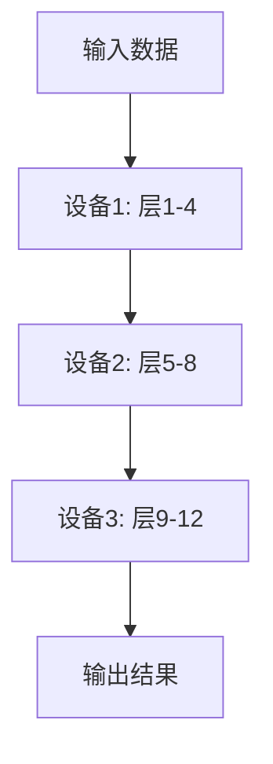

# 大语言模型原理基础与前沿 流水线并行

## 1.背景介绍

大语言模型（Large Language Model, LLM）是近年来人工智能领域的一个重要突破。它们通过训练在大量文本数据上，能够生成高质量的自然语言文本，完成翻译、问答、文本生成等任务。随着模型规模的不断扩大，训练和推理的计算需求也急剧增加。流水线并行（Pipeline Parallelism）作为一种有效的并行计算技术，能够显著提升大语言模型的训练和推理效率。

## 2.核心概念与联系

### 2.1 大语言模型

大语言模型是基于深度学习的自然语言处理模型，通常采用Transformer架构。它们通过大量的参数和层数，能够捕捉语言中的复杂模式和语义关系。

### 2.2 并行计算

并行计算是指将计算任务分解为多个子任务，并同时在多个处理器上执行。常见的并行计算方法包括数据并行、模型并行和流水线并行。

### 2.3 流水线并行

流水线并行是一种将模型的不同层分配到不同计算设备上的技术。每个设备负责处理模型的一部分，并将中间结果传递给下一个设备。这种方法能够有效地利用多台设备的计算资源，减少训练和推理时间。

## 3.核心算法原理具体操作步骤

### 3.1 模型分割

将大语言模型的层按顺序分割成若干部分，每部分分配给一个计算设备。例如，一个12层的Transformer模型可以分割成3部分，每部分包含4层。

### 3.2 数据流动

输入数据从第一个设备开始处理，经过每个设备的计算后，逐步传递到下一个设备。每个设备在接收到数据后，立即开始计算，并将结果传递给下一个设备。

### 3.3 并行执行

通过流水线并行，多个输入数据可以同时在不同设备上处理。例如，当第一个输入数据在第二个设备上处理时，第二个输入数据可以在第一个设备上处理。

### 3.4 同步与通信

为了确保数据的正确传递和计算结果的准确性，设备之间需要进行同步和通信。这通常通过高速网络和高效的通信协议实现。

以下是一个简单的Mermaid流程图，展示了流水线并行的基本流程：



## 4.数学模型和公式详细讲解举例说明

### 4.1 Transformer模型

Transformer模型是大语言模型的基础，其核心组件包括多头自注意力机制和前馈神经网络。Transformer的计算复杂度主要集中在自注意力机制上。

### 4.2 自注意力机制

自注意力机制的计算公式如下：

$$
\text{Attention}(Q, K, V) = \text{softmax}\left(\frac{QK^T}{\sqrt{d_k}}\right)V
$$

其中，$Q$、$K$、$V$分别是查询、键和值矩阵，$d_k$是键的维度。

### 4.3 流水线并行的计算复杂度

假设一个Transformer模型有$L$层，每层的计算复杂度为$O(n^2d)$，其中$n$是序列长度，$d$是隐藏层维度。通过流水线并行，将模型分割成$P$部分，每部分的计算复杂度为$O\left(\frac{L}{P}n^2d\right)$。

### 4.4 示例说明

假设一个12层的Transformer模型，序列长度为128，隐藏层维度为512。将模型分割成3部分，每部分的计算复杂度为：

$$
O\left(\frac{12}{3} \cdot 128^2 \cdot 512\right) = O(4 \cdot 16384 \cdot 512) = O(33554432)
$$

相比于单设备的计算复杂度$O(12 \cdot 16384 \cdot 512) = O(100663296)$，流水线并行显著降低了计算复杂度。

## 5.项目实践：代码实例和详细解释说明

### 5.1 环境准备

首先，确保安装了必要的深度学习框架，如PyTorch或TensorFlow。以下示例基于PyTorch。

```python
import torch
import torch.nn as nn
import torch.optim as optim
from torch.utils.data import DataLoader, TensorDataset
```

### 5.2 模型定义

定义一个简单的Transformer模型，并将其分割成多个部分。

```python
class SimpleTransformer(nn.Module):
    def __init__(self, num_layers, d_model, num_heads, d_ff):
        super(SimpleTransformer, self).__init__()
        self.layers = nn.ModuleList([
            nn.TransformerEncoderLayer(d_model, num_heads, d_ff)
            for _ in range(num_layers)
        ])
    
    def forward(self, x):
        for layer in self.layers:
            x = layer(x)
        return x

# 定义12层的Transformer模型
model = SimpleTransformer(num_layers=12, d_model=512, num_heads=8, d_ff=2048)
```

### 5.3 模型分割与分配

将模型分割成3部分，并分配到不同设备上。

```python
devices = [torch.device('cuda:0'), torch.device('cuda:1'), torch.device('cuda:2')]

# 将模型分割成3部分
part1 = nn.Sequential(*model.layers[:4]).to(devices[0])
part2 = nn.Sequential(*model.layers[4:8]).to(devices[1])
part3 = nn.Sequential(*model.layers[8:]).to(devices[2])
```

### 5.4 数据流动与并行执行

定义数据流动和并行执行的逻辑。

```python
def pipeline_forward(x):
    x = x.to(devices[0])
    x = part1(x)
    x = x.to(devices[1])
    x = part2(x)
    x = x.to(devices[2])
    x = part3(x)
    return x

# 示例输入数据
input_data = torch.randn(128, 10, 512)  # (序列长度, 批次大小, 隐藏层维度)
output_data = pipeline_forward(input_data)
```

### 5.5 训练与优化

定义训练和优化的逻辑。

```python
criterion = nn.MSELoss()
optimizer = optim.Adam(model.parameters(), lr=0.001)

# 示例目标数据
target_data = torch.randn(128, 10, 512).to(devices[2])

# 训练步骤
optimizer.zero_grad()
output_data = pipeline_forward(input_data)
loss = criterion(output_data, target_data)
loss.backward()
optimizer.step()
```

## 6.实际应用场景

### 6.1 自然语言处理

大语言模型在自然语言处理任务中表现出色，如机器翻译、文本生成、问答系统等。流水线并行能够加速这些任务的训练和推理过程。

### 6.2 语音识别

语音识别系统需要处理大量的音频数据，并将其转换为文本。大语言模型可以用于语音识别中的语言建模，流水线并行能够提高系统的实时性和准确性。

### 6.3 图像描述生成

图像描述生成任务需要将图像转换为自然语言描述。大语言模型可以用于生成高质量的描述文本，流水线并行能够加速这一过程。

## 7.工具和资源推荐

### 7.1 深度学习框架

- PyTorch: https://pytorch.org/
- TensorFlow: https://www.tensorflow.org/

### 7.2 分布式计算工具

- Horovod: https://github.com/horovod/horovod
- DeepSpeed: https://www.deepspeed.ai/

### 7.3 资源与教程

- 《深度学习》 by Ian Goodfellow, Yoshua Bengio, Aaron Courville
- 《自然语言处理入门》 by Jacob Eisenstein

## 8.总结：未来发展趋势与挑战

流水线并行作为一种有效的并行计算技术，已经在大语言模型的训练和推理中展现出巨大的潜力。未来，随着模型规模的进一步扩大和计算资源的不断提升，流水线并行将继续发挥重要作用。然而，仍然存在一些挑战，如设备间通信延迟、负载均衡等问题，需要进一步研究和优化。

## 9.附录：常见问题与解答

### 9.1 流水线并行与数据并行的区别是什么？

数据并行是将数据分割成多个子集，并在多个设备上同时处理相同的模型。流水线并行是将模型分割成多个部分，并在多个设备上顺序处理相同的数据。

### 9.2 如何选择模型分割的粒度？

模型分割的粒度取决于模型的层数和设备的数量。通常，层数越多，设备越多，分割的粒度越细。

### 9.3 流水线并行的通信开销如何优化？

可以通过高效的通信协议和高速网络来优化设备间的通信开销。此外，合理的模型分割和负载均衡也能够减少通信开销。

---

作者：禅与计算机程序设计艺术 / Zen and the Art of Computer Programming