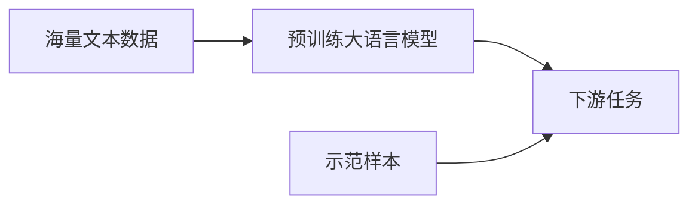

# 大语言模型原理基础与前沿 示范样本选择

## 1. 背景介绍
### 1.1 大语言模型的兴起
近年来,随着深度学习技术的飞速发展,自然语言处理(NLP)领域也迎来了一次革命性的突破。其中,大语言模型(Large Language Model,LLM)的出现,更是将NLP推向了一个新的高度。从2018年GPT-1的横空出世,到如今GPT-4、PaLM等模型的问世,大语言模型以其强大的语言理解和生成能力,在各种NLP任务上取得了令人瞩目的成绩,甚至在某些任务上已经超越了人类的表现。

### 1.2 示范样本选择的重要性
然而,训练一个高质量的大语言模型并非易事。除了需要海量的训练数据和计算资源外,示范样本(demonstration example)的选择也至关重要。示范样本是指在few-shot learning设置下,用于向模型展示任务format和所需完成的目标的样本。合理的示范样本不仅能帮助模型更好地理解任务,快速适应新的任务,还能引导模型朝着人类期望的方向优化,减少有害的偏见和错误。因此,示范样本选择已经成为大语言模型研究中的一个重要课题。

### 1.3 本文的主要内容
本文将围绕大语言模型中的示范样本选择展开,首先介绍大语言模型的核心概念和主要类型,然后重点阐述示范样本选择的核心算法原理和数学模型,并给出详细的代码实例。同时,本文还将讨论示范样本选择在实际应用中的场景和面临的挑战,为读者提供全面的示范样本选择知识。

## 2. 核心概念与联系
### 2.1 大语言模型的定义与特点
大语言模型是一类基于海量文本数据训练的语言模型,旨在学习自然语言的统计规律和语义表示。与传统的语言模型不同,大语言模型通常采用Transformer等深度神经网络结构,参数量高达数亿甚至上千亿,能够建模更加复杂和抽象的语言模式。大语言模型的主要特点包括:

1. 强大的语言理解和生成能力
2. 良好的泛化和迁移能力
3. 支持few-shot和zero-shot学习
4. 需要海量的训练数据和计算资源

### 2.2 主要的大语言模型类型
目前主流的大语言模型可以分为以下几类:

1. GPT系列:由OpenAI开发,代表模型有GPT-1/2/3/4,擅长开放域对话和文本生成。
2. BERT系列:由Google提出,代表模型有BERT、RoBERTa等,主要用于自然语言理解任务。
3. T5系列:将NLP任务统一为文本到文本的生成任务,代表模型有T5、mT5等。
4. 其他大语言模型:如XLNet、ELECTRA、PaLM等。

### 2.3 示范样本选择的定义与作用
示范样本选择是指在few-shot learning设置下,如何从训练集或其他数据源中选择合适的样本,用于向模型展示任务的format和所需完成的目标。其主要作用包括:

1. 帮助模型理解任务的输入输出格式和要求
2. 引导模型朝着人类期望的方向优化
3. 加速模型在新任务上的适应和学习
4. 减少模型输出的偏见和错误

下图展示了示范样本选择在大语言模型应用中的重要作用:



## 3. 核心算法原理具体操作步骤
### 3.1 基于相似度的示范样本选择
基于相似度的方法是最直观的示范样本选择策略,其基本思想是从候选样本中选择与目标任务最相似的样本作为示范样本。具体步骤如下:

1. 将目标任务的输入编码为向量表示 $\mathbf{x}_t$
2. 对候选样本集 $\mathcal{D}=\{(\mathbf{x}_i,\mathbf{y}_i)\}_{i=1}^N$ 中的每个样本,计算其输入 $\mathbf{x}_i$ 与 $\mathbf{x}_t$ 的相似度 $s_i$,常见的相似度度量包括余弦相似度、欧氏距离等
3. 选择相似度最高的 $k$ 个样本 $\{(\mathbf{x}_{(i)},\mathbf{y}_{(i)})\}_{i=1}^k$ 作为示范样本
4. 将选择的示范样本和目标任务输入一起传入语言模型,生成最终结果

### 3.2 基于不确定性的示范样本选择
基于不确定性的方法利用模型在候选样本上的预测不确定性来选择示范样本,其思路是优先选择那些能够为模型提供更多信息的样本。常见的不确定性度量包括熵、互信息等。算法步骤如下:

1. 在候选样本集 $\mathcal{D}$ 上,用语言模型计算每个样本的预测概率分布 $P(\mathbf{y}_i|\mathbf{x}_i)$
2. 计算每个样本的不确定性度量 $u_i$,例如熵:

$$
u_i = -\sum_{c=1}^C P(y_{i,c}|\mathbf{x}_i) \log P(y_{i,c}|\mathbf{x}_i)
$$

其中 $C$ 为类别数。

3. 选择不确定性最高的 $k$ 个样本作为示范样本
4. 将选择的示范样本和目标任务输入一起传入语言模型,生成最终结果

### 3.3 基于对比学习的示范样本选择
基于对比学习的方法通过构建正负样本对,学习一个示范样本选择模型,使其能够区分高质量和低质量的示范样本。主要步骤如下:

1. 构建正负样本对 $\{(\mathbf{x}_i^+,\mathbf{x}_i^-)\}_{i=1}^M$,其中正样本 $\mathbf{x}_i^+$ 是高质量的示范样本,负样本 $\mathbf{x}_i^-$ 是随机选择的样本
2. 训练一个示范样本选择模型 $f_\theta$,使其能够最大化正负样本对之间的差异:

$$
\mathcal{L}(\theta) = \sum_{i=1}^M \max(0, \Delta - f_\theta(\mathbf{x}_i^+) + f_\theta(\mathbf{x}_i^-))
$$

其中 $\Delta$ 为正负样本之间的间隔阈值。

3. 在候选样本集 $\mathcal{D}$ 上,用训练好的 $f_\theta$ 打分,选择得分最高的 $k$ 个样本作为示范样本
4. 将选择的示范样本和目标任务输入一起传入语言模型,生成最终结果

## 4. 数学模型和公式详细讲解举例说明
本节将详细讲解示范样本选择中涉及的几个关键数学模型和公式。

### 4.1 余弦相似度
余弦相似度用于衡量两个向量之间的夹角余弦值,常用于计算文本向量之间的相似性。给定两个 $n$ 维向量 $\mathbf{x}=(x_1,\dots,x_n)$ 和 $\mathbf{y}=(y_1,\dots,y_n)$,其余弦相似度定义为:

$$
\cos(\mathbf{x},\mathbf{y}) = \frac{\mathbf{x} \cdot \mathbf{y}}{\|\mathbf{x}\| \|\mathbf{y}\|} = \frac{\sum_{i=1}^n x_i y_i}{\sqrt{\sum_{i=1}^n x_i^2} \sqrt{\sum_{i=1}^n y_i^2}}
$$

余弦相似度的取值范围为 $[-1,1]$,值越大表示两个向量方向越接近。

举例来说,假设有两个文本向量:

$\mathbf{x}=(0.5, 0.7, 0.2)$
$\mathbf{y}=(0.6, 0.8, 0.1)$

则它们的余弦相似度为:

$$
\cos(\mathbf{x},\mathbf{y}) = \frac{0.5 \times 0.6 + 0.7 \times 0.8 + 0.2 \times 0.1}{\sqrt{0.5^2+0.7^2+0.2^2} \sqrt{0.6^2+0.8^2+0.1^2}} \approx 0.996
$$

可见这两个文本向量非常相似。

### 4.2 信息熵
信息熵用于衡量一个概率分布的不确定性,分布越均匀,熵越大。对于一个离散型随机变量 $X$,其概率分布为 $P(X=x_i)=p_i,i=1,\dots,n$,则 $X$ 的信息熵定义为:

$$
H(X) = -\sum_{i=1}^n p_i \log p_i
$$

当对数以2为底时,熵的单位为比特(bit)。

举例来说,假设一个二分类问题的预测概率分布为:

$P(y=1|\mathbf{x})=0.8$
$P(y=0|\mathbf{x})=0.2$

则其信息熵为:

$$
H(y|\mathbf{x}) = -0.8 \log 0.8 - 0.2 \log 0.2 \approx 0.722 \text{ bits}
$$

而如果预测概率分布为:

$P(y=1|\mathbf{x})=0.5$
$P(y=0|\mathbf{x})=0.5$

则其信息熵为:

$$
H(y|\mathbf{x}) = -0.5 \log 0.5 - 0.5 \log 0.5 = 1 \text{ bit}
$$

可见第二个分布的不确定性更大。

### 4.3 Hinge Loss
Hinge Loss常用于支持向量机和对比学习中,用于最大化正负样本之间的间隔。给定一个正样本 $\mathbf{x}^+$ 和一个负样本 $\mathbf{x}^-$,Hinge Loss定义为:

$$
\mathcal{L}(\mathbf{x}^+, \mathbf{x}^-) = \max(0, \Delta - f(\mathbf{x}^+) + f(\mathbf{x}^-))
$$

其中 $f$ 为打分函数,$\Delta$ 为正负样本之间的间隔阈值。当 $f(\mathbf{x}^+) - f(\mathbf{x}^-) \geq \Delta$ 时,Loss为0,否则Loss为 $\Delta - (f(\mathbf{x}^+) - f(\mathbf{x}^-))$。

举例来说,假设 $\Delta=1$,对于以下三对正负样本:

$f(\mathbf{x}_1^+)=2.0, f(\mathbf{x}_1^-)=0.5$
$f(\mathbf{x}_2^+)=1.2, f(\mathbf{x}_2^-)=0.8$
$f(\mathbf{x}_3^+)=0.6, f(\mathbf{x}_3^-)=1.5$

则它们的Hinge Loss分别为:

$$
\mathcal{L}(\mathbf{x}_1^+, \mathbf{x}_1^-) = \max(0, 1 - (2.0 - 0.5)) = 0
$$

$$
\mathcal{L}(\mathbf{x}_2^+, \mathbf{x}_2^-) = \max(0, 1 - (1.2 - 0.8)) = 0.6
$$

$$
\mathcal{L}(\mathbf{x}_3^+, \mathbf{x}_3^-) = \max(0, 1 - (0.6 - 1.5)) = 1.9
$$

可见只有第一对样本满足要求,第二对和第三对样本都需要优化。

## 5. 项目实践:代码实例和详细解释说明
下面给出基于相似度的示范样本选择的Python代码实例:

```python
import numpy as np
from sklearn.metrics.pairwise import cosine_similarity

def select_demo_by_similarity(candidate_inputs, candidate_outputs, target_input, k):
    """
    基于相似度选择示范样本
    :param candidate_inputs: 候选样本的输入列表
    :param candidate_outputs: 候选样本的输出列表
    :param target_input: 目标任务的输入
    :param k: 选择的示范样本数量
    :return: 选择的示范样本输入和输出
    """
    # 将文本编码为向量
    candidate_input_vectors = encode(