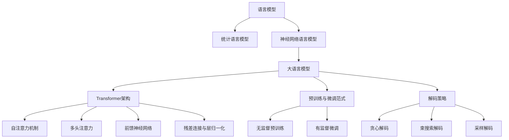

# 大语言模型原理基础与前沿 解码策略

## 1.背景介绍
### 1.1 大语言模型的发展历程
#### 1.1.1 早期的语言模型
#### 1.1.2 神经网络语言模型的兴起 
#### 1.1.3 Transformer架构的革命性突破
### 1.2 大语言模型的应用现状
#### 1.2.1 自然语言处理领域的广泛应用
#### 1.2.2 跨领域迁移学习的成功案例
#### 1.2.3 大语言模型的局限性和挑战
### 1.3 解码策略的重要性
#### 1.3.1 解码在语言生成中的作用
#### 1.3.2 不同解码策略的特点比较
#### 1.3.3 解码策略研究的意义

## 2.核心概念与联系
### 2.1 语言模型的定义与分类
#### 2.1.1 统计语言模型
#### 2.1.2 神经网络语言模型 
#### 2.1.3 大语言模型的特点
### 2.2 Transformer架构剖析
#### 2.2.1 自注意力机制
#### 2.2.2 多头注意力
#### 2.2.3 前馈神经网络
#### 2.2.4 残差连接与层归一化
### 2.3 预训练与微调范式
#### 2.3.1 无监督预训练
#### 2.3.2 有监督微调
#### 2.3.3 预训练目标函数设计
### 2.4 解码策略概述
#### 2.4.1 贪心解码
#### 2.4.2 束搜索解码
#### 2.4.3 采样解码
#### 2.4.4 其他解码策略



## 3.核心算法原理具体操作步骤
### 3.1 Transformer的编码器
#### 3.1.1 输入嵌入与位置编码
#### 3.1.2 自注意力计算过程
#### 3.1.3 残差连接与层归一化
#### 3.1.4 前馈神经网络
### 3.2 Transformer的解码器  
#### 3.2.1 掩蔽自注意力机制
#### 3.2.2 编码-解码注意力机制
#### 3.2.3 残差连接与层归一化
#### 3.2.4 前馈神经网络
### 3.3 预训练算法
#### 3.3.1 BERT的掩码语言模型
#### 3.3.2 GPT的因果语言模型
#### 3.3.3 ELECTRA的替换语言模型
### 3.4 微调算法
#### 3.4.1 分类任务微调
#### 3.4.2 序列标注任务微调
#### 3.4.3 阅读理解任务微调
### 3.5 解码算法
#### 3.5.1 贪心解码算法
#### 3.5.2 束搜索解码算法
#### 3.5.3 Top-k采样算法
#### 3.5.4 Top-p核采样算法

## 4.数学模型和公式详细讲解举例说明
### 4.1 Transformer的数学表示
#### 4.1.1 自注意力的数学推导
$Attention(Q,K,V) = softmax(\frac{QK^T}{\sqrt{d_k}})V$
其中，$Q$是查询矩阵，$K$是键矩阵，$V$是值矩阵，$d_k$是键向量的维度。
#### 4.1.2 多头注意力的数学表示  
$$MultiHead(Q,K,V) = Concat(head_1,...,head_h)W^O$$
$$head_i = Attention(QW_i^Q, KW_i^K, VW_i^V)$$
其中，$W_i^Q, W_i^K, W_i^V$是第$i$个头的权重矩阵，$W^O$是输出的线性变换矩阵。
#### 4.1.3 前馈神经网络的数学表示
$$FFN(x) = max(0, xW_1 + b_1)W_2 + b_2$$
其中，$W_1, b_1, W_2, b_2$是前馈神经网络的权重和偏置。
### 4.2 语言模型的概率公式
#### 4.2.1 统计语言模型的概率计算
$$P(w_1, w_2, ..., w_n) = \prod_{i=1}^n P(w_i|w_1,...,w_{i-1})$$
其中，$w_i$是第$i$个单词，$P(w_i|w_1,...,w_{i-1})$是给定前$i-1$个单词下第$i$个单词的条件概率。
#### 4.2.2 神经网络语言模型的概率计算
$$P(w_1, w_2, ..., w_n) = \prod_{i=1}^n P(w_i|w_1,...,w_{i-1};\theta)$$  
其中，$\theta$是神经网络的参数。
### 4.3 解码策略的数学表示
#### 4.3.1 贪心解码
$$\hat{y} = \arg\max_{y} P(y|x)$$
其中，$\hat{y}$是预测的输出序列，$x$是输入序列。
#### 4.3.2 束搜索解码
$$\hat{Y} = \arg\max_{Y} \sum_{y \in Y} \log P(y|x)$$
其中，$\hat{Y}$是保留的$k$个最优候选输出序列的集合。
#### 4.3.3 Top-k采样
$$P(y_i|y_{<i},x) \propto \begin{cases} 
P(y_i|y_{<i},x) & \text{if } y_i \in V_{top-k}(y_{<i},x) \\
0 & \text{otherwise}
\end{cases}$$
其中，$V_{top-k}(y_{<i},x)$是给定前$i-1$个生成单词和输入$x$下的top-k单词集合。
#### 4.3.4 Top-p核采样
$$V_{top-p}(y_{<i},x) = \{y_i | \sum_{j=1}^i P(y_j|y_{<j},x) \le p\}$$
其中，$V_{top-p}(y_{<i},x)$是给定前$i-1$个生成单词和输入$x$下的累积概率不超过$p$的单词集合。

## 5.项目实践：代码实例和详细解释说明
### 5.1 使用Transformers库进行预训练
#### 5.1.1 加载预训练模型
```python
from transformers import BertModel, BertTokenizer

model = BertModel.from_pretrained('bert-base-uncased')
tokenizer = BertTokenizer.from_pretrained('bert-base-uncased')
```
#### 5.1.2 对输入进行编码
```python
inputs = tokenizer("Hello world!", return_tensors="pt")
outputs = model(**inputs)
```
#### 5.1.3 提取输出特征
```python
last_hidden_states = outputs.last_hidden_state
pooler_output = outputs.pooler_output
```
### 5.2 使用Transformers库进行微调
#### 5.2.1 定义微调模型
```python
from transformers import BertForSequenceClassification

model = BertForSequenceClassification.from_pretrained('bert-base-uncased', num_labels=2)
```
#### 5.2.2 准备训练数据
```python
from transformers import InputExample, InputFeatures

train_examples = [
    InputExample(guid=None, text_a="Hello world!", text_b=None, label=1),
    InputExample(guid=None, text_a="Nice to meet you!", text_b=None, label=1),
    InputExample(guid=None, text_a="I don't like this.", text_b=None, label=0),
]

def convert_examples_to_features(examples, tokenizer, max_length=128):
    features = []
    for example in examples:
        inputs = tokenizer.encode_plus(example.text_a, add_special_tokens=True, max_length=max_length, pad_to_max_length=True)
        features.append(InputFeatures(input_ids=inputs["input_ids"], attention_mask=inputs["attention_mask"], label=example.label))
    return features

train_features = convert_examples_to_features(train_examples, tokenizer)
```
#### 5.2.3 开始微调训练
```python
from transformers import Trainer, TrainingArguments

training_args = TrainingArguments(
    output_dir='./results',
    num_train_epochs=3,
    per_device_train_batch_size=16,
    per_device_eval_batch_size=64,
    warmup_steps=500,
    weight_decay=0.01,
    logging_dir='./logs',
)

trainer = Trainer(
    model=model,
    args=training_args,
    train_dataset=train_features,
)

trainer.train()
```
### 5.3 使用Transformers库进行解码
#### 5.3.1 加载微调后的模型
```python
from transformers import BertForSequenceClassification

model = BertForSequenceClassification.from_pretrained('./results')
tokenizer = BertTokenizer.from_pretrained('bert-base-uncased')
```
#### 5.3.2 对新输入进行预测
```python
inputs = tokenizer("This is a new sentence.", return_tensors="pt")
outputs = model(**inputs)
predicted_label = outputs.logits.argmax().item()
print(predicted_label)  # 输出预测的标签
```

## 6.实际应用场景
### 6.1 情感分析
#### 6.1.1 基于大语言模型的情感分类
#### 6.1.2 情感强度预测
#### 6.1.3 细粒度情感分析
### 6.2 文本摘要
#### 6.2.1 抽取式摘要
#### 6.2.2 生成式摘要
#### 6.2.3 多文档摘要
### 6.3 机器翻译
#### 6.3.1 基于Transformer的神经机器翻译
#### 6.3.2 无监督机器翻译
#### 6.3.3 低资源语言翻译
### 6.4 对话系统
#### 6.4.1 任务型对话系统
#### 6.4.2 开放域对话系统
#### 6.4.3 个性化对话生成
### 6.5 知识图谱构建
#### 6.5.1 实体链接
#### 6.5.2 关系抽取
#### 6.5.3 知识表示学习

## 7.工具和资源推荐
### 7.1 开源工具包
#### 7.1.1 Transformers
#### 7.1.2 Fairseq
#### 7.1.3 OpenNMT
#### 7.1.4 Tensor2Tensor
### 7.2 预训练模型
#### 7.2.1 BERT
#### 7.2.2 GPT系列
#### 7.2.3 XLNet
#### 7.2.4 RoBERTa
### 7.3 评测基准
#### 7.3.1 GLUE
#### 7.3.2 SuperGLUE
#### 7.3.3 SQuAD
#### 7.3.4 CoQA
### 7.4 学习资源
#### 7.4.1 相关论文列表
#### 7.4.2 在线课程
#### 7.4.3 博客与教程
#### 7.4.4 开源项目

## 8.总结：未来发展趋势与挑战
### 8.1 大语言模型的发展趋势
#### 8.1.1 模型规模的持续增长
#### 8.1.2 多模态语言模型
#### 8.1.3 低资源语言建模
#### 8.1.4 知识增强语言模型
### 8.2 解码策略的研究方向  
#### 8.2.1 个性化解码
#### 8.2.2 可控文本生成
#### 8.2.3 解码效率优化
#### 8.2.4 解码过程的可解释性
### 8.3 面临的挑战
#### 8.3.1 计算资源瓶颈
#### 8.3.2 数据隐私与安全
#### 8.3.3 模型偏见与公平性
#### 8.3.4 生成文本的可控性

## 9.附录：常见问题与解答
### 9.1 如何选择合适的预训练模型？
### 9.2 微调过程中出现过拟合怎么办？  
### 9.3 生成文本出现重复或不连贯的问题如何解决？
### 9.4 面对低资源语言任务，如何利用大语言模型？
### 9.5 如何平衡解码的多样性和相关性？

大语言模型和解码策略是自然语言处理领域的重要研究方向，对语言理解和生成任务具有广泛的影响。本文全面介绍了大语言模型的基本原理、Transformer架构、预