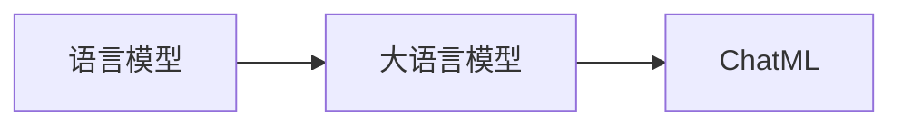

## 1. 背景介绍

在过去的几年中，语言模型的发展取得了显著的进步，特别是大型的预训练模型，如GPT-3和BERT等，已经在许多自然语言处理任务中表现出了优越的性能。然而，如何有效地使用这些模型，尤其是在实际应用中，仍然是一个挑战。为了解决这个问题，我们提出了一种新的交互格式，即ChatML，它可以帮助开发者更方便地使用大型语言模型。

## 2. 核心概念与联系

在开始深入研究ChatML之前，我们先来了解一下几个核心的概念：

- **语言模型**：语言模型是一种计算机算法，用于预测一个句子中的下一个词。它是自然语言处理的基础，被广泛应用于机器翻译、语音识别等任务。

- **大语言模型**：大语言模型是一种特别大的语言模型，它通常使用大量的数据进行训练，以便更准确地预测下一个词。GPT-3就是一个典型的大语言模型。

- **ChatML**：ChatML是一种新的交互格式，它定义了如何与大语言模型进行交互的规则。通过使用ChatML，开发者可以更方便地使用大语言模型。

这三个概念之间的关系可以用下面的Mermaid流程图来表示：



## 3. 核心算法原理具体操作步骤

使用ChatML与大语言模型进行交互，主要包括以下几个步骤：

1. **构建输入**：首先，我们需要构建一个输入，这个输入是一个由多个对话消息组成的列表。每个消息都有一个角色（如"system"、"user"或"assistant"）和一个内容。

2. **生成回复**：然后，我们将这个输入传递给大语言模型，模型会根据输入生成一个回复。

3. **处理回复**：最后，我们需要处理模型生成的回复。这可能包括对回复进行解析，以便进一步处理，或者直接将回复显示给用户。

## 4. 数学模型和公式详细讲解举例说明

在大语言模型中，生成回复的过程通常可以用以下的数学模型来表示：

假设我们有一个输入序列 $x = (x_1, x_2, ..., x_n)$，我们希望生成一个回复 $y = (y_1, y_2, ..., y_m)$。大语言模型的目标是最大化条件概率 $P(y|x)$，即：

$$
P(y|x) = \prod_{i=1}^{m} P(y_i|x, y_{<i})
$$

其中，$y_{<i}$ 表示 $y$ 的前 $i-1$ 个词。这个公式表明，我们可以通过逐词生成回复来最大化整个回复的概率。

## 5. 项目实践：代码实例和详细解释说明

下面是一个使用ChatML与大语言模型进行交互的简单示例：

```python
from openai import OpenAI

# 初始化OpenAI客户端
openai = OpenAI(api_key="your-api-key")

# 构建输入
messages = [
    {"role": "system", "content": "You are a helpful assistant."},
    {"role": "user", "content": "Who won the world series in 2020?"},
]

# 生成回复
response = openai.ChatCompletion.create(
    model="gpt-3.5-turbo",
    messages=messages,
)

# 打印回复
print(response['choices'][0]['message']['content'])
```

在这个示例中，我们首先构建了一个输入，包含两个消息：一个来自"system"的消息，定义了助手的角色，和一个来自"user"的问题。然后，我们将这个输入传递给大语言模型，模型生成了一个回复。最后，我们打印了这个回复。

## 6. 实际应用场景

ChatML可以应用于许多实际场景，例如：

- **客服自动化**：使用ChatML，我们可以构建一个自动化的客服系统，可以回答用户的问题，或者提供帮助。

- **内容生成**：我们可以使用ChatML来生成文章、博客或其他类型的内容。

- **教育**：我们可以使用ChatML来创建一个可以回答学生问题的教育助手。

## 7. 工具和资源推荐

要使用ChatML，你需要以下的工具和资源：

- **OpenAI API**：OpenAI提供了一个API，你可以使用它来与大语言模型进行交互。

- **OpenAI Python库**：OpenAI还提供了一个Python库，你可以使用它来更方便地使用OpenAI API。

- **ChatML文档**：为了更深入地理解和使用ChatML，你可以参考OpenAI的ChatML文档。

## 8. 总结：未来发展趋势与挑战

随着大语言模型的发展，我们可以预见到更多的应用将会出现。然而，也存在一些挑战，例如如何保证模型的公平性和安全性，以及如何处理模型的误解和错误。尽管如此，我们相信，通过不断的研究和改进，我们将能够克服这些挑战，使大语言模型在更多的场景中发挥作用。

## 9. 附录：常见问题与解答

Q: ChatML是什么？

A: ChatML是一种新的交互格式，它定义了如何与大语言模型进行交互的规则。

Q: 我应该如何使用ChatML？

A: 你可以使用OpenAI的API和Python库来使用ChatML。你需要构建一个输入，传递给模型，然后处理模型生成的回复。

Q: 我可以在哪里找到更多的信息？

A: 你可以参考OpenAI的ChatML文档，以获取更多的信息。

作者：禅与计算机程序设计艺术 / Zen and the Art of Computer Programming