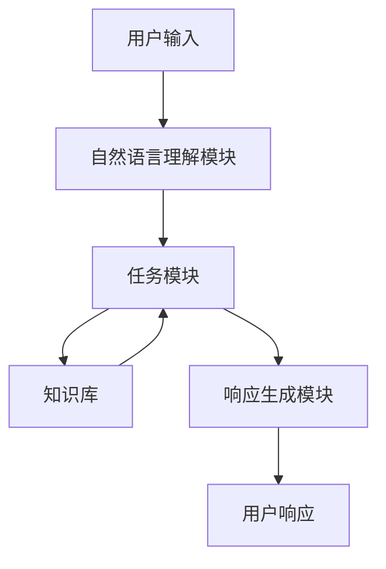

以下是一篇关于"大语言模型应用指南：Generative Agents"的技术博客文章。

# 大语言模型应用指南：Generative Agents

## 1. 背景介绍

### 1.1 大语言模型的兴起

近年来,随着计算能力的飞速提升和海量数据的积累,大型语言模型(Large Language Models, LLMs)在自然语言处理领域取得了令人瞩目的成就。这些模型通过在大规模语料库上进行预训练,学习了丰富的语言知识和上下文关联,从而展现出惊人的生成和理解能力。

代表性的大语言模型包括:

- GPT-3 (Generative Pre-trained Transformer 3)
- BERT (Bidirectional Encoder Representations from Transformers)
- XLNet
- RoBERTa
- ALBERT
- ...

### 1.2 Generative Agents的概念

Generative Agents是一种新兴的基于大语言模型的人工智能系统,旨在通过自然语言交互为用户提供智能服务。它们能够理解用户的查询、指令和上下文,并生成相关、连贯和有意义的响应。

Generative Agents的核心是一个强大的语言生成模型,通常采用Transformer等注意力机制架构。除了语言理解和生成能力,它们还集成了各种任务专用模块,如知识检索、推理、规划等,从而实现更智能、更个性化的交互体验。

### 1.3 Generative Agents的应用前景

Generative Agents具有广阔的应用前景,可以在多个领域发挥作用:

- 智能助手:提供自然语言交互界面,协助用户完成各种任务。
- 客户服务:提供个性化的客户支持和问题解答。
- 教育:作为智能教学助手,提供定制化的学习资源和指导。
- 写作辅助:协助用户生成高质量的文本内容。
- 医疗保健:为患者提供个性化的健康咨询和建议。
- ...

## 2. 核心概念与联系

### 2.1 语言模型

语言模型是Generative Agents的核心组成部分,负责理解和生成自然语言。常见的语言模型架构包括:

- **Transformer**: 基于自注意力机制的序列到序列模型,广泛应用于机器翻译、文本生成等任务。
- **GPT(Generative Pre-trained Transformer)**: 基于Transformer的自回归语言模型,专注于生成任务。
- **BERT(Bidirectional Encoder Representations from Transformers)**: 基于Transformer的双向编码器,适用于各种语言理解任务。
- **XLNet**: 改进的自回归语言模型,采用排列语言建模策略。
- **RoBERTa**: 改进的BERT模型,通过更大规模的预训练数据和更长的训练时间提升性能。

### 2.2 知识库

为了提供准确和有见地的响应,Generative Agents需要整合丰富的知识库。常见的知识库形式包括:

- **结构化知识库**: 基于知识图谱、本体论等形式组织结构化数据。
- **非结构化知识库**: 包括网页、文档、书籍等非结构化文本数据。
- **多模态知识库**: 整合文本、图像、视频等多种模态的知识。

### 2.3 任务模块

为了支持特定的应用场景,Generative Agents通常需要集成各种任务专用模块,如:

- **问答模块**: 基于知识库和推理能力回答用户的问题。
- **对话模块**: 维护上下文,进行多轮自然语言交互。
- **规划模块**: 根据用户意图生成行动计划或指令序列。
- **推理模块**: 进行逻辑推理、常识推理等高级认知任务。
- **知识检索模块**: 从知识库中检索相关信息。

### 2.4 核心架构

Generative Agents的核心架构通常包括以下几个主要组件:



用户输入经过自然语言理解模块解析后,交由任务模块处理。任务模块根据需要从知识库中检索相关信息,并结合推理、规划等能力生成响应,最终由响应生成模块输出自然语言响应。

## 3. 核心算法原理具体操作步骤

### 3.1 语言模型预训练

Generative Agents的核心语言模型通常采用自监督的预训练方式,在大规模语料库上学习通用的语言表示。常见的预训练目标包括:

1. **掩码语言模型(Masked Language Modeling, MLM)**: 随机掩码部分词元,模型需要预测被掩码的词元。
2. **下一句预测(Next Sentence Prediction, NSP)**: 判断两个句子是否连贯。
3. **因果语言模型(Causal Language Modeling, CLM)**: 基于前文预测下一个词元。
4. **排列语言模型(Permutation Language Modeling, PLM)**: 预测打乱顺序的词元序列。

通过预训练,语言模型学习到丰富的语言知识和上下文关联能力,为下游任务提供强大的初始化参数。

### 3.2 微调和提示学习

在特定任务上,需要对预训练的语言模型进行微调(Fine-tuning)或提示学习(Prompt Learning):

- **微调**: 在任务数据上继续训练语言模型的全部或部分参数,使其适应特定任务。
- **提示学习**: 通过设计特定的提示模板,指导语言模型生成所需的输出,无需更新模型参数。

微调和提示学习的选择取决于任务复杂性、可用数据量以及计算资源等因素。

### 3.3 多任务学习

为了支持多种任务,Generative Agents通常采用多任务学习(Multi-Task Learning)的范式,在不同任务数据上联合训练模型。这种方式可以提高模型的泛化能力,并实现知识迁移。

常见的多任务学习策略包括:

- **硬参数共享**: 不同任务共享模型的部分或全部参数。
- **软参数共享**: 通过正则化约束不同任务的参数相似性。
- **层级多任务学习**: 在不同层次上进行多任务学习。

### 3.4 知识增强

为了增强Generative Agents的知识能力,常采用以下策略:

- **知识蒸馏(Knowledge Distillation)**: 从大型知识库或专家模型中蒸馏知识,传递给Generative Agents模型。
- **检索增强(Retrieval Augmentation)**: 在生成响应时,从知识库中检索相关信息,并将其融入模型输入。
- **记忆增强(Memory Augmentation)**: 为模型引入外部记忆模块,存储和查询知识信息。

这些策略有助于Generative Agents获取更丰富的知识,提高响应的准确性和信息量。

## 4. 数学模型和公式详细讲解举例说明

### 4.1 Transformer模型

Transformer是Generative Agents中广泛采用的序列到序列模型架构,其核心是自注意力(Self-Attention)机制。自注意力机制通过计算查询(Query)与键(Key)的相似性,从值(Value)中选取相关信息,从而捕获序列中的长程依赖关系。

自注意力的计算过程可以表示为:

$$
\mathrm{Attention}(Q, K, V) = \mathrm{softmax}\left(\frac{QK^T}{\sqrt{d_k}}\right)V
$$

其中:

- $Q$是查询矩阵(Query Matrix)
- $K$是键矩阵(Key Matrix)
- $V$是值矩阵(Value Matrix)
- $d_k$是缩放因子,用于防止点积过大导致梯度消失

多头自注意力(Multi-Head Attention)通过并行计算多个注意力头,可以从不同的子空间捕获不同的相关性:

$$
\mathrm{MultiHead}(Q, K, V) = \mathrm{Concat}(\mathrm{head}_1, \ldots, \mathrm{head}_h)W^O
$$

$$
\mathrm{head}_i = \mathrm{Attention}(QW_i^Q, KW_i^K, VW_i^V)
$$

其中$W_i^Q$、$W_i^K$、$W_i^V$和$W^O$是可学习的线性投影参数。

Transformer的编码器(Encoder)和解码器(Decoder)都由多个相同的层组成,每层包括多头自注意力子层、全连接前馈网络子层,以及残差连接和层归一化。

### 4.2 BERT模型

BERT(Bidirectional Encoder Representations from Transformers)是一种基于Transformer的双向编码器,通过掩码语言模型(MLM)和下一句预测(NSP)任务进行预训练,学习双向的语境表示。

在MLM任务中,BERT随机掩码输入序列的部分词元,并预测被掩码的词元。其目标函数为:

$$
\mathcal{L}_\mathrm{MLM} = -\sum_{i=1}^n \log P(x_i | \hat{x}_i)
$$

其中$\hat{x}_i$是输入序列中被掩码的词元位置。

NSP任务则判断两个句子是否连贯,目标函数为:

$$
\mathcal{L}_\mathrm{NSP} = -\log P(y | \mathbf{x}_1, \mathbf{x}_2)
$$

其中$y$是二元标签,表示两个句子是否连贯。

BERT在预训练后,可以通过在特定任务数据上进行微调,或使用提示学习的方式,应用于各种自然语言理解任务。

### 4.3 GPT模型

GPT(Generative Pre-trained Transformer)是一种基于Transformer的自回归语言模型,专注于生成任务。与BERT不同,GPT采用单向语言模型(Causal Language Modeling)进行预训练,预测下一个词元的概率:

$$
P(\mathbf{x}) = \prod_{t=1}^n P(x_t | x_{<t})
$$

其中$x_{<t}$表示词元$x_t$之前的上下文序列。

GPT通过最大化语言模型的对数似然作为预训练目标:

$$
\mathcal{L}_\mathrm{LM} = -\sum_{t=1}^n \log P(x_t | x_{<t})
$$

在生成任务中,GPT可以通过自回归地采样或贪婪搜索生成文本序列。GPT-3等大型语言模型展现出了强大的文本生成能力。

## 5. 项目实践:代码实例和详细解释说明

以下是一个使用Hugging Face Transformers库对GPT-2进行文本生成的Python代码示例:

```python
from transformers import GPT2LMHeadModel, GPT2Tokenizer

# 加载预训练模型和分词器
model = GPT2LMHeadModel.from_pretrained('gpt2')
tokenizer = GPT2Tokenizer.from_pretrained('gpt2')

# 输入文本
input_text = "写一篇关于人工智能的文章:"

# 对输入文本进行编码
input_ids = tokenizer.encode(input_text, return_tensors='pt')

# 生成文本
output = model.generate(input_ids, max_length=1000, do_sample=True, top_k=50, top_p=0.95, num_return_sequences=1)

# 解码输出
generated_text = tokenizer.decode(output[0], skip_special_tokens=True)

print(generated_text)
```

代码解释:

1. 首先导入GPT2LMHeadModel和GPT2Tokenizer从Hugging Face Transformers库中。
2. 使用from_pretrained方法加载预训练的GPT-2模型和分词器。
3. 定义输入文本,在本例中是"写一篇关于人工智能的文章:"。
4. 使用分词器的encode方法将输入文本转换为模型可以处理的张量形式。
5. 调用模型的generate方法生成文本。主要参数包括:
   - input_ids: 输入文本的编码张量
   - max_length: 生成文本的最大长度
   - do_sample: 是否进行采样生成,True表示采样,False表示贪婪搜索
   - top_k: 在每个解码步骤中,只考虑具有前k个最高概率的词元
   - top_p: 在每个解码步骤中,只考虑累积概率质量达到top_p的词元
   - num_return_sequences: 生成序列的数量
6. 使用分词器的decode方法将生成的输出张量解码为文本。
7. 打印生成的文本。

通过修改输入文本和生成参数,您可以控