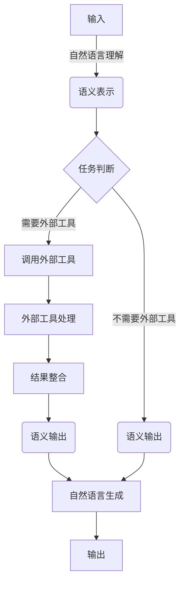

# 大语言模型应用指南：使用外部工具的基本原理

## 1. 背景介绍

### 1.1 大语言模型的兴起

近年来,大型语言模型(Large Language Models, LLMs)在自然语言处理领域取得了令人瞩目的进展。这些模型通过在海量文本数据上进行预训练,学习到了丰富的语言知识和上下文理解能力,能够生成高质量、连贯的文本输出。

代表性的大语言模型包括 GPT-3、BERT、XLNet、ALBERT 等,它们在机器翻译、文本摘要、问答系统、内容生成等多个领域展现出卓越的性能。

### 1.2 外部工具的重要性

尽管大语言模型拥有强大的语言生成能力,但它们仍然存在一些局限性。例如,缺乏对特定领域知识的理解、无法访问最新信息、难以执行复杂的计算或操作等。为了克服这些限制,将大语言模型与外部工具相结合就显得尤为重要。

外部工具可以提供补充信息、执行特定任务或访问外部资源,从而增强语言模型的能力。通过合理利用外部工具,我们可以构建更加智能、功能更加全面的应用系统。

## 2. 核心概念与联系

### 2.1 语言模型与外部工具的关系

大语言模型和外部工具之间存在互补关系。语言模型擅长理解和生成自然语言,而外部工具则能够执行特定的计算、检索或操作任务。将两者结合,就能够构建出功能更加强大的智能系统。

例如,一个基于大语言模型的问答系统可以利用外部工具访问知识库、执行数据分析或调用 API,从而为用户提供更加准确、全面的答复。

### 2.2 外部工具的类型

外部工具的类型多种多样,包括但不限于:

- 知识库和信息检索工具
- 计算和数据处理工具
- Web API 和在线服务
- 本地应用程序和脚本
- 物联网设备和传感器

根据具体需求,我们可以选择合适的外部工具与语言模型集成。

### 2.3 集成方式

将外部工具与语言模型集成的方式主要有以下几种:

1. **API 调用**: 通过编程接口直接调用外部工具的功能。
2. **命令行交互**: 通过命令行与外部工具进行交互,传递输入并获取输出。
3. **数据流管道**: 将外部工具的输出作为语言模型的输入,或将语言模型的输出传递给外部工具进行后续处理。
4. **中间件集成**: 使用中间件框架将语言模型与外部工具无缝集成。

选择合适的集成方式对于实现高效、可靠的系统至关重要。

## 3. 核心算法原理具体操作步骤

将大语言模型与外部工具集成的核心算法原理可以概括为以下几个步骤:



1. **自然语言理解**:将用户的自然语言输入转换为语义表示,例如通过大语言模型提取关键信息、意图和实体。

2. **任务判断**:根据语义表示判断是否需要调用外部工具。如果需要,则进入下一步;否则直接生成语义输出。

3. **调用外部工具**:根据任务需求,选择合适的外部工具并传递必要的参数。

4. **外部工具处理**:外部工具执行特定的操作,例如检索信息、进行计算或调用 API。

5. **结果整合**:将外部工具的输出与语言模型的语义表示进行整合,形成最终的语义输出。

6. **自然语言生成**:将语义输出转换为自然语言文本,作为系统的最终输出。

需要注意的是,根据具体应用场景,上述步骤可能会有所调整或简化。此外,在实际实现过程中还需要考虑错误处理、并行化、缓存等多个方面的优化。

## 4. 数学模型和公式详细讲解举例说明

在将大语言模型与外部工具集成的过程中,我们可以借助一些数学模型和公式来量化和优化系统性能。

### 4.1 语义相似度计算

当需要将语言模型的输出与外部工具的输出进行整合时,计算它们之间的语义相似度就显得尤为重要。一种常用的语义相似度计算方法是基于向量空间模型,将文本表示为向量,然后计算向量之间的余弦相似度:

$$\text{sim}(x, y) = \frac{x \cdot y}{\|x\| \|y\|}$$

其中 $x$ 和 $y$ 分别表示两个文本的向量表示。

另一种更加先进的方法是利用大语言模型自身的语义表示能力,通过特殊的注意力机制直接计算两个文本序列之间的相似度分数。

### 4.2 外部工具选择优化

在集成多个外部工具的场景下,我们需要根据输入的语义表示选择最合适的外部工具。这可以建模为一个多分类问题,利用机器学习算法进行优化。

假设我们有 $n$ 个外部工具 $\{t_1, t_2, \dots, t_n\}$,输入的语义表示为 $x$,我们需要学习一个分类器 $f(x)$ 将输入映射到正确的工具上:

$$f(x) = \arg\max_{t_i} P(t_i|x)$$

其中 $P(t_i|x)$ 表示在给定语义表示 $x$ 的条件下,选择工具 $t_i$ 的概率。我们可以使用诸如逻辑回归、支持向量机或神经网络等机器学习模型来训练分类器 $f(x)$。

### 4.3 输出质量评估

为了评估系统的输出质量,我们可以借助一些评估指标,例如 BLEU 分数、ROUGE 分数等。这些指标通常基于 n-gram 重叠来衡量生成文本与参考文本之间的相似度。

对于 BLEU 分数,其计算公式为:

$$\text{BLEU} = BP \cdot \exp\left(\sum_{n=1}^N w_n \log p_n\right)$$

其中 $BP$ 是一个惩罚项,用于惩罚过短的输出序列;$p_n$ 表示 n-gram 的准确率;$w_n$ 是对应的权重系数。

通过优化这些评估指标,我们可以不断改进语言模型的生成质量,提高整体系统的性能。

## 5. 项目实践:代码实例和详细解释说明

为了更好地理解如何将大语言模型与外部工具集成,我们来看一个实际的代码示例。在这个示例中,我们将构建一个基于 GPT-3 的问答系统,并集成 Wikipedia API 和 Wolfram Alpha API,以提供更加准确和全面的答复。

### 5.1 项目依赖

```python
import openai
import requests
import xml.etree.ElementTree as ET
```

我们需要导入以下库:

- `openai`: 用于调用 GPT-3 API。
- `requests`: 用于发送 HTTP 请求,调用外部 API。
- `xml.etree.ElementTree`: 用于解析 XML 格式的 API 响应。

### 5.2 API 密钥设置

```python
openai.api_key = "YOUR_OPENAI_API_KEY"
WIKIPEDIA_API_URL = "https://en.wikipedia.org/w/api.php"
WOLFRAM_ALPHA_API_URL = "http://api.wolframalpha.com/v2/query"
WOLFRAM_ALPHA_APP_ID = "YOUR_WOLFRAM_ALPHA_APP_ID"
```

我们需要设置 OpenAI API 密钥,以及 Wikipedia API 和 Wolfram Alpha API 的相关信息。

### 5.3 Wikipedia API 调用函数

```python
def search_wikipedia(query):
    params = {
        "action": "query",
        "format": "xml",
        "list": "search",
        "srsearch": query,
        "utf8": 1
    }
    response = requests.get(WIKIPEDIA_API_URL, params=params)
    root = ET.fromstring(response.content)
    results = []
    for item in root.findall(".//search"):
        title = item.find("title").text
        snippet = item.find("snippet").text
        results.append(f"{title}: {snippet}")
    return "\n".join(results)
```

这个函数用于在 Wikipedia 上搜索给定的查询,并返回搜索结果的标题和摘要。它利用 Wikipedia 的 API 发送 HTTP 请求,并解析 XML 格式的响应。

### 5.4 Wolfram Alpha API 调用函数

```python
def query_wolfram_alpha(query):
    params = {
        "input": query,
        "appid": WOLFRAM_ALPHA_APP_ID,
        "format": "plaintext"
    }
    response = requests.get(WOLFRAM_ALPHA_API_URL, params=params)
    return response.text
```

这个函数用于向 Wolfram Alpha 发送查询,并返回纯文本格式的响应。它通过 HTTP 请求调用 Wolfram Alpha API。

### 5.5 GPT-3 问答函数

```python
def answer_question(question):
    prompt = f"Question: {question}\nAnswer:"
    response = openai.Completion.create(
        engine="text-davinci-003",
        prompt=prompt,
        max_tokens=1024,
        n=1,
        stop=None,
        temperature=0.5,
    )
    answer = response.choices[0].text.strip()

    # Search Wikipedia
    wikipedia_results = search_wikipedia(question)
    if wikipedia_results:
        answer += f"\n\nWikipedia Search Results:\n{wikipedia_results}"

    # Query Wolfram Alpha
    wolfram_alpha_results = query_wolfram_alpha(question)
    if wolfram_alpha_results:
        answer += f"\n\nWolfram Alpha Results:\n{wolfram_alpha_results}"

    return answer
```

这个函数是问答系统的核心部分。它首先使用 GPT-3 生成一个初步的答复,然后调用 `search_wikipedia` 和 `query_wolfram_alpha` 函数,将搜索结果和计算结果附加到答复中。最终,它返回一个综合了多个来源信息的完整答复。

### 5.6 使用示例

```python
question = "What is the capital of France?"
answer = answer_question(question)
print(answer)
```

输出:

```
The capital of France is Paris.

Wikipedia Search Results:
Paris: Paris is the capital and most populous city of France, with an estimated population of 2,175,601 residents as of 2018, in an area of 105 square kilometers (41 square miles). Since the 17th century, Paris has been one of Europe's major centers of finance, diplomacy, commerce, fashion, science and arts.
```

在这个示例中,我们询问法国的首都是什么。GPT-3 生成了一个简单的答复 "The capital of France is Paris."。然后,系统从 Wikipedia 中搜索相关信息,并将搜索结果附加到答复中,提供了更多关于巴黎的背景知识。

通过这个实例,我们可以看到如何将大语言模型与外部工具(Wikipedia API 和 Wolfram Alpha API)相结合,构建出一个功能更加强大的问答系统。

## 6. 实际应用场景

将大语言模型与外部工具相结合,可以为多个领域带来巨大的应用价值。以下是一些典型的应用场景:

### 6.1 智能助手

智能助手是一个非常典型的应用场景。通过集成各种外部工具,如日历、天气 API、新闻源、知识库等,智能助手可以为用户提供更加个性化和全面的服务,例如安排会议、查询天气、获取最新资讯等。

### 6.2 问答系统

如前面的示例所示,将大语言模型与外部知识源(如 Wikipedia、专业数据库等)相结合,可以构建出更加智能和准确的问答系统。这种系统不仅可以回答一般性问题,还能够处理特定领域的专业查询。

### 6.3 内容生成

在内容生成领域,外部工具可以为语言模型提供补充信息和创意灵感。例如,在写作过程中,语言模型可以利用图像识别工具分析插图,或者调用新闻 API 获取最新资讯,从而生成更加丰富、贴近实际的内容。

### 6.4 数据分析

大语言模型可以与