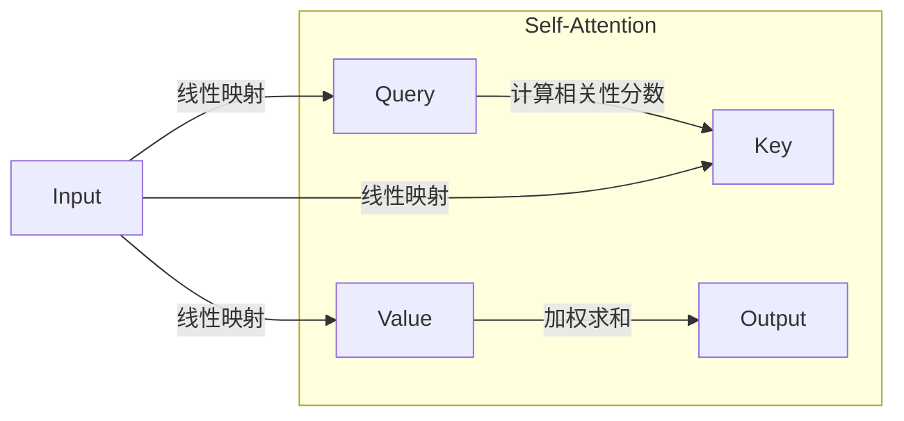
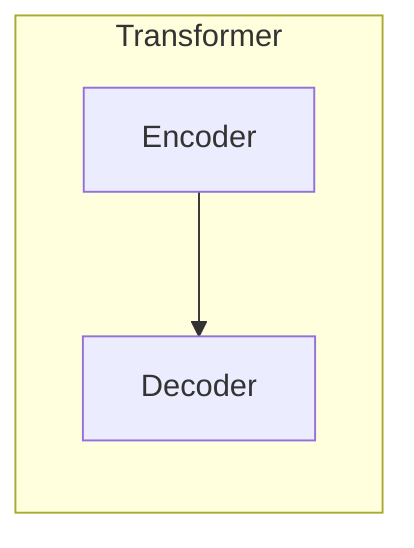
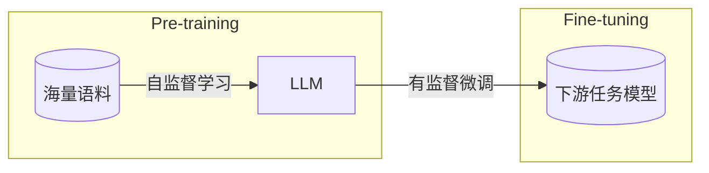
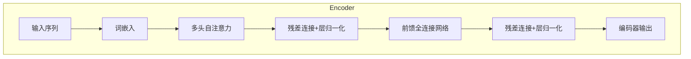
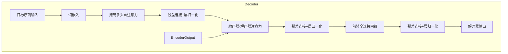
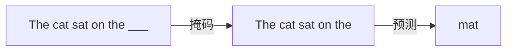
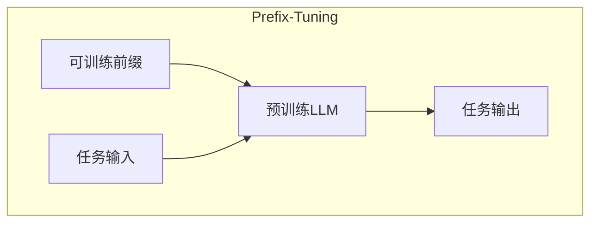

# 如何利用AI LLM优化自然语言处理任务

## 1.背景介绍

### 1.1 自然语言处理的重要性

随着人工智能技术的快速发展,自然语言处理(Natural Language Processing, NLP)已经成为当今科技领域最热门、最具挑战的研究方向之一。自然语言处理旨在使计算机能够理解和生成人类语言,实现人机自然交互,广泛应用于机器翻译、语音识别、信息检索、问答系统、智能助理等诸多领域。

### 1.2 传统NLP方法的局限性  

传统的自然语言处理方法主要依赖于规则库、统计模型和特征工程,需要大量的人工标注数据和领域知识。这些方法存在一些固有的局限性:

- 规则库构建成本高,缺乏灵活性和可扩展性
- 统计模型对大规模标注数据的依赖
- 特征工程耗时耗力,需要专业领域知识

### 1.3 大模型革命:LLM的崛起

近年来,大型语言模型(Large Language Model, LLM)的出现为自然语言处理领域带来了革命性的突破。LLM通过在大规模无标注文本数据上进行自监督学习,能够捕捉语言的深层次统计规律,展现出惊人的语言理解和生成能力。代表性的LLM模型包括GPT-3、PaLM、ChatGPT等,这些模型在多项NLP任务上表现出卓越的性能。

LLM的优势主要体现在:

- 无需大量人工标注数据,可从海量未标注语料中学习
- 通用性强,可迁移到多种NLP任务
- 生成性能出众,可生成流畅自然的文本
- 持续学习能力,可通过指令精调适应新任务

## 2.核心概念与联系

### 2.1 LLM的核心概念

#### 2.1.1 自注意力机制(Self-Attention)

自注意力机制是LLM的核心基础,它允许模型捕捉输入序列中任意两个位置之间的关系,克服了RNN等序列模型的局限性。自注意力机制可以并行计算,显著提高了模型的计算效率。

#### 2.1.2 Transformer架构

Transformer是第一个完全基于自注意力机制的序列模型,它由编码器(Encoder)和解码器(Decoder)组成。编码器捕获输入序列的上下文信息,解码器则根据编码器的输出生成目标序列。

#### 2.1.3 预训练与微调(Pre-training & Fine-tuning)

LLM采用两阶段训练策略:首先在大规模无标注文本数据上进行自监督预训练,学习通用的语言知识;然后在有标注的任务数据上进行微调(Fine-tuning),将预训练模型迁移到特定的下游任务。

### 2.2 LLM与NLP任务的联系

#### 2.2.1 文本生成

LLM擅长生成流畅自然的文本,可应用于机器写作、文案创作、对话系统、自动问答等场景。

#### 2.2.2 文本理解与分析

通过微调,LLM可用于文本分类、情感分析、命名实体识别、关系抽取等文本理解任务。

#### 2.2.3 机器翻译

LLM可以直接生成目标语言文本,为神经机器翻译提供了新的范式。

#### 2.2.4 多模态任务

LLM还可与计算机视觉模型相结合,支持图像描述、视觉问答等多模态任务。

## 3.核心算法原理具体操作步骤

### 3.1 Transformer编码器(Encoder)

Transformer编码器的核心是多头自注意力机制和前馈神经网络,通过这两个子层对输入序列进行编码。具体操作步骤如下:

1. 将输入序列映射为词嵌入矩阵
2. 执行多头自注意力计算,捕获序列中元素之间的依赖关系
3. 对自注意力输出执行残差连接和层归一化
4. 通过前馈全连接网络对序列进一步编码
5. 再次执行残差连接和层归一化
6. 重复2-5步骤,堆叠多个编码器层

### 3.2 Transformer解码器(Decoder) 

解码器的结构与编码器类似,但增加了对编码器输出的注意力计算,以捕获输入和输出序列之间的依赖关系。具体步骤:

1. 将目标序列映射为词嵌入矩阵
2. 执行掩码多头自注意力,防止attending未来位置
3. 对输出执行残差连接和层归一化  
4. 执行编码器-解码器注意力,attending编码器输出
5. 再次残差连接和层归一化
6. 通过前馈全连接网络
7. 最后残差连接和层归一化
8. 重复2-7步骤,堆叠多个解码器层

### 3.3 LLM预训练

LLM预训练阶段的目标是在大规模无标注文本数据上学习通用的语言知识。常见的自监督预训练目标包括:

#### 3.3.1 掩码语言模型(Masked Language Modeling)

随机掩码输入序列中的部分词元,模型需要基于上下文预测被掩码的词元。

#### 3.3.2 下一句预测(Next Sentence Prediction)

给定两个句子,模型需要预测它们是否为连续的句子对。

#### 3.3.3 序列到序列预训练(Sequence-to-Sequence Pre-training)

模型需要学习将输入序列生成为目标序列,如机器翻译、文本摘要等任务。

### 3.4 LLM微调

在预训练后,LLM可通过微调迁移到特定的下游NLP任务。微调过程中,模型参数在任务数据上进行进一步训练和调整,以适应新任务。常见的微调方法包括:

#### 3.4.1 全模型微调

对整个LLM模型的所有参数进行微调,获得最佳性能,但计算代价较高。

#### 3.4.2 前馈层微调

只对LLM的前馈网络层进行微调,计算量较小,但性能可能受到影响。

#### 3.4.3 提示学习(Prompt Learning)

通过设计特定的提示,将下游任务转化为掩码语言模型任务,无需微调模型参数。

#### 3.4.4 前缀学习(Prefix Tuning)

在LLM输入端添加可训练的前缀向量,作为任务的参数化提示,避免修改预训练参数。

## 4.数学模型和公式详细讲解举例说明

### 4.1 自注意力机制

自注意力机制是Transformer的核心,它通过计算Query、Key和Value之间的相似性分数,对序列中的每个元素进行加权求和,捕获全局依赖关系。

给定一个长度为$n$的序列$\boldsymbol{x} = (x_1, x_2, \ldots, x_n)$,我们将其线性映射到Query($\boldsymbol{Q}$)、Key($\boldsymbol{K}$)和Value($\boldsymbol{V}$)矩阵:

$$\begin{aligned}
\boldsymbol{Q} &= \boldsymbol{x}\boldsymbol{W}^Q\\
\boldsymbol{K} &= \boldsymbol{x}\boldsymbol{W}^K\\
\boldsymbol{V} &= \boldsymbol{x}\boldsymbol{W}^V
\end{aligned}$$

其中$\boldsymbol{W}^Q$、$\boldsymbol{W}^K$和$\boldsymbol{W}^V$是可训练的权重矩阵。

然后,我们计算Query和Key之间的点积,获得相似性分数矩阵:

$$\text{Scores}(\boldsymbol{Q}, \boldsymbol{K}) = \frac{\boldsymbol{Q}\boldsymbol{K}^\top}{\sqrt{d_k}}$$

其中$d_k$是Query和Key的维度,用于缩放点积值。

通过对分数矩阵执行SoftMax操作,我们得到注意力权重矩阵:

$$\text{Attention}(\boldsymbol{Q}, \boldsymbol{K}, \boldsymbol{V}) = \text{softmax}\left(\frac{\boldsymbol{Q}\boldsymbol{K}^\top}{\sqrt{d_k}}\right)\boldsymbol{V}$$

最终,自注意力输出是Value矩阵根据注意力权重矩阵的加权求和。

### 4.2 多头自注意力

为了捕捉不同子空间的依赖关系,Transformer使用了多头自注意力机制。具体来说,我们将Query、Key和Value矩阵分别投影到$h$个子空间,对每个子空间执行自注意力操作,然后将所有头的输出拼接起来:

$$\begin{aligned}
\text{MultiHead}(\boldsymbol{Q}, \boldsymbol{K}, \boldsymbol{V}) &= \text{Concat}(\text{head}_1, \ldots, \text{head}_h)\boldsymbol{W}^O\\
\text{where}\quad \text{head}_i &= \text{Attention}(\boldsymbol{Q}\boldsymbol{W}_i^Q, \boldsymbol{K}\boldsymbol{W}_i^K, \boldsymbol{V}\boldsymbol{W}_i^V)
\end{aligned}$$

其中$\boldsymbol{W}_i^Q$、$\boldsymbol{W}_i^K$、$\boldsymbol{W}_i^V$和$\boldsymbol{W}^O$是可训练的投影矩阵。

多头机制赋予了模型关注不同位置关系的能力,提高了表达能力和性能。

### 4.3 掩码语言模型目标

掩码语言模型(Masked Language Modeling, MLM)是LLM预训练的主要目标之一。给定一个长度为$n$的序列$\boldsymbol{x} = (x_1, x_2, \ldots, x_n)$,我们