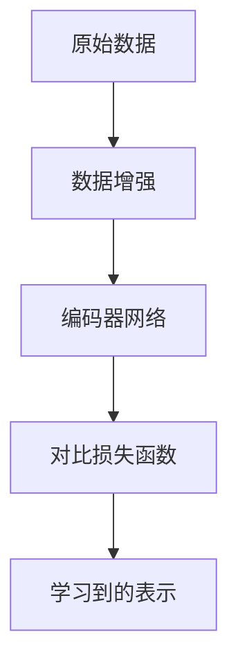

# 对比学习原理与代码实战案例讲解

## 1. 背景介绍

### 1.1 对比学习的起源与发展
#### 1.1.1 对比学习的起源
#### 1.1.2 对比学习的发展历程
#### 1.1.3 对比学习的研究现状

### 1.2 对比学习的应用领域
#### 1.2.1 计算机视觉中的应用
#### 1.2.2 自然语言处理中的应用 
#### 1.2.3 语音识别中的应用

### 1.3 对比学习的优势与挑战
#### 1.3.1 对比学习的优势
#### 1.3.2 对比学习面临的挑战
#### 1.3.3 对比学习的未来展望

## 2. 核心概念与联系

### 2.1 对比学习的定义
#### 2.1.1 对比学习的形式化定义
#### 2.1.2 对比学习与监督学习、无监督学习的区别
#### 2.1.3 对比学习的核心思想

### 2.2 对比学习的关键组成部分
#### 2.2.1 数据增强
#### 2.2.2 编码器网络
#### 2.2.3 对比损失函数

### 2.3 对比学习中的重要概念
#### 2.3.1 正样本与负样本
#### 2.3.2 对比预测编码
#### 2.3.3 对比表示学习

## 3. 核心算法原理具体操作步骤

### 3.1 SimCLR算法
#### 3.1.1 SimCLR算法原理
#### 3.1.2 SimCLR算法流程
#### 3.1.3 SimCLR算法的优缺点分析

### 3.2 MoCo算法
#### 3.2.1 MoCo算法原理
#### 3.2.2 MoCo算法流程 
#### 3.2.3 MoCo算法的优缺点分析

### 3.3 BYOL算法
#### 3.3.1 BYOL算法原理
#### 3.3.2 BYOL算法流程
#### 3.3.3 BYOL算法的优缺点分析

## 4. 数学模型和公式详细讲解举例说明

### 4.1 对比损失函数的数学表达
#### 4.1.1 InfoNCE损失函数
$$ \mathcal{L}_{q,k^+,\{k^-\}}=-\log \frac{\exp(q\cdot k^+/\tau)}{\exp(q\cdot k^+/\tau)+\sum_{k^-}\exp(q\cdot k^-/\tau)} $$

#### 4.1.2 NT-Xent损失函数 
$$ \ell_{i,j} = -\log \frac{\exp(\mathrm{sim}(\boldsymbol{z}_i, \boldsymbol{z}_j)/\tau)}{\sum_{k=1}^{2N} \mathbb{1}_{[k \neq i]} \exp(\mathrm{sim}(\boldsymbol{z}_i, \boldsymbol{z}_k)/\tau)} $$

#### 4.1.3 其他常见的对比损失函数

### 4.2 编码器网络的数学表达
#### 4.2.1 卷积神经网络编码器
#### 4.2.2 Transformer编码器
#### 4.2.3 图神经网络编码器

### 4.3 对比学习中的数据增强技术
#### 4.3.1 随机裁剪
#### 4.3.2 颜色失真
#### 4.3.3 高斯模糊

## 5. 项目实践：代码实例和详细解释说明

### 5.1 基于PyTorch的SimCLR实现
#### 5.1.1 数据准备与预处理
#### 5.1.2 模型构建与训练
#### 5.1.3 模型评估与结果分析

### 5.2 基于TensorFlow的MoCo实现
#### 5.2.1 数据准备与预处理
#### 5.2.2 模型构建与训练
#### 5.2.3 模型评估与结果分析

### 5.3 基于Keras的BYOL实现
#### 5.3.1 数据准备与预处理
#### 5.3.2 模型构建与训练
#### 5.3.3 模型评估与结果分析

## 6. 实际应用场景

### 6.1 图像分类任务
#### 6.1.1 使用对比学习进行图像分类
#### 6.1.2 对比学习在图像分类中的优势
#### 6.1.3 图像分类任务的实践案例

### 6.2 目标检测任务
#### 6.2.1 使用对比学习进行目标检测
#### 6.2.2 对比学习在目标检测中的优势
#### 6.2.3 目标检测任务的实践案例

### 6.3 语义分割任务
#### 6.3.1 使用对比学习进行语义分割
#### 6.3.2 对比学习在语义分割中的优势
#### 6.3.3 语义分割任务的实践案例

## 7. 工具和资源推荐

### 7.1 对比学习的开源框架
#### 7.1.1 PyTorch中的对比学习库
#### 7.1.2 TensorFlow中的对比学习库
#### 7.1.3 其他常用的对比学习框架

### 7.2 对比学习的数据集资源
#### 7.2.1 图像分类数据集
#### 7.2.2 目标检测数据集
#### 7.2.3 语义分割数据集

### 7.3 对比学习的学习资料
#### 7.3.1 对比学习的教程与博客
#### 7.3.2 对比学习的论文与综述
#### 7.3.3 对比学习的视频课程

## 8. 总结：未来发展趋势与挑战

### 8.1 对比学习的未来发展趋势
#### 8.1.1 对比学习与多模态学习的结合
#### 8.1.2 对比学习在无监督领域的拓展
#### 8.1.3 对比学习与元学习的融合

### 8.2 对比学习面临的挑战
#### 8.2.1 负样本的选择与构建
#### 8.2.2 大规模数据下的计算效率问题
#### 8.2.3 对比学习的理论基础与证明

### 8.3 对比学习的研究展望
#### 8.3.1 对比学习在更广泛领域的应用
#### 8.3.2 对比学习算法的优化与改进
#### 8.3.3 对比学习与其他机器学习范式的结合

## 9. 附录：常见问题与解答

### 9.1 对比学习与传统监督学习的区别是什么？
### 9.2 对比学习中的数据增强技术有哪些？
### 9.3 如何选择合适的对比损失函数？
### 9.4 对比学习中的编码器网络有哪些常见的选择？
### 9.5 对比学习在实际应用中需要注意哪些问题？

作者：禅与计算机程序设计艺术 / Zen and the Art of Computer Programming