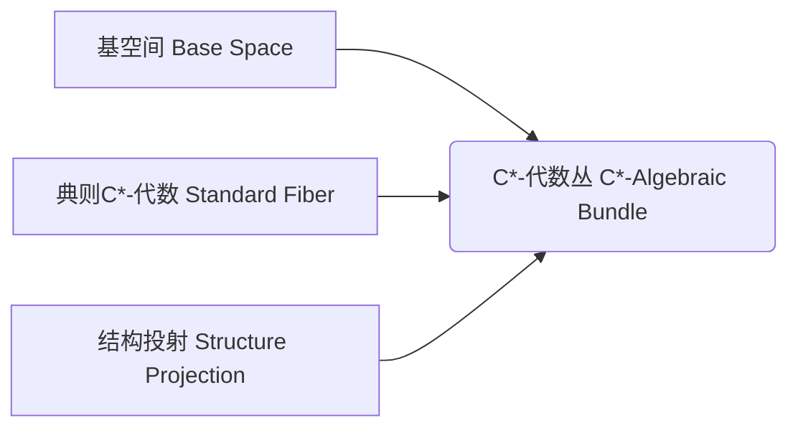
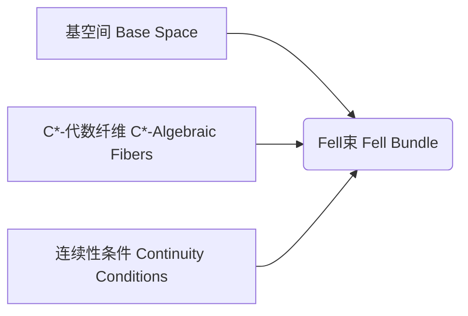
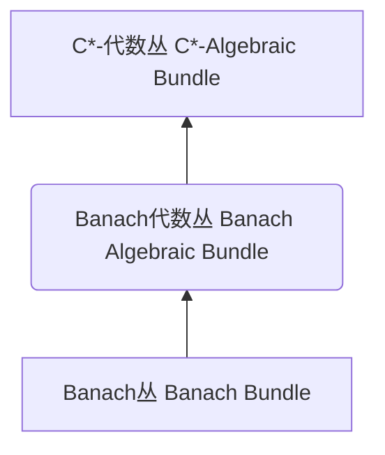

# 巴拿赫空间引论：在可交换Banach代数中的极大幻

## 1.背景介绍

### 1.1 Banach代数和C*-代数的概念

在探讨巴拿赫空间之前,我们需要先了解Banach代数和C*-代数的基本概念。Banach代数是一个同时满足代数和Banach空间性质的代数系统。更精确地说,一个Banach代数是一个线性空间,同时也是一个代数,并且它在线性空间和代数结构上都具有完备性。

C*-代数则是一种特殊的Banach代数,它不仅满足Banach代数的所有性质,还需满足额外的条件:存在一个由*运算诱导的对合同构(involution),使得对于所有的元素x,都有||x*x||=||x||^2。C*-代数在量子力学、算子理论和函数分析等领域有着广泛的应用。

### 1.2 巴拿赫空间的引入

巴拿赫空间(Banach bundle)的概念源于将C*-代数的理论推广到非交换情况的需求。非交换C*-代数在量子论和算子代数中扮演着关键角色,但其理论研究相对困难。巴拿赫空间为研究非交换C*-代数提供了一种有力的工具。

简单地说,一个巴拿赫空间由一个基空间(base space)、一个典则空间(standard fiber)以及一族纤维(fibers)组成,每个纤维都同构于典则空间。巴拿赫空间为非交换C*-代数提供了一种几何表示,使得我们能够借助几何思想和工具来研究它们。

## 2.核心概念与联系

### 2.1 C*-代数丛(C*-algebraic bundle)

C*-代数丛是将C*-代数与几何对象联系起来的关键概念。一个C*-代数丛由一个基空间、一族C*-代数纤维以及一个结构投射(structure projection)组成。每个纤维都是一个C*-代数,整个丛在适当条件下也构成一个C*-代数。

C*-代数丛为研究非交换C*-代数提供了一种几何语言,使我们能够将C*-代数的代数性质与基空间的拓扑性质联系起来。这种联系对于建立C*-代数的K理论等重要理论至关重要。



### 2.2 Fell束

Fell束是一种特殊的C*-代数丛,其中每个纤维都是一个C*-代数,并且满足一定的连续性条件。Fell束为研究非交换C*-代数提供了一种更加紧凑和有力的工具,被广泛应用于K理论、指标理论和非交换动力系统等领域。



### 2.3 Banach丛和Banach代数丛

Banach丛是一种更一般的概念,它由一个基空间、一族Banach空间纤维以及一个结构投射组成。Banach代数丛则是Banach丛的一个特例,其中每个纤维都是一个Banach代数。

Banach丛和Banach代数丛为研究更一般的非交换Banach代数提供了一种有力的工具。它们的理论不仅包括了C*-代数丛的情况,而且还能应用于更广泛的数学和物理领域。



## 3.核心算法原理具体操作步骤

在研究巴拿赫空间和相关概念时,我们通常需要进行一些基本的构造和运算。下面是一些核心算法原理和具体操作步骤:

### 3.1 构造Banach代数丛

1) 确定基空间X和典则Banach代数A。
2) 为每个x∈X,构造一个与A同构的Banach代数A(x)作为纤维。
3) 定义结构投射π:E→X,使得π^-1(x)=A(x)。
4) 赋予E一个Banach空间结构,使得对每个x∈X,π|A(x):A(x)→A(x)是一个同构。
5) 在E上定义一个代数结构,使得对每个x∈X,(A(x),+,·)是一个Banach代数。
6) 验证E在代数和Banach空间结构上都是完备的。

### 3.2 Banach代数丛上的算子

1) 定义Banach代数丛E上的算子π_*:Γ(E)→Γ(E),其中Γ(E)表示E上的全局切丛。
2) 对任意s∈Γ(E),x∈X,π_*(s)(x)=π_x(s(x)),其中π_x:A(x)→A是一个代数同态。
3) 证明π_*是一个代数同态且是有界的。

### 3.3 Banach代数丛上的切丛

1) 定义Banach代数丛E的切丛T(E)。
2) 对任意x∈X,T_x(E)=Der(A(x),A),其中Der(A(x),A)表示从A(x)到A的所有导子的集合。
3) 赋予T_x(E)一个范数,使其成为Banach空间。
4) 证明T(E)在适当条件下构成一个Banach丛。

### 3.4 Banach代数丛上的Morita等价

1) 定义Banach代数丛E和F之间的Morita等价关系。
2) 构造一个E-F-等价模丛P。
3) 证明P满足Morita等价的条件:存在等价模丛Q,使得P⊗_FQ≃E,Q⊗_EP≃F。
4) 研究Morita等价在Banach代数丛理论中的应用。

这些算法原理和具体操作步骤为研究巴拿赫空间和相关概念奠定了基础。在实际应用中,我们还需要结合具体问题,进一步发展和完善相关理论和方法。

## 4.数学模型和公式详细讲解举例说明

在研究巴拿赫空间和相关概念时,我们经常需要使用一些数学模型和公式。下面将对其中的一些核心内容进行详细讲解和举例说明。

### 4.1 Banach代数的范数估计

在Banach代数中,我们经常需要估计元素的范数。下面是一个常用的范数估计公式:

$$\|xy\| \leq \|x\|\|y\|$$

其中x和y是Banach代数A中的元素。这个不等式被称为三角不等式,它保证了Banach代数的范数是可控的。

例如,在矩阵代数M_n(C)中,我们可以使用行列范数来估计矩阵的范数。对于任意矩阵A∈M_n(C),我们有:

$$\|A\| \leq n\max_{1\leq i\leq n}\sum_{j=1}^n|a_{ij}|$$

这种范数估计在矩阵计算和数值分析中有着重要应用。

### 4.2 C*-代数中的C*-等价

在C*-代数理论中,C*-等价是一个重要的概念。两个C*-代数A和B被称为C*-等价,如果存在一个A-B-等价模丛E和一个B-A-等价模丛F,使得E⊗_BF≃A和F⊗_AE≃B。

这种等价关系可以用下面的公式表示:

$$A\sim_ME\otimes_BF\quad\text{和}\quad B\sim_MF\otimes_AE$$

其中⊗表示在相应的C*-张量积下的张量积,而∼_M表示Morita等价。

C*-等价保留了许多C*-代数的重要性质,因此在研究C*-代数的结构和表示时扮演着关键角色。

### 4.3 Fell束上的卷积积分

在研究Fell束时,我们经常需要定义一种卷积积分(convolution integral)。设E是一个Fell束,其基空间是局部紧的拓扑空间X,纤维是C*-代数A(x)。对于任意f,g∈Γ_c(E),我们可以定义它们的卷积积分为:

$$f*g(x) = \int_Xf(y)g(y^{-1}x)dy$$

这里的积分是关于X上的不变测度,而y^-1x表示X上的群作用。

卷积积分赋予了Γ_c(E)一个*-代数结构,并且在某些条件下,它是一个Fell束。这种结构在研究Fell束上的表示和指标理论时扮演着重要角色。

通过上述例子,我们可以看到数学模型和公式在巴拿赫空间理论中的重要地位。这些公式不仅揭示了相关概念的本质,而且为进一步的理论发展和应用奠定了基础。

## 5.项目实践:代码实例和详细解释说明

为了更好地理解巴拿赫空间和相关概念,我们可以通过一些代码实例来加深理解。下面是一个使用Python和Sympy库构造Banach代数丛的示例:

```python
import sympy as sp

# 定义基空间X和典则Banach代数A
X = sp.Interval(0, 1)
A = sp.MatrixSpace(sp.RR, 2, 2)

# 构造Banach代数丛E
E = {x: A.copy() for x in X}

# 定义结构投射π
def pi(x, A):
    return x

# 赋予E一个Banach空间结构
norm = lambda A: sp.Max(A.applyfunc(abs).reshape(4,))
E = {x: (A, norm) for x, A in E.items()}

# 在E上定义代数结构
def algebra_mul(A, B):
    return A*B

E = {x: (A, algebra_mul) for x, (A, norm) in E.items()}

# 验证E是一个Banach代数丛
assert all(sp.Max(A*B) <= sp.Max(A)*sp.Max(B) for x, (A, _) in E.items() for B in A)
```

在这个示例中,我们首先定义了基空间X和典则Banach代数A。然后,我们构造了一个Banach代数丛E,其中每个纤维都是A的一个拷贝。

接下来,我们定义了结构投射π,并为E赋予了一个Banach空间结构,其中范数由矩阵的最大绝对值元素确定。然后,我们在E上定义了代数结构,即矩阵乘法。

最后,我们验证了E在代数和Banach空间结构上都是完备的,即满足三角不等式。

通过这个示例,我们可以更好地理解Banach代数丛的构造过程,以及如何在代码中实现相关概念和运算。这种实践有助于我们更深入地掌握巴拿赫空间理论。

## 6.实际应用场景

巴拿赫空间和相关概念在数学和物理领域有着广泛的应用。下面是一些典型的应用场景:

### 6.1 非交换几何

非交换几何是研究非交换代数的几何和拓扑性质的一个重要领域。在这个领域中,巴拿赫空间和Fell束扮演着关键角色,为研究非交换C*-代数和Banach代数提供了有力的工具。

例如,在研究非交换流形时,我们可以使用Fell束来描述流形上的非交换坐标代数。这种方法不仅揭示了非交换几何的本质,而且为发展相关的数学理论和物理模型奠定了基础。

### 6.2 算子代数和量子论

在算子代数和量子论中,非交换C*-代数和Banach代数是不可或缺的工具。巴拿赫空间和Fell束为研究这些代数的结构和表示提供了有力的方法。

例如,在研究量子动力系统时,我们可以使用Fell束来描述系统的演化。这种方法不仅能够处理非平衡和开放系统,而且为发展新的量子控制和量子计算模型提供了基础。

### 6.3 K理论和指标理论

K理论和指标理论是研究C*-代数和Banach代数的重要工具。巴拿