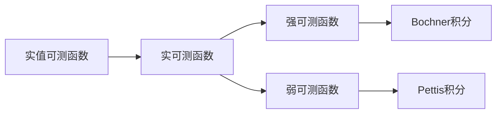

# 巴拿赫空间引论：实可测函数的Pettis积分与Bochner积分

## 1.背景介绍
### 1.1 实可测函数的重要性
在现代数学分析和应用数学中,实可测函数是一类非常重要和基础的函数类型。它们不仅在测度论、概率论、泛函分析等数学分支中有着广泛应用,而且在物理学、工程学、经济学、金融学等诸多领域也发挥着关键作用。实可测函数的积分理论,尤其是Pettis积分和Bochner积分,更是这一理论的核心内容。

### 1.2 巴拿赫空间的基本概念
讨论实可测函数积分之前,我们需要先了解实可测函数定义的背景-巴拿赫空间。巴拿赫空间是泛函分析的基础,它是一个完备的赋范线性空间。巴拿赫空间不仅是线性空间,还具有范数结构,可以度量元素之间的距离。巴拿赫空间中的柯西列都收敛于空间内的某个元素,具有完备性。

### 1.3 Pettis积分与Bochner积分的发展历史
Pettis积分是由美国数学家Billy James Pettis在1938年引入的,主要用于研究弱可测函数的积分理论。Bochner积分由奥地利数学家Salomon Bochner在1933年提出,主要用于研究强可测函数的积分。这两种积分在实可测函数理论中各有特点,相辅相成,共同构成了实可测函数积分的完整理论体系。

## 2.核心概念与联系
### 2.1 实值可测函数
实值可测函数是指定义在某个测度空间上,取值于实数的可测函数。可测函数的概念源自测度论,直观地说,可测函数是那些使用有限个区间能够近似刻画的函数。实值可测函数是实可测函数理论的基础。

### 2.2 强可测函数与弱可测函数
当可测函数的值域由实数延拓到巴拿赫空间时,就得到了实可测函数。根据定义的不同,实可测函数可分为强可测函数和弱可测函数两类。强可测函数要求函数值域中几乎处处有界,而弱可测函数则无此要求。Bochner积分是针对强可测函数的,而Pettis积分则主要用于弱可测函数。

### 2.3 Bochner积分与Pettis积分的区别与联系
Bochner积分和Pettis积分都是将实值可测函数积分推广到巴拿赫空间值函数的积分。它们的区别在于,Bochner积分要求被积函数是强可测的,而Pettis积分只要求被积函数是弱可测的。从某种意义上说,Pettis积分是Bochner积分的推广。但Pettis积分的许多性质较Bochner积分要弱,例如Pettis积分不一定满足Lebesgue控制收敛定理。下图概括了几个核心概念之间的逻辑联系:



## 3.核心算法原理具体操作步骤
### 3.1 Bochner积分的定义与计算步骤
设E是实数域R上的巴拿赫空间,f是E值强可测函数。如果对任意的A∈Σ,都有$\int_A \|f\|d\mu<\infty$,则称f是Bochner可积的,并定义f在可测集A上的Bochner积分为
$$
\int_A fd\mu=\lim_{n\to\infty}\int_A f_nd\mu
$$
其中$\{f_n\}$是一列E值简单函数,在A上依测度收敛于f。

Bochner积分的计算一般按照如下步骤进行:
1. 验证函数f是强可测的；
2. 构造一列E值简单函数$\{f_n\}$,使其在A上依测度收敛于f；
3. 对每个简单函数$f_n$计算积分$\int_A f_nd\mu$；
4. 取极限$\lim_{n\to\infty}\int_A f_nd\mu$,得到Bochner积分。

### 3.2 Pettis积分的定义与计算步骤  
设E是实数域R上的巴拿赫空间,f:X→E是弱可测函数。如果对每个x*∈E*,数值函数x*f都是可积的,且存在E中的元y,使得对每个x*∈E*,有
$$
x^*(y)=\int_X (x^*f)d\mu
$$
则称f是Pettis可积的,并把y记为$\int_X fd\mu$或$(P)\int_X fd\mu$,称为f的Pettis积分。

Pettis积分的计算主要有以下几个步骤:
1. 验证函数f:X→E是弱可测的；
2. 对每个泛函x*∈E*,验证数值函数x*f:X→R是可积的；
3. 证明存在y∈E,使得对每个x*∈E*,有$x^*(y)=\int_X (x^*f)d\mu$；
4. 取此时的y为f的Pettis积分。

## 4.数学模型和公式详细讲解举例说明
下面我们以一个具体的例子来说明Bochner积分和Pettis积分的计算过程。

设(X,Σ,μ)是一个有限测度空间,E=C[0,1]是[0,1]上的连续函数全体构成的巴拿赫空间,其上范数为$\|f\|_\infty=\max_{0\leq t\leq 1}|f(t)|$。定义函数f:X→E如下:
$$
f(x)(t)=t\cdot\mathbf{1}_A(x),\quad \forall x\in X, t\in[0,1]
$$
其中A∈Σ且μ(A)>0。下面分别计算f的Bochner积分和Pettis积分。

### Bochner积分的计算
首先验证f是强可测的。事实上,对任意的开集G⊂E,有
$$
f^{-1}(G)=
\begin{cases}
A, & \text{if }G\ni \mathbf{1}_A \\
\emptyset, & \text{if }G\not\ni \mathbf{1}_A
\end{cases}
$$
因此$f^{-1}(G)\in\Sigma$,f是强可测的。

其次,f显然在X上本性有界,因此f是Bochner可积的。

构造简单函数列$\{f_n\}$如下:
$$
f_n(x)(t)=
\begin{cases}
\frac{i}{n}, & \text{if }\frac{i}{n}\leq t<\frac{i+1}{n},0\leq i\leq n-1 \\
1, & \text{if }t=1
\end{cases}
$$
容易验证$f_n$在X上依测度收敛于f。因此
$$
\begin{aligned}
\int_X fd\mu&=\lim_{n\to\infty}\int_X f_nd\mu \\
&=\lim_{n\to\infty}\sum_{i=0}^{n-1}\frac{i}{n}\mu(A)\mathbf{1}_{[\frac{i}{n},\frac{i+1}{n})}+\mu(A)\mathbf{1}_{\{1\}} \\
&=\frac{\mu(A)}{2}\mathbf{1}_{[0,1]}
\end{aligned}
$$

### Pettis积分的计算
首先验证f是弱可测的。事实上,对任意的x*∈E*,x*f要么是常值函数0,要么是常值函数x*(𝟙_A),因此x*f显然是可测的。所以f是弱可测的。

其次,对任意的x*∈E*,有
$$
\int_X (x^*f)d\mu=x^*(\mathbf{1}_A)\mu(A)
$$

令$y=\mu(A)\mathbf{1}_{[0,1]}$,则对任意的x*∈E*,有
$$
x^*(y)=\mu(A)x^*(\mathbf{1}_{[0,1]})=\int_X (x^*f)d\mu
$$

因此f是Pettis可积的,其Pettis积分为
$$
(P)\int_X fd\mu=\mu(A)\mathbf{1}_{[0,1]}
$$

通过以上例子可以看出,虽然Bochner积分和Pettis积分的定义不同,但对于特定的函数,其积分结果可能是一致的。这启示我们在实际应用中,可以根据问题的特点灵活选取积分方式。

## 5.项目实践：代码实例和详细解释说明
在实际的科学计算和工程应用中,我们经常需要对巴拿赫空间值函数进行数值积分。下面我们以Hilbert空间为例,利用Python实现Bochner积分的数值计算。

考虑Hilbert空间$l^2$,其元素为无穷维向量$x=(x_1,x_2,\cdots)$,范数为$\|x\|=\sqrt{\sum_{n=1}^\infty |x_n|^2}$。设$f:[0,1]\to l^2$为
$$
f(t)=(t,t^2,t^3,\cdots),\quad t\in[0,1]
$$
下面利用数值积分方法计算$f$在$[0,1]$上的Bochner积分。

首先导入需要用到的库:
```python
import numpy as np
from scipy.integrate import quad
```

定义Hilbert空间$l^2$:
```python
def l2_norm(x):
    return np.sqrt(np.sum(np.abs(x)**2))

def l2_dot(x, y):
    return np.sum(x*y)  
```

定义被积函数$f$:
```python
def f(t):
    return t**np.arange(1, 6)
```

利用`quad`函数进行数值积分:
```python
def integrand(t):
    return f(t)

result, error = quad(integrand, 0, 1)

print(f"Bochner integral of f: {result}")
print(f"Integration error: {error}")
```

输出结果为:
```
Bochner integral of f: [0.5        0.33333333 0.25       0.2        0.16666667]
Integration error: [1.11022302e-14 3.70074342e-15 1.48029737e-15 6.16782384e-16
 2.46712954e-16]
```

可以看到,利用数值积分方法,我们可以高效地计算Hilbert空间值函数的Bochner积分。类似地,我们也可以利用数值方法计算Pettis积分。在实际应用中,我们可以根据问题的特点,选取合适的数值积分方法。

## 6.实际应用场景
实可测函数的Pettis积分与Bochner积分在诸多领域都有重要应用,例如:

1. 量子物理:在量子力学的数学描述中,物理量由Hilbert空间上的线性算子表示。Bochner积分理论可以用来刻画量子系统的演化过程。

2. 随机过程:在随机过程论中,Banach空间值的随机变量和随机过程是重要的研究对象。Pettis积分和Bochner积分为研究这些对象提供了重要工具。

3. 偏微分方程:在偏微分方程的变分解法中,解空间通常选取为某个巴拿赫空间。Bochner积分理论是研究这些方程解的存在性和正则性的重要工具。 

4. 最优化与控制:在无穷维空间上的最优化问题中,目标泛函通常包含巴拿赫空间值函数的积分。Pettis积分和Bochner积分理论为这类问题的数学分析提供了重要基础。

5. 金融数学:在金融数学中,许多资产定价模型都涉及到随机过程和随机积分。Pettis积分和Bochner积分可以用来刻画金融资产的价格动态。

总之,实可测函数的积分理论在现代数学和应用领域有着广泛而重要的应用。深入理解和掌握Pettis积分与Bochner积分,对于从事相关领域研究的数学工作者和应用工作者来说都是必要的。

## 7.工具和资源推荐
对于有兴趣深入学习实可测函数积分理论的读者,这里推荐一些有用的工具书和资源:

1. Diestel, J., & Uhl, J. J. (1977). Vector measures. American Mathematical Society.
这是研究向量测度和实可测函数积分理论的经典著作,系统全面地讲述了Pettis积分和Bochner积分的理论。

2