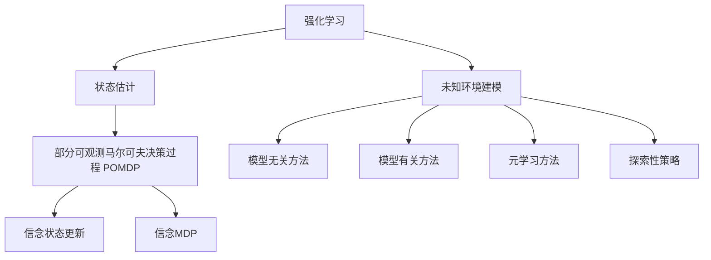

# 强化学习Reinforcement Learning中的状态估计与未知环境建模

## 1. 背景介绍
### 1.1 强化学习概述
强化学习(Reinforcement Learning, RL)是机器学习的一个重要分支,它研究如何让智能体(agent)通过与环境的交互来学习最优策略,以获得最大的累积奖励。与监督学习和无监督学习不同,强化学习并不依赖于标注数据,而是通过探索(exploration)和利用(exploitation)来不断试错,从而找到最优策略。

### 1.2 强化学习的核心要素
强化学习主要包含以下几个核心要素:
- 智能体(Agent):与环境交互并做出决策的主体
- 环境(Environment):智能体所处的环境,提供观测(observation)和奖励(reward)
- 状态(State):环境的内部状态,可以是完全可观测的,也可以是部分可观测的
- 动作(Action):智能体根据当前状态选择的动作
- 策略(Policy):智能体选择动作的策略函数,将状态映射为动作的概率分布
- 价值函数(Value Function):评估状态的好坏,通常用累积奖励的期望来表示
- 奖励函数(Reward Function):环境根据智能体的动作给出的即时奖励

### 1.3 强化学习面临的挑战
强化学习在实际应用中面临许多挑战,其中状态估计和未知环境建模是两个关键问题:

1. 状态估计:在许多实际场景中,智能体无法直接获得环境的完整状态,只能通过有限的观测来推断状态。如何从观测序列中准确估计状态是一个重要挑战。

2. 未知环境建模:在许多实际场景中,环境的转移概率和奖励函数是未知的。智能体需要在与环境交互的过程中,同时学习环境模型和最优策略。如何在探索和利用之间权衡,高效地学习环境模型是一个重要挑战。

本文将重点讨论强化学习中的状态估计和未知环境建模问题,介绍相关的核心概念、算法原理、数学模型、代码实例以及实际应用,并展望未来的发展方向。

## 2. 核心概念与联系
### 2.1 马尔可夫决策过程
马尔可夫决策过程(Markov Decision Process, MDP)是描述强化学习问题的标准数学框架。一个MDP由以下元素组成:
- 状态空间 $\mathcal{S}$:所有可能状态的集合
- 动作空间 $\mathcal{A}$:在每个状态下可用动作的集合  
- 转移概率 $\mathcal{P}(s'|s,a)$:在状态 $s$ 下执行动作 $a$ 后转移到状态 $s'$ 的概率
- 奖励函数 $\mathcal{R}(s,a)$:在状态 $s$ 下执行动作 $a$ 获得的即时奖励的期望
- 折扣因子 $\gamma \in [0,1]$:未来奖励的折扣率,用于平衡即时奖励和长期奖励

MDP的目标是找到一个最优策略 $\pi^*$,使得从任意初始状态出发,执行该策略能获得最大的期望累积奖励:

$$\pi^* = \arg\max_{\pi} \mathbb{E}\left[\sum_{t=0}^{\infty} \gamma^t \mathcal{R}(s_t,a_t) | \pi \right]$$

其中 $s_t$ 和 $a_t$ 分别表示在时刻 $t$ 的状态和动作。

### 2.2 部分可观测马尔可夫决策过程
在许多实际场景中,智能体无法直接获得MDP的状态,而是通过一个观测函数 $\mathcal{O}(o|s)$ 从状态生成观测 $o$。这种情况下的决策过程称为部分可观测马尔可夫决策过程(Partially Observable Markov Decision Process, POMDP)。POMDP在MDP的基础上引入了:  
- 观测空间 $\Omega$:所有可能观测的集合
- 观测函数 $\mathcal{O}(o|s)$:在状态 $s$ 下生成观测 $o$ 的概率

在POMDP中,最优策略 $\pi^*$ 需要基于历史观测和动作来选择当前动作:

$$\pi^*(a_t|o_1,a_1,\dots,o_t) = \arg\max_{\pi} \mathbb{E}\left[\sum_{t=0}^{\infty} \gamma^t \mathcal{R}(s_t,a_t) | o_1,a_1,\dots,o_t, \pi \right]$$

### 2.3 信念状态与信念MDP
为了在POMDP中做出最优决策,一种常用的方法是将历史观测和动作总结为一个信念状态(belief state) $b_t$,表示对当前状态的概率分布。给定转移和观测概率,信念状态可以递归更新:

$$b_{t+1}(s') = \eta \mathcal{O}(o_{t+1}|s') \sum_{s\in\mathcal{S}} \mathcal{P}(s'|s,a_t)b_t(s)$$

其中 $\eta$ 是归一化常数。基于信念状态,可以将POMDP转化为一个信念MDP(Belief MDP),其状态空间为所有可能的信念状态,转移函数为信念状态的更新规则。信念MDP的最优策略 $\pi^*$ 定义为:

$$\pi^*(a_t|b_t) = \arg\max_{\pi} \mathbb{E}\left[\sum_{t=0}^{\infty} \gamma^t \mathcal{R}(s_t,a_t) | b_t, \pi \right]$$

### 2.4 未知环境建模
在许多实际场景中,环境的转移概率 $\mathcal{P}$ 和奖励函数 $\mathcal{R}$ 是未知的。此时智能体需要在与环境交互的过程中,同时学习环境模型和最优策略。常见的方法包括:

1. 模型无关的方法:直接学习状态-动作值函数 $Q(s,a)$ 或者优势函数 $A(s,a)$,而无需显式地估计环境模型,如Q-learning和策略梯度等。

2. 模型有关的方法:显式地估计环境模型 $\hat{\mathcal{P}}$ 和 $\hat{\mathcal{R}}$,然后基于估计的模型进行规划,如Dyna和PILCO等。

3. 元学习(Meta-Learning)方法:学习一个通用的学习器,可以快速适应新的环境,如MAML和RL2等。

4. 探索性策略:鼓励智能体探索未知的状态-动作对,以便更好地估计环境模型,如count-based exploration和curiosity-driven exploration等。

下图展示了状态估计和未知环境建模在强化学习中的关系:

## 3. 核心算法原理具体操作步骤
本节将介绍几种常用的状态估计和未知环境建模算法的原理和具体操作步骤。

### 3.1 卡尔曼滤波(Kalman Filter)
卡尔曼滤波是一种用于线性高斯系统状态估计的经典算法。它通过递归地进行预测和更新,维护状态变量的后验概率分布。卡尔曼滤波的具体步骤如下:

1. 初始化:给定初始状态的先验分布 $p(x_0) = \mathcal{N}(x_0|\mu_0,\Sigma_0)$。

2. 预测步骤:根据上一时刻的后验分布和状态转移模型,预测当前时刻的先验分布。
$$\begin{aligned}
\bar{\mu}_t &= A_t \mu_{t-1} + B_t u_t \\
\bar{\Sigma}_t &= A_t \Sigma_{t-1} A_t^T + Q_t
\end{aligned}$$
其中 $A_t$ 是状态转移矩阵,$B_t$ 是控制输入矩阵,$u_t$ 是控制输入,$Q_t$ 是过程噪声协方差。

3. 更新步骤:根据当前时刻的观测值,更新先验分布,得到后验分布。
$$\begin{aligned}
K_t &= \bar{\Sigma}_t H_t^T (H_t \bar{\Sigma}_t H_t^T + R_t)^{-1} \\
\mu_t &= \bar{\mu}_t + K_t (z_t - H_t \bar{\mu}_t) \\
\Sigma_t &= (I - K_t H_t) \bar{\Sigma}_t
\end{aligned}$$
其中 $H_t$ 是观测矩阵,$z_t$ 是观测值,$R_t$ 是观测噪声协方差,$K_t$ 是卡尔曼增益。

4. 重复步骤2和3,直到所有时刻的观测值处理完毕。

### 3.2 粒子滤波(Particle Filter) 
粒子滤波是一种用于非线性非高斯系统状态估计的蒙特卡洛方法。它通过一组加权粒子来近似状态的后验概率分布。粒子滤波的具体步骤如下:

1. 初始化:根据初始状态的先验分布 $p(x_0)$ 采样 $N$ 个粒子 $\{x_0^{(i)}\}_{i=1}^N$,并设置初始权重 $w_0^{(i)} = 1/N$。

2. 预测步骤:根据上一时刻的粒子和状态转移模型,采样当前时刻的粒子。
$$x_t^{(i)} \sim p(x_t|x_{t-1}^{(i)},u_t), \quad i=1,\dots,N$$

3. 更新步骤:根据当前时刻的观测值,更新每个粒子的权重。
$$w_t^{(i)} = w_{t-1}^{(i)} p(z_t|x_t^{(i)}), \quad i=1,\dots,N$$
然后归一化权重:
$$\tilde{w}_t^{(i)} = \frac{w_t^{(i)}}{\sum_{j=1}^N w_t^{(j)}}, \quad i=1,\dots,N$$

4. 重采样步骤:根据归一化的权重 $\{\tilde{w}_t^{(i)}\}_{i=1}^N$ 重采样粒子,得到新的粒子集合 $\{x_t^{(i)}\}_{i=1}^N$,并将权重重置为 $1/N$。

5. 重复步骤2到4,直到所有时刻的观测值处理完毕。

### 3.3 Dyna-Q算法
Dyna-Q是一种结合模型学习和Q-learning的强化学习算法。它在与环境交互的同时,学习环境模型,并利用模型进行规划,加速Q函数的收敛。Dyna-Q的具体步骤如下:

1. 初始化Q函数 $Q(s,a)$ 和环境模型 $\hat{\mathcal{P}}(s'|s,a)$,$\hat{\mathcal{R}}(s,a)$。

2. 与环境交互:在状态 $s$ 下选择动作 $a$(例如使用 $\epsilon$-greedy策略),观测下一状态 $s'$ 和奖励 $r$,并更新环境模型:
$$\begin{aligned}
\hat{\mathcal{P}}(s'|s,a) &\leftarrow \hat{\mathcal{P}}(s'|s,a) + \alpha (1 - \hat{\mathcal{P}}(s'|s,a)) \\
\hat{\mathcal{R}}(s,a) &\leftarrow \hat{\mathcal{R}}(s,a) + \alpha (r - \hat{\mathcal{R}}(s,a))
\end{aligned}$$
其中 $\alpha$ 是学习率。

3. Q-learning更新:
$$Q(s,a) \leftarrow Q(s,a) + \alpha (r + \gamma \max_{a'} Q(s',a') - Q(s,a))$$

4. 规划:从 $\hat{\mathcal{P}}$ 和 $\hat{\mathcal{R}}$ 中采样 $n$ 个状态-动作对 $(s,a)$,对每个 $(s,a)$ 执行:
   - 根据 $\hat{\mathcal{P}}(s'|s,a)$ 采样下一状态 $s'$
   - 根据 $\hat{\mathcal