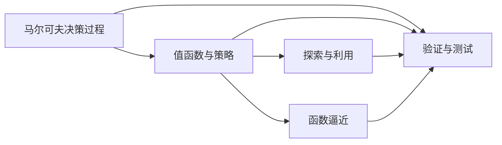

# 强化学习Reinforcement Learning算法的验证与测试

## 1. 背景介绍

### 1.1 强化学习简介
强化学习(Reinforcement Learning,RL)是机器学习的一个重要分支,它通过智能体(Agent)与环境(Environment)的交互,从经验中学习,以获得最大的累积奖励。与监督学习和非监督学习不同,强化学习不需要预先准备好的训练数据,而是通过探索和利用(Exploration and Exploitation)的方式,不断尝试和优化策略,以适应环境的变化。

### 1.2 强化学习的应用
强化学习在许多领域都有广泛的应用,例如:
- 游戏AI:通过强化学习,AI可以学会玩各种复杂的游戏,如国际象棋、围棋、Atari等。
- 机器人控制:强化学习可以让机器人学会在复杂环境中自主导航、抓取物体、避障等任务。 
- 自动驾驶:通过强化学习,自动驾驶系统可以学会在复杂的交通环境中安全、高效地行驶。
- 推荐系统:利用强化学习,推荐系统可以根据用户的行为和反馈,不断优化推荐策略,提高用户满意度。

### 1.3 强化学习算法验证与测试的重要性
尽管强化学习取得了许多令人振奋的成果,但在实际应用中,我们还面临着许多挑战。其中一个关键问题就是如何验证和测试强化学习算法的性能和鲁棒性。由于强化学习通常应用于复杂、动态的环境,传统的软件测试方法难以直接应用。因此,我们需要探索新的验证与测试技术,以确保强化学习系统的可靠性和安全性。

## 2. 核心概念与联系

### 2.1 马尔可夫决策过程(MDP)
马尔可夫决策过程是强化学习的理论基础。一个MDP由以下元素组成:
- 状态集合 $\mathcal{S}$
- 动作集合 $\mathcal{A}$ 
- 转移概率函数 $\mathcal{P}(s'|s,a)$
- 奖励函数 $\mathcal{R}(s,a)$
- 折扣因子 $\gamma \in [0,1]$

目标是找到一个最优策略 $\pi^*$,使得累积奖励最大化:

$$\pi^* = \arg\max_\pi \mathbb{E}\left[\sum_{t=0}^\infty \gamma^t r_t \right]$$

### 2.2 值函数与策略
- 状态值函数 $V^\pi(s)$:在策略 $\pi$ 下,从状态 $s$ 开始的期望累积奖励。
- 动作值函数 $Q^\pi(s,a)$:在策略 $\pi$ 下,从状态 $s$ 采取动作 $a$ 的期望累积奖励。
- 最优状态值函数 $V^*(s) = \max_\pi V^\pi(s)$
- 最优动作值函数 $Q^*(s,a) = \max_\pi Q^\pi(s,a)$

策略 $\pi$ 定义了在每个状态下应该采取的动作。一个最优策略 $\pi^*$ 满足:

$$\pi^*(s) = \arg\max_a Q^*(s,a)$$

### 2.3 探索与利用
探索(Exploration)是指智能体尝试新的动作,收集更多信息;利用(Exploitation)是指智能体根据当前已知,选择期望回报最高的动作。两者需要权衡,以在有限的交互中获得尽可能多的累积奖励。常见的探索策略有:
- $\epsilon$-贪婪($\epsilon$-greedy):以 $\epsilon$ 的概率随机探索,否则采取贪婪动作。
- 软性最大值(Softmax):根据动作值的指数函数计算概率,再随机采样。 

### 2.4 值函数逼近
当状态和动作空间很大时,我们无法穷举每一个状态的值函数。此时,可以用函数逼近的方法来估计值函数,常见的函数逼近器有:
- 线性函数:$\hat{V}(s) = \boldsymbol{w}^T \boldsymbol{x}(s)$
- 神经网络:$\hat{V}(s) = f_{\boldsymbol{w}}(\boldsymbol{x}(s))$

其中 $\boldsymbol{w}$ 是待学习的参数,$\boldsymbol{x}(s)$ 是状态的特征表示。

### 2.5 验证与测试
验证(Verification)是指确认系统满足设计规范,测试(Testing)是通过系统执行来发现缺陷。在强化学习中,我们需要验证和测试的对象包括:
- 环境模型:状态、动作空间定义是否合理,转移函数和奖励函数是否正确。
- 算法实现:伪代码与代码实现是否一致,超参数设置是否合理。
- 策略性能:策略在训练和测试环境中的表现,如累积奖励、成功率等。
- 泛化能力:策略在未见过的环境中的适应能力。
- 鲁棒性:策略对环境噪声、参数扰动的敏感程度。

下图展示了这些核心概念之间的关系:

## 3. 核心算法原理具体操作步骤

### 3.1 Q-learning算法
Q-learning是一种经典的异策略时序差分算法,它通过更新动作值函数来逼近最优策略。具体步骤如下:
1. 初始化Q表格 $Q(s,a)$,对所有 $s\in\mathcal{S},a\in\mathcal{A}$,令 $Q(s,a)=0$。
2. 重复以下步骤,直到收敛:
   1. 初始化状态 $s$
   2. 重复以下步骤,直到 $s$ 为终止状态:
      1. 根据 $Q(s,\cdot)$ 和探索策略,选择动作 $a$
      2. 执行动作 $a$,观察奖励 $r$ 和下一状态 $s'$
      3. 更新 $Q(s,a) \leftarrow Q(s,a) + \alpha [r + \gamma \max_{a'} Q(s',a') - Q(s,a)]$
      4. $s \leftarrow s'$

其中 $\alpha \in (0,1]$ 是学习率,$\gamma \in [0,1]$ 是折扣因子。Q-learning的收敛性得到了理论证明,但前提是所有状态-动作对都被无限次访问。

### 3.2 DQN算法
深度Q网络(Deep Q-Network,DQN)将深度神经网络作为Q函数的逼近器,可以处理高维状态空间。DQN在Q-learning的基础上引入了两个重要改进:
1. 经验回放(Experience Replay):将转移样本 $(s,a,r,s')$ 存入回放缓冲区,之后从中随机抽取小批量样本来更新网络参数。这样可以打破数据的相关性,提高样本利用效率。
2. 目标网络(Target Network):每隔一定步数将当前Q网络的参数复制给目标网络,用目标网络来计算TD目标。这样可以提高训练稳定性。

DQN的具体步骤如下:
1. 初始化Q网络 $Q_{\boldsymbol{\theta}}$ 和目标网络 $Q_{\boldsymbol{\theta}^-}$,令 $\boldsymbol{\theta}^- = \boldsymbol{\theta}$。
2. 初始化回放缓冲区 $\mathcal{D}$。
3. 重复以下步骤,直到收敛:
   1. 初始化状态 $s$
   2. 重复以下步骤,直到 $s$ 为终止状态:
      1. 根据 $Q_{\boldsymbol{\theta}}(s,\cdot)$ 和探索策略,选择动作 $a$
      2. 执行动作 $a$,观察奖励 $r$ 和下一状态 $s'$
      3. 将转移样本 $(s,a,r,s')$ 存入 $\mathcal{D}$
      4. 从 $\mathcal{D}$ 中随机抽取小批量样本 $(s_i,a_i,r_i,s'_i)$
      5. 计算TD目标 $y_i = \begin{cases} r_i & \text{if } s'_i \text{ is terminal} \\ r_i + \gamma \max_{a'} Q_{\boldsymbol{\theta}^-}(s'_i,a') & \text{otherwise} \end{cases}$
      6. 最小化损失 $\mathcal{L}(\boldsymbol{\theta}) = \frac{1}{N} \sum_i (y_i - Q_{\boldsymbol{\theta}}(s_i,a_i))^2$,更新 $\boldsymbol{\theta}$
      7. 每隔 $C$ 步,令 $\boldsymbol{\theta}^- \leftarrow \boldsymbol{\theta}$
      8. $s \leftarrow s'$

其中 $N$ 是小批量样本的大小,$C$ 是目标网络的更新频率。

### 3.3 策略梯度算法
策略梯度(Policy Gradient)算法直接优化策略函数 $\pi_{\boldsymbol{\theta}}(a|s)$,而不是值函数。常见的策略梯度算法有REINFORCE和Actor-Critic。

以REINFORCE为例,其核心思想是通过梯度上升来最大化期望回报:

$$J(\boldsymbol{\theta}) = \mathbb{E}_{\tau \sim p_{\boldsymbol{\theta}}(\tau)} \left[ \sum_{t=0}^T \gamma^t r_t \right]$$

其中 $\tau = (s_0,a_0,r_0,\dots,s_T,a_T,r_T)$ 是一条轨迹,$p_{\boldsymbol{\theta}}(\tau)$ 是在策略 $\pi_{\boldsymbol{\theta}}$ 下生成轨迹 $\tau$ 的概率。根据策略梯度定理,我们有:

$$\nabla_{\boldsymbol{\theta}} J(\boldsymbol{\theta}) = \mathbb{E}_{\tau \sim p_{\boldsymbol{\theta}}(\tau)} \left[ \sum_{t=0}^T \nabla_{\boldsymbol{\theta}} \log \pi_{\boldsymbol{\theta}}(a_t|s_t) \sum_{t'=t}^T \gamma^{t'-t} r_{t'} \right]$$

REINFORCE算法的具体步骤如下:
1. 初始化策略网络 $\pi_{\boldsymbol{\theta}}$。
2. 重复以下步骤,直到收敛:
   1. 在策略 $\pi_{\boldsymbol{\theta}}$ 下采样一批轨迹 $\{ \tau_i \}$
   2. 对每条轨迹 $\tau_i$,计算折扣回报 $G_t = \sum_{t'=t}^T \gamma^{t'-t} r_{t'}$
   3. 计算策略梯度 $\hat{g} = \frac{1}{N} \sum_i \sum_t \nabla_{\boldsymbol{\theta}} \log \pi_{\boldsymbol{\theta}}(a_{i,t}|s_{i,t}) G_{i,t}$
   4. 更新策略参数 $\boldsymbol{\theta} \leftarrow \boldsymbol{\theta} + \alpha \hat{g}$

其中 $N$ 是轨迹的数量,$\alpha$ 是学习率。REINFORCE算法的一个缺点是方差较大,因为它使用蒙特卡洛方法来估计回报。Actor-Critic算法通过引入值函数来减少方差,能够获得更稳定、更高效的策略梯度估计。

## 4. 数学模型和公式详细讲解举例说明

本节我们详细讲解强化学习中的几个关键数学模型和公式,并给出具体的例子。

### 4.1 贝尔曼方程
贝尔曼方程是描述最优值函数的递归关系,是许多强化学习算法的理论基础。对于状态值函数,贝尔曼最优方程为:

$$V^*(s) = \max_a \mathcal{R}(s,a) + \gamma \sum_{s' \in \mathcal{S}} \mathcal{P}(s'|s,a) V^*(s')$$

对于动作值函数,贝尔曼最优方程为:

$$Q^*(s,a) = \mathcal{R}(s,a) + \gamma \sum_{s' \in \mathcal{S}} \mathcal{P}(s'|s,a) \max_{a'} Q^*(s',a')$$

例如,考虑一个简单的网格世界环境,状态空间