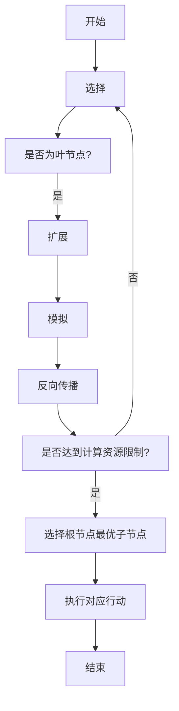

# 强化学习算法：蒙特卡洛树搜索 (Monte Carlo Tree Search) 原理与代码实例讲解

## 1. 背景介绍

### 1.1 强化学习与决策过程

强化学习是机器学习的一个重要分支,它关注于如何基于环境反馈来学习采取最优行为策略的问题。在强化学习中,智能体(Agent)通过与环境(Environment)进行交互,接收来自环境的奖励信号,并根据这些信号来调整自身的行为策略,从而达到最大化长期累积奖励的目标。

强化学习广泛应用于决策过程问题,例如机器人控制、游戏对战、资源调度等领域。这些问题通常可以建模为马尔可夫决策过程(Markov Decision Process, MDP),其中智能体需要根据当前状态选择行动,并转移到下一个状态,同时获得相应的奖励或惩罚。

### 1.2 蒙特卡洛树搜索算法概述

蒙特卡洛树搜索(Monte Carlo Tree Search, MCTS)是一种高效的决策树搜索算法,被广泛应用于强化学习领域。它通过有限的计算资源,对庞大的决策树进行智能搜索,从而找到近似最优的行动序列。

MCTS算法的核心思想是将决策树的搜索过程分为四个阶段:选择(Selection)、扩展(Expansion)、模拟(Simulation)和反向传播(Backpropagation)。通过不断地重复这四个步骤,MCTS算法可以逐步构建出一棵值估计树,并基于该树做出最优决策。

MCTS算法的优势在于,它不需要事先了解环境的完整信息,可以在线学习和决策,并且能够有效地权衡探索(Exploration)和利用(Exploitation)之间的平衡,从而在有限的计算资源下获得较好的决策质量。

## 2. 核心概念与联系

### 2.1 马尔可夫决策过程 (MDP)

马尔可夫决策过程(Markov Decision Process, MDP)是强化学习中的一种基本建模框架。MDP由以下几个要素组成:

- 状态集合 (State Space) $\mathcal{S}$
- 行动集合 (Action Space) $\mathcal{A}$
- 转移概率 (Transition Probability) $\mathcal{P}_{ss'}^a = \mathbb{P}(s' | s, a)$
- 奖励函数 (Reward Function) $\mathcal{R}_s^a$

在MDP中,智能体处于某个状态 $s \in \mathcal{S}$,选择一个行动 $a \in \mathcal{A}$,然后根据转移概率 $\mathcal{P}_{ss'}^a$ 转移到下一个状态 $s'$,并获得相应的奖励 $\mathcal{R}_s^a$。智能体的目标是找到一个最优策略 $\pi^*$,使得在该策略下的长期累积奖励最大化。

### 2.2 价值函数与贝尔曼方程

在强化学习中,我们通常使用价值函数(Value Function)来评估一个状态或状态-行动对的价值。状态价值函数 $V^\pi(s)$ 表示在策略 $\pi$ 下,从状态 $s$ 开始执行后的长期累积奖励的期望值。而状态-行动价值函数 $Q^\pi(s, a)$ 则表示在策略 $\pi$ 下,从状态 $s$ 开始执行行动 $a$,之后按照策略 $\pi$ 执行后的长期累积奖励的期望值。

贝尔曼方程(Bellman Equation)给出了价值函数与转移概率和奖励函数之间的递推关系,是求解最优价值函数和最优策略的基础。

### 2.3 探索与利用的权衡

在强化学习中,智能体需要权衡探索(Exploration)和利用(Exploitation)之间的平衡。探索是指尝试新的未知行动,以发现潜在的更优策略;而利用是指基于已知的价值函数,选择当前看起来最优的行动。

过多的探索会导致效率低下,而过多的利用则可能陷入局部最优,无法发现全局最优解。MCTS算法通过一种称为上确界置信区间树(Upper Confidence Bounds applied to Trees, UCT)的策略,在探索和利用之间达成了一个很好的平衡。

## 3. 核心算法原理具体操作步骤

MCTS算法的核心思想是通过不断地构建和更新一棵值估计树,来逼近最优的行动序列。算法的具体步骤如下:



1. **选择 (Selection)**

从根节点开始,递归地选择当前节点的子节点,直到到达一个叶节点(无子节点)为止。选择子节点的策略通常采用UCT公式,即:

$$\text{UCT}(s, a) = \frac{Q(s, a)}{N(s, a)} + C \sqrt{\frac{\ln N(s)}{N(s, a)}}$$

其中 $Q(s, a)$ 是状态-行动对 $(s, a)$ 的价值估计,  $N(s, a)$ 是该对被访问的次数, $N(s)$ 是状态 $s$ 被访问的总次数, $C$ 是一个调节探索程度的常数。UCT公式将价值估计和探索程度进行了平衡,可以在exploitation和exploration之间达成一个很好的权衡。

2. **扩展 (Expansion)**

如果到达的是一个叶节点,则需要对该节点进行扩展。扩展的方式是从该节点可选的行动集合中,选择一个尚未被试探的行动,并将其添加到树中作为新的子节点。

3. **模拟 (Simulation)**

从新扩展的节点开始,执行一个随机的模拟(Roll-out),直到达到终止状态。模拟的目的是获得一个从该节点开始的回报估计值。

4. **反向传播 (Backpropagation)**

将模拟获得的回报估计值沿着模拟路径向上反向传播,更新每个经过节点的统计数据,如访问次数 $N(s, a)$ 和价值估计 $Q(s, a)$。

5. **重复**

重复上述步骤,直到达到计算资源的限制(如最大迭代次数或时间限制)。

6. **选择最优行动**

在根节点的子节点中,选择访问次数最多(或价值估计最高)的子节点对应的行动,作为此次决策的输出。

7. **执行行动并更新状态**

执行选择的行动,获得实际的奖励和新的状态,并将新状态作为下一次搜索的根节点。

通过不断地重复上述过程,MCTS算法可以逐步构建出一棵值估计树,并基于该树做出最优决策。

## 4. 数学模型和公式详细讲解举例说明

### 4.1 UCT公式

UCT(Upper Confidence Bounds applied to Trees)公式是MCTS算法中用于选择节点的关键策略,它在exploitation和exploration之间达成了一个很好的平衡。UCT公式的数学表达式如下:

$$\text{UCT}(s, a) = \frac{Q(s, a)}{N(s, a)} + C \sqrt{\frac{\ln N(s)}{N(s, a)}}$$

其中:

- $Q(s, a)$ 是状态-行动对 $(s, a)$ 的价值估计,即从状态 $s$ 执行行动 $a$ 后,获得的平均回报。
- $N(s, a)$ 是状态-行动对 $(s, a)$ 被访问的次数。
- $N(s)$ 是状态 $s$ 被访问的总次数,即 $N(s) = \sum_a N(s, a)$。
- $C$ 是一个调节探索程度的常数,通常取值在 $\sqrt{2}$ 附近。

UCT公式由两部分组成:

1. **exploitation 部分**: $\frac{Q(s, a)}{N(s, a)}$

这部分表示利用已知的价值估计,选择当前看起来最优的行动。当 $N(s, a)$ 较大时,该项的贡献较大,算法倾向于exploitation。

2. **exploration 部分**: $C \sqrt{\frac{\ln N(s)}{N(s, a)}}$

这部分鼓励算法去探索那些访问次数较少的行动。当 $N(s, a)$ 较小时,该项的贡献较大,算法倾向于exploration。

通过 UCT 公式,MCTS 算法可以在 exploitation 和 exploration 之间达成一个动态的平衡,从而在有限的计算资源下获得较好的决策质量。

### 4.2 UCT公式应用示例

假设我们正在进行一场国际象棋游戏,当前局面如下:

```
   +---+---+---+---+---+---+---+---+
8  | r | n | b | q | k | b | n | r |
   +---+---+---+---+---+---+---+---+
7  | p | p | p | p |   | p | p | p |
   +---+---+---+---+---+---+---+---+
6  |   |   |   |   | p |   |   |   |
   +---+---+---+---+---+---+---+---+
5  |   |   |   |   |   |   |   |   |
   +---+---+---+---+---+---+---+---+
4  |   |   |   |   | P |   |   |   |
   +---+---+---+---+---+---+---+---+
3  |   |   |   |   |   |   |   |   |
   +---+---+---+---+---+---+---+---+
2  | P | P | P | P |   | P | P | P |
   +---+---+---+---+---+---+---+---+
1  | R | N | B | Q | K | B | N | R |
   +---+---+---+---+---+---+---+---+
     a   b   c   d   e   f   g   h
```

我们使用 MCTS 算法来选择下一步的最优行动。假设在选择阶段,算法遍历到了状态 `e4` (白色的士兵),可选的行动有 `e5` (前进一步)和 `e3` (后退一步)。根据 UCT 公式,我们可以计算这两个行动的 UCT 值:

已知:
- $Q(e4, e5) = 0.6$, $N(e4, e5) = 20$
- $Q(e4, e3) = 0.3$, $N(e4, e3) = 5$
- $N(e4) = 20 + 5 = 25$
- $C = \sqrt{2}$

则:

$$\begin{aligned}
\text{UCT}(e4, e5) &= \frac{Q(e4, e5)}{N(e4, e5)} + C \sqrt{\frac{\ln N(e4)}{N(e4, e5)}} \\
                  &= \frac{0.6}{20} + \sqrt{2} \sqrt{\frac{\ln 25}{20}} \\
                  &\approx 0.03 + 0.23 \\
                  &= 0.26
\end{aligned}$$

$$\begin{aligned}
\text{UCT}(e4, e3) &= \frac{Q(e4, e3)}{N(e4, e3)} + C \sqrt{\frac{\ln N(e4)}{N(e4, e3)}} \\
                  &= \frac{0.3}{5} + \sqrt{2} \sqrt{\frac{\ln 25}{5}} \\
                  &\approx 0.06 + 0.58 \\
                  &= 0.64
\end{aligned}$$

由于 $\text{UCT}(e4, e3) > \text{UCT}(e4, e5)$,因此算法会选择行动 `e3` 进行扩展和模拟。

通过这个示例,我们可以看到 UCT 公式如何在 exploitation 和 exploration 之间达成平衡。虽然 `e5` 的价值估计更高,但由于它被访问的次数也更多,所以 `e3` 的 UCT 值更大,算法倾向于探索这个较少被访问的行动。

## 5. 项目实践: 代码实例和详细解释说明

下面是一个使用 Python 实现的 MCTS 算法示例,用于解决简单的井字棋游戏。

### 5.1 游戏状态表示

我们首先定义一个 `State` 类来表示游戏状态:

```python
class State:
    def __init__(self, boar