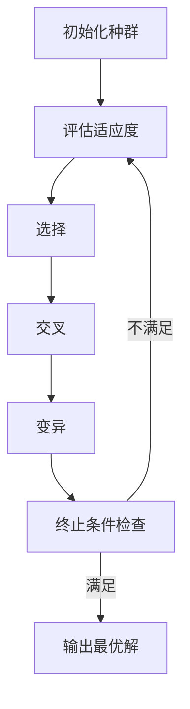

# 强化学习算法：遗传算法 原理与代码实例讲解

## 1.背景介绍

### 1.1 什么是强化学习?

强化学习(Reinforcement Learning)是机器学习的一个重要分支,它研究如何基于环境的反馈来学习行为策略,以最大化长期的累积奖励。与监督学习不同,强化学习没有给定的输入输出对,也没有完整的数据集,而是通过与环境的持续交互来学习。

### 1.2 遗传算法在强化学习中的作用

遗传算法(Genetic Algorithm)是一种基于生物进化过程的优化算法,通过模拟自然选择、遗传和突变等过程,从一组可能的解中发现或逼近最优解。在强化学习领域,遗传算法可以用于寻找最优策略、调优算法超参数,或者直接进化出智能体的控制策略。

## 2.核心概念与联系  

### 2.1 遗传算法基本概念

遗传算法主要包括以下几个核心概念:

1. **个体(Individual)**: 候选解的一个实例,通常用一个染色体(编码)来表示。
2. **种群(Population)**: 所有个体的集合。
3. **适应度(Fitness)**: 评估个体优劣的指标函数。
4. **选择(Selection)**: 根据适应度从种群中选择个体,以产生新一代。
5. **交叉(Crossover)**: 将两个或多个个体的染色体进行组合,产生新的个体。
6. **变异(Mutation)**: 对个体的染色体进行少量随机改变,增加种群的多样性。

### 2.2 遗传算法在强化学习中的应用

在强化学习中,遗传算法可以用于以下几个方面:

1. **策略搜索(Policy Search)**: 将策略编码为染色体,通过遗传算法直接进化出最优策略。
2. **超参数优化(Hyperparameter Optimization)**: 将算法的超参数编码为染色体,通过遗传算法寻找最优超参数组合。
3. **环境/奖励建模(Environment/Reward Modeling)**: 将环境模型或奖励函数编码为染色体,通过遗传算法优化它们。

### 2.3 遗传算法与其他强化学习算法的关系

遗传算法是一种基于进化计算的全局优化算法,与基于梯度下降的强化学习算法(如Q-Learning、策略梯度等)有着本质的区别。遗传算法更适合于解决具有离散状态空间和动作空间的强化学习问题,而梯度下降算法更适合于连续空间。两种算法也可以相互结合,形成混合算法。

## 3.核心算法原理具体操作步骤

遗传算法在强化学习中的应用可以概括为以下几个步骤:



1. **初始化种群**: 随机生成一定数量的个体,作为初始种群。每个个体通常用一个染色体(编码)来表示,编码方式因问题而异。

2. **评估适应度**: 对每个个体计算其适应度,即根据目标函数(如奖励函数)评估个体的优劣程度。

3. **选择**: 根据适应度从当前种群中选择个体,作为下一代种群的父母。常用的选择方法有轮盘赌选择、锦标赛选择等。

4. **交叉**: 将选择出的父母个体的染色体进行组合,产生新的个体(子代)。常用的交叉方法有单点交叉、多点交叉、均匀交叉等。

5. **变异**: 对子代个体的染色体进行少量随机改变,以增加种群的多样性,避免过早收敛。常用的变异方法有位变异、均匀变异等。

6. **终止条件检查**: 检查是否满足终止条件,如达到最大迭代次数、目标函数值等。如果满足,输出当前种群中最优个体作为最终解;否则,返回步骤2,继续进行下一代的进化。

在具体应用中,上述步骤可能会有一些变化和调整,如增加种群更新策略、并行计算等。此外,编码方式、选择方法、交叉方法和变异方法的设计也会对算法性能产生重大影响。

## 4.数学模型和公式详细讲解举例说明

### 4.1 适应度函数

适应度函数(Fitness Function)用于评估个体的优劣程度,是遗传算法的核心部分之一。在强化学习中,适应度函数通常与奖励函数或策略性能指标相关。

对于策略搜索问题,适应度函数可以定义为:

$$\text{Fitness}(\pi) = \mathbb{E}_{\tau \sim \pi} \left[ \sum_{t=0}^{T} \gamma^t r(s_t, a_t) \right]$$

其中 $\pi$ 表示策略, $\tau$ 表示在该策略下产生的轨迹, $r(s_t, a_t)$ 表示在时刻 $t$ 获得的奖励, $\gamma$ 是折现因子, $T$ 是轨迹长度。

对于超参数优化问题,适应度函数可以定义为:

$$\text{Fitness}(\theta) = \text{Performance}(\text{Algorithm}(\theta))$$

其中 $\theta$ 表示算法的超参数组合, $\text{Performance}$ 是评估算法性能的指标函数,如累积奖励、收敛速度等。

### 4.2 选择方法

选择(Selection)是从当前种群中选择个体作为下一代父母的过程。常用的选择方法包括:

1. **轮盘赌选择(Roulette Wheel Selection)**: 每个个体被选择的概率与其适应度成正比。

   $$P(i) = \frac{f(i)}{\sum_{j=1}^{N} f(j)}$$

   其中 $P(i)$ 表示第 $i$ 个个体被选择的概率, $f(i)$ 表示第 $i$ 个个体的适应度, $N$ 是种群大小。

2. **锦标赛选择(Tournament Selection)**: 从种群中随机选择一定数量的个体进行比赛,适应度最高的个体被选中。

3. **等位线采样(Truncation Sampling)**: 根据适应度对种群进行排序,选择前 $N$ 个个体作为父母。

### 4.3 交叉方法

交叉(Crossover)是将两个或多个父母个体的染色体进行组合,产生新的子代个体。常用的交叉方法包括:

1. **单点交叉(Single-Point Crossover)**: 在染色体的某个位置随机选择一个交叉点,交换两个父母个体在该点之后的基因片段。

   ```python
   parent1 = [1, 2, 3, 4, 5, 6, 7, 8]
   parent2 = [9, 8, 7, 6, 5, 4, 3, 2]
   crossover_point = 4
   child1 = parent1[:crossover_point] + parent2[crossover_point:]
   child2 = parent2[:crossover_point] + parent1[crossover_point:]
   ```

2. **多点交叉(Multi-Point Crossover)**: 在染色体上随机选择多个交叉点,交换父母个体在这些点之间的基因片段。

3. **均匀交叉(Uniform Crossover)**: 对于每一个基因位,随机选择来自父母个体中的哪一个基因。

### 4.4 变异方法

变异(Mutation)是对个体的染色体进行少量随机改变,以增加种群的多样性。常用的变异方法包括:

1. **位变异(Bit-Flip Mutation)**: 对于二进制编码的染色体,随机选择一些位并翻转它们的值。

2. **均匀变异(Uniform Mutation)**: 对于实数编码的染色体,在一定范围内随机改变某些基因的值。

3. **高斯变异(Gaussian Mutation)**: 对于实数编码的染色体,对某些基因加上一个服从高斯分布的随机噪声。

变异操作的概率通常较小,以避免破坏优良个体的结构。

## 5.项目实践:代码实例和详细解释说明

下面是一个使用遗传算法解决经典的 0-1 背包问题的示例,包含了完整的代码和详细的注释解释。

### 5.1 问题描述

0-1 背包问题是一个经典的组合优化问题,可以描述为:给定一组物品,每个物品都有一定的价值和重量,以及一个背包,背包有一定的承重限制。要求选择一些物品放入背包,使得背包中物品的总价值最大,同时总重量不超过背包的承重限制。

### 5.2 编码方式

我们将每个个体编码为一个二进制串,长度等于物品数量。每一位表示对应的物品是否被选中,1 表示选中,0 表示未选中。例如,对于 5 个物品,个体 `[1, 0, 1, 1, 0]` 表示选中了第 1、3 和 4 个物品。

### 5.3 适应度函数

适应度函数定义为背包中物品的总价值,同时需要惩罚超重的解。具体来说:

$$\text{Fitness}(x) = \begin{cases}
\sum_{i=1}^{n} x_i v_i, & \text{if } \sum_{i=1}^{n} x_i w_i \leq W \\
\sum_{i=1}^{n} x_i v_i - \lambda \left(\sum_{i=1}^{n} x_i w_i - W\right), & \text{otherwise}
\end{cases}$$

其中 $x$ 是个体的编码, $n$ 是物品数量, $v_i$ 和 $w_i$ 分别是第 $i$ 个物品的价值和重量, $W$ 是背包的承重限制, $\lambda$ 是惩罚系数。

### 5.4 代码实现

```python
import random

# 问题参数
num_items = 10  # 物品数量
weights = [5, 4, 7, 3, 6, 2, 8, 1, 9, 3]  # 物品重量
values = [8, 6, 12, 4, 10, 3, 14, 2, 16, 5]  # 物品价值
max_weight = 20  # 背包承重限制
population_size = 100  # 种群大小
max_generations = 500  # 最大进化代数
mutation_rate = 0.1  # 变异率
penalty_factor = 10  # 惩罚系数

# 适应度函数
def fitness(individual):
    weight = sum(weights[i] for i in range(num_items) if individual[i] == 1)
    value = sum(values[i] for i in range(num_items) if individual[i] == 1)
    if weight > max_weight:
        value -= penalty_factor * (weight - max_weight)
    return value

# 初始化种群
population = [[random.randint(0, 1) for _ in range(num_items)] for _ in range(population_size)]

# 遗传算法主循环
for generation in range(max_generations):
    # 评估适应度
    fitnesses = [fitness(individual) for individual in population]
    
    # 选择
    selected = [population[i] for i in random.choices(range(population_size), weights=fitnesses, k=population_size)]
    
    # 交叉
    offspring = []
    for i in range(0, population_size, 2):
        parent1 = selected[i]
        parent2 = selected[i+1]
        crossover_point = random.randint(1, num_items-1)
        child1 = parent1[:crossover_point] + parent2[crossover_point:]
        child2 = parent2[:crossover_point] + parent1[crossover_point:]
        offspring.append(child1)
        offspring.append(child2)
    
    # 变异
    for i in range(population_size):
        for j in range(num_items):
            if random.random() < mutation_rate:
                offspring[i][j] = 1 - offspring[i][j]
    
    # 更新种群
    population = offspring
    
    # 打印当前最优解
    best_individual = max(population, key=fitness)
    best_fitness = fitness(best_individual)
    print(f"Generation {generation}: Best fitness = {best_fitness}")
    
# 输出最优解
best_individual = max(population, key=fitness)
best_fitness = fitness(best_individual)
selected_items = [i for i in range(num_items) if best_individual[i] == 1]
print(f"Best solution: {best_individual}")
print(f"Selected items: {selected_items}")
print(f"Total value: {best_fitness}")
```

### 5.5 代码解释

1. 首先定义了问题参数,包括物品数量、物品重量和价值列