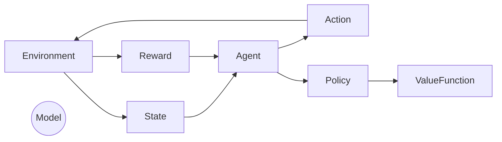

# 强化学习：利用软件模拟环境进行训练

## 1.背景介绍

### 1.1 什么是强化学习？

强化学习(Reinforcement Learning, RL)是机器学习的一个重要分支,它关注于如何基于环境反馈来学习一个行为策略,使得在某个任务中可以获得最大的累积奖励。与监督学习不同,强化学习没有给定正确的输入/输出对,而是通过与环境的交互来学习,这种学习方式更接近于人类和动物的学习方式。

强化学习的核心思想是利用一个智能体(Agent)与环境(Environment)进行交互,智能体根据当前状态选择一个行为,环境会根据这个行为给出一个奖励反馈,并转移到下一个状态。智能体的目标是通过不断尝试,学习到一个最优的策略,使得在该任务中可以获得最大的累积奖励。

### 1.2 软件模拟环境的重要性

在强化学习中,训练智能体需要与环境进行大量的交互,但是在很多实际应用场景中,与真实环境交互存在一些问题:

1. 安全性问题:比如在机器人控制或自动驾驶等领域,直接在真实环境中训练可能会造成安全隐患。

2. 成本问题:一些领域如机器人控制、游戏AI等,与真实环境交互的成本非常高昂。

3. 环境复杂性:有些环境非常复杂,难以建模和模拟。

因此,使用软件模拟环境来训练强化学习智能体具有重要意义。软件模拟环境可以在安全、低成本的情况下模拟真实环境,为智能体提供交互训练的平台,从而降低训练的风险和成本。

## 2.核心概念与联系

### 2.1 强化学习的核心要素

强化学习系统由以下几个核心要素组成:

1. **环境(Environment)**: 智能体与之交互的外部世界。环境可以是部分可观测的,也可以是完全可观测的。

2. **状态(State)**: 环境的当前情况,包含了智能体所需的全部信息。

3. **奖励(Reward)**: 环境对智能体当前行为的评价,可以是正值(获得奖励)、负值(受到惩罚)或0。

4. **策略(Policy)**: 智能体根据当前状态选择行为的策略,是强化学习要学习的最终目标。

5. **价值函数(Value Function)**: 评估当前状态或状态-行为对在后续步骤中可获得的累积奖励的函数。

6. **模型(Model)**: 可选的环境模型,描述了状态转移概率和奖励。

这些要素之间的关系如下所示:

其中,智能体根据当前状态和策略选择行为,环境根据行为给出奖励并转移到下一状态。智能体的目标是学习一个最优策略,使得累积奖励最大化。价值函数和模型可以辅助策略的学习。

### 2.2 强化学习的主要类型

根据是否利用环境的模型,强化学习可分为两大类:

1. **基于模型的强化学习(Model-based RL)**: 利用已知或学习到的环境模型,通过规划或搜索等方法来优化策略。这种方法需要精确建模环境的动态,但可以充分利用模型进行高效学习。

2. **基于免模型的强化学习(Model-free RL)**: 不需要环境模型,通过与环境直接交互来学习策略。这种方法更加通用,但收敛速度较慢。

常见的基于模型的强化学习算法有:确定性规划、概率规划等。常见的基于免模型的强化学习算法有:Q-Learning、Sarsa、Policy Gradient等。

### 2.3 强化学习与其他机器学习的关系

强化学习与监督学习和无监督学习有一些相似之处,但也有本质区别:

- 与监督学习相比,强化学习没有给定的输入/输出对,而是通过与环境交互来学习策略。
- 与无监督学习相比,强化学习有明确的目标,即最大化累积奖励。
- 强化学习更加关注序列决策问题,需要根据历史信息做出当前行为决策。

强化学习还与其他领域有一些联系:

- 与最优控制理论联系紧密,都关注于序列决策问题。
- 与心理学的操作条件反射理论有相似之处,都强调通过反馈来学习行为。
- 与博弈论、进化算法等也有一些联系。

## 3.核心算法原理具体操作步骤

### 3.1 马尔可夫决策过程(MDP)

马尔可夫决策过程是强化学习问题的数学模型,由以下要素组成:

- 状态集合 $\mathcal{S}$
- 行为集合 $\mathcal{A}$  
- 状态转移概率 $\mathcal{P}_{ss'}^a = \mathbb{P}(S_{t+1}=s'|S_t=s, A_t=a)$
- 奖励函数 $\mathcal{R}_s^a = \mathbb{E}[R_{t+1}|S_t=s, A_t=a]$
- 折扣因子 $\gamma \in [0, 1)$

其中,智能体的目标是找到一个最优策略 $\pi^*$,使得在任意初始状态 $s_0$ 下,其期望累积折扣奖励最大:

$$
\pi^* = \arg\max_\pi \mathbb{E}_\pi \left[ \sum_{t=0}^\infty \gamma^t R_{t+1} | S_0=s_0 \right]
$$

### 3.2 价值函数和Bellman方程

为了评估一个策略的好坏,我们引入**状态价值函数**和**状态-行为价值函数**:

$$
\begin{aligned}
V^\pi(s) &= \mathbb{E}_\pi \left[ \sum_{t=0}^\infty \gamma^t R_{t+1} | S_0=s \right] \\
Q^\pi(s, a) &= \mathbb{E}_\pi \left[ \sum_{t=0}^\infty \gamma^t R_{t+1} | S_0=s, A_0=a \right]
\end{aligned}
$$

价值函数满足以下Bellman方程:

$$
\begin{aligned}
V^\pi(s) &= \sum_{a \in \mathcal{A}} \pi(a|s) \left( \mathcal{R}_s^a + \gamma \sum_{s' \in \mathcal{S}} \mathcal{P}_{ss'}^a V^\pi(s') \right) \\
Q^\pi(s, a) &= \mathcal{R}_s^a + \gamma \sum_{s' \in \mathcal{S}} \mathcal{P}_{ss'}^a \sum_{a' \in \mathcal{A}} \pi(a'|s') Q^\pi(s', a')
\end{aligned}
$$

最优价值函数和最优策略之间的关系为:

$$
\begin{aligned}
V^*(s) &= \max_\pi V^\pi(s) = \max_{a \in \mathcal{A}} Q^*(s, a) \\
\pi^*(a|s) &= \begin{cases}
1 & \text{if } a = \arg\max_{a' \in \mathcal{A}} Q^*(s, a') \\
0 & \text{otherwise}
\end{cases}
\end{aligned}
$$

### 3.3 动态规划算法

如果已知环境的完整模型,可以使用动态规划算法来求解最优策略和最优价值函数,主要有以下几种算法:

1. **价值迭代(Value Iteration)**

通过不断应用Bellman方程更新状态价值函数,直到收敛得到最优价值函数 $V^*$,再由此导出最优策略 $\pi^*$。

2. **策略迭代(Policy Iteration)** 

先初始化一个策略 $\pi_0$,然后不断执行以下两个步骤:
   - 策略评估: 计算当前策略的价值函数 $V^{\pi_i}$
   - 策略改进: 基于 $V^{\pi_i}$ 更新策略 $\pi_{i+1}$

直到收敛得到最优策略 $\pi^*$。

3. **Q-Value Iteration**

类似于价值迭代,但直接迭代更新状态-行为价值函数 $Q^*$,最终由 $Q^*$ 导出最优策略 $\pi^*$。

动态规划算法可以保证收敛到最优解,但需要已知环境的完整模型,且在状态空间很大时计算代价较高。

### 3.4 时序差分学习算法

如果不知道环境的精确模型,可以使用基于采样的时序差分(Temporal Difference, TD)学习算法。这些算法通过与环境交互采样,利用TD误差来更新价值函数或策略,主要有以下几种:

1. **Q-Learning**

Q-Learning是最经典的无模型强化学习算法,其核心是利用TD误差不断更新状态-行为价值函数 $Q$:

$$
Q(S_t, A_t) \leftarrow Q(S_t, A_t) + \alpha \left[ R_{t+1} + \gamma \max_{a'} Q(S_{t+1}, a') - Q(S_t, A_t) \right]
$$

通过不断探索和利用,最终 $Q$ 会收敛到最优 $Q^*$,从而可以导出最优策略 $\pi^*$。

2. **Sarsa**

Sarsa 算法与 Q-Learning 类似,但使用的TD误差为:

$$
Q(S_t, A_t) \leftarrow Q(S_t, A_t) + \alpha \left[ R_{t+1} + \gamma Q(S_{t+1}, A_{t+1}) - Q(S_t, A_t) \right]
$$

其中 $A_{t+1}$ 是根据策略 $\pi$ 在状态 $S_{t+1}$ 选择的下一个行为。

3. **策略梯度算法(Policy Gradient)**

策略梯度算法直接对策略 $\pi_\theta$ (参数化为 $\theta$) 进行参数化建模,并根据累积奖励的梯度信息来更新参数 $\theta$:

$$
\theta \leftarrow \theta + \alpha \nabla_\theta \log \pi_\theta(a|s) R
$$

这种算法可以直接学习到最优策略,无需学习价值函数作为中间步骤。

时序差分学习算法不需要环境模型,可以通过在线采样来学习,但收敛性能较差,需要大量样本和探索。

## 4.数学模型和公式详细讲解举例说明

### 4.1 马尔可夫决策过程的形式化定义

马尔可夫决策过程(Markov Decision Process, MDP)是强化学习问题的数学模型,可以形式化定义为一个五元组 $(\mathcal{S}, \mathcal{A}, \mathcal{P}, \mathcal{R}, \gamma)$:

- $\mathcal{S}$ 是有限的状态集合
- $\mathcal{A}$ 是有限的行为集合
- $\mathcal{P}_{ss'}^a = \mathbb{P}(S_{t+1}=s'|S_t=s, A_t=a)$ 是状态转移概率
- $\mathcal{R}_s^a = \mathbb{E}[R_{t+1}|S_t=s, A_t=a]$ 是奖励函数
- $\gamma \in [0, 1)$ 是折扣因子

在 MDP 中,智能体的目标是找到一个最优策略 $\pi^*$,使得在任意初始状态 $s_0$ 下,其期望累积折扣奖励最大:

$$
\pi^* = \arg\max_\pi \mathbb{E}_\pi \left[ \sum_{t=0}^\infty \gamma^t R_{t+1} | S_0=s_0 \right]
$$

其中,期望累积折扣奖励可以写为:

$$
\mathbb{E}_\pi \left[ \sum_{t=0}^\infty \gamma^t R_{t+1} | S_0=s_0 \right] = \mathbb{E}_\pi \left[ R_1 + \gamma R_2 + \gamma^2 R_3 + \cdots | S_0=s_0 \right]
$$

这里的 $\gamma$ 是折扣因子,它控制了未来奖励对当前价值的影响程度。当 $\gamma=0$ 时,智能体只关注当前奖励;当 $\gamma \rightarrow 1$ 时,智能体会更加重视长期累积奖励。

### 4.2 价值函数和Bellman方程

为了评估一个策略的好坏,我们引入**状态价值函数**和**状态-行为价值函