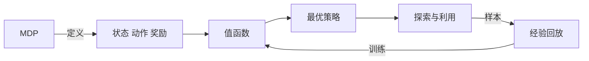

# 强化学习：在智能交通系统中的应用

## 1. 背景介绍
### 1.1 智能交通系统概述
#### 1.1.1 智能交通系统的定义
智能交通系统（Intelligent Transportation System，ITS）是将先进的信息技术、数据通信传输技术、电子控制技术、计算机技术等有效地集成运用于整个地面交通管理系统而建立的一种在大范围内、全方位发挥作用的，实时、准确、高效的综合交通运输管理系统。

#### 1.1.2 智能交通系统的特点
智能交通系统具有信息化、网络化、智能化等特点。通过各种传感器实时采集海量交通数据，利用大数据分析、云计算等技术对数据进行处理，从而实现交通流的实时监控、预测与诱导。

#### 1.1.3 智能交通系统的意义
智能交通系统可以有效缓解交通拥堵，提高交通效率，保障交通安全，减少环境污染，对于改善人们的出行体验、提升城市管理水平具有重要意义。

### 1.2 强化学习概述
#### 1.2.1 强化学习的定义
强化学习（Reinforcement Learning，RL）是机器学习的一个重要分支，它是一种通过智能体（Agent）与环境（Environment）的交互，使智能体学会如何采取最优行动策略以获得最大累积奖励的学习方法。

#### 1.2.2 强化学习的特点
强化学习具有 "试错探索" 和 "即时奖励" 的特点。智能体在与环境交互的过程中，通过不断尝试不同的行动并根据环境反馈的奖励调整策略，最终学习到最优策略。

#### 1.2.3 强化学习的应用
强化学习在智能交通、自动驾驶、机器人控制、游戏AI等领域有广泛应用。通过强化学习，系统可以自主学习解决复杂问题的策略，具有很大的发展潜力。

### 1.3 强化学习在智能交通中应用的意义
#### 1.3.1 复杂性
交通系统是一个高度动态、随机且复杂的系统，涉及车辆、道路、信号灯等诸多要素，传统的优化控制方法难以应对。

#### 1.3.2 数据驱动
海量的交通数据为强化学习提供了良好的基础，通过数据驱动的方式可以学习到更加精细化的控制策略。

#### 1.3.3 自适应性
交通流具有很强的时变性，强化学习具备自适应学习能力，可以根据实时交通状态动态调整策略，实现更加智能的交通管控。

## 2. 核心概念与联系
### 2.1 马尔可夫决策过程（MDP）
马尔可夫决策过程是强化学习的理论基础，由状态集合S、动作集合A、状态转移概率P、奖励函数R、折扣因子γ组成，用于描述智能体与环境交互的过程。

### 2.2 策略（Policy）
策略定义了智能体在每个状态下应该采取的动作，用π表示。强化学习的目标就是学习一个最优策略π*，使得期望累积奖励最大化。

### 2.3 值函数（Value Function） 
值函数表示在策略π下处于某个状态s的期望回报，分为状态值函数V(s)和动作值函数Q(s,a)。值函数反映了策略的优劣，是策略学习的基础。

### 2.4 探索与利用（Exploration & Exploitation）
探索是指智能体尝试新的动作以发现可能更优的策略，利用是指执行当前已知的最优策略。平衡探索与利用是强化学习的关键问题之一。

### 2.5 经验回放（Experience Replay）
将智能体与环境交互产生的转移样本(s,a,r,s')存储到经验池中，之后从中随机抽取小批量样本用于训练，提高样本利用效率并打破数据的相关性。

### 2.6 概念之间的联系
在智能交通场景下，交通系统可以建模为一个MDP，状态s可以是车流量、排队长度等交通参数，动作a可以是信号配时、交通诱导等控制措施，奖励r可以是通过时间、停车次数等。通过不断探索与利用，结合经验回放等机制，智能体学习值函数，进而得到最优控制策略，实现交通流的优化调度。



## 3. 核心算法原理具体操作步骤
### 3.1 Q-learning算法
Q-learning是一种经典的值函数型强化学习算法，通过值迭代的方式直接学习最优动作值函数Q*。
#### 3.1.1 算法流程
1. 初始化Q(s,a)，对所有s∈S，a∈A，令Q(s,a)=0
2. 重复循环直到收敛：
   1. 根据ε-greedy策略选择动作a，即以ε的概率随机选择动作，否则选择Q值最大的动作
   2. 执行动作a，观察奖励r和下一状态s'
   3. 更新Q(s,a)：
      Q(s,a) ← Q(s,a) + α[r + γ max Q(s',a') - Q(s,a)]
   4. s ← s'
3. 输出最优策略：π*(s) = argmax Q(s,a)

其中，α为学习率，γ为折扣因子，ε为探索概率。

#### 3.1.2 在智能交通中的应用
以信号控制为例，状态s可以是各车道的排队长度，动作a是选择不同的信号配时方案，奖励r可以是通过车辆数。通过Q-learning算法，信号控制器可以学习到一个最优的配时策略，动态调节绿信比，最小化车辆延误。

### 3.2 DQN算法
DQN（Deep Q-Network）算法是将深度神经网络引入Q-learning的一种创新算法，通过神经网络拟合Q函数，可以处理高维连续状态空间。

#### 3.2.1 算法流程
1. 初始化经验回放池D，参数为θ的Q网络以及参数为θ-的目标Q网络
2. 重复循环：
   1. 根据ε-greedy策略选择动作a
   2. 执行动作a，观察奖励r和下一状态s'，存储转移样本(s,a,r,s')到D
   3. 从D中随机抽取小批量转移样本(s,a,r,s')
   4. 计算目标值：
      - 若s'为终止状态，y = r
      - 否则，y = r + γ max Q(s',a';θ-)
   5. 最小化损失函数：
      L(θ) = E[(y - Q(s,a;θ))^2]
   6. 每C步同步目标网络参数：θ- ← θ

#### 3.2.2 在智能交通中的应用
在交通流预测中，状态s可以是历史交通流量数据，动作a可以是不同的预测模型，奖励r可以是预测误差。通过DQN算法，可以自适应地选择最优的预测模型，提高预测精度。

## 4. 数学模型和公式详细讲解举例说明
### 4.1 MDP数学模型
MDP可以用一个五元组(S,A,P,R,γ)来表示：
- S表示有限状态集合
- A表示有限动作集合 
- P表示状态转移概率，P(s'|s,a)表示在状态s下执行动作a后转移到状态s'的概率
- R表示奖励函数，R(s,a)表示在状态s下执行动作a获得的即时奖励
- γ∈[0,1]为折扣因子，表示未来奖励的折现程度

在MDP中，策略π将每个状态映射为一个动作的概率分布，即π(a|s)表示在状态s下选择动作a的概率。MDP的目标是寻找一个最优策略π*，使得期望累积奖励最大化：

$$
\pi^* = \arg\max_\pi E[\sum_{t=0}^{\infty} \gamma^t R(s_t,a_t) | \pi]
$$

其中，t表示时间步，s_t和a_t分别表示t时刻的状态和动作。

### 4.2 Q-learning的数学推导
Q-learning算法的核心是值函数的更新公式：

$$
Q(s,a) \leftarrow Q(s,a) + \alpha[r + \gamma \max_{a'} Q(s',a') - Q(s,a)]
$$

这个公式可以从Bellman最优方程推导得到。根据Bellman最优方程，最优动作值函数Q*满足：

$$
Q^*(s,a) = R(s,a) + \gamma \sum_{s' \in S} P(s'|s,a) \max_{a'} Q^*(s',a')
$$

将Q*用Q来近似，并利用样本平均代替期望，得到：

$$
Q(s,a) \approx R(s,a) + \gamma \max_{a'} Q(s',a')
$$

进一步，用TD误差来更新Q值，即：

$$
Q(s,a) \leftarrow Q(s,a) + \alpha[R(s,a) + \gamma \max_{a'} Q(s',a') - Q(s,a)]
$$

化简即得到Q-learning的更新公式。

举例来说，假设一个信号控制问题，状态s表示各车道排队长度，动作a表示配时方案，奖励r表示通过车辆数。假设当前状态s=[5,8,3]，执行动作a后获得奖励r=10，下一状态为s'=[4,6,2]，学习率α=0.1，折扣因子γ=0.9，则Q值更新过程为：

$$
\begin{aligned}
Q(s,a) &\leftarrow Q(s,a) + \alpha[r + \gamma \max_{a'} Q(s',a') - Q(s,a)] \\
&= Q([5,8,3],a) + 0.1 \times [10 + 0.9 \times \max_{a'} Q([4,6,2],a') - Q([5,8,3],a)]
\end{aligned}
$$

通过这样的更新，Q值不断向最优值收敛，最终得到最优配时策略。

## 5. 项目实践：代码实例和详细解释说明
下面以Python代码为例，演示如何用Q-learning算法解决一个简单的信号控制问题。

```python
import numpy as np

# 定义状态空间和动作空间
states = [[0,0],[0,1],[0,2],[1,0],[1,1],[1,2],[2,0],[2,1],[2,2]]
actions = [0,1,2] # 0表示NS方向绿灯，1表示EW方向绿灯，2表示全红

# 初始化Q表
Q = np.zeros((len(states),len(actions)))

# 设置超参数
alpha = 0.1 # 学习率 
gamma = 0.9 # 折扣因子
epsilon = 0.1 # 探索概率

# Q-learning主循环
for episode in range(1000):
    # 初始化状态
    s = states[np.random.randint(len(states))]
    
    while True:
        # 选择动作
        if np.random.uniform(0,1) < epsilon:
            a = np.random.choice(actions) # 探索
        else:
            a = np.argmax(Q[states.index(s)]) # 利用
        
        # 执行动作，获得奖励和下一状态
        if a == 0: # NS绿灯
            r = s[0] # 奖励为NS方向通过车辆数
            s_next = [0, max(0,s[1]-np.random.randint(2))] # EW方向排队车辆随机减少
        elif a == 1: # EW绿灯 
            r = s[1] # 奖励为EW方向通过车辆数
            s_next = [max(0,s[0]-np.random.randint(2)), 0] # NS方向排队车辆随机减少
        else: # 全红
            r = -1 # 惩罚
            s_next = [min(2,s[0]+np.random.randint(2)), min(2,s[1]+np.random.randint(2))] # 两个方向排队车辆随机增加
        
        # 更新Q值
        Q[states.index(s)][a] += alpha * (r + gamma * np.max(Q[states.index(s_next)]) - Q[states.index(s)][a])
        
        # 更新状态
        s = s_next
        
        # 判断是否结束
        if s == [0,0]:
            break

# 输出最优策