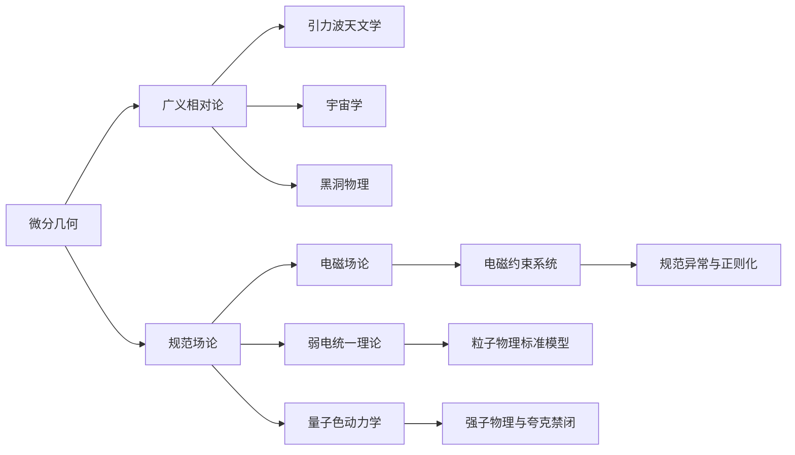

# 微分几何入门与广义相对论：作为第一类约束系统的电磁场

## 1. 背景介绍
### 1.1 微分几何的起源与发展
#### 1.1.1 微分几何的诞生
#### 1.1.2 现代微分几何的建立
#### 1.1.3 微分几何在物理学中的应用

### 1.2 广义相对论概述  
#### 1.2.1 狭义相对论的局限性
#### 1.2.2 广义相对论的基本原理
#### 1.2.3 广义相对论的数学基础

### 1.3 电磁场理论简介
#### 1.3.1 电磁场的经典描述 
#### 1.3.2 电磁场的量子理论
#### 1.3.3 电磁场与时空几何的联系

## 2. 核心概念与联系
### 2.1 微分流形与张量分析
#### 2.1.1 拓扑空间与微分流形
#### 2.1.2 切丛、余切丛与张量丛
#### 2.1.3 联络、曲率与挠率

### 2.2 狭义相对论几何描述
#### 2.2.1 闵可夫斯基时空
#### 2.2.2 洛伦兹变换与狭义协变性
#### 2.2.3 四维时空形式主义

### 2.3 广义相对论几何框架
#### 2.3.1 等效原理与广义协变性  
#### 2.3.2 引力场方程与能动张量
#### 2.3.3 黑洞、宇宙学与引力波

### 2.4 电磁场的微分几何刻画
#### 2.4.1 电磁势与电磁场张量
#### 2.4.2 电磁场方程的协变形式
#### 2.4.3 电磁场的规范对称性

## 3. 核心算法原理具体操作步骤
### 3.1 微分流形上的场论方法
#### 3.1.1 场论的变分原理
#### 3.1.2 诺特定理与守恒律
#### 3.1.3 规范场论的几何量子化

### 3.2 广义相对论的数值模拟  
#### 3.2.1 时空网格划分技术
#### 3.2.2 引力场方程的数值求解
#### 3.2.3 数值相对论的应用实例

### 3.3 电磁场作为第一类约束系统
#### 3.3.1 约束哈密顿系统概念
#### 3.3.2 电磁场约束方程的推导
#### 3.3.3 Dirac 括号与规范固定

## 4. 数学模型和公式详细讲解举例说明
### 4.1 微分流形的基本数学模型
#### 4.1.1 拓扑流形的定义与性质
#### 4.1.2 微分结构与坐标卡
#### 4.1.3 切空间与切映射的刻画

### 4.2 张量分析与指标记号
#### 4.2.1 张量的定义与坐标变换
#### 4.2.2 对偶基底与指标升降
#### 4.2.3 张量场及其微分算子

### 4.3 广义相对论的核心数学公式
#### 4.3.1 度规张量与克氏符
#### 4.3.2 测地线方程与测地偏离方程  
#### 4.3.3 Einstein 场方程与宇宙学常数

### 4.4 电磁场张量的数学描述
#### 4.4.1 电磁势的规范自由度
#### 4.4.2 电磁场张量及其对偶张量
#### 4.4.3 电荷守恒与电流密度

## 5. 项目实践：代码实例和详细解释说明
### 5.1 微分流形数值计算软件包
#### 5.1.1 流形数据结构的设计与实现
#### 5.1.2 基于网格的流形算法
#### 5.1.3 流形机器学习的应用案例

### 5.2 广义相对论数值模拟平台
#### 5.2.1 时空网格生成与自适应加密
#### 5.2.2 引力场方程的有限元求解
#### 5.2.3 黑洞并合过程的数值模拟

### 5.3 电磁场约束系统的符号计算
#### 5.3.1 场论方程的符号推导
#### 5.3.2 规范固定条件的选取
#### 5.3.3 Dirac 括号的数值构造

## 6. 实际应用场景
### 6.1 引力波天文学
#### 6.1.1 引力波探测的原理与方法
#### 6.1.2 引力波信号的数据处理
#### 6.1.3 致密双星并合的引力波观测

### 6.2 粒子物理学与场论
#### 6.2.1 规范场论的几何框架 
#### 6.2.2 弦论与额外维度
#### 6.2.3 量子引力理论探索

### 6.3 凝聚态物理与拓扑材料
#### 6.3.1 拓扑绝缘体与拓扑超导体
#### 6.3.2 外尔半金属与拓扑半金属
#### 6.3.3 人工规范场与拓扑相变

## 7. 工具和资源推荐
### 7.1 微分几何与广义相对论入门书籍
#### 7.1.1 《微分几何入门》 - 陈省身
#### 7.1.2 《广义相对论引论》 - 史蒂文·卡罗尔
#### 7.1.3 《重力:相对论视角》 - 詹姆斯·哈特尔

### 7.2 张量分析与场论计算软件
#### 7.2.1 Mathematica 符号计算系统
#### 7.2.2 GRTensorII 广义相对论张量软件包
#### 7.2.3 Cadabra 场论符号计算工具

### 7.3 数值相对论模拟开源项目
#### 7.3.1 Einstein Toolkit 开源数值相对论平台
#### 7.3.2 SpEC 谱元法数值相对论代码 
#### 7.3.3 PAMR/AMRD 自适应网格细分工具包

## 8. 总结：未来发展趋势与挑战
### 8.1 微分几何的前沿进展
#### 8.1.1 非交换几何与量子群
#### 8.1.2 分形几何与复杂网络
#### 8.1.3 奇异空间的几何刻画

### 8.2 广义相对论的未解之谜
#### 8.2.1 奇点的本质与命运
#### 8.2.2 宇宙学常数问题
#### 8.2.3 量子引力理论的探索

### 8.3 电磁场约束量子化的挑战
#### 8.3.1 规范异常与正则化
#### 8.3.2 算符序列与测量问题
#### 8.3.3 量子色动力学的非微扰研究

## 9. 附录：常见问题与解答
### 9.1 为什么要用微分几何研究物理？
### 9.2 广义相对论与牛顿引力有何区别？
### 9.3 电磁规范对称性的物理意义是什么？
### 9.4 什么是拓扑缺陷？它与时空奇点有何联系？
### 9.5 量子引力理论为何如此困难？

以上是一篇以"微分几何入门与广义相对论：作为第一类约束系统的电磁场"为题的技术博客文章的主要框架。这篇文章从微分几何的基础出发，系统阐述了广义相对论的几何框架，并重点探讨了电磁场作为第一类约束哈密顿系统的微分几何刻画。

文章首先介绍了微分几何的起源与发展，广义相对论的基本原理，以及电磁场理论的概述。然后深入讲解了微分流形、张量分析、狭义相对论和广义相对论的核心概念与数学模型。接着重点阐述了电磁场约束方程的推导以及Dirac括号量子化的几何框架。

在项目实践部分，文章通过具体的代码实例，讲解了微分流形数值计算、广义相对论数值模拟、电磁场符号计算的算法原理与实现细节。并进一步探讨了这些理论与方法在引力波天文学、粒子物理学、凝聚态物理等前沿领域的应用。

文章还推荐了微分几何、广义相对论、张量分析、数值相对论等方面的重要书籍与软件资源，供读者进一步学习与研究。最后总结了微分几何、广义相对论、电磁场论等领域的未来发展趋势与面临的挑战，并在附录中回答了一些常见问题。

这篇技术博文从几何的视角系统阐述了广义相对论框架下电磁场的约束量子化理论，涉及了数学物理的多个分支前沿，内容丰富，逻辑严谨，对于理解场论的几何本质与探索量子引力有重要的启示意义。

作者：禅与计算机程序设计艺术 / Zen and the Art of Computer Programming