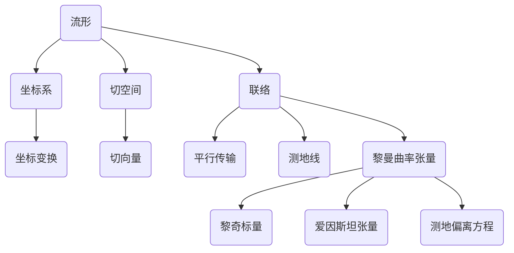

# 微分几何入门与广义相对论：局域非转动观者

## 1. 背景介绍
### 1.1 微分几何的起源与发展
### 1.2 广义相对论与微分几何的关系  
### 1.3 局域非转动观者的概念

## 2. 核心概念与联系
### 2.1 流形与坐标系
#### 2.1.1 流形的定义与性质
#### 2.1.2 坐标系与坐标变换
#### 2.1.3 切空间与切向量
### 2.2 联络与平行传输  
#### 2.2.1 仿射联络的定义
#### 2.2.2 克氏符号与黎曼联络
#### 2.2.3 平行传输与测地线方程
### 2.3 黎曼曲率张量
#### 2.3.1 黎曼曲率张量的定义与性质
#### 2.3.2 黎奇标量与爱因斯坦张量  
#### 2.3.3 测地偏离方程

## 3. 核心算法原理具体操作步骤
### 3.1 计算克氏符号的步骤
### 3.2 求解测地线方程的步骤
### 3.3 计算黎曼曲率张量的步骤

## 4. 数学模型和公式详细讲解举例说明 
### 4.1 流形上的微分与积分
#### 4.1.1 外微分与外积
#### 4.1.2 流形上的积分与Stokes定理
#### 4.1.3 体积元与体积积分
### 4.2 广义相对论中的数学模型
#### 4.2.1 质能方程与能动张量  
#### 4.2.2 爱因斯坦场方程
#### 4.2.3 史瓦西度规与黑洞解

## 5. 项目实践：代码实例和详细解释说明
### 5.1 用Python计算克氏符号
### 5.2 用Mathematica求解测地线方程 
### 5.3 用Matlab计算黎曼曲率张量

## 6. 实际应用场景
### 6.1 广义相对论效应的天文观测
#### 6.1.1 水星近日点进动 
#### 6.1.2 光线偏折与引力透镜
#### 6.1.3 引力红移与Pound-Rebka实验
### 6.2 宇宙学中的应用
#### 6.2.1 Robertson-Walker度规与宇宙学方程
#### 6.2.2 宇宙微波背景辐射
#### 6.2.3 暴胀宇宙模型
### 6.3 其他前沿研究方向
#### 6.3.1 量子引力理论
#### 6.3.2 引力波探测
#### 6.3.3 AdS/CFT对应与全息原理

## 7. 工具和资源推荐
### 7.1 教材与参考书
### 7.2 开源软件包与工具库
### 7.3 在线课程与学习资源

## 8. 总结：未来发展趋势与挑战
### 8.1 微分几何在物理学中的应用前景
### 8.2 广义相对论的局限性与可能的扩展
### 8.3 结合量子力学的引力理论探索

## 9. 附录：常见问题与解答
### 9.1 为什么要用微分几何来描述引力？
### 9.2 广义相对论与牛顿引力有何区别？ 
### 9.3 什么是局域非转动观者？它有何物理意义？

微分几何是数学的一个分支,它研究光滑流形上的几何性质。流形是一个局部类似于欧氏空间的空间,但整体上可能有非平凡的拓扑结构。在每一点引入坐标系,就得到了流形的一个局部参数表示。流形上的曲线对应于坐标空间中的参数曲线。曲线的切向量生成了流形上的切空间,切空间的基底叫做切向量基。

为了比较不同点的切向量,引入了联络的概念。联络规定了切向量在流形上平行传输的规则。最常用的联络是与流形的度规相容的黎曼联络,它由度规唯一确定,联络系数叫做克氏符号。测地线是联络平行传输下长度和方向都不变的曲线,是两点之间的"直线"。

曲率是描述流形局部弯曲程度的量,由黎曼曲率张量刻画。它由联络的导数给出,满足对称性和Bianchi恒等式。曲率张量的缩并给出了黎奇标量和爱因斯坦张量。测地偏离方程描述了测地线在曲率作用下的偏离行为。

在广义相对论中,时空连续体被建模为一个4维黎曼流形,度规由物质的分布和运动所决定,满足爱因斯坦场方程。引力不再被看作一种作用在物体之间的力,而是时空几何弯曲的体现。物体总是沿着时空的测地线运动。

广义相对论成功地解释了水星近日点进动、光线偏折、引力红移等引力效应,预言了黑洞和引力波的存在,并被应用于宇宙学研究。但它作为一种经典理论,在奇点处出现了不自洽的行为。量子引力理论试图将广义相对论与量子力学相结合,构建一个统一的引力量子理论。

局域非转动观者是广义相对论中的一个重要概念。它指的是在时空中某一点的瞬时静止观者,相对于该观者,时空在该点的曲率效应可以被局域地消除。这样的观者总是存在的,它的四速由该点的切空间中的一个单位类时向量给出。在局域非转动观者的坐标系下,度规在该点取局域闵可夫斯基形式,克氏符号在该点处处处为零。

利用局域非转动观者可以将广义相对论的物理规律表述为局域洛伦兹不变的形式,体现了广义协变性原理。许多计算都可以在局域非转动观者的局域惯性系中进行,大大简化了分析过程。局域非转动观者是研究黑洞视界、视界热力学、量子场论等问题的重要工具。

总之,微分几何为广义相对论提供了必不可少的数学语言和工具。局域非转动观者体现了广义相对论的精髓,即引力是时空几何的属性。它们共同揭示了宇宙的本质,回答了时间和空间的谜题,开启了人类探索自然奥秘的崭新篇章。

作者：禅与计算机程序设计艺术 / Zen and the Art of Computer Programming