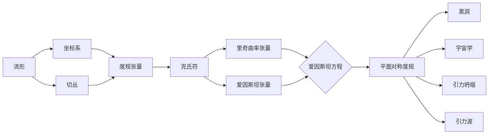

# 微分几何入门与广义相对论：平面对称度规简介

## 1. 背景介绍
### 1.1 微分几何概述
微分几何是数学的一个分支,主要研究流形(manifold)上的几何性质。它将微积分、线性代数、拓扑学等数学工具应用于几何学研究。微分几何在物理学,尤其是广义相对论中有着广泛的应用。
### 1.2 广义相对论简介
广义相对论是爱因斯坦在1915年提出的一个关于引力的理论。它将引力描述为时空的曲率,用黎曼几何(Riemannian geometry)来描述时空的几何性质。在广义相对论中,物质和能量导致时空弯曲,而时空的弯曲又告诉物质如何运动。
### 1.3 平面对称度规的意义
在广义相对论中,度规(metric)是描述时空几何性质的基本量。平面对称度规是一类具有特殊对称性的度规,它在研究黑洞、宇宙学模型等问题时有重要应用。理解平面对称度规的性质,有助于我们更好地理解广义相对论。

## 2. 核心概念与联系
### 2.1 流形与坐标系
- 流形:一个局部类似于欧氏空间$\mathbb{R}^n$的拓扑空间。
- 坐标系:为流形上的点建立标签的方法,使得我们可以用一组数来表示一个点。
- 过渡函数:不同坐标系之间的转换函数,保证了流形的光滑性。
### 2.2 切丛与切空间
- 切向量:描述曲线在某点的方向和速度。
- 切空间:某点所有切向量的集合,是一个线性空间。
- 切丛:所有点的切空间的并集,是一个流形。
### 2.3 度规与曲率
- 度规:为切空间定义内积,使其成为内积空间。度规可以用来测量长度、角度等。
- 曲率:描述流形偏离欧氏空间的程度。曲率可以通过黎曼曲率张量、里奇张量等来度量。
### 2.4 爱因斯坦场方程
爱因斯坦场方程描述了时空的几何性质与物质能量分布之间的关系:

$$R_{\mu\nu}-\frac{1}{2}Rg_{\mu\nu}=\frac{8\pi G}{c^4}T_{\mu\nu}$$

其中$R_{\mu\nu}$是里奇曲率张量,$R$是标量曲率,$g_{\mu\nu}$是度规张量,$T_{\mu\nu}$是能动张量,$G$是引力常数,$c$是光速。

## 3. 核心算法原理具体操作步骤
### 3.1 计算克氏符
克氏符$\Gamma^{\mu}_{\nu\lambda}$描述了协变导数对矢量的作用,是计算曲率的基础。给定度规$g_{\mu\nu}$,克氏符可以通过下式计算:

$$\Gamma^{\mu}_{\nu\lambda}=\frac{1}{2}g^{\mu\sigma}(\partial_{\nu}g_{\sigma\lambda}+\partial_{\lambda}g_{\nu\sigma}-\partial_{\sigma}g_{\nu\lambda})$$

其中$g^{\mu\nu}$是度规的逆矩阵,$\partial_{\mu}$表示对坐标$x^{\mu}$的偏导数。
### 3.2 计算里奇曲率张量
有了克氏符,我们可以计算里奇曲率张量$R_{\mu\nu}$:

$$R_{\mu\nu}=\partial_{\lambda}\Gamma^{\lambda}_{\mu\nu}-\partial_{\nu}\Gamma^{\lambda}_{\mu\lambda}+\Gamma^{\lambda}_{\mu\nu}\Gamma^{\sigma}_{\lambda\sigma}-\Gamma^{\lambda}_{\mu\sigma}\Gamma^{\sigma}_{\nu\lambda}$$

### 3.3 求解爱因斯坦方程
将里奇曲率张量代入爱因斯坦方程,再结合能动张量$T_{\mu\nu}$的具体形式,就可以求解出度规$g_{\mu\nu}$。这通常需要解一个非线性偏微分方程组,在许多情况下需要借助数值方法。

## 4. 数学模型和公式详细讲解举例说明
### 4.1 平面对称度规的定义
平面对称度规是一类具有平面对称性的度规,其最一般的形式可以写作:

$$ds^2=e^{2\nu(r)}dt^2-e^{2\lambda(r)}dr^2-r^2(d\theta^2+\sin^2\theta d\phi^2)$$

其中$\nu(r)$和$\lambda(r)$是关于径向坐标$r$的函数,$(t,r,\theta,\phi)$是时空的坐标。这个度规描述了一个静态、球对称的时空。
### 4.2 平面对称度规的性质
对于平面对称度规,我们可以计算出它的里奇曲率张量和标量曲率:

$$R_{tt}=e^{2\nu-2\lambda}(\nu''+\nu'^2-\nu'\lambda'+\frac{2\nu'}{r})$$
$$R_{rr}=-\nu''-\nu'^2+\nu'\lambda'+\frac{2\lambda'}{r}$$
$$R_{\theta\theta}=R_{\phi\phi}/\sin^2\theta=e^{-2\lambda}(r\lambda'-r\nu'-1)+1$$
$$R=2e^{-2\lambda}(\nu''+\nu'^2-\nu'\lambda'+\frac{2\nu'-2\lambda'}{r}-\frac{e^{2\lambda}}{r^2})+\frac{2}{r^2}$$

其中撇号表示对$r$的导数。这些量描述了平面对称时空的几何性质。
### 4.3 平面对称度规的应用
平面对称度规可以用来描述许多重要的时空,例如:
- 史瓦西度规(Schwarzschild metric):描述球对称黑洞的外部时空。
- 内部史瓦西度规(Interior Schwarzschild metric):描述恒星内部的时空。
- 托朗-邦迪度规(Tolman-Bondi metric):描述球对称尘埃云的演化。

这些度规都可以通过选取特定的$\nu(r)$和$\lambda(r)$函数从平面对称度规导出。

## 5. 项目实践：代码实例和详细解释说明
下面我们用Python的Sympy库来计算平面对称度规的里奇曲率张量和标量曲率。

```python
from sympy import * 

# 定义坐标和函数
t, r, theta, phi = symbols('t r theta phi')
nu = Function('nu')(r)  
lambd = Function('lambd')(r)

# 定义度规张量
g00 = exp(2*nu)
g11 = -exp(2*lambd) 
g22 = -r**2
g33 = -r**2*sin(theta)**2

g = diag(g00, g11, g22, g33)

# 计算克氏符
gamma = christoffel(g)

# 计算里奇张量
ricci = ricci_tensor(g, gamma)

# 计算标量曲率
R = ricci.trace()

# 打印结果
pprint(ricci)
pprint(R)
```

这段代码首先定义了时空坐标$(t,r,\theta,\phi)$和度规函数$\nu(r),\lambda(r)$,然后构造了平面对称度规的度规张量$g_{\mu\nu}$。

接着,它调用`christoffel`函数计算克氏符$\Gamma^{\mu}_{\nu\lambda}$,再调用`ricci_tensor`函数计算里奇曲率张量$R_{\mu\nu}$。最后,它计算标量曲率$R$并打印结果。

这个例子展示了如何用计算机代数系统来进行张量计算。在实际研究中,我们还可以用数值方法求解爱因斯坦方程,得到度规函数$\nu(r)$和$\lambda(r)$的具体形式。

## 6. 实际应用场景
平面对称度规在广义相对论的许多领域都有应用,例如:
- 黑洞物理:研究黑洞的性质,如视界、奇点、热力学等。
- 宇宙学:构建宇宙学模型,描述宇宙的大尺度结构和演化。
- 引力坍缩:研究星体在自身引力作用下的演化和最终命运。
- 引力波:研究引力波的产生、传播和探测。

理解平面对称度规的性质,有助于我们更好地应用广义相对论解决实际问题。

## 7. 工具和资源推荐
- Sympy:Python的符号计算库,可以进行张量分析。 
- GRTensorII:Maple的广义相对论张量分析包。
- GYOTO:用于计算广义相对论下的光线追踪的C++库。
- EinsteinToolkit:开源的数值相对论模拟软件。
- Exact Solutions of Einstein's Field Equations(书籍):介绍爱因斯坦方程的各种解析解。
- General Relativity(书籍):Wald的广义相对论教材,对平面对称度规有详细讨论。

这些工具和资源可以帮助我们更好地学习和应用广义相对论。

## 8. 总结：未来发展趋势与挑战
平面对称度规在广义相对论研究中有着重要的地位。未来,随着观测技术的进步,我们有望通过引力波、黑洞阴影等观测来验证平面对称度规的预言。同时,平面对称度规也为研究量子引力效应提供了一个很好的平台。

然而,广义相对论也面临着一些挑战:
- 奇点问题:广义相对论预言黑洞中心存在奇点,在奇点处时空曲率发散,引力理论失效。
- 量子引力:如何将广义相对论与量子力学结合,构建一个量子引力理论,是当前物理学的一大难题。
- 暗物质和暗能量:宇宙学观测发现,宇宙中存在大量暗物质和暗能量,它们的性质尚不清楚,给广义相对论带来了新的挑战。

未来,我们需要在理论和实验两个方面取得进展,来更好地理解和应用平面对称度规乃至广义相对论。这需要物理学家和数学家的共同努力。

## 9. 附录：常见问题与解答
### 问题1:平面对称度规与球对称度规有何区别?
答:平面对称度规描述的时空在径向和时间方向上是不对称的,而在角度方向上是各向同性的。球对称度规则在径向、时间和角度方向上都是对称的。平面对称度规比球对称度规更一般。
### 问题2:平面对称度规能否描述旋转黑洞?
答:不能。描述旋转黑洞需要用到更一般的轴对称度规,如Kerr度规。平面对称度规只能描述不旋转的黑洞。
### 问题3:为什么要研究平面对称度规?
答:平面对称度规虽然比球对称度规更复杂,但它能描述更广泛的时空,如带电黑洞、宇宙尘埃云等。研究平面对称度规有助于我们深入理解广义相对论的数学结构和物理内涵。同时,平面对称度规也是研究更一般时空的基础。

作者：禅与计算机程序设计艺术 / Zen and the Art of Computer Programming

