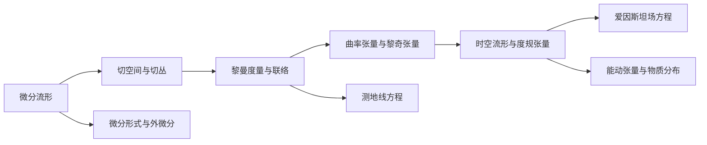

# 微分几何入门与广义相对论：广义相对论的经典实验验证

## 1. 背景介绍
### 1.1 微分几何的发展历史
#### 1.1.1 微分几何的起源
#### 1.1.2 微分几何的发展历程
#### 1.1.3 现代微分几何的应用

### 1.2 广义相对论概述  
#### 1.2.1 狭义相对论的局限性
#### 1.2.2 广义相对论的提出
#### 1.2.3 广义相对论的基本原理

### 1.3 微分几何与广义相对论的关系
#### 1.3.1 黎曼几何与广义相对论 
#### 1.3.2 微分几何在广义相对论中的应用
#### 1.3.3 微分几何对广义相对论的影响

## 2. 核心概念与联系
### 2.1 微分流形
#### 2.1.1 拓扑空间与微分流形
#### 2.1.2 切空间与切丛
#### 2.1.3 微分形式与外微分

### 2.2 联络与曲率
#### 2.2.1 黎曼度量与联络
#### 2.2.2 曲率张量与黎奇张量
#### 2.2.3 测地线方程

### 2.3 广义相对论的几何描述
#### 2.3.1 时空流形与度规张量  
#### 2.3.2 爱因斯坦场方程
#### 2.3.3 能动张量与物质分布



## 3. 核心算法原理具体操作步骤
### 3.1 测地线方程的求解
#### 3.1.1 克氏符方法
#### 3.1.2 欧拉-拉格朗日方程法
#### 3.1.3 雅可比场与测地线偏差

### 3.2 爱因斯坦场方程的求解
#### 3.2.1 真空场方程的求解
#### 3.2.2 含物质场方程的求解
#### 3.2.3 弱场近似下的求解

### 3.3 黑洞解的求解
#### 3.3.1 史瓦西度规
#### 3.3.2 克尔度规
#### 3.3.3 克尔-纽曼度规

## 4. 数学模型和公式详细讲解举例说明
### 4.1 黎曼度量
#### 4.1.1 黎曼度量的定义
设 $M$ 为 $n$ 维光滑流形，$T_pM$ 为 $p\in M$ 点的切空间，若映射 $g_p: T_pM\times T_pM \to \mathbb{R}$ 满足：
1. 对称性：$\forall X,Y \in T_pM, g_p(X,Y)=g_p(Y,X)$
2. 双线性：$\forall X,Y,Z \in T_pM, a,b \in \mathbb{R}$
   $g_p(aX+bY,Z)=ag_p(X,Z)+bg_p(Y,Z)$  
   $g_p(Z,aX+bY)=ag_p(Z,X)+bg_p(Z,Y)$
3. 非退化性：若 $\forall Y\in T_pM, g_p(X,Y)=0$，则 $X=0$

则称 $g_p$ 为 $p$ 点的黎曼度量。若 $\forall p\in M$，$g_p$ 光滑变化，则称 $g=\{g_p\}$ 为流形 $M$ 上的黎曼度量。

#### 4.1.2 黎曼度量的坐标表示
在局部坐标 $(x^1,\cdots,x^n)$ 下，$g$ 可表示为
$$g=g_{ij}dx^i\otimes dx^j, \quad g_{ij}=g_p(\frac{\partial}{\partial x^i},\frac{\partial}{\partial x^j})$$
其中 $g_{ij}$ 为度规张量分量，满足对称性 $g_{ij}=g_{ji}$。

#### 4.1.3 诱导度量
设 $\varphi:N\to M$ 为流形间的光滑映射，$g^M$ 为 $M$ 上的黎曼度量，则 $\varphi$ 诱导 $N$ 上的黎曼度量 $g^N$ 为
$$g^N(X,Y)=g^M(d\varphi(X),d\varphi(Y)), \quad \forall X,Y\in TN$$

### 4.2 曲率张量
#### 4.2.1 黎曼曲率张量的定义
设 $(M,g)$ 为黎曼流形，$\nabla$ 为 $g$ 相容的黎曼联络，则黎曼曲率张量 $R$ 定义为
$$R(X,Y)Z=\nabla_X\nabla_YZ-\nabla_Y\nabla_XZ-\nabla_{[X,Y]}Z$$
其中 $X,Y,Z$ 为光滑向量场，$[X,Y]=XY-YX$ 为 $X,Y$ 的李括号。

#### 4.2.2 黎奇张量的定义
黎奇张量 $Ric$ 定义为黎曼曲率张量的缩并
$$Ric(X,Y)=\text{tr}(Z\mapsto R(X,Z)Y)$$

#### 4.2.3 标量曲率的定义
标量曲率 $S$ 定义为黎奇张量的迹
$$S=\text{tr}(Ric)=g^{ij}R_{ij}$$
其中 $g^{ij}$ 为度规张量的逆矩阵。

### 4.3 爱因斯坦场方程
#### 4.3.1 场方程的提出
爱因斯坦场方程描述了时空几何与物质分布之间的关系，其形式为
$$R_{ij}-\frac{1}{2}Rg_{ij}=\frac{8\pi G}{c^4}T_{ij}$$
其中 $R_{ij}$ 为黎奇张量分量，$R$ 为标量曲率，$T_{ij}$ 为能动张量分量，$G$ 为引力常数，$c$ 为光速。

#### 4.3.2 能动张量
能动张量 $T_{ij}$ 描述物质和场的能量动量分布，其分量为
$$T_{ij}=(\rho+\frac{p}{c^2})u_iu_j+pg_{ij}$$
其中 $\rho$ 为静止质量密度，$p$ 为压强，$u^i$ 为四速度。

#### 4.3.3 场方程的简化形式
引入爱因斯坦张量 $G_{ij}=R_{ij}-\frac{1}{2}Rg_{ij}$，场方程可简写为
$$G_{ij}=\frac{8\pi G}{c^4}T_{ij}$$
表明时空几何由物质能量动量分布所决定。

## 5. 项目实践：代码实例和详细解释说明
### 5.1 数值相对论简介
#### 5.1.1 ADM分解
#### 5.1.2 BSSN方程组
#### 5.1.3 时空网格与边界条件

### 5.2 数值求解爱因斯坦方程
#### 5.2.1 有限差分方法
以下为一维波动方程 $\partial_t^2\phi=\partial_x^2\phi$ 的有限差分格式
```python
import numpy as np

def wave_equation_1d(phi_init, phi_t_init, dx, dt, t_max):
    nx = len(phi_init)
    nt = int(t_max/dt)
    phi = np.zeros((nt,nx))
    phi[0] = phi_init
    phi[1] = phi_init + dt*phi_t_init
    
    for n in range(1,nt-1):
        for i in range(1,nx-1):
            phi[n+1,i] = 2*phi[n,i] - phi[n-1,i] + (dt/dx)**2*(phi[n,i+1]-2*phi[n,i]+phi[n,i-1])
        
    return phi
```

#### 5.2.2 谱方法
以下为一维波动方程的傅里叶谱方法
```python
import numpy as np

def fourier_wave_equation_1d(phi_init, phi_t_init, dx, dt, t_max):
    nx = len(phi_init)
    nt = int(t_max/dt)
    kx = 2*np.pi*np.fft.fftfreq(nx,dx)
    phi_hat = np.fft.fft(phi_init)
    phi_t_hat = np.fft.fft(phi_t_init)
    
    for n in range(nt):
        phi_hat_new = np.cos(kx*dt)*phi_hat + np.sin(kx*dt)/kx*phi_t_hat
        phi_t_hat = -kx*np.sin(kx*dt)*phi_hat + np.cos(kx*dt)*phi_t_hat
        phi_hat = phi_hat_new
        
    phi = np.real(np.fft.ifft(phi_hat))
    
    return phi  
```

#### 5.2.3 并行计算与自适应网格

### 5.3 数值相对论应用
#### 5.3.1 双黑洞并合模拟
#### 5.3.2 引力波信号提取
#### 5.3.3 吸积盘与喷流结构研究

## 6. 实际应用场景
### 6.1 引力波天文学
#### 6.1.1 引力波探测的原理
#### 6.1.2 地面引力波探测器
#### 6.1.3 空间引力波探测计划

### 6.2 黑洞与活动星系核
#### 6.2.1 超大质量黑洞
#### 6.2.2 吸积过程与喷流
#### 6.2.3 黑洞影像与事件视界望远镜

### 6.3 宇宙学应用
#### 6.3.1 宇宙学参数测量
#### 6.3.2 宇宙大尺度结构形成
#### 6.3.3 早期宇宙与暴胀理论

## 7. 工具和资源推荐
### 7.1 数值相对论开源代码
- Einstein Toolkit: 开源数值相对论计算平台
- PAMR: 自适应网格细化并行库
- GRChombo: 基于Chombo库的自适应网格细化数值相对论代码 

### 7.2 符号计算软件
- Mathematica: 广泛用于广义相对论研究的符号计算软件
- Maple: 另一款应用于广义相对论的符号计算软件
- SageMath: 开源的基于Python的符号计算系统

### 7.3 在线课程与教材
- General Relativity (MIT OpenCourseWare): 麻省理工公开课广义相对论课程
- Numerical Relativity (CalTech Online): 加州理工在线数值相对论课程
- Gravitation (Misner, Thorne, Wheeler): 经典广义相对论教材
- Numerical Relativity (Baumgarte, Shapiro): 数值相对论方法标准教材

## 8. 总结：未来发展趋势与挑战
### 8.1 引力波天文学的未来
#### 8.1.1 第三代地面引力波探测器
#### 8.1.2 空间引力波探测阵列
#### 8.1.3 多信使天文学

### 8.2 数值相对论的发展方向
#### 8.2.1 高阶精度与自适应算法 
#### 8.2.2 新物理过程耦合
#### 8.2.3 高性能计算与人工智能

### 8.3 广义相对论的前沿问题
#### 8.3.1 量子引力理论
#### 8.3.2 宇宙学奇点与暴胀理论
#### 8.3.3 引力与其他相互作用的大统一

## 9. 附录：常见问题与解答
### 9.1 为什么要学习微分几何？
微分几何是现代物理学的数学基础，不仅在广义相对论中有着广泛应用，在场论、弦理论等领域也发挥着重要作用。学习微分几何有助于深入理解物理学的几何本质，掌握描述自然规律的数学语言。

### 9.2 广义相对论与牛顿引力有何区别？
牛顿引力是一种瞬时作用力，引力强度正比于质量乘积而反比于距离平方。而在广义相对论中，引力被视为时空几何的弯曲效应，物体运动沿着时空测地线前进。广义相对论能够解释水星近日点进动等牛顿引力无法解释的现象，在强引力场条件下给出与牛顿引力显著不同的预言。

### 9.3 什么是引力波？
引力