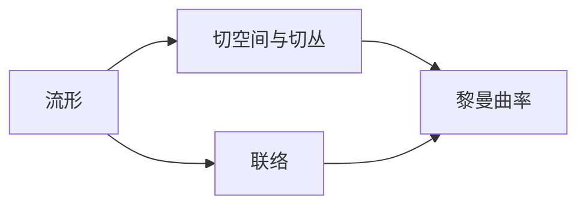

# 微分几何入门与广义相对论：弯曲时空中的物理定律

## 1.背景介绍
### 1.1 微分几何的发展历程
#### 1.1.1 古希腊时期的几何学
#### 1.1.2 笛卡尔的解析几何
#### 1.1.3 黎曼的非欧几何
### 1.2 广义相对论的诞生
#### 1.2.1 牛顿的经典力学
#### 1.2.2 狭义相对论的局限性
#### 1.2.3 爱因斯坦的时空观
### 1.3 微分几何与广义相对论的结合
#### 1.3.1 引力的几何化
#### 1.3.2 曲率与物质分布
#### 1.3.3 时空的动力学方程

## 2.核心概念与联系
### 2.1 流形
#### 2.1.1 拓扑空间
#### 2.1.2 微分结构
#### 2.1.3 坐标卡
### 2.2 切空间与切丛
#### 2.2.1 切向量
#### 2.2.2 切丛
#### 2.2.3 对偶丛
### 2.3 联络
#### 2.3.1 平行移动
#### 2.3.2 克氏符
#### 2.3.3 测地线
### 2.4 黎曼曲率
#### 2.4.1 黎曼曲率张量
#### 2.4.2 里奇张量
#### 2.4.3 标量曲率

## 3.核心算法原理具体操作步骤
### 3.1 张量分析
#### 3.1.1 协变导数
#### 3.1.2 李导数
#### 3.1.3 外微分
### 3.2 测地线方程
#### 3.2.1 测地线的变分法
#### 3.2.2 测地线方程的推导
#### 3.2.3 测地线的唯一性定理
### 3.3 曲率计算
#### 3.3.1 曲率张量的计算
#### 3.3.2 里奇张量的计算
#### 3.3.3 标量曲率的计算

## 4.数学模型和公式详细讲解举例说明
### 4.1 黎曼度量
#### 4.1.1 度量张量
$$
ds^2 = g_{\mu\nu}dx^\mu dx^\nu
$$
#### 4.1.2 诱导度量
#### 4.1.3 度量相容性
### 4.2 测地线方程
$$
\frac{d^2x^\lambda}{dp^2} + \Gamma^\lambda_{\mu\nu} \frac{dx^\mu}{dp}\frac{dx^\nu}{dp} = 0
$$
### 4.3 曲率张量
$$
R^\rho_{\sigma\mu\nu} = \partial_\mu \Gamma^\rho_{\nu\sigma} - \partial_\nu \Gamma^\rho_{\mu\sigma} + \Gamma^\rho_{\mu\lambda}\Gamma^\lambda_{\nu\sigma} - \Gamma^\rho_{\nu\lambda}\Gamma^\lambda_{\mu\sigma}
$$
### 4.4 爱因斯坦场方程
$$
R_{\mu\nu} - \frac{1}{2}g_{\mu\nu}R + \Lambda g_{\mu\nu} = \frac{8\pi G}{c^4} T_{\mu\nu}
$$

## 5.项目实践：代码实例和详细解释说明
### 5.1 符号计算工具 SymPy
#### 5.1.1 张量运算
#### 5.1.2 黎曼曲率计算
#### 5.1.3 爱因斯坦场方程求解
### 5.2 数值相对论工具包 GRay
#### 5.2.1 时空度规设置
#### 5.2.2 测地线求解
#### 5.2.3 光线追踪
### 5.3 可视化工具 Mayavi
#### 5.3.1 曲面绘制
#### 5.3.2 矢量场可视化
#### 5.3.3 时空图示

## 6.实际应用场景
### 6.1 黑洞
#### 6.1.1 史瓦西度规
#### 6.1.2 视界
#### 6.1.3 吸积盘
### 6.2 宇宙学
#### 6.2.1 宇宙学原理
#### 6.2.2 弗里德曼方程
#### 6.2.3 宇宙的几何结构
### 6.3 引力波
#### 6.3.1 引力波的产生
#### 6.3.2 引力波的传播
#### 6.3.3 引力波探测

## 7.工具和资源推荐
### 7.1 教材
#### 7.1.1 《微分几何入门》 - 陈维桓
#### 7.1.2 《广义相对论引论》 - 史蒂文·卡罗尔
#### 7.1.3 《引力》 - 詹姆斯·哈特尔
### 7.2 课程
#### 7.2.1 Leonard Susskind - 广义相对论
#### 7.2.2 Frederic Schuller - 几何学、拓扑学和物理学
#### 7.2.3 Nigel Hitchen - 微分几何
### 7.3 软件
#### 7.3.1 SymPy
#### 7.3.2 GRay
#### 7.3.3 Mayavi

## 8.总结：未来发展趋势与挑战
### 8.1 量子引力
#### 8.1.1 圈量子引力
#### 8.1.2 弦理论
#### 8.1.3 因果集引力
### 8.2 数值相对论
#### 8.2.1 时空网格构造
#### 8.2.2 黑洞并合模拟
#### 8.2.3 引力波信号提取
### 8.3 观测验证
#### 8.3.1 引力透镜
#### 8.3.2 黑洞阴影
#### 8.3.3 宇宙微波背景辐射

## 9.附录：常见问题与解答
### 9.1 为什么时空是弯曲的？
时空的弯曲源于物质和能量的分布。根据爱因斯坦场方程，物质和能量告诉时空如何弯曲，而弯曲的时空又告诉物质如何运动。这种时空与物质的相互作用，构成了广义相对论的核心内容。

### 9.2 什么是黑洞？
黑洞是时空中的一个区域，其引力场如此之强，以至于连光都无法逃逸。黑洞的边界称为事件视界，一旦物体越过事件视界，就再也无法回到外部时空。黑洞的存在是广义相对论的重要预言之一，目前已有多个黑洞候选天体被观测到。

### 9.3 引力波是什么？
引力波是时空曲率的涟漪，以光速在宇宙中传播。引力波携带着产生它的天体系统的信息，如双黑洞并合、中子星并合等剧烈的天体物理过程。2015年，LIGO首次直接探测到了引力波信号，开启了引力波天文学的新时代。

作者：禅与计算机程序设计艺术 / Zen and the Art of Computer Programming