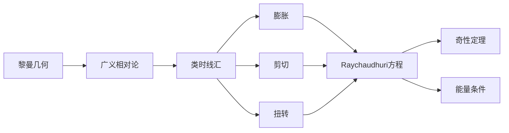

# 微分几何入门与广义相对论：类时线汇（参考系）的膨胀、剪切和扭转

## 1. 背景介绍
### 1.1 微分几何概述
### 1.2 广义相对论概述  
### 1.3 类时线汇的定义与意义

## 2. 核心概念与联系
### 2.1 黎曼几何与广义相对论
#### 2.1.1 黎曼度量
#### 2.1.2 黎曼曲率
#### 2.1.3 爱因斯坦场方程
### 2.2 类时线汇的几何性质
#### 2.2.1 类时测地线
#### 2.2.2 测地偏离方程
#### 2.2.3 测地偏离向量
### 2.3 类时线汇的动力学性质 
#### 2.3.1 Raychaudhuri 方程
#### 2.3.2 剪切张量
#### 2.3.3 扭转张量

## 3. 核心算法原理具体操作步骤
### 3.1 计算类时测地线
### 3.2 求解测地偏离方程  
### 3.3 计算剪切张量与扭转张量
### 3.4 求解Raychaudhuri方程

## 4. 数学模型和公式详细讲解举例说明
### 4.1 黎曼度量及其意义
### 4.2 黎曼曲率张量与爱因斯坦场方程
### 4.3 测地偏离方程的推导与解释  
### 4.4 剪切张量与扭转张量的定义
### 4.5 Raychaudhuri方程及其物理意义

## 5. 项目实践：代码实例和详细解释说明
### 5.1 计算Christoffel符号的示例代码
### 5.2 数值求解测地线方程的示例
### 5.3 symbolab计算黎曼曲率张量的代码
### 5.4 数值求解Raychaudhuri方程的示例

## 6. 实际应用场景
### 6.1 黑洞视界附近的类时线汇性质 
### 6.2 宇宙学中物质密度涨落的演化
### 6.3 引力透镜效应中光线偏折的计算
### 6.4 引力波探测中的应用

## 7. 工具和资源推荐
### 7.1 数学软件：Mathematica, Maple
### 7.2 数值相对论工具包：GRTensorII, GYOTO 
### 7.3 符号计算库：sympy, Cadabra
### 7.4 在线教程与课程资源

## 8. 总结：未来发展趋势与挑战
### 8.1 高阶微分几何在广义相对论中的应用
### 8.2 数值相对论方法的改进与发展
### 8.3 量子引力理论对类时线汇的影响
### 8.4 观测数据与理论预言的比对与验证

## 9. 附录：常见问题与解答
### 9.1 什么是类时线汇？它有什么物理意义？
### 9.2 测地偏离方程描述了什么物理过程？
### 9.3 剪切和扭转对类时线汇有何影响？
### 9.4 Raychaudhuri方程在广义相对论中的地位？
### 9.5 类时线汇的研究对黑洞和宇宙学有何启示？

微分几何是现代物理学的核心数学工具之一，尤其在广义相对论中得到了充分的应用。广义相对论将时空几何与物质分布和运动联系起来，用黎曼几何来刻画弯曲时空中的引力效应。在这一理论框架下，类时线汇（congruence of timelike curves）这一概念尤为重要，它描述了一束无限接近的类时测地线在时空演化过程中的行为特征。

类时线汇可以用三个几何量来刻画：膨胀、剪切和扭转。其中膨胀描述体积元素的变化率，剪切描述形状的畸变，扭转则刻画线汇绕轴旋转的性质。这三者共同决定了类时线汇的动力学演化。Raychaudhuri方程则给出了膨胀、剪切、扭转这三个几何量随时间演化的动力学方程，在广义相对论中有着极其重要的地位，被誉为"广义相对论的第二大方程"。

Raychaudhuri方程直接导出了广义相对论中的奇性定理，即在一定条件下，引力坍缩将不可避免地形成奇性。它也与能量条件密切相关，能量条件对时空中的物质性质做出了限制，是许多重要结论的前提假设。因此，对类时线汇的研究，对于深入理解广义相对论的内在结构和因果性质，具有重要意义。

在数学上，类时线汇的刻画离不开黎曼几何的基本概念，如黎曼度量、黎曼曲率、测地线等。黎曼度量给出了时空的几何结构，决定了类时线的测地方程。黎曼曲率则反映了时空的内禀性质，与物质的能动张量直接相关。测地偏离方程描述了相邻测地线之间的距离如何随时间变化，是研究类时线汇动力学性质的基础。

在数值计算和符号运算方面，现代数学软件如Mathematica、Maple等为张量分析和广义相对论的研究提供了强大的工具。而GYOTO、GRTensorII等专用软件包则直接面向广义相对论中的具体问题，提供了高效的数值算法。借助这些工具，许多以前难以计算的问题得到了很好的解决。

类时线汇的研究已经取得了丰硕的成果，但仍然存在许多开放的问题。随着微分几何的不断发展，更高阶的几何量如曲率导数、Weyl张量等在广义相对论中的作用日益凸显。而量子引力理论的发展，也可能从根本上改变我们对时空结构的认识。此外，随着引力波探测等新技术的出现，人们有望通过观测数据直接检验广义相对论的预言，类时线汇的性质也将受到更加严格的限制。

总之，类时线汇作为联系微分几何与广义相对论的纽带，在当代物理学中占据着重要地位。对其性质的深入研究，不仅有助于我们更好地理解时空的几何结构，也为探索宇宙的本质提供了新的视角。展望未来，微分几何与广义相对论的交叉融合必将持续深化，为人类认识自然打开新的大门。

作者：禅与计算机程序设计艺术 / Zen and the Art of Computer Programming