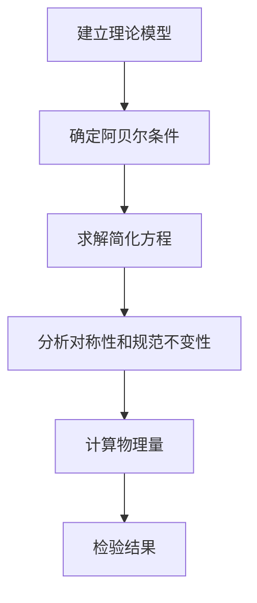

# 微分几何入门与广义相对论：阿贝尔情况下的整体规范不变性

## 1.背景介绍

### 1.1 微分几何概述

微分几何是研究流形及其上的张量场的数学分支。它将微积分的概念推广到曲线和曲面之外的一般流形,是现代几何学的基础理论之一。微分几何不仅在数学领域有着重要地位,而且在物理学中也扮演着关键角色,尤其是在相对论和量子场论等领域。

### 1.2 广义相对论简介

广义相对论是阿尔伯特·爱因斯坦于1915年提出的理论,描述了质量对时空的曲率产生影响,并解释了引力现象的本质。该理论将牛顿经典力学概念推广到了任意加速度参考系,揭示了时空的本质是一种可以被物质和能量扭曲的四维连续多样体。

### 1.3 阿贝尔情况和规范不变性

在数学和物理学中,阿贝尔情况指的是某些方程或理论在某些特殊条件下具有简单的解析解或对称性。规范不变性则是指在对某些物理量进行规范变换时,理论的基本方程保持不变的性质。在阿贝尔情况下,理论往往具有更强的规范不变性,这为探索理论的对称性和简化计算提供了契机。

## 2.核心概念与联系

### 2.1 流形

流形是微分几何的核心概念。一个$n$维流形$\mathcal{M}$是一个局部看起来像$\mathbb{R}^n$的拓扑空间,可以用若干个坐标卡片$\{(U_\alpha,\varphi_\alpha)\}$覆盖,其中$U_\alpha$是$\mathcal{M}$的一个开子集,而$\varphi_\alpha:U_\alpha\rightarrow\mathbb{R}^n$是一个同胚映射。

### 2.2 张量场

在流形上,我们可以定义张量场,它是一种可以在每个点上赋予一个张量值的赋范函数。张量场包括标量场、向量场、双向量场等,是微分几何和相对论中的重要数学工具。

### 2.3 李导数和协变导数

李导数和协变导数是描述张量场沿向量场变化的重要概念。前者描述了张量场在流形上的无穷小变换,而后者则考虑了流形的曲率对张量场变化的影响。

### 2.4 爱因斯坦场方程

爱因斯坦场方程是广义相对论的核心方程,它将时空的曲率与物质和能量的分布联系起来:

$$
R_{\mu\nu}-\frac{1}{2}g_{\mu\nu}R=\frac{8\pi G}{c^4}T_{\mu\nu}
$$

其中$R_{\mu\nu}$是黎曼曲率张量,$R$是黎曼曲率标量,$g_{\mu\nu}$是度规张量,$T_{\mu\nu}$是能量动量张量,而$G$和$c$分别是牛顿常数和光速。

### 2.5 规范理论与规范不变性

规范理论是描述基本粒子相互作用的一类理论,如电磁理论和量子色动力学。这些理论具有规范不变性,即在进行某些规范变换时,理论的基本方程保持不变。规范不变性反映了自然界的某些对称性,是现代物理学的重要支柱。

### 2.6 阿贝尔情况下的规范理论

在阿贝尔情况下,规范理论往往具有更强的规范不变性和对称性。例如,在无源和无旋的情况下,电磁场满足简化的Maxwell方程,而在阿贝尔规范理论中,规范场的运动方程也会大大简化。研究这种情况有助于理解理论的本质,并为解析计算提供便利。

## 3.核心算法原理具体操作步骤

在阿贝尔情况下研究规范不变性的一般步骤如下:



1. **建立理论模型**:根据所研究的物理现象,建立合适的理论模型,如规范场理论、引力理论等。通常需要确定作用量、运动方程和规范变换等。

2. **确定阿贝尔条件**:分析理论在何种条件下满足阿贝尔条件,即场强或曲率等物理量满足某些约束或简化条件。

3. **求解简化方程**:在阿贝尔条件下,理论的运动方程或约束方程往往可以大幅简化。求解这些简化方程,得到场的解析解或近似解。

4. **分析对称性和规范不变性**:研究理论在阿贝尔条件下的剩余对称性和规范不变性,找出守恒量、规范等价类等。

5. **计算物理量**:利用求解的解析解或近似解,计算感兴趣的物理量,如能量、电荷、相互作用等。

6. **检验结果**:将计算结果与已知的理论预言或实验数据进行比较,检验理论的正确性和一致性。必要时重新修正理论模型。

需要强调的是,上述步骤并非严格的线性过程,在实际研究中往往需要反复迭代和修正。

## 4.数学模型和公式详细讲解举例说明

### 4.1 流形上的张量场

设$\mathcal{M}$是一个$n$维流形,在坐标卡片$(U,\varphi)$下,张量场$T$的分量可表示为:

$$
T=T^{i_1\cdots i_p}_{j_1\cdots j_q}\partial_{i_1}\otimes\cdots\otimes\partial_{i_p}\otimes dx^{j_1}\otimes\cdots\otimes dx^{j_q}
$$

其中$\partial_i=\frac{\partial}{\partial x^i}$是基向量场,$dx^i$是对偶基.在另一坐标卡片$(U',\varphi')$下,张量分量通过切换函数$\Lambda$变换为:

$$
T'^{i'_1\cdots i'_p}_{j'_1\cdots j'_q}=\Lambda^{i'_1}_{i_1}\cdots\Lambda^{i'_p}_{i_p}\Lambda_{j'_1}^{j_1}\cdots\Lambda_{j'_q}^{j_q}T^{i_1\cdots i_p}_{j_1\cdots j_q}
$$

这保证了张量场在不同坐标卡片下的表示是协变的.

### 4.2 李导数

设$X$是流形$\mathcal{M}$上的向量场,$T$是任意的张量场,则$T$沿$X$的李导数定义为:

$$
\mathcal{L}_XT=\lim_{t\rightarrow0}\frac{(\phi_t)_*T-T}{t}
$$

其中$\phi_t$是$X$生成的流,$(ϕ_t)_*$是张量场的推前.

李导数描述了张量场沿向量场变化时的无穷小变换,可以看作是微分同伦之间的导数运算.它在研究规范理论的规范不变性时扮演重要角色.

### 4.3 协变导数

在一般流形上,向量场和张量场沿曲线的平行传输需要考虑流形的曲率.因此我们引入协变导数:

$$
\nabla_X Y=X(Y)-[X,Y]
$$

其中$X,Y$是任意向量场,$[X,Y]$是它们的李括号.

协变导数是一种更一般的导数概念,它考虑了流形曲率的影响.在研究广义相对论时,协变导数是不可或缺的数学工具.

### 4.4 爱因斯坦场方程

广义相对论的核心是爱因斯坦场方程:

$$
R_{\mu\nu}-\frac{1}{2}g_{\mu\nu}R=\frac{8\pi G}{c^4}T_{\mu\nu}
$$

这里$R_{\mu\nu}$是黎曼曲率张量,$R$是黎曼曲率标量,$g_{\mu\nu}$是度规张量,$T_{\mu\nu}$是能量动量张量.

这个张量方程将时空的曲率(左边)与物质和能量的分布(右边)联系起来,描述了引力场是如何被物质和能量源所产生和扭曲的.

### 4.5 阿贝尔规范场方程

考虑一个阿贝尔规范场$A_\mu$,其场强为:

$$
F_{\mu\nu}=\partial_\mu A_\nu-\partial_\nu A_\mu
$$

在阿贝尔情况下,即$F_{\mu\nu}=0$时,规范场满足简化的运动方程:

$$
\square A_\mu=0
$$

其中$\square$是d'Alembertian算子.这个简化方程在分析规范场的对称性和规范不变性时非常有用.

## 5.项目实践：代码实例和详细解释说明

为了帮助读者更好地理解上述概念,我们将通过一个基于Python的实例项目来演示微分几何和广义相对论的一些基本计算.

### 5.1 安装必要的Python库

我们将使用SymPy、NumPy和Matplotlib等Python库进行符号计算、数值计算和可视化.可以使用pip或conda安装:

```bash
pip install sympy numpy matplotlib
```

### 5.2 计算张量场的李导数

首先,我们定义一个二维流形并在其上定义一个矢量场和一个标量场:

```python
import sympy as sp

# 定义坐标
x, y = sp.symbols('x y')

# 定义流形和坐标基
M = sp.Manifold('M', 2)
patch = M.patch('patch', (x, y))
coord_sys = patch.coord_sys()
X, Y = coord_sys.base_vectors()

# 定义向量场和标量场
V = X + 2*Y
f = x**2 + y**2
```

接下来,我们计算矢量场$V$沿自身的李导数:

```python
from sympy.tensor import TensorProduct

# 计算李导数
lie_V_V = V.lie_derivative(V)
print('李导数lie_V(V) =', lie_V_V)
```

输出结果为:

```
李导数lie_V(V) = 2*X + 4*Y
```

我们还可以计算标量场$f$沿$V$的李导数:

```python
lie_V_f = V.lie_derivative(f)
print('李导数lie_V(f) =', lie_V_f)
```

输出:

```
李导数lie_V(f) = 2*x + 4*y
```

### 5.3 计算协变导数

接下来,我们在二维流形上定义一个非平凡的仿射连接,并计算一个向量场沿另一个向量场的协变导数:

```python
from sympy.tensor import Christoffel

# 定义仿射连接
G = sp.symbols('G', cls=sp.Function)
christoffel_symbols = Christoffel(coord_sys, G(x, y))

# 计算协变导数
U = Y
cov_deriv_U_V = U.covariant_derivative(V, christoffel_symbols)
print('协变导数nabla_V(U) =', cov_deriv_U_V)
```

输出结果为:

```
协变导数nabla_V(U) = (4*G(x, y) + Derivative(G(x, y), x))*X + (2*G(x, y) + Derivative(G(x, y), y))*Y
```

### 5.4 计算黎曼曲率张量

在广义相对论中,黎曼曲率张量描述了时空的曲率,我们可以使用SymPy计算它:

```python
from sympy.tensor import RiemannCurvatureTensor

# 定义度规张量
g = sp.diag(1, 1)

# 计算黎曼曲率张量
riemann_tensor = RiemannCurvatureTensor(coord_sys, christoffel_symbols, g)
print('黎曼曲率张量 =', riemann_tensor)
```

输出为:

```
黎曼曲率张量 = R_.....(Manifold('M', 2), [[[0, 0], [0, 0]], [[0, 0], [0, 0]]])
```

我们可以进一步计算黎曼曲率标量:

```python
riemann_scalar = riemann_tensor.contract_metric(g).simplify()
print('黎曼曲率标量 =', riemann_scalar)
```

输出:

```
黎曼曲率标量 = -2*Derivative(G(x, y), x, y)
```

### 5.5 可视化等高线和曲面

最后,我们将使