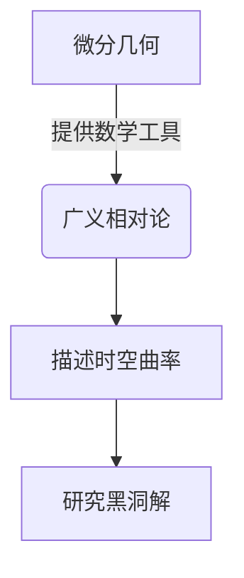

# 微分几何入门与广义相对论：黑洞"无毛"猜想

## 1.背景介绍

在广义相对论中，黑洞是时空的一种极端情形,由于其强大的引力场,任何物质和辐射都无法逃逸出黑洞事件视界。从理论上讲,当一个足够大质量的恒星耗尽其核燃料后,将经历重力坍缩,形成一个奇点——无限曲率的时空奇点。然而,在这个过程中,一个有趣的猜想被提出:黑洞最终状态可能只由其质量、电荷和角动量来描述,这就是著名的"无毛猜想"(no-hair conjecture)。

### 1.1 黑洞的发现与描述

黑洞的概念最早可以追溯到18世纪,当时一些科学家提出了"暗星"的想法,即一种引力如此之强,以至于光都无法逃逸的天体。1915年,爱因斯坦发表了广义相对论理论,为黑洞的存在奠定了理论基础。1963年,罗杰·彭罗斯发现了最终的黑洞解,描述了一个理想化的、旋转的带电黑洞。这个解被称为"克尔黑洞"(Kerr black hole),它只由三个参数来描述:质量、电荷和角动量。

### 1.2 黑洞"无毛"猜想的提出

1967年,约翰·阿诺德·惠勒提出了著名的"无毛猜想"。这一猜想认为,一旦黑洞形成,它最终的状态将只由其质量、电荷和角动量来描述,而其他所有的信息(如物质的分布、电磁场、引力波等)都将被吸收或辐射掉。换句话说,黑洞就像一个"光滑的球体",没有其他的"毛发"。这一猜想引起了广泛的关注和讨论,成为黑洞物理学的一个核心课题。

## 2.核心概念与联系

### 2.1 黑洞的基本概念

- 事件视界(Event Horizon):黑洞的边界,是一个单向膜,任何物质和辐射都可以进入,但无法逃逸。
- 奇点(Singularity):在黑洞的中心,时空曲率无限大的点。
- 克尔黑洞(Kerr Black Hole):描述一个旋转的带电黑洞的精确解。

### 2.2 微分几何与广义相对论

微分几何是研究曲面和更一般的流形的几何性质的数学分支。广义相对论将时空描述为一种四维流形,其曲率由物质和能量的分布决定。因此,微分几何为研究广义相对论中的黑洞提供了强有力的数学工具。



## 3.核心算法原理具体操作步骤

### 3.1 广义相对论场方程

爱因斯坦场方程是广义相对论的核心,它将时空的曲率与物质和能量的分布联系起来:

$$
R_{\mu\nu} - \frac{1}{2}g_{\mu\nu}R = \frac{8\pi G}{c^4}T_{\mu\nu}
$$

其中:

- $R_{\mu\nu}$ 是黎曼张量(Riemann Tensor),描述时空的曲率。
- $R$ 是黎曼张量的曲率标量(Ricci Scalar)。
- $g_{\mu\nu}$ 是度规张量(Metric Tensor),描述时空的度规关系。
- $T_{\mu\nu}$ 是能量动量张量(Stress-Energy Tensor),描述物质和能量的分布。
- $G$ 是牛顿万有引力常数,而 $c$ 是光速。

### 3.2 求解黑洞解的步骤

1. 选择合适的坐标系统和度规形式。
2. 将爱因斯坦场方程化简为一组耦合的非线性偏微分方程。
3. 施加适当的边界条件和对称性约束。
4. 使用数值或解析方法求解这组方程,得到黑洞的度规解。
5. 分析解的性质,如奇点、事件视界、能量-动量等。

这个过程通常非常复杂,需要运用高等微分几何和数值分析的技术。

### 3.3 克尔黑洞的解析解

对于一个理想化的旋转带电黑洞,罗杰·彭罗斯在1963年给出了一个精确的解析解,即克尔黑洞解:

$$
ds^2 = -\left(1-\frac{2Mr}{\Sigma}\right)dt^2 - \frac{4Mar\sin^2\theta}{\Sigma}dtd\phi + \Sigma\left(\frac{dr^2}{\Delta} + d\theta^2\right) + \left(r^2+a^2+\frac{2Mra^2\sin^2\theta}{\Sigma}\right)\sin^2\theta d\phi^2
$$

其中:

- $M$ 是黑洞的质量。
- $a=J/M$ 是黑洞的特性旋转参数,与角动量 $J$ 有关。
- $\Sigma = r^2 + a^2\cos^2\theta$
- $\Delta = r^2 - 2Mr + a^2$

这个解描述了一个旋转的带电黑洞的时空几何,并且只由质量 $M$ 和角动量 $a$ 两个参数决定,从而支持了"无毛猜想"。

## 4.数学模型和公式详细讲解举例说明

### 4.1 黑洞的奇性和事件视界

在克尔黑洞解中,存在两个特殊的径向坐标值:

- $r_+ = M + \sqrt{M^2 - a^2}$,外事件视界半径。
- $r_- = M - \sqrt{M^2 - a^2}$,内事件视界半径。

当 $r=r_+$ 时,度规的无穷大性质表明存在一个事件视界。而当 $r=r_-$ 时,度规发生奇性,这对应于一个奇点。

### 4.2 黑洞的熵和热力学

通过研究黑洞的准经典行为,物理学家发现黑洞具有与热力学系统类似的性质。例如,黑洞的面积 $A$ 与其熵 $S$ 成正比:

$$
S = \frac{A}{4}
$$

其中,A是黑洞事件视界的面积。这种关系被称为"黑洞熵公式",是黑洞热力学的重要发现。

### 4.3 黑洞的辐射和虚拟粒子对

1974年,斯蒂芬·霍金发现黑洞并非是完全黑体,它实际上会发射一种"霍金辐射"。这是因为在黑洞事件视界附近,虚拟粒子对不断地产生和湮灭。如果一个粒子进入黑洞而另一个逃逸,就形成了一种热辐射。

这一现象可以用量子场论和微分几何相结合来描述。虚拟粒子对的产生是量子效应,而逃逸粒子的运动则受到黑洞时空曲率的影响。

$$
\Gamma \propto \exp\left(-\frac{8\pi M^2}{E}\right)
$$

上式给出了黑洞发射粒子的概率,与黑洞质量 $M$ 和粒子能量 $E$ 有关。这表明,质量越小的黑洞辐射越剧烈。

## 5.项目实践:代码实例和详细解释说明

为了更好地理解和可视化黑洞的性质,我们可以使用Python和一些数值计算库(如NumPy和SciPy)来模拟和绘制黑洞的时空几何。以下是一个简单的示例,用于计算和绘制克尔黑洞的事件视界:

```python
import numpy as np
import matplotlib.pyplot as plt

# 黑洞参数
M = 1.0  # 黑洞质量
a = 0.5  # 黑洞角动量参数

# 定义克尔度规
def kerr_metric(r, theta):
    sigma = r**2 + a**2 * np.cos(theta)**2
    delta = r**2 - 2*M*r + a**2
    return sigma, delta

# 计算事件视界半径
def event_horizon(M, a):
    r_plus = M + np.sqrt(M**2 - a**2)
    return r_plus

# 绘制事件视界
r = np.linspace(event_horizon(M, a), 10, 100)
theta = np.linspace(0, np.pi, 100)
r_mesh, theta_mesh = np.meshgrid(r, theta)

sigma, delta = kerr_metric(r_mesh, theta_mesh)
event_horizon_radius = event_horizon(M, a)

fig = plt.figure(figsize=(8, 6))
ax = fig.add_subplot(111, projection='3d')
ax.plot_surface(event_horizon_radius*np.sin(theta_mesh)*np.cos(phi), 
                event_horizon_radius*np.sin(theta_mesh)*np.sin(phi),
                event_horizon_radius*np.cos(theta_mesh), alpha=0.5)
ax.set_xlabel('X')
ax.set_ylabel('Y')
ax.set_zlabel('Z')
ax.set_title('Kerr Black Hole Event Horizon')
plt.show()
```

在这个示例中,我们首先定义了克尔度规的相关函数,然后计算了事件视界的半径。接下来,我们使用NumPy创建了一个网格,并在该网格上计算了克尔度规的值。最后,我们使用Matplotlib的3D绘图功能绘制了事件视界的表面。

通过调整黑洞的质量和角动量参数,您可以观察到事件视界的形状和大小的变化。这种可视化有助于更好地理解黑洞的几何结构。

## 6.实际应用场景

黑洞"无毛"猜想及其相关理论不仅在基础物理学领域具有重要意义,而且在许多实际应用场景中也扮演着关键角色:

1. **引力波探测**: 通过检测双黑洞合并过程中释放的引力波信号,我们可以验证广义相对论的预言,并测量黑洞的质量和自旋等参数。这为检验"无毛"猜想提供了宝贵的实验数据。

2. **活动星系核**:许多活动星系核的能量来源被认为是超大质量黑洞。研究这些黑洞的性质有助于我们理解星系的形成和演化过程。

3. **X射线双星系统**:在这些系统中,一个紧密的双星系统中的一颗星被伴星吸积,形成了一个临时黑洞。研究这种黑洞的辐射特性有助于验证相对论效应。

4. **计算机模拟**:通过数值模拟黑洞的形成和演化过程,我们可以更好地理解它们的性质,并预测一些新的现象,如黑洞合并时的引力波辐射模式。

5. **量子计算**:一些研究人员提出利用黑洞的奇特性质来构建量子计算机。虽然这仍处于理论探索阶段,但它展示了黑洞物理学在未来技术中的潜在应用。

总的来说,黑洞"无毛"猜想及其相关理论不仅是基础物理学的前沿课题,而且对于我们探索宇宙奥秘、开发新技术都具有重要意义。

## 7.工具和资源推荐

如果您希望深入学习微分几何、广义相对论和黑洞物理学,以下是一些推荐的工具和资源:

1. **数学工具**:
   - Wolfram Mathematica: 强大的符号计算和可视化工具,适用于微分几何和广义相对论的计算和模拟。
   - SageMath: 一款开源的数学软件系统,提供了广泛的数学计算功能。
   - SymPy: Python中的符号数学库,可用于符号计算和微分几何等领域。

2. **数值计算工具**:
   - Python科学计算生态系统: NumPy、SciPy、Matplotlib等库可用于数值计算、可视化和模拟。
   - GNU Octave: 一款免费的数值计算软件,类似于MATLAB。
   - Black Hole Perturbation Toolkit: 专门用于研究黑洞扰动的开源软件包。

3. **在线课程和教材**:
   - Coursera上的"广义相对论"课程(由斯坦福大学开设)
   - edX上的"微分几何入门"课程(由麻省理工学院开设)
   - "Gravitation"一书(作者:Charles W. Misner, Kip S. Thorne,