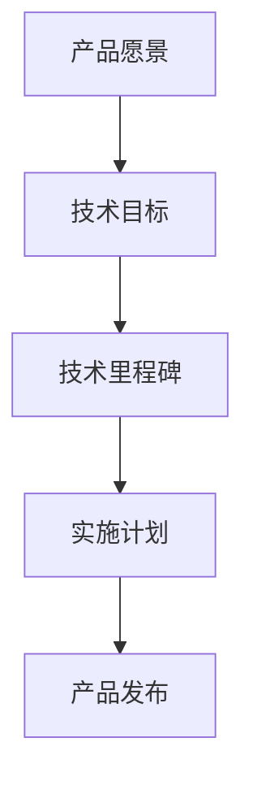
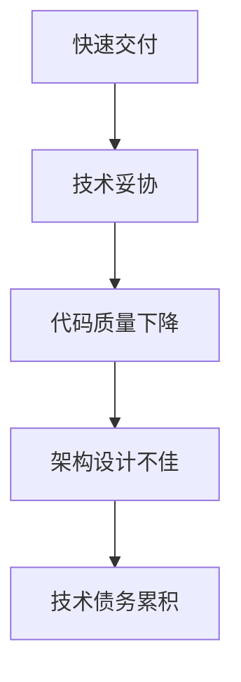
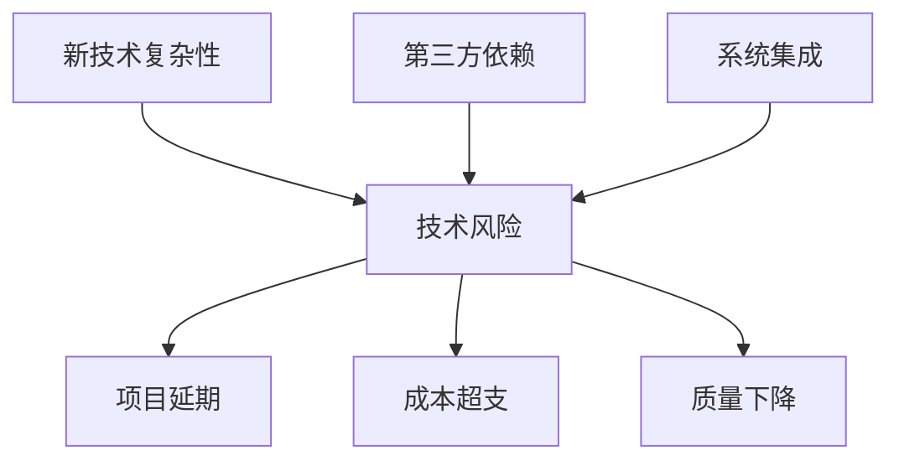
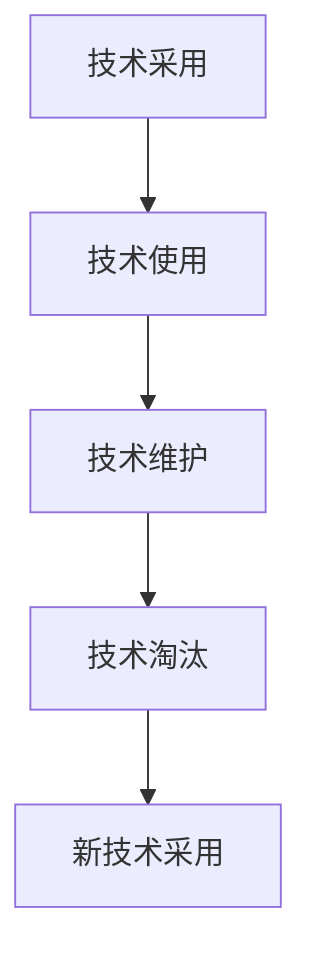
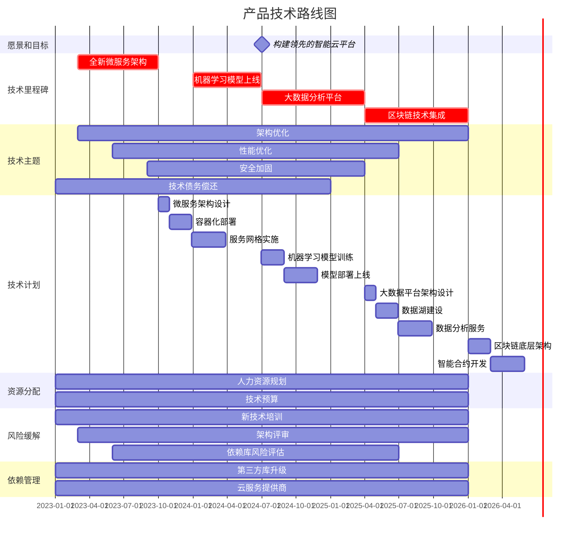

# 怎样具体规划并实施软件产品技术路线图，紧跟前沿技术趋势，实现产品商业化和规模化

## 1.背景介绍

### 1.1 软件产品技术路线图的重要性

在当今快节奏的科技发展时代，软件产品的生命周期越来越短。要想在激烈的市场竞争中立于不败之地，企业必须紧跟前沿技术趋势，不断创新和迭代产品。制定清晰的软件产品技术路线图对于指导产品发展方向、管理技术债务、规避技术风险至关重要。

一个合理的技术路线图不仅能够确保产品具备先进的技术架构和功能，还能帮助企业高效分配研发资源、协调跨部门协作、把控开发进度，最终实现产品的商业化和规模化。

### 1.2 技术路线图规划的挑战

然而，制定高质量的技术路线图并非易事。它需要对市场需求、技术发展趋势、竞争对手动向有全面深入的了解,并结合企业自身的战略目标、技术实力、资源条件进行综合考量。此外,随着产品复杂度的增加和技术栈的日益庞大,技术债务和技术风险也在不断累积,给路线图规划带来了巨大挑战。

## 2.核心概念与联系

规划和实施软件产品技术路线图涉及多个关键概念,它们相互关联、环环相扣。我们先来理解这些核心概念:

### 2.1 技术路线图(Technical Roadmap)

技术路线图是一种战略规划工具,用于描绘产品未来的技术发展蓝图。它通常包括产品的愿景、目标、技术里程碑、实施计划等内容,为产品研发提供指导方向。

### 2.2 技术债务(Technical Debt)

技术债务指的是在软件开发过程中,为了加快开发速度或降低短期成本而做出的一些妥协或权衡,导致代码质量下降、架构设计不佳等技术问题的累积。如果不及时偿还这些债务,将会阻碍产品的长期发展。

### 2.3 技术风险(Technical Risk)

技术风险是指在产品开发和运维过程中,可能遇到的各种技术相关的不确定性因素,如新技术的复杂性、第三方依赖库的更新、系统集成问题等,这些风险可能会导致项目延期、成本超支或质量下降。

### 2.4 技术生命周期管理(Technology Lifecycle Management)

技术生命周期管理是一种系统化的方法,用于管理技术的采用、使用、维护和淘汰等全生命周期。它有助于企业合理规划技术投资,避免过度依赖即将被淘汰的技术,并及时引入创新技术以保持竞争力。

## 3.核心算法原理具体操作步骤

规划和实施软件产品技术路线图是一个循环迭代的过程,需要遵循一定的原理和步骤。下面我们来详细介绍这一流程:

### 3.1 形成产品愿景和战略目标

首先,我们需要明确产品的长期愿景和战略目标。这是制定技术路线图的出发点和基础,它将指导产品的技术发展方向。

在这一步,我们需要回答以下几个关键问题:

- 我们的产品要解决什么问题?为谁服务?
- 我们希望产品在未来3-5年内达到什么样的发展阶段?
- 我们的核心竞争力是什么?如何保持领先优势?
- 我们的商业模式是什么?如何实现盈利和规模化?

### 3.2 分析市场需求和技术趋势

接下来,我们需要深入分析市场需求和技术发展趋势,了解用户的痛点和期望,把握行业的创新动向。这将为确定技术路线图的优先级提供依据。

可以采取的分析方法包括但不限于:

- 用户反馈分析:收集并分析用户对产品的反馈、评论和建议
- 竞品分析:研究竞争对手的产品功能、技术架构等优缺点
- 技术论坛关注:密切关注业内技术社区的热门话题和讨论
- 行业报告研读:购买并研读权威机构发布的行业报告和预测
- 专家访谈:邀请行业专家或资深从业者进行深入访谈

### 3.3 评估现有技术状况

在规划未来的技术路线图之前,我们需要对产品的现有技术架构、代码质量、技术债务等状况进行全面评估,找出潜在的风险点和瓶颈。

可以从以下几个方面入手:

- 代码质量审计:使用静态代码分析工具检查代码质量
- 架构评审:由架构师领导的架构评审会议,识别架构缺陷
- 性能测试:进行压力测试、负载测试等,评估系统性能表现
- 技术债务评估:量化现有的技术债务,制定还债计划
- 安全审计:检查系统是否存在安全漏洞和风险

### 3.4 制定技术路线图

根据前面的分析和评估结果,我们可以开始制定技术路线图了。技术路线图通常包含以下几个部分:

1. **愿景和目标**:阐述产品的长期愿景和技术目标
2. **技术里程碑**:列出需要实现的关键技术里程碑及其时间节点
3. **技术主题**:划分不同的技术主题领域,如架构、性能、安全等
4. **技术计划**:详细说明每个技术主题下的具体计划和任务
5. **资源分配**:估算所需的人力、财力等资源,制定资源分配方案
6. **风险缓解**:列出潜在的技术风险,并提出应对措施
7. **依赖管理**:列出对外部依赖库、服务的依赖,制定管理计划

以下是一个技术路线图的示例:

### 3.5 实施和持续优化

制定出技术路线图后,我们需要具体落实执行。这个过程中,需要注意以下几点:

- **分阶段实施**:根据路线图拆分为多个阶段,每个阶段都有明确的目标和交付物
- **跨部门协作**:技术部门需要与产品、运营等部门紧密协作,确保目标一致
- **定期评估**:针对实施进度、质量、成本等进行定期评估,及时调整计划
- **持续优化**:根据新的市场需求、技术发展趋势及时优化和调整路线图
- **技术债务管理**:建立技术债务跟踪机制,制定还债计划,防止债务过度累积
- **风险缓解**:密切关注技术风险,并采取有效的缓解措施

## 4.数学模型和公式详细讲解举例说明

在规划和实施技术路线图的过程中,我们可以借助一些数学模型和公式来量化和优化决策。下面我们介绍几个常用的模型:

### 4.1 技术债务模型

技术债务是无法避免的,但我们需要控制在可控范围内。Martin Fowler提出了一个简单但有效的技术债务模型:

$$
技术债务利息 = 技术债务本金 \times 利率 \times 时间
$$

其中:

- 技术债务本金指代码质量下降、架构设计不佳等带来的技术问题
- 利率指这些问题给开发、测试、运维等工作带来的额外工作量
- 时间指这些问题被放任存在的时间

通过这个公式,我们可以估算技术债务的"利息成本",从而权衡是继续忍受债务还是偿还债务更加合理。

### 4.2 技术投资回报模型

在制定技术路线图时,我们需要评估技术投资的回报率。一种简单的模型是:

$$
投资回报率 = \frac{预期收益-投资成本}{投资成本}
$$

其中:

- 预期收益可以是直接的经济收益,也可以是间接的效益(如提高效率、降低风险等)
- 投资成本包括人力、硬件、软件、培训等各项支出

通过计算不同技术方案的投资回报率,我们可以优先选择回报率更高的方案。

### 4.3 技术生命周期模型

技术的生命周期通常遵循"导入 -> 成长 -> 成熟 -> 衰退 -> 淘汰"的过程。我们可以使用贝尔曲线(Bell Curve)模型来描述这一过程:

$$
f(x) = \frac{1}{\sigma\sqrt{2\pi}}e^{-\frac{(x-\mu)^2}{2\sigma^2}}
$$

其中:

- $x$ 表示时间
- $\mu$ 表示曲线的峰值点(技术成熟期)
- $\sigma$ 表示曲线的宽度(技术生命周期长度)

通过分析技术的生命周期曲线,我们可以判断现有技术是否即将过时,以及新技术是否值得投资。

### 4.4 示例:技术债务评估

假设我们的产品代码库中存在以下技术债务:

- 遗留的未测试代码: 20,000 行
- 违反编码标准的代码: 15,000 行
- 复杂的面条代码: 10,