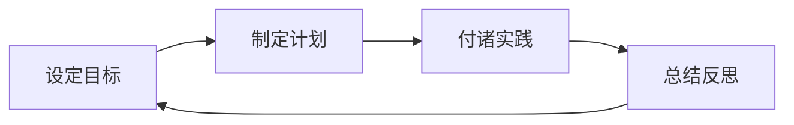

# 怎样培养优秀的沟通协调能力、领导能力、组织能力、控制能力、分析判断能力、组织能力

## 1.背景介绍
在现代企业管理和团队协作中,个人的综合素质和能力发挥着至关重要的作用。其中沟通协调能力、领导能力、组织能力、控制能力、分析判断能力、组织能力是每个优秀管理者和员工必备的核心竞争力。这些能力不仅能帮助个人更好地适应工作环境,提升工作绩效,而且对团队的高效运转、企业的可持续发展都有着深远影响。

然而,许多人对如何系统地培养和提升这些能力还缺乏清晰的认识和切实可行的方法。本文将从概念阐述、能力模型、实践方法等方面,深入探讨培养优秀沟通协调能力、领导能力、组织能力、控制能力、分析判断能力、组织能力的有效途径,为个人职业发展和企业人才培养提供参考。

## 2.核心概念与联系

### 2.1 沟通协调能力
沟通协调能力是指在团队合作中,通过有效的语言表达、倾听理解、疏导关系等方式,促进信息交流、消除误解、化解矛盾,最终达成一致目标的能力。它是团队协作的基础,对于提升团队凝聚力、工作效率至关重要。

### 2.2 领导能力
领导能力是指运用个人影响力,激励和引导他人为实现组织目标而努力工作的能力。优秀的领导者能够制定战略规划、把握全局、科学决策、凝聚人心,带领团队克服困难、创造佳绩。

### 2.3 组织能力
组织能力是指通过合理配置人力、物力、财力等资源,有序安排各项任务和活动,确保目标顺利实现的能力。它包括计划、执行、协调、控制等环节,是管理工作的核心内容之一。

### 2.4 控制能力
控制能力是指对各项工作进行监督、检查、评估和反馈,及时发现偏差并采取纠正措施,确保实际执行与预期目标相一致的能力。它贯穿管理的全过程,对于提高工作质量和效率至关重要。

### 2.5 分析判断能力 
分析判断能力是指运用逻辑思维和专业知识,对复杂问题进行分解、比较、归纳和演绎,作出正确判断和决策的能力。它是管理者和专业人士必备的基本功,直接影响工作的科学性和前瞻性。

### 2.6 能力间的关系
以上几种能力相辅相成、缺一不可:
- 沟通是领导的前提和基础
- 领导需要组织能力作为支撑
- 组织离不开有效的控制
- 分析判断贯穿领导和管理的方方面面

只有系统地培养各项能力,才能形成优势互补、相得益彰的良性循环。

## 3.核心原理与操作步骤

### 3.1 沟通协调能力的培养
1. 提高表达能力:学习演讲、写作等语言表达技巧,注重逻辑性、层次性、说服力。
2. 强化倾听意识:保持开放心态,尊重对方,站在对方角度思考问题。 
3. 把握沟通策略:根据对象、情景灵活调整沟通方式,必要时寻求第三方协助。
4. 学会疏导情绪:遇到分歧冲突时,学会控制情绪,理性分析,化干戈为玉帛。

### 3.2 领导能力的培养
1. 树立领导意识:主动承担责任,敢于担当,成为他人榜样。
2. 提升领导艺术:善于授权激励,因材施教,营造良好氛围。 
3. 注重团队建设:甄选人才,优化分工,促进协作,形成合力。
4. 加强战略思维:立足全局,把握大势,制定长远规划,带领团队不断进步。

### 3.3 组织能力的培养
1. 夯实理论基础:系统学习管理学、组织行为学等专业知识,丰富理论素养。
2. 强化执行意识:制定周密计划,落实到人、到事、到位,确保高效执行。
3. 优化资源配置:根据任务需求,合理调配人员、设备、资金等,做到物尽其用。
4. 注重协调沟通:统筹兼顾,及时协调解决执行中的问题,确保各环节紧密衔接。

### 3.4 控制能力的培养
1. 明确控制目标:根据组织目标,制定科学、可行的控制指标和标准。
2. 完善控制体系:构建全方位、多层次的监督机制,对关键环节实施重点控制。
3. 加强过程管控:对计划执行情况进行动态跟踪,及时纠偏,消除潜在风险。
4. 重视反馈改进:客观评价控制效果,总结经验教训,持续优化控制措施。

### 3.5 分析判断能力的培养
1. 拓展知识视野:广泛涉猎各领域知识,培养全局观念和系统思维。 
2. 训练逻辑思辨:学习各类思维工具,如5W2H、鱼骨图等,提高逻辑分析能力。
3. 加强实践锻炼:多参与实际问题的分析和决策,在实践中积累经验、提升水平。
4. 学习前人经验:向优秀管理者学习,借鉴他们的分析思路和决策智慧。

## 4.能力培养模型与公式

### 4.1 能力培养模型
基于PDCA(计划-执行-检查-改进)循环,我们可以构建一个简洁、实用的能力培养模型:

该模型强调目标导向、系统规划、勇于实践、善于反思,通过循环往复、螺旋上升,不断提升各项能力。

### 4.2 能力培养公式
借鉴物理学中的功率公式,我们可以形象地描述能力培养的关键要素:

$能力=\frac{成果}{时间}=\frac{目标 \times 方法}{时间}$

即能力的提升一方面取决于目标的高度和方法的科学性,另一方面需要持之以恒的时间投入,切不可急于求成、半途而废。

## 5.项目实践:管理培训营
为帮助企业系统培养管理人才,我们设计了一套完整的"管理培训营"项目。

### 5.1 项目目标
- 全面提升学员的沟通协调、领导、组织、控制、分析判断等管理能力
- 帮助学员树立现代管理理念,掌握实用管理技巧,胜任企业中高层管理岗位

### 5.2 项目内容
- 管理理论学习:邀请知名管理学专家授课,系统学习管理学原理和前沿理念
- 案例研讨:选取优秀企业管理案例,组织学员进行深入研讨,培养全局思维和决策能力  
- 技能训练:开展沟通、领导、执行、控制等专项技能训练,提升学员实操水平
- 团队拓展:设计丰富的团队活动,锻炼学员组织协调能力,增强团队凝聚力
- 实战演练:开展模拟经营、项目管理等实战演练,检验学员管理能力,及时查漏补缺

### 5.3 项目成果
- 理论扎实:掌握系统的管理学知识,具备宏观视野和前瞻意识
- 技能娴熟:具备出色的沟通、领导、组织、控制、决策等管理技能 
- 实战经验:积累丰富的团队管理和项目管理实践经验,能够独当一面
- 综合素质:形成积极向上的职业心态,树立"以人为本、追求卓越"的价值理念

## 6.实际应用场景

优秀的沟通协调、领导、组织、控制、分析判断能力在企业管理的方方面面都有广泛应用,例如:

- 跨部门项目管理:需要协调不同部门、处理复杂关系,统筹资源、控制进度、把握全局
- 团队绩效管理:需要合理设定目标、科学分配任务、有效激励团队、开展绩效考核
- 企业战略决策:需要洞察行业趋势、分析自身优劣、权衡各种方案、制定长远规划
- 突发事件应对:需要快速分析情况、果断下达指令、有序组织行动、严密控制过程
- 企业文化建设:需要以身作则、感召团队、形成共识、营造良好氛围

可以说,这些能力是现代企业管理的核心要义,对管理者的要求越来越高。

## 7.工具和资源推荐

为了更好地培养和提升相关能力,我们推荐以下实用工具和资源:

- 管理学经典著作:《管理的实践》、《卓有成效的管理者》、《第五项修炼》等
- 在线学习平台:LinkedIn Learning、Coursera、edX等,提供优质的管理类课程
- 思维导图软件:XMind、MindManager等,帮助梳理问题、分析逻辑、拓展思路
- 项目管理工具:Microsoft Project、Jira等,实现对项目各环节的有效管控 
- 领导力评估工具:MBTI、DISC等性格测试,帮助了解自我、扬长避短
- 商业模拟游戏:《模拟人生》、《商业大亨》等,在虚拟环境中锻炼管理决策能力

充分利用这些资源,必将事半功倍,使能力提升更加高效、系统、持久。

## 8.总结:未来发展趋势与挑战

展望未来,随着商业环境日趋复杂,市场竞争日益激烈,对管理者的能力要求也必将不断提高:

- 全球化趋势下,管理者需要具备跨文化沟通和全球化运营的能力
- 数字化时代下,管理者需要熟悉信息技术,驾驭海量数据,洞察发展机遇
- 不确定性加剧下,管理者需要更强的应变能力、创新精神和学习意愿
- 社会责任日益受重视,管理者需要平衡经济、社会、环境效益,践行可持续发展

因此,管理者必须与时俱进,加强学习,勇于创新,在解决问题、应对挑战中不断磨砺、成长,成为引领企业、社会进步的中坚力量。

## 9.附录:常见问题与解答

问:如何在日常工作中有针对性地提升管理能力?
答:可以通过以下途径:
- 主动承担具有挑战性的任务,在实践中强化能力 
- 向优秀同事学习,虚心请教,借鉴他人经验
- 积极参与培训、研讨等学习活动,与他人切磋交流
- 加强自我反思,总结得失,制定改进措施

问:如何处理管理工作中的矛盾冲突?
答:可以遵循以下原则:
- 冷静分析矛盾成因,明确问题的本质
- 站在对方立场思考,设身处地为他人着想
- 本着解决问题的态度,而非针对个人
- 寻求双方都能接受的解决方案,达成共赢
- 必要时寻求第三方调解,打破僵局

问:如何提高团队管理的效果?
答:需要注重以下几点:  
- 树立"以人为本"的理念,关心、信任、尊重团队成员
- 根据团队成员特点,合理分工,发挥各自所长
- 营造开放、互信的沟通氛围,消除误解,增进理解
- 适时给予表扬鼓励,调动积极性,激发潜力
- 以身作则,起到模范带头作用,形成良好团队文化

问:新晋管理者应该如何尽快适应角色转变?
答:建议采取以下措施:
- 尽快熟悉业务流程、规章制度,全面了解部门职能 
- 花时间与下属沟通,建立良好关系,