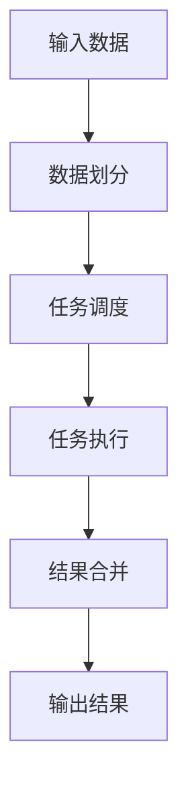

# 批处理 原理与代码实例讲解

## 1.背景介绍

批处理(Batch Processing)是指将大量数据或任务作为一个批次进行处理,而不是一次处理一个。这种处理方式可以提高系统的效率和吞吐量,因为它可以最大限度地利用计算机资源,减少了频繁启动和终止进程所带来的开销。

批处理广泛应用于各种领域,例如:

- 金融行业的账单处理、交易处理和风险分析
- 制造业的库存管理、生产计划和质量控制
- 科学计算中的大规模数据处理和模拟
- Web应用程序中的日志分析和报告生成

随着大数据时代的到来,批处理在处理海量数据方面发挥着重要作用。它可以有效地处理TB甚至PB级别的数据,满足各种数据密集型应用的需求。

## 2.核心概念与联系

### 2.1 批处理的核心概念

1. **批次(Batch)**: 指需要作为一个整体进行处理的一组数据或任务。
2. **作业(Job)**: 批处理系统中的基本执行单元,通常由一个或多个步骤(Step)组成。
3. **步骤(Step)**: 作业中的最小执行单元,通常对应一个程序或脚本。
4. **作业控制语言(Job Control Language, JCL)**: 用于定义和控制批处理作业的语言。
5. **作业调度器(Job Scheduler)**: 负责管理和执行批处理作业的系统组件。

### 2.2 批处理与其他处理模式的关系

1. **批处理 vs 实时处理(Online Transaction Processing, OLTP)**:
   - 批处理关注吞吐量,适合处理大量数据;实时处理关注响应时间,适合交互式应用。
2. **批处理 vs 流处理(Stream Processing)**:
   - 批处理以离线方式处理有限数据集;流处理实时处理无限数据流。
3. **批处理 vs 微批处理(Micro-Batch Processing)**:
   - 批处理以较大的时间间隔处理数据;微批处理以较小的时间间隔处理数据,介于批处理和流处理之间。

## 3.核心算法原理具体操作步骤

批处理系统的核心算法通常包括以下几个步骤:



1. **输入数据**: 从各种数据源(如文件、数据库、消息队列等)获取需要处理的原始数据。
2. **数据划分**: 将输入数据划分为多个数据块或分区,以便并行处理。常用的数据划分技术包括哈希划分、范围划分和随机划分等。
3. **任务调度**: 根据数据划分的结果,将处理任务分发到多个计算节点上执行。任务调度器需要考虑负载均衡、容错性和资源利用率等因素。
4. **任务执行**: 在各个计算节点上并行执行分配的任务,处理对应的数据块。任务执行可能涉及多个步骤,如数据清洗、转换、聚合等。
5. **结果合并**: 将各个计算节点上的处理结果收集并合并,形成最终的输出结果。
6. **输出结果**: 将合并后的结果输出到指定的目标位置,如文件系统、数据库或消息队列等。

在实际应用中,批处理系统还需要考虑容错性、可靠性、监控和管理等方面的需求,以确保数据处理的正确性和效率。

## 4.数学模型和公式详细讲解举例说明

在批处理系统中,常见的数学模型和公式包括:

1. **数据划分模型**:
   - 哈希划分: 根据数据的某个键(Key)计算哈希值,将数据划分到不同的分区。
     $$
     partition = hash(key) \% numPartitions
     $$
     其中,`hash`是哈希函数,`numPartitions`是分区数量。
   - 范围划分: 根据数据的某个键值的范围,将数据划分到不同的分区。
     $$
     partition = \left\lfloor\frac{key - minKey}{rangeSize}\right\rfloor
     $$
     其中,`minKey`是键值的最小值,`rangeSize`是每个分区覆盖的键值范围大小。

2. **负载均衡模型**:
   - 加权轮询调度: 根据计算节点的权重分配任务,权重越高的节点分配到的任务就越多。
     $$
     P(node_i) = \frac{w_i}{\sum_{j=1}^{n}w_j}
     $$
     其中,`P(node_i)`是分配给节点`i`的任务比例,`w_i`是节点`i`的权重,`n`是节点总数。

3. **容错模型**:
   - 复制备份: 为关键数据和中间结果创建多个副本,以防止单点故障导致数据丢失。
     $$
     reliability = 1 - (1 - p)^r
     $$
     其中,`reliability`是可靠性,`p`是单个副本的可靠性,`r`是副本数量。

这些数学模型和公式为批处理系统的设计和优化提供了理论基础,有助于提高系统的性能、可靠性和容错能力。

## 5.项目实践:代码实例和详细解释说明

以下是一个使用Python实现的简单批处理示例,用于统计文本文件中单词出现的频率。

```python
import os
from collections import Counter
from multiprocessing import Pool

def count_words(file_path):
    """统计单个文件中单词出现的频率"""
    word_counts = Counter()
    with open(file_path, 'r', encoding='utf-8') as f:
        for line in f:
            words = line.split()
            word_counts.update(words)
    return word_counts

def merge_counts(counts):
    """合并多个文件的单词计数结果"""
    merged = Counter()
    for count in counts:
        merged += count
    return merged

def batch_word_count(dir_path):
    """批量统计目录中所有文本文件的单词频率"""
    file_paths = [os.path.join(dir_path, f) for f in os.listdir(dir_path) if f.endswith('.txt')]
    
    # 使用多进程并行处理文件
    with Pool() as pool:
        counts = pool.map(count_words, file_paths)
    
    # 合并各个文件的单词计数结果
    merged_counts = merge_counts(counts)
    
    # 输出合并后的结果
    for word, count in merged_counts.most_common():
        print(f"{word}: {count}")

if __name__ == '__main__':
    batch_word_count('text_files')
```

代码解释:

1. `count_words`函数用于统计单个文本文件中单词出现的频率。它使用`collections.Counter`来计数单词,并返回一个`Counter`对象。
2. `merge_counts`函数用于合并多个文件的单词计数结果。它将多个`Counter`对象相加,得到合并后的结果。
3. `batch_word_count`函数是主要的批处理函数。它首先获取指定目录中所有文本文件的路径列表。
4. 使用Python的`multiprocessing`模块创建一个进程池,并使用`pool.map`函数并行执行`count_words`函数,统计每个文件的单词频率。
5. 调用`merge_counts`函数,将各个文件的单词计数结果合并。
6. 最后,输出合并后的单词频率结果。

该示例展示了如何使用Python实现批处理,包括并行处理、中间结果合并和最终结果输出等步骤。您可以根据实际需求,修改代码以处理其他类型的数据和任务。

## 6.实际应用场景

批处理在各个领域都有广泛的应用,以下是一些典型的应用场景:

1. **日志处理**: Web服务器、应用程序和系统日志通常会产生大量的日志数据,需要进行批量处理和分析,以了解系统运行状况、用户行为模式和潜在问题等。

2. **数据仓库构建**: 从各种数据源(如数据库、文件、API等)提取数据,经过清洗、转换和加载(ETL)过程,最终加载到数据仓库中,为数据分析和商业智能应用提供支持。

3. **科学计算和模拟**: 在气象预报、基因组学、物理模拟等领域,经常需要对海量数据进行批量处理和计算,以获得所需的模拟结果或预测结果。

4. **风险分析和欺诈检测**: 在金融、保险等行业,需要对大量交易数据进行批量分析,以识别潜在的风险和欺诈行为。

5. **推荐系统**: 电子商务网站和在线视频平台等需要基于用户的历史行为数据,批量构建推荐模型,为用户提供个性化的推荐内容。

6. **大数据处理**: 随着大数据时代的到来,批处理成为处理TB甚至PB级别海量数据的重要手段,广泛应用于各种大数据应用场景中。

总的来说,批处理适用于需要高吞吐量、离线处理大量数据的场景,可以有效利用计算资源,提高数据处理的效率和可扩展性。

## 7.工具和资源推荐

在实际开发和部署批处理系统时,可以利用各种工具和框架来简化开发过程、提高系统的可靠性和可扩展性。以下是一些常用的工具和资源:

1. **Apache Hadoop**: 一个分布式计算框架,支持批处理、流处理和机器学习等多种应用场景。Hadoop生态系统包括HDFS、MapReduce、Yarn等核心组件,以及Hive、Pig、Spark等上层工具。

2. **Apache Spark**: 一个快速、通用的集群计算框架,支持批处理、流处理、机器学习和图计算等多种工作负载。Spark提供了高级API,如RDD、DataFrame和Dataset,可以用多种语言(如Scala、Java、Python和R)进行编程。

3. **Apache Flink**: 一个分布式流处理框架,支持有状态计算和准确一次的语义。Flink可以用于批处理、流处理和机器学习等场景。

4. **Apache Beam**: 一个统一的批处理和流处理编程模型,支持多种运行时环境,如Apache Spark、Apache Flink和Google Cloud Dataflow。

5. **Luigi**: 一个Python库,用于构建批处理管道,支持依赖关系解析、可视化和故障恢复等功能。

6. **Airflow**: 一个流行的工作流管理系统,用于编排复杂的批处理工作流程,支持调度、监控和日志记录等功能。

7. **Apache Kafka**: 一个分布式流处理平台,常用于构建实时数据管道,可以与批处理系统集成,实现近乎实时的数据处理。

8. **云服务**: 各大云服务提供商(如AWS、Azure和GCP)都提供了批处理相关的服务和产品,如Amazon EMR、Azure Batch和Google Cloud Dataflow等,可以简化批处理系统的部署和管理。

选择合适的工具和框架需要根据具体的应用场景、数据量、团队技能等因素进行权衡。同时,也可以结合开源社区和官方文档,获取更多的学习资源和最佳实践。

## 8.总结:未来发展趋势与挑战

批处理技术在未来仍将扮演重要角色,但也面临一些新的发展趋势和挑战:

1. **混合处理架构**: 将批处理与流处理相结合,形成混合处理架构,以满足不同时间和延迟要求的数据处理需求。例如,Apache Spark和Apache Flink等框架都支持批处理和流处理的统一编程模型。

2. **无服务器计算**: 利用无服务器计算(Serverless Computing)技术,如AWS Lambda和Google Cloud Functions,实现更加灵活和按需的批处理任务执行,避免过度或欠配置资源的问题。

3. **机器学习和人工智能**: 将批处理与机器学习和人工智能技术相结合,用于构建智能化的数据处理管道,实现自动化的特征工程、模型训练和模型部署等功能。

4. **流数据处理**: 随着物联网、实时分析等应用场景的兴起,对流数据处理的需求越来越高,批处理系统需要与流处理系统紧密集成,实现近乎实时的数据处理。

5. **数据安全和隐私保护**: 随着数据隐私法规的不断加强,批处