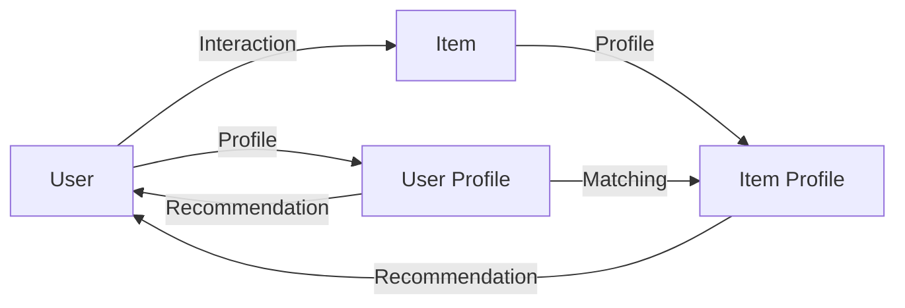

# 推荐系统原理与代码实战案例讲解

## 1.背景介绍

### 1.1 推荐系统的兴起与发展
推荐系统作为一种信息过滤技术,在互联网信息爆炸式增长的今天,已经成为各大互联网公司不可或缺的核心技术之一。它通过分析用户的历史行为数据,自动为用户推荐可能感兴趣的信息和商品,从海量的信息中帮助用户快速发现感兴趣的内容,提升用户体验。

最早的推荐系统可以追溯到上世纪90年代中期。1994年,Resnick等人提出了协同过滤(Collaborative Filtering)的概念[1],开创了个性化推荐的先河。此后,推荐系统技术不断发展,逐渐从学术界走向工业界。亚马逊、Netflix、YouTube等互联网巨头纷纷将推荐系统应用到自己的产品中,极大提升了用户满意度和公司收益。

### 1.2 推荐系统的应用场景
如今,推荐系统已广泛应用于各个领域,典型的应用场景包括:

1. 电子商务网站:如亚马逊、淘宝等,为用户推荐可能感兴趣的商品。
2. 视频网站:如YouTube、Netflix等,为用户推荐个性化的视频内容。
3. 新闻资讯:如今日头条、腾讯新闻等,根据用户兴趣推荐新闻文章。 
4. 社交网络:如Facebook、微博等,推荐用户可能感兴趣的好友、话题等。
5. 音乐平台:如Spotify、网易云音乐等,为用户推荐个性化歌单。

可以说,推荐系统已经渗透到互联网应用的方方面面,成为提升用户粘性、促进业务增长的利器。

### 1.3 推荐系统面临的挑战
尽管推荐系统取得了巨大成功,但仍面临诸多挑战:

1. 冷启动问题:对于新用户和新物品,由于缺乏足够的历史交互数据,推荐质量往往较差。
2. 数据稀疏性:现实中的用户-物品交互矩阵往往非常稀疏,给推荐带来困难。
3. 推荐的多样性:推荐结果要兼顾相关性和多样性,避免同质化问题。
4. 实时性和可扩展性:要求推荐系统能快速响应海量用户的请求,并具备良好的可扩展性。

这些挑战需要研究者和工程师们不断探索,优化推荐算法和系统架构,以给用户带来更好的推荐体验。

## 2.核心概念与联系

### 2.1 用户(User)
推荐系统中的用户,代表接受推荐服务的主体。通常有一个唯一的用户ID,以及相关的属性信息,如性别、年龄、职业等。

### 2.2 物品(Item)
物品是被推荐的对象,可以是商品、电影、新闻等。同样有唯一的物品ID,以及相关的属性信息,如类别、关键词等。

### 2.3 用户-物品交互(Interaction)
用户和物品之间的交互行为,是推荐系统的核心数据来源。常见的交互类型有:

- 显式反馈:如评分、点赞/踩等
- 隐式反馈:如点击、购买、收藏等

通过分析用户的历史交互数据,可以挖掘用户的兴趣偏好,从而做出个性化推荐。

### 2.4 用户画像(User Profile)
用户画像是对用户特征的全面刻画,包括用户的人口统计学属性、行为偏好、社交关系等多个维度。构建准确的用户画像,是提升推荐质量的关键。

### 2.5 物品画像(Item Profile)
物品画像是对物品特征的全面刻画,包括物品的内容属性、流行度、相似物品等。物品画像可以帮助计算物品之间的相似度,挖掘物品的隐含语义。

### 2.6 推荐结果(Recommendation)
推荐系统的输出,通常是一个物品列表,按照用户可能的兴趣程度排序。好的推荐结果应该具备相关性、新颖性、多样性等特点。

以上是推荐系统的核心概念,它们之间的关系可以用下图表示:

可以看出,用户和物品通过交互行为关联在一起,分别对应着用户画像和物品画像。推荐系统通过分析用户画像和物品画像,利用匹配算法产生个性化的推荐结果,反馈给用户。理解这些概念之间的联系,是掌握推荐系统原理的基础。

## 3.核心算法原理具体操作步骤

推荐系统的核心是推荐算法,根据使用的技术原理,主要可分为以下三大类:

### 3.1 协同过滤(Collaborative Filtering)
协同过滤是最经典的推荐算法之一,基本思想是利用用户群体的集体智慧来推荐。主要分为两类:

#### 3.1.1 基于用户的协同过滤(User-based CF)
1. 计算用户之间的相似度,常用的相似度度量有:
   - 余弦相似度(Cosine Similarity)
   - 皮尔逊相关系数(Pearson Correlation Coefficient)
   - 修正的余弦相似度(Adjusted Cosine Similarity)

2. 找到与目标用户最相似的K个用户(最近邻)
3. 根据最近邻用户对物品的评分,计算目标用户对物品的预测评分
4. 将预测评分高的物品推荐给目标用户

#### 3.1.2 基于物品的协同过滤(Item-based CF)
1. 计算物品之间的相似度,常用的相似度度量有:
   - 余弦相似度
   - 皮尔逊相关系数
   - 条件概率(Conditional Probability)

2. 根据用户的历史评分,计算用户对每个物品的预测评分
   - 预测评分=用户评分过的相似物品的评分*相似度之和/相似度之和

3. 将预测评分高的物品推荐给用户

协同过滤算法的优点是简单易实现,适用于各种场景。缺点是受数据稀疏性影响较大,对新用户和新物品的推荐效果较差(冷启动问题)。

### 3.2 基于内容的推荐(Content-based Recommendation)
基于内容的推荐利用物品的内容属性,为用户推荐和历史喜欢物品相似的其他物品。主要步骤如下:

1. 对物品的内容信息进行表示,常用的方法有:
   - TF-IDF向量
   - 主题模型(如LDA)
   - Word2Vec等词嵌入方法

2. 构建用户画像,通常使用用户历史喜欢物品的内容表示的聚合(如平均向量)
3. 计算候选物品与用户画像的相似度,常用的相似度度量有:
   - 余弦相似度
   - Jaccard相似度

4. 将相似度高的物品推荐给用户

基于内容的推荐的优点是不依赖用户行为数据,适合冷启动场景。缺点是推荐的多样性不足,容易陷入"信息茧房"。

### 3.3 组合推荐
单一的推荐算法往往难以满足实际需求,工业界通常采用多种算法组合的混合推荐策略。常见的组合方式有:

1. 加权融合:将不同算法的推荐结果按权重进行线性组合
2. 分层推荐:不同算法负责不同的推荐任务(如热门推荐、相似推荐等)
3. 分桶测试:对不同算法的效果进行在线A/B测试,动态调整权重

此外,还可以使用一些高级的机器学习模型,如因子分解机(Factorization Machine)、深度学习等,构建更加复杂和精准的组合推荐系统。

## 4.数学模型和公式详细讲解举例说明

推荐系统涉及的数学知识主要包括线性代数、概率论、优化理论等。下面以协同过滤算法为例,详细讲解其中的数学模型和公式。

### 4.1 用户-物品评分矩阵
协同过滤算法的输入是用户-物品评分矩阵,记为 $R$。其中 $R_{ui}$ 表示用户 $u$ 对物品 $i$ 的评分。

例如,一个3个用户、4个物品的评分矩阵可以表示为:

$$
R=
\begin{bmatrix}
5 & 3 & 0 & 1 \\
4 & 0 & 4 & 3 \\
1 & 1 & 0 & 5
\end{bmatrix}
$$

其中,0表示用户未对该物品评分。

### 4.2 相似度计算
#### 4.2.1 余弦相似度
余弦相似度计算两个向量夹角的余弦值,范围在[-1,1]之间。公式为:

$$
\cos(u,v)=\frac{u \cdot v}{||u||_2||v||_2}=\frac{\sum_{i=1}^{n}u_iv_i}{\sqrt{\sum_{i=1}^{n}u_i^2}\sqrt{\sum_{i=1}^{n}v_i^2}}
$$

其中 $u=(u_1,u_2,...,u_n)$ 和 $v=(v_1,v_2,...,v_n)$ 是两个 $n$ 维向量。

在协同过滤中,可以将用户或物品看作向量,向量的每个元素对应对某个物品的评分。

例如,对于上述评分矩阵,用户1和用户2的余弦相似度为:

$$
\cos(u_1,u_2)=\frac{5*4+3*0+0*4+1*3}{\sqrt{5^2+3^2+0^2+1^2}\sqrt{4^2+0^2+4^2+3^2}}=0.5883
$$

#### 4.2.2 皮尔逊相关系数
皮尔逊相关系数衡量两个变量之间的线性相关性,范围在[-1,1]之间。公式为:

$$
\rho(u,v)=\frac{\sum_{i=1}^{n}(u_i-\bar{u})(v_i-\bar{v})}{\sqrt{\sum_{i=1}^{n}(u_i-\bar{u})^2}\sqrt{\sum_{i=1}^{n}(v_i-\bar{v})^2}}
$$

其中 $\bar{u}$ 和 $\bar{v}$ 分别是向量 $u$ 和 $v$ 的均值。

相比余弦相似度,皮尔逊相关系数考虑了评分的平均值,更能反映用户的评分习惯。

例如,对于上述评分矩阵,用户1和用户2的皮尔逊相关系数为:

$$
\begin{aligned}
\bar{u}_1&=\frac{5+3+1}{3}=3 \\
\bar{u}_2&=\frac{4+4+3}{3}=3.67 \\
\rho(u_1,u_2)&=\frac{(5-3)(4-3.67)+(3-3)(0-3.67)+(1-3)(3-3.67)}{\sqrt{(5-3)^2+(3-3)^2+(1-3)^2}\sqrt{(4-3.67)^2+(0-3.67)^2+(3-3.67)^2}}\\
&=-0.7856
\end{aligned}
$$

可以看出,尽管用户1和用户2的余弦相似度为正,但皮尔逊相关系数为负,说明两个用户的评分趋势是反向的。

### 4.3 预测评分计算
在基于用户的协同过滤中,预测用户 $u$ 对物品 $i$ 的评分 $\hat{R}_{ui}$ 的公式为:

$$
\hat{R}_{ui}=\bar{R}_u+\frac{\sum_{v \in N(u)} \text{sim}(u,v)(R_{vi}-\bar{R}_v)}{\sum_{v \in N(u)} |\text{sim}(u,v)|}
$$

其中 $N(u)$ 是与用户 $u$ 最相似的K个用户(最近邻),sim(u,v)是用户 $u$ 和用户 $v$ 的相似度,$\bar{R}_u$ 和 $\bar{R}_v$ 分别