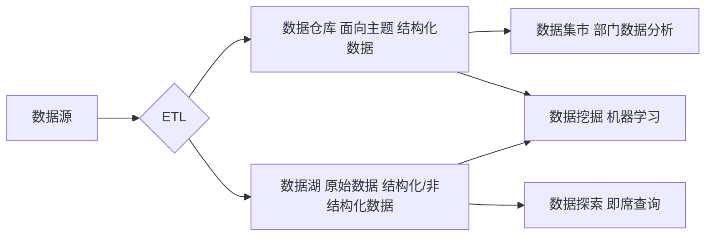

# 数据仓库与数据湖原理与代码实战案例讲解

## 1. 背景介绍
### 1.1 数据仓库与数据湖的起源与发展
#### 1.1.1 数据仓库的起源与发展
#### 1.1.2 数据湖的起源与发展 
#### 1.1.3 两者的异同点比较

### 1.2 数据仓库与数据湖在企业中的应用现状
#### 1.2.1 数据仓库在企业中的应用现状
#### 1.2.2 数据湖在企业中的应用现状
#### 1.2.3 两者结合使用的案例分析

### 1.3 数据仓库与数据湖对企业数字化转型的意义
#### 1.3.1 数据仓库对企业数字化转型的推动作用
#### 1.3.2 数据湖对企业数字化转型的推动作用
#### 1.3.3 两者协同促进企业数字化转型升级

## 2. 核心概念与联系
### 2.1 数据仓库的定义与特征
#### 2.1.1 数据仓库的定义
#### 2.1.2 数据仓库的主要特征
#### 2.1.3 数据仓库与传统数据库的区别

### 2.2 数据湖的定义与特征  
#### 2.2.1 数据湖的定义
#### 2.2.2 数据湖的主要特征
#### 2.2.3 数据湖与大数据平台的关系

### 2.3 数据仓库与数据湖的异同点分析
#### 2.3.1 两者的相同点
#### 2.3.2 两者的不同点 
#### 2.3.3 两者的互补关系

### 2.4 数据仓库与数据湖架构设计原则比较
#### 2.4.1 数据仓库架构设计原则
#### 2.4.2 数据湖架构设计原则
#### 2.4.3 两者架构设计异同点比较

## 3. 核心算法原理具体操作步骤
### 3.1 数据仓库ETL过程详解 
#### 3.1.1 数据抽取(Extract)
#### 3.1.2 数据转换(Transform)
#### 3.1.3 数据加载(Load)

### 3.2 数据湖数据接入与处理流程
#### 3.2.1 数据采集 
#### 3.2.2 数据存储
#### 3.2.3 数据处理
#### 3.2.4 数据分析

### 3.3 数据仓库与数据湖数据治理流程
#### 3.3.1 元数据管理
#### 3.3.2 数据质量管理
#### 3.3.3 主数据管理
#### 3.3.4 数据安全与权限管理

## 4. 数学模型和公式详细讲解举例说明
### 4.1 数据仓库维度建模
#### 4.1.1 星型模型
$$ Sales\_Fact = Measures \times Time \times Store \times Product $$
#### 4.1.2 雪花模型
$$ Sales\_Fact = Measures \times Time \times Store \times Product \times Supplier $$
#### 4.1.3 星座模型
$$ Sales\_Fact = Measures \times Time \times Store \times Product $$
$$ Inventory\_Fact = Measures \times Time \times Store \times Product $$

### 4.2 数据湖数据处理算法
#### 4.2.1 分布式文件存储算法
$$ Blocks = File\_Size / Block\_Size $$
$$ Nodes = Blocks / Replication $$
#### 4.2.2 分布式计算框架 MapReduce
$$ Map(k1,v1) \rightarrow list(k2,v2) $$
$$ Reduce(k2, list(v2)) \rightarrow list(v3) $$

### 4.3 数据挖掘与机器学习常用算法
#### 4.3.1 关联规则挖掘 Apriori
$$ Support(A \Rightarrow B) = P(A \cup B) $$
$$ Confidence(A \Rightarrow B) = P(B|A) = \frac{Support(A \cup B)}{Support(A)} $$
#### 4.3.2 聚类算法 K-Means
$$ J = \sum_{j=1}^k\sum_{i=1}^n||x_i^{(j)}-c_j||^2 $$
#### 4.3.3 分类算法 决策树 ID3
$$ Entropy(D) = -\sum_{k=1}^{|y|}p_klog_2p_k $$
$$ Gain(D,a) = Entropy(D) - \sum_{v=1}^V\frac{|D^v|}{|D|}Entropy(D^v) $$

## 5. 项目实践：代码实例和详细解释说明
### 5.1 使用Hive构建数据仓库
#### 5.1.1 Hive表设计
#### 5.1.2 ETL数据装载
#### 5.1.3 数据分析查询

### 5.2 使用Spark+HDFS构建数据湖
#### 5.2.1 HDFS数据存储  
#### 5.2.2 Spark数据处理
#### 5.2.3 Spark SQL数据分析

### 5.3 数据仓库与数据湖联合分析案例
#### 5.3.1 需求分析
#### 5.3.2 数据准备
#### 5.3.3 分析过程
#### 5.3.4 结果展示

## 6. 实际应用场景
### 6.1 零售行业客户360度视图
#### 6.1.1 业务需求
#### 6.1.2 技术架构 
#### 6.1.3 实施效果

### 6.2 金融行业风控模型
#### 6.2.1 业务需求
#### 6.2.2 技术架构
#### 6.2.3 实施效果

### 6.3 电商行业智能推荐
#### 6.3.1 业务需求 
#### 6.3.2 技术架构
#### 6.3.3 实施效果

## 7. 工具和资源推荐
### 7.1 数据仓库工具
#### 7.1.1 商业工具：Oracle、Teradata、SQL Server等
#### 7.1.2 开源工具：Hive、Presto、Kylin等

### 7.2 数据湖工具
#### 7.2.1 Hadoop生态系统：HDFS、HBase、Hive等
#### 7.2.2 Spark生态系统：Spark Core、Spark SQL、Spark Streaming等

### 7.3 学习资源
#### 7.3.1 经典书籍推荐
#### 7.3.2 在线课程推荐
#### 7.3.3 技术博客推荐

## 8. 总结：未来发展趋势与挑战
### 8.1 数据仓库的发展趋势
#### 8.1.1 实时数据仓库 
#### 8.1.2 云数据仓库
#### 8.1.3 自助式数据仓库

### 8.2 数据湖的发展趋势
#### 8.2.1 数据湖治理
#### 8.2.2 数据即服务(Data as a Service)
#### 8.2.3 数据虚拟化

### 8.3 数据仓库与数据湖融合发展
#### 8.3.1 统一的数据架构
#### 8.3.2 元数据驱动 
#### 8.3.3 智能数据管理

### 8.4 未来面临的挑战
#### 8.4.1 海量数据的存储与计算
#### 8.4.2 数据安全与隐私保护
#### 8.4.3 数据治理与质量管控

## 9. 附录：常见问题与解答
### 9.1 如何选择数据仓库还是数据湖？
### 9.2 数据仓库与数据集市的区别是什么？ 
### 9.3 数据湖会取代数据仓库吗？
### 9.4 数据仓库与数据湖如何实现互补？
### 9.5 如何平衡数据湖的灵活性与数据治理？

作者：禅与计算机程序设计艺术 / Zen and the Art of Computer Programming