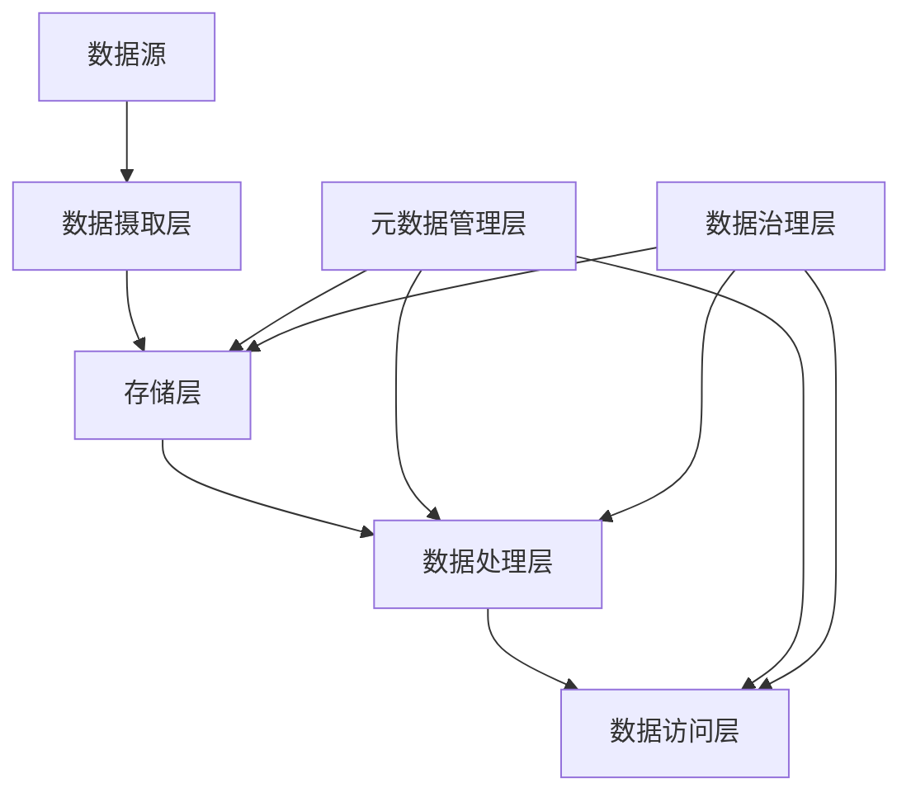

# 数据湖 原理与代码实例讲解

## 1.背景介绍

### 1.1 数据爆炸时代

在当今的数据时代，海量的结构化和非结构化数据源源不断地产生。从社交媒体、物联网设备到企业应用程序,数据正以前所未有的速度积累。根据IDC的预测,到2025年,全球数据总量将达到175ZB(1ZB=1万亿GB)。这种数据爆炸式增长对传统数据存储和处理系统带来了巨大挑战。

### 1.2 数据湖的兴起

为了应对这一挑战,数据湖(Data Lake)的概念应运而生。数据湖是一种能够存储各种格式数据的集中式存储库,旨在支持数据科学家、数据分析师和业务用户进行数据探索、分析和可视化。与传统数据仓库相比,数据湖具有更大的灵活性和可扩展性,能够存储原始数据,而无需事先对其进行结构化处理。

## 2.核心概念与联系

### 2.1 数据湖的核心概念

数据湖由以下几个核心概念组成:

1. **存储层**: 通常使用分布式文件系统(如HDFS或对象存储)来存储原始数据。
2. **数据摄取层**: 负责从各种数据源(如日志文件、数据库、流媒体等)收集和加载数据到存储层。
3. **元数据管理层**: 用于存储和管理数据的元数据,如数据模式、数据线程、访问控制等。
4. **数据处理层**: 提供各种计算引擎(如Apache Spark、Apache Hive等)用于数据处理和分析。
5. **数据访问层**: 为数据消费者(如数据分析师、数据科学家等)提供访问和查询数据的接口。
6. **数据治理层**: 确保数据的质量、安全性和合规性,包括数据加密、访问控制和审计等。

### 2.2 数据湖与数据仓库的关系

数据湖和传统数据仓库并非完全对立,而是相辅相成。数据仓库专注于存储经过ETL(提取、转换、加载)处理的结构化数据,用于支持报告和OLAP分析。而数据湖则侧重于存储原始数据,支持数据探索、数据科学和机器学习等场景。

在现代数据架构中,数据湖和数据仓库可以协同工作。数据湖作为企业数据的集中存储库,为数据仓库和其他分析系统提供数据源。数据仓库则从数据湖中提取、转换和加载所需数据,用于满足特定的分析需求。

## 3.核心算法原理具体操作步骤

### 3.1 数据摄取

数据摄取是将数据从各种来源加载到数据湖的过程。常见的数据摄取方式包括:

1. **批量摄取**: 周期性地从数据源(如数据库、文件系统等)加载数据,适用于处理大量历史数据。
2. **流式摄取**: 实时从数据源(如消息队列、流媒体等)获取数据,适用于处理实时数据流。

无论采用何种方式,数据摄取都需要解决以下几个关键问题:

1. **数据源连接**: 建立与各种数据源的连接,包括数据库、文件系统、消息队列等。
2. **数据提取**: 从数据源中提取所需数据,可能需要进行数据过滤、转换等预处理操作。
3. **数据传输**: 将提取的数据安全、高效地传输到数据湖存储层。
4. **容错和重试**: 确保数据摄取过程的可靠性和容错性,能够自动重试失败的操作。
5. **元数据管理**: 记录和管理摄取的数据的元数据信息,如数据源、模式、时间戳等。

Apache NiFi、Apache Kafka Connect和AWS Glue等工具都提供了数据摄取的功能。

### 3.2 数据存储

数据湖通常采用分布式文件系统(如HDFS)或对象存储(如AWS S3)来存储原始数据。这些存储系统具有高度的可扩展性和容错性,能够存储海量数据。

数据通常以文件的形式存储在数据湖中,常见的文件格式包括:

1. **文本格式**: CSV、JSON、XML等。
2. **列式存储格式**: Apache Parquet、Apache ORC等,具有高效的压缩和编码能力。
3. **批量格式**: Apache Avro、Apache Thrift等,用于序列化和反序列化数据。

存储层还需要解决以下几个关键问题:

1. **数据布局**: 确定数据在存储层中的组织方式,如按日期或按主题进行分区。
2. **数据压缩**: 采用合适的压缩算法和级别,以节省存储空间和提高读写性能。
3. **数据加密**: 对敏感数据进行加密,保护数据安全。
4. **数据生命周期管理**: 制定数据保留和删除策略,优化存储利用率。
5. **元数据管理**: 记录和管理存储数据的元数据信息,如数据位置、模式、时间戳等。

### 3.3 数据处理

数据湖中的数据需要经过处理和分析才能释放其价值。常见的数据处理方式包括:

1. **批处理**: 使用Apache Spark、Apache Hive等引擎对大量历史数据进行批量处理和分析。
2. **流处理**: 使用Apache Spark Streaming、Apache Flink等引擎对实时数据流进行处理和分析。
3. **机器学习和人工智能**: 使用Apache Spark MLlib、TensorFlow等框架和库进行机器学习和深度学习建模。

数据处理过程通常包括以下步骤:

1. **数据提取**: 从数据湖中提取所需数据,可能需要进行数据过滤、转换等预处理操作。
2. **数据清洗**: 处理缺失值、异常值和重复数据等数据质量问题。
3. **数据转换**: 根据分析需求对数据进行转换,如聚合、连接、窗口化等操作。
4. **模型构建**: 使用机器学习算法构建预测模型或进行模式挖掘。
5. **结果输出**: 将处理和分析结果输出到指定位置,如数据湖、数据仓库或可视化工具。

Apache Spark、Apache Hive、Apache Flink等开源框架和AWS Athena、Google Dataproc等云服务都提供了数据处理的功能。

### 3.4 数据访问和可视化

数据湖中的数据需要通过适当的工具和接口进行访问和可视化,以满足不同用户群体的需求。常见的数据访问和可视化方式包括:

1. **SQL查询**: 使用Apache Hive、Apache Impala等SQL引擎查询和分析数据。
2. **数据可视化工具**: 使用Tableau、Power BI等工具对数据进行可视化展示和交互式探索。
3. **数据科学工具**: 使用Jupyter Notebook、Apache Zeppelin等工具进行数据探索和建模。
4. **BI报表**: 使用传统BI工具(如Cognos、MicroStrategy)生成报表和仪表板。
5. **API和数据服务**: 通过RESTful API或数据服务层将数据暴露给应用程序和其他系统。

数据访问层需要解决以下几个关键问题:

1. **数据发现和元数据管理**: 提供数据目录和元数据管理功能,帮助用户发现和理解数据。
2. **访问控制和安全性**: 实施适当的访问控制策略,确保数据的安全性和合规性。
3. **性能优化**: 采用缓存、索引和分区等技术优化查询性能。
4. **数据虚拟化**: 将多个数据源统一抽象为单一视图,简化数据访问。
5. **数据治理和审计**: 确保数据的质量、一致性和可追溯性。

AWS Athena、Google BigQuery、Apache Superset和Microsoft Power BI等工具和服务都提供了数据访问和可视化的功能。

## 4.数学模型和公式详细讲解举例说明

在数据湖中,常常需要处理和分析大规模数据集。为了提高计算效率和降低资源消耗,我们可以借助一些数学模型和算法。以下是一些常见的数学模型和公式,以及它们在数据湖中的应用场景。

### 4.1 数据采样

在处理海量数据时,我们通常无法对整个数据集进行计算和分析。这时,我们可以采用数据采样的方法,从原始数据集中抽取一个较小的代表性样本,然后对样本进行处理和分析。

常见的数据采样方法包括简单随机采样、分层采样和系统采样等。以简单随机采样为例,其公式如下:

$$
P(S) = \binom{N}{n} \cdot \left(\frac{1}{N}\right)^n \cdot \left(1 - \frac{1}{N}\right)^{N-n}
$$

其中:

- $P(S)$ 表示从总体 $N$ 中抽取样本 $S$ 的概率
- $N$ 表示总体数据量
- $n$ 表示样本数据量
- $\binom{N}{n}$ 表示从 $N$ 个元素中选取 $n$ 个元素的组合数

通过采样,我们可以在保证一定精度的情况下,大幅减少计算量和资源消耗。

### 4.2 数据分区

在数据湖中,我们通常会根据某些特征(如时间、地理位置等)对数据进行分区存储。合理的数据分区策略可以提高查询效率,减少不必要的数据扫描。

假设我们需要查询某个时间范围内的数据,如果数据按时间分区存储,我们只需要扫描相关分区即可,而无需扫描整个数据集。这种分区pruning(剪枝)技术可以极大地提高查询性能。

我们可以使用信息熵(Information Entropy)来评估分区策略的有效性。信息熵公式如下:

$$
H(X) = -\sum_{i=1}^{n} p(x_i) \log_2 p(x_i)
$$

其中:

- $H(X)$ 表示随机变量 $X$ 的信息熵
- $n$ 表示可能取值的数量
- $p(x_i)$ 表示随机变量 $X$ 取值 $x_i$ 的概率

信息熵越小,表示数据分布越集中,分区策略越有效。我们可以尝试不同的分区组合,选择具有最小信息熵的分区方案。

### 4.3 数据压缩

为了节省存储空间和提高数据传输效率,我们通常会对数据进行压缩。常见的压缩算法包括Snappy、Gzip和LZO等。

以Snappy压缩算法为例,它采用了LZ77编码和哈弗曼编码的混合策略。LZ77编码用于查找重复字符串,哈弗曼编码用于编码字面量。

Snappy的压缩速度非常快,但压缩率相对较低。它的压缩公式如下:

$$
\text{Compressed Size} = \text{Tag Bytes} + \text{Literal Bytes} + \sum_{i=1}^{n} \text{Copy Bytes}_i
$$

其中:

- $\text{Tag Bytes}$ 表示标记字节,用于指示是字面量还是重复字符串
- $\text{Literal Bytes}$ 表示字面量字节
- $\text{Copy Bytes}_i$ 表示第 $i$ 个重复字符串的长度

在数据湖中,我们可以根据数据特征和应用场景,选择合适的压缩算法,在存储空间和计算性能之间进行权衡。

### 4.4 数据分桶

在处理大规模数据集时,我们常常需要对数据进行分组或聚合操作。分桶(Bucketing)技术可以将相似的数据划分到同一个桶(Bucket)中,从而提高分组和聚合的效率。

以基于散列的分桶为例,我们可以使用以下公式计算桶编号:

$$
\text{Bucket Number} = \text{Hash}(x) \bmod \text{Number of Buckets}
$$

其中:

- $\text{Hash}(x)$ 表示对数据 $