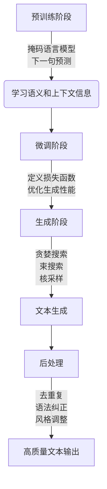

# 文本生成(Text Generation) - 原理与代码实例讲解

## 1.背景介绍

文本生成是自然语言处理(NLP)领域的一个重要任务,旨在根据给定的上下文或提示自动生成连贯、流畅和有意义的文本。随着深度学习技术的快速发展,基于神经网络的文本生成模型已经取得了令人瞩目的成就,在诸多领域得到了广泛应用,如机器翻译、对话系统、文本摘要、内容创作等。

文本生成任务的挑战在于,需要模型能够捕捉语言的复杂性,包括语法、语义、上下文和风格等多个层面。此外,生成的文本还需要具有连贯性、多样性和创新性,避免出现重复、矛盾或无意义的内容。

## 2.核心概念与联系

文本生成任务可以被视为一个序列到序列(Sequence-to-Sequence)的建模问题。给定一个输入序列(如提示或上下文),模型需要生成一个相应的输出序列(即目标文本)。核心思想是利用神经网络模型学习输入和输出序列之间的条件概率分布,从而实现文本的自动生成。

常见的文本生成模型包括:

1. **基于RNN的序列到序列模型**,如编码器-解码器(Encoder-Decoder)架构,利用循环神经网络(RNN)或其变体(LSTM、GRU)捕捉序列信息。
2. **基于Transformer的自注意力模型**,如GPT、BERT等,通过自注意力机制有效捕捉长距离依赖关系。
3. **生成对抗网络(GAN)**,将文本生成视为生成器与判别器的对抗过程,生成更加自然流畅的文本。
4. **变分自编码器(VAE)**,将文本生成建模为从潜在空间采样并解码的过程,增强生成文本的多样性。

这些模型通过在大规模语料库上训练,学习文本的统计规律和语义关联,从而实现高质量的文本生成能力。

## 3.核心算法原理具体操作步骤

以基于Transformer的GPT(Generative Pre-trained Transformer)模型为例,其核心算法原理和具体操作步骤如下:

1. **预训练阶段**:
   - 采用自监督学习策略,在大规模语料库上对GPT模型进行预训练。
   - 预训练目标是最大化输入文本序列的条件概率,即最小化语言模型损失函数。
   - 通过掩码语言模型(Masked Language Model)和下一句预测(Next Sentence Prediction)等任务,使模型学习文本的语义和上下文信息。

2. **微调阶段**:
   - 将预训练好的GPT模型在特定的文本生成任务上进行微调(Fine-tuning)。
   - 根据任务的特点,设计合适的输入表示和输出格式。
   - 定义新的损失函数,优化模型在目标任务上的生成性能。

3. **生成阶段**:
   - 给定输入提示或上下文,利用微调后的GPT模型进行文本生成。
   - 采用解码器(Decoder)逐步生成文本序列的每个词元。
   - 常用的解码策略包括贪婪搜索(Greedy Search)、束搜索(Beam Search)和核采样(Nucleus Sampling)等。

4. **后处理**:
   - 对生成的文本进行后处理,如去重复、语法纠正、风格调整等。
   - 引入约束条件或控制策略,使生成的文本符合特定要求。

GPT模型通过自注意力机制有效捕捉输入序列的上下文信息,并利用掩码语言模型等技术学习文本的语义和语法知识,从而实现高质量的文本生成。此外,预训练和微调的分步策略也有助于提高模型的泛化能力和生成质量。



## 4.数学模型和公式详细讲解举例说明

在文本生成任务中,常用的数学模型是基于条件概率的语言模型。给定输入序列 $X = (x_1, x_2, ..., x_n)$,目标是生成输出序列 $Y = (y_1, y_2, ..., y_m)$,其中 $x_i$ 和 $y_j$ 分别表示输入和输出序列中的词元。

根据链式法则,输出序列 $Y$ 的条件概率可以表示为:

$$P(Y|X) = \prod_{t=1}^{m} P(y_t|y_{<t}, X)$$

其中 $y_{<t}$ 表示输出序列中位置 $t$ 之前的所有词元。

在基于Transformer的GPT模型中,条件概率 $P(y_t|y_{<t}, X)$ 由自注意力机制和前馈神经网络共同计算得到。具体来说,对于位置 $t$,模型首先计算查询向量(Query) $q_t$、键向量(Key) $K$ 和值向量(Value) $V$,然后通过缩放点积注意力(Scaled Dot-Product Attention)计算上下文向量 $c_t$:

$$c_t = \text{Attention}(q_t, K, V) = \text{softmax}\left(\frac{q_t K^\top}{\sqrt{d_k}}\right)V$$

其中 $d_k$ 是缩放因子,用于防止点积的值过大导致梯度消失或爆炸。

接下来,上下文向量 $c_t$ 和位置 $t$ 的embedding向量 $e_t$ 经过前馈神经网络得到生成概率分布:

$$P(y_t|y_{<t}, X) = \text{softmax}(FFN(c_t, e_t))$$

在训练阶段,通过最大化输出序列的条件对数似然,优化模型参数:

$$\mathcal{L} = -\sum_{t=1}^{m} \log P(y_t|y_{<t}, X)$$

生成阶段则是根据训练好的模型,给定输入序列 $X$,通过贪婪搜索或其他解码策略,逐步生成具有最高条件概率的输出序列 $Y$。

以上是文本生成任务中常用的数学模型和公式,通过条件概率建模和自注意力机制,实现了高质量的文本生成能力。

## 5.项目实践:代码实例和详细解释说明

以下是一个使用PyTorch实现的基于GPT的文本生成示例,包括数据预处理、模型定义、训练和生成等核心步骤。

### 5.1 数据预处理

```python
import torch
from torchtext.data.utils import get_tokenizer
from torchtext.vocab import build_vocab_from_iterator

# 加载语料库
train_iter = datasets.WikiText2(split='train')

# 构建词表
tokenizer = get_tokenizer('basic_english')
vocab = build_vocab_from_iterator(map(tokenizer, train_iter), specials=['<unk>'])
vocab.set_default_index(vocab['<unk>'])

# 文本编码
text_pipeline = lambda x: vocab(tokenizer(x))
label_pipeline = lambda x: torch.tensor(x, dtype=torch.long)
```

### 5.2 模型定义

```python
import torch.nn as nn

class GPTModel(nn.Module):
    def __init__(self, vocab_size, embedding_dim, hidden_dim, num_layers):
        super(GPTModel, self).__init__()
        self.token_embedding = nn.Embedding(vocab_size, embedding_dim)
        self.position_embedding = nn.Embedding(max_len, embedding_dim)
        
        encoder_layer = nn.TransformerEncoderLayer(d_model=embedding_dim, nhead=8)
        self.transformer_encoder = nn.TransformerEncoder(encoder_layer, num_layers=num_layers)
        
        self.fc_out = nn.Linear(embedding_dim, vocab_size)
        
    def forward(self, x, src_mask):
        token_embeddings = self.token_embedding(x)
        position_embeddings = self.position_embedding(torch.arange(x.size(1), device=x.device))
        embeddings = token_embeddings + position_embeddings
        
        encoded = self.transformer_encoder(embeddings, src_mask)
        output = self.fc_out(encoded)
        return output
```

### 5.3 训练

```python
import torch.optim as optim

model = GPTModel(len(vocab), 256, 512, 6)
criterion = nn.CrossEntropyLoss(ignore_index=vocab['<unk>'])
optimizer = optim.Adam(model.parameters(), lr=0.001)

for epoch in range(num_epochs):
    for batch in train_iter:
        input_ids = batch.text[:, :-1]
        targets = batch.text[:, 1:]
        src_mask = model.generate_square_subsequent_mask(input_ids.size(-1)).to(device)
        
        output = model(input_ids, src_mask)
        loss = criterion(output.view(-1, len(vocab)), targets.contiguous().view(-1))
        
        optimizer.zero_grad()
        loss.backward()
        optimizer.step()
```

### 5.4 生成

```python
import torch.nn.functional as F

def generate(model, prompt, max_len=100, top_k=10, top_p=0.9, device='cpu'):
    model.eval()
    tokens = vocab(tokenizer(prompt))
    tokens = torch.tensor(tokens).unsqueeze(0).to(device)
    
    for _ in range(max_len):
        src_mask = model.generate_square_subsequent_mask(tokens.size(-1)).to(device)
        output = model(tokens, src_mask)
        
        next_token_logits = output[:, -1, :]
        filtered_logits = top_k_top_p_filtering(next_token_logits, top_k, top_p)
        next_token = torch.multinomial(F.softmax(filtered_logits, dim=-1), num_samples=1)
        
        tokens = torch.cat((tokens, next_token), dim=-1)
        
    text = vocab.decode(tokens.squeeze().tolist())
    return text

# 生成示例
prompt = "The quick brown fox"
generated_text = generate(model, prompt, device=device)
print(generated_text)
```

上述代码实现了一个基于GPT的文本生成模型,包括数据预处理、模型定义、训练和生成等核心步骤。在训练阶段,模型学习输入序列到目标序列的条件概率分布;在生成阶段,给定输入提示,模型通过自回归(Autoregressive)的方式逐步生成输出序列。

代码中的关键点包括:

1. 使用Transformer的Encoder部分作为语言模型,捕捉输入序列的上下文信息。
2. 引入位置编码(Position Embedding),使模型能够捕捉序列中词元的位置信息。
3. 在生成阶段,采用Top-K和Top-P采样策略,提高生成文本的多样性和质量。
4. 使用交叉熵损失函数(CrossEntropyLoss)优化模型参数。

通过上述实现,可以在各种文本生成任务中应用GPT模型,如机器翻译、对话系统、文本摘要等。同时,也可以根据具体任务需求,对模型进行进一步的优化和改进。

## 6.实际应用场景

文本生成技术在实际应用中有着广泛的应用前景,包括但不限于以下几个领域:

1. **机器翻译**: 利用文本生成模型,可以实现从一种语言到另一种语言的自动翻译,如英译中、中译英等。

2. **对话系统**: 在对话系统中,文本生成模型可以根据上下文生成自然、连贯的回复,实现人机对话交互。

3. **文本摘要**: 将长篇文本自动condensed成简洁的摘要,方便快速获取核心内容。

4. **新闻报道/文案创作**: 根据给定的主题或大纲,自动生成新闻报道、广告文案等内容。

5. **故事创作**: 基于给定的开头或情节,生成富有创意的小说、故事等文学作品。

6. **问答系统**: 根据用户提问,从知识库中生成相关的答复。

7. **代码生成**: 根据给定的需求描述,自动生成相应的代码片段或程序框架。

8. **自动作文/论文写作**: 辅助学生或研究人员进行作文、论文等写作任务。

9. **智能客服**: 为客户提供自动化的问题解答和服务响应。

10. **个性化推荐系统**: 根据用户的兴趣爱好和历史记录,生成个性化的推荐内容。

总的来说,文本生成技术可以极大地提高内容创作的效率,减轻人工