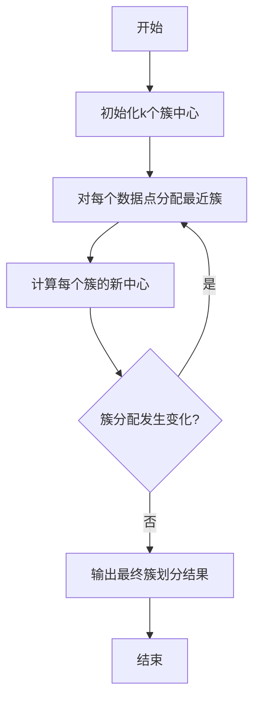
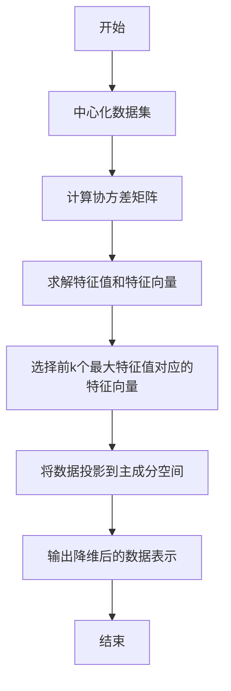
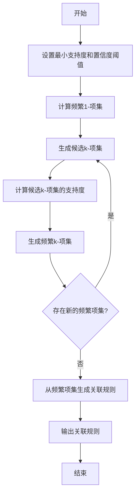

# 无监督学习(Unsupervised Learning)原理与代码实战案例讲解

## 1.背景介绍

### 1.1 什么是无监督学习

无监督学习(Unsupervised Learning)是机器学习的一个重要分支,它与有监督学习(Supervised Learning)和强化学习(Reinforcement Learning)并列为机器学习的三大类型。无监督学习的主要目标是从未标记的数据中发现内在的模式、结构或规律,而无需任何人工标注或指导。

在现实世界中,大量的数据都是未标记的,如图像、视频、语音、文本等,这些数据缺乏明确的标签或目标值。无监督学习算法能够自主地从这些原始数据中提取有价值的信息,揭示数据的内在结构和规律性,为后续的数据分析和决策提供支持。

### 1.2 无监督学习的应用场景

无监督学习在诸多领域都有广泛的应用,包括但不限于:

- **聚类分析(Clustering Analysis)**: 根据数据的相似性将其划分为多个簇或组,如客户细分、基因表达模式发现等。
- **降维(Dimensionality Reduction)**: 将高维数据映射到低维空间,保留数据的主要特征,如图像压缩、数据可视化等。
- **异常检测(Anomaly Detection)**: 发现数据中的异常值或离群点,如网络入侵检测、欺诈检测等。
- **关联规则挖掘(Association Rule Mining)**: 发现数据集中的频繁项集和关联规则,如购物篮分析、网页链接挖掘等。
- **特征学习(Feature Learning)**: 自动从原始数据中学习出有意义的特征表示,为后续的任务提供有价值的输入,如深度学习中的自编码器。

### 1.3 无监督学习算法分类

无监督学习算法主要可分为以下几类:

- **聚类算法(Clustering Algorithms)**: K-Means、层次聚类、DBSCAN、高斯混合模型等。
- **降维算法(Dimensionality Reduction Algorithms)**: 主成分分析(PCA)、核化主成分分析、t-SNE、自编码器等。
- **关联规则挖掘算法(Association Rule Mining Algorithms)**: Apriori算法、FP-Growth算法等。
- **密度估计算法(Density Estimation Algorithms)**: 核密度估计、高斯混合模型等。
- **嵌入算法(Embedding Algorithms)**: Word2Vec、Node2Vec等。

## 2.核心概念与联系

### 2.1 无监督学习的核心概念

无监督学习的核心概念包括:

1. **相似性度量(Similarity Measure)**: 定义数据点之间的相似程度,是聚类和降维等算法的基础。常用的相似性度量有欧几里得距离、余弦相似度、Jaccard相似系数等。

2. **簇(Cluster)**: 由相似的数据点组成的组或组块。聚类算法的目标是将数据划分为若干个簇,使得簇内数据点相似度高,簇间相似度低。

3. **潜在变量(Latent Variable)**: 无监督学习算法通常假设数据是由一些隐藏的潜在变量生成的,算法的目标是发现这些潜在变量。如聚类算法中的簇标记、主成分分析中的主成分等。

4. **概率密度估计(Probability Density Estimation)**: 估计数据的概率密度函数,常用于异常检测、生成模型等任务。

5. **低维嵌入(Low-Dimensional Embedding)**: 将高维数据映射到低维空间的过程,常用于数据可视化、特征提取等。

6. **关联规则(Association Rule)**: 描述数据集中项集之间存在的关联模式,用于发现有趣的频繁模式。

### 2.2 无监督学习与其他机器学习范式的联系

1. **无监督学习与有监督学习**:
   - 有监督学习利用标记数据进行训练,目标是学习数据与标签之间的映射关系。
   - 无监督学习则直接从原始数据中发现模式和规律,不需要标签信息。
   - 无监督学习常被用于数据预处理、特征提取等,为有监督学习任务提供有价值的输入。

2. **无监督学习与半监督学习**:
   - 半监督学习同时利用少量标记数据和大量未标记数据进行训练。
   - 无监督学习可以作为半监督学习的一个重要组成部分,用于从未标记数据中挖掘有用的模式和特征。

3. **无监督学习与强化学习**:
   - 强化学习关注智能体如何通过与环境交互来学习最优策略。
   - 无监督学习可以用于从环境状态中提取有用的特征表示,为强化学习任务提供更好的状态表示。

4. **无监督学习与深度学习**:
   - 深度学习模型常被用于无监督特征学习,如自编码器、生成对抗网络等。
   - 无监督学习也可以用于对深度模型进行预训练,提高模型的泛化能力。

## 3.核心算法原理具体操作步骤

无监督学习涵盖了多种不同的算法,每种算法的原理和操作步骤也不尽相同。本节将重点介绍三种核心算法的原理和具体操作步骤:K-Means聚类算法、主成分分析(PCA)降维算法和Apriori关联规则挖掘算法。

### 3.1 K-Means聚类算法

K-Means是一种经典的聚类算法,其目标是将n个数据点划分为k个簇,使得簇内数据点相似度高,簇间相似度低。算法的具体操作步骤如下:

1. **初始化**: 随机选择k个数据点作为初始簇中心。

2. **分配簇**: 对于每个数据点,计算它与各个簇中心的距离,将其分配到最近的簇中。

3. **更新簇中心**: 对于每个簇,重新计算簇中所有数据点的均值作为新的簇中心。

4. **重复步骤2和3**: 重复执行步骤2和步骤3,直到簇分配不再发生变化或达到最大迭代次数。

5. **输出结果**: 输出最终的簇划分结果。

K-Means算法的优点是简单、高效,但也存在一些缺陷,如对初始簇中心选择敏感、对噪声和异常值敏感、无法处理非凸形状的簇等。因此,在实际应用中,常需要结合其他技术来改进和优化算法。

### 3.2 主成分分析(PCA)降维算法

主成分分析(Principal Component Analysis, PCA)是一种常用的降维算法,它通过线性变换将高维数据投影到一个低维子空间,同时尽量保留数据的方差信息。PCA算法的具体操作步骤如下:

1. **中心化**: 将数据集的均值归零,使数据集的中心位于原点。

2. **计算协方差矩阵**: 计算数据集的协方差矩阵。

3. **求解特征值和特征向量**: 对协方差矩阵进行特征值分解,得到对应的特征值和特征向量。

4. **选择主成分**: 根据特征值的大小,选择前k个最大的特征值对应的特征向量作为主成分。

5. **投影到主成分空间**: 将原始数据投影到由主成分张成的低维子空间中,得到降维后的数据表示。

PCA算法的优点是简单、高效,能够有效地降低数据维度,同时保留数据的主要信息。但它也有一些局限性,如只能捕捉线性关系、对异常值敏感等。在实际应用中,常需要结合其他技术来处理非线性数据和异常值。

### 3.3 Apriori关联规则挖掘算法

Apriori算法是一种经典的关联规则挖掘算法,它通过迭代搜索频繁项集,从而发现数据集中的关联规则。算法的具体操作步骤如下:

1. **初始化**: 设置最小支持度阈值和最小置信度阈值。

2. **计算频繁1-项集**: 扫描数据集,统计每个项的支持度,将支持度大于最小支持度阈值的项作为频繁1-项集。

3. **生成候选k-项集**: 利用频繁(k-1)-项集生成候选k-项集。

4. **计算候选k-项集的支持度**: 扫描数据集,统计每个候选k-项集的支持度。

5. **生成频繁k-项集**: 将支持度大于最小支持度阈值的候选k-项集作为频繁k-项集。

6. **重复步骤3-5**: 重复执行步骤3-5,直到无法再生成新的频繁项集为止。

7. **生成关联规则**: 从频繁项集中生成满足最小置信度阈值的关联规则。

Apriori算法的优点是简单、易于理解和实现,但在处理大规模数据集时效率较低。因此,在实际应用中,常需要结合其他优化技术,如哈希技术、采样技术等,来提高算法的效率。

## 4.数学模型和公式详细讲解举例说明

无监督学习算法常常涉及到一些数学模型和公式,本节将详细讲解几个核心的数学模型和公式,并给出具体的例子说明。

### 4.1 相似性度量

相似性度量是无监督学习算法的基础,它定义了数据点之间的相似程度。常用的相似性度量包括:

1. **欧几里得距离**:

$$d(x, y) = \sqrt{\sum_{i=1}^{n}(x_i - y_i)^2}$$

其中,x和y是n维空间中的两个数据点。

例如,在二维平面上,点(1, 2)和点(3, 4)的欧几里得距离为:

$$d((1, 2), (3, 4)) = \sqrt{(1-3)^2 + (2-4)^2} = \sqrt{4 + 4} = 2\sqrt{2}$$

2. **余弦相似度**:

$$\text{sim}(x, y) = \frac{x \cdot y}{\|x\| \|y\|} = \frac{\sum_{i=1}^{n}x_iy_i}{\sqrt{\sum_{i=1}^{n}x_i^2}\sqrt{\sum_{i=1}^{n}y_i^2}}$$

余弦相似度常用于文本挖掘和推荐系统等领域。

例如,向量(1, 2, 3)和向量(2, 4, 6)的余弦相似度为:

$$\text{sim}((1, 2, 3), (2, 4, 6)) = \frac{1\times2 + 2\times4 + 3\times6}{\sqrt{1^2+2^2+3^2}\sqrt{2^2+4^2+6^2}} = \frac{28}{\sqrt{14}\sqrt{52}} \approx 0.97$$

### 4.2 期望最大化(EM)算法

期望最大化(Expectation-Maximization, EM)算法是一种常用的无监督学习算法,它通过迭代计算来估计模型参数和隐变量的值。EM算法常被用于聚类、密度估计等任务。

EM算法的基本思想是:首先基于当前的模型参数估计