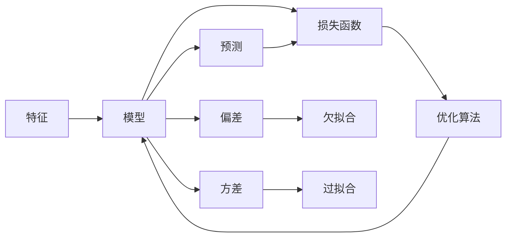

# 机器学习算法原理与代码实战案例讲解

## 1.背景介绍

### 1.1 机器学习概述

机器学习是人工智能的一个重要分支,其目标是通过算法让计算机从数据中学习,从而具备对未知数据进行预测和决策的能力。机器学习算法可以从大量的历史数据中自动发现规律和模式,无需人工显式编程。近年来,随着大数据和计算能力的飞速发展,机器学习在各个领域取得了突破性的进展,如计算机视觉、自然语言处理、语音识别、推荐系统等。

### 1.2 机器学习的分类

根据学习方式的不同,机器学习主要可以分为以下三类:

1. 监督学习(Supervised Learning):训练数据包含输入和期望输出,算法需要从标注数据中学习出一个函数,可以将输入映射为正确的输出。代表算法有线性回归、Logistic回归、支持向量机、决策树、随机森林等。

2. 无监督学习(Unsupervised Learning):训练数据只有输入,没有标注的输出。算法需要在无监督的情况下发现数据中隐藏的结构和关系。代表算法有聚类、降维、关联规则等。

3. 强化学习(Reinforcement Learning):通过智能体(Agent)与环境的交互,根据环境反馈的奖励或惩罚来调整策略,使得智能体的决策能够获得最大化的累积奖励。代表算法有Q-Learning、SARSA、Policy Gradient等。

### 1.3 机器学习的应用场景

机器学习在各行各业都有广泛的应用,主要包括:

1. 计算机视觉:图像分类、目标检测、语义分割、人脸识别等
2. 自然语言处理:文本分类、情感分析、机器翻译、对话系统等  
3. 语音识别:语音转文本、说话人识别、情感识别等
4. 推荐系统:电商推荐、新闻推荐、广告推荐等
5. 异常检测:设备故障诊断、金融欺诈检测等
6. 预测分析:销量预测、股票预测、天气预测等
7. 自动驾驶:环境感知、路径规划、决策控制等

## 2.核心概念与联系

### 2.1 特征(Feature)

特征是对数据进行描述的属性或变量,是机器学习算法的基本输入。好的特征对于算法性能至关重要。特征可分为数值型特征和类别型特征。特征工程包括特征提取、特征选择、特征降维等关键步骤。

### 2.2 模型(Model)

模型定义了从输入到输出的映射函数,是机器学习的核心。监督学习的模型可以看作是一个判别式条件概率分布 $P(y|x)$ 。无监督学习的模型可以看作是一个生成式联合概率分布 $P(x,z)$ 。其中 $x$ 为输入特征, $y$ 为输出标签, $z$ 为隐变量。

### 2.3 损失函数(Loss Function)

损失函数用于衡量模型预测值与真实值之间的差距,是模型优化的目标函数。常见的损失函数有均方误差、交叉熵、对数似然等。损失函数的选择要与问题和模型相匹配。

### 2.4 优化算法(Optimization Algorithm)  

优化算法通过最小化损失函数来估计模型参数,使得模型在训练数据上的误差最小化。常见的优化算法有梯度下降法(Gradient Descent)及其变种、牛顿法、拟牛顿法等。

### 2.5 偏差(Bias)与方差(Variance)

偏差指模型预测值与真实值之间的差异,反映了模型本身的拟合能力。方差指模型对不同训练集的预测结果的波动,反映了模型的稳定性。偏差和方差是一对矛盾,需要权衡。

### 2.6 过拟合(Overfitting)与欠拟合(Underfitting)

过拟合是指模型过于复杂,把训练数据的噪声也拟合进去,导致在测试集上泛化性能较差。欠拟合是指模型过于简单,无法很好地捕捉数据的内在规律。我们需要采取一些策略如正则化、交叉验证等来减少过拟合。

### 2.7 概念之间的联系

下图展示了机器学习核心概念之间的关系:

## 3.核心算法原理具体操作步骤

下面以线性回归和逻辑回归为例,详细讲解其原理和步骤。

### 3.1 线性回归(Linear Regression)

线性回归是一种基本的监督学习算法,用于拟合连续型输出。其模型假设输出 $y$ 可以用输入特征 $x$ 的线性组合来近似。

#### 3.1.1 模型定义

单变量线性回归模型定义为:

$$y = wx + b$$

其中 $w$ 为权重, $b$ 为偏置。

多变量线性回归模型定义为:

$$y = w_1x_1 + w_2x_2 + ... + w_nx_n + b$$

用向量形式表示为:

$$y = \mathbf{w}^T\mathbf{x} + b$$

其中 $\mathbf{w} = (w_1,w_2,...,w_n)^T$ 为权重向量, $\mathbf{x} = (x_1,x_2,...,x_n)^T$ 为输入特征向量。

#### 3.1.2 损失函数

线性回归常用的损失函数是均方误差(Mean Squared Error,MSE):

$$J(\mathbf{w},b) = \frac{1}{2m}\sum_{i=1}^m(f_{\mathbf{w},b}(\mathbf{x}^{(i)})-y^{(i)})^2$$

其中 $f_{\mathbf{w},b}(\mathbf{x}^{(i)}) = \mathbf{w}^T\mathbf{x}^{(i)} + b$ 为模型在第 $i$ 个样本上的预测值, $y^{(i)}$ 为第 $i$ 个样本的真实值, $m$ 为样本总数。

#### 3.1.3 优化算法

线性回归通常使用梯度下降法来优化模型参数。梯度下降分为批量梯度下降(Batch Gradient Descent)、随机梯度下降(Stochastic Gradient Descent)和小批量梯度下降(Mini-Batch Gradient Descent)。

以批量梯度下降为例,参数更新公式为:

$$
\begin{aligned}
\mathbf{w} &:= \mathbf{w} - \alpha \frac{\partial J(\mathbf{w},b)}{\partial \mathbf{w}} \\
b &:= b - \alpha \frac{\partial J(\mathbf{w},b)}{\partial b}
\end{aligned}
$$

其中 $\alpha$ 为学习率,控制每次更新的步长。偏导数项为:

$$
\begin{aligned}
\frac{\partial J(\mathbf{w},b)}{\partial \mathbf{w}} &= \frac{1}{m}\sum_{i=1}^m(\mathbf{w}^T\mathbf{x}^{(i)} + b - y^{(i)})\mathbf{x}^{(i)} \\
\frac{\partial J(\mathbf{w},b)}{\partial b} &= \frac{1}{m}\sum_{i=1}^m(\mathbf{w}^T\mathbf{x}^{(i)} + b - y^{(i)})
\end{aligned}
$$

#### 3.1.4 算法步骤

线性回归的主要步骤如下:

1. 数据预处理:对特征进行归一化、标准化等操作
2. 初始化模型参数 $\mathbf{w}$ 和 $b$ 为0或随机值
3. 迭代直到收敛:
   - 计算当前模型在整个训练集上的损失 $J(\mathbf{w},b)$
   - 计算损失函数关于 $\mathbf{w}$ 和 $b$ 的偏导数
   - 使用梯度下降公式更新 $\mathbf{w}$ 和 $b$
4. 返回学习到的模型参数 $\mathbf{w}$ 和 $b$

### 3.2 逻辑回归(Logistic Regression)

逻辑回归是一种常用的分类算法,用于二分类问题。虽然名字有"回归",但它实际上是一个分类模型。逻辑回归基于Sigmoid函数将线性回归的输出转化为概率。

#### 3.2.1 Sigmoid函数

Sigmoid函数定义为:

$$\sigma(z) = \frac{1}{1+e^{-z}}$$

它可以将实数映射到(0,1)区间内,解释为概率。Sigmoid函数的导数为:

$$\sigma'(z) = \sigma(z)(1-\sigma(z))$$

#### 3.2.2 模型定义

逻辑回归模型定义为:

$$h_{\mathbf{w}}(\mathbf{x}) = \sigma(\mathbf{w}^T\mathbf{x} + b) = \frac{1}{1+e^{-(\mathbf{w}^T\mathbf{x} + b)}}$$

其中 $h_{\mathbf{w}}(\mathbf{x})$ 表示样本 $\mathbf{x}$ 为正例的概率。

#### 3.2.3 损失函数 

逻辑回归使用对数似然作为损失函数:

$$J(\mathbf{w},b) = -\frac{1}{m}\sum_{i=1}^m[y^{(i)}\log h_{\mathbf{w}}(\mathbf{x}^{(i)}) + (1-y^{(i)})\log (1-h_{\mathbf{w}}(\mathbf{x}^{(i)}))]$$

其中 $y^{(i)} \in \{0,1\}$ 为样本的真实标签。

#### 3.2.4 优化算法

逻辑回归同样使用梯度下降法来优化。参数更新公式与线性回归类似,只是偏导数项变为:

$$
\begin{aligned}
\frac{\partial J(\mathbf{w},b)}{\partial \mathbf{w}} &= \frac{1}{m}\sum_{i=1}^m(h_{\mathbf{w}}(\mathbf{x}^{(i)}) - y^{(i)})\mathbf{x}^{(i)} \\
\frac{\partial J(\mathbf{w},b)}{\partial b} &= \frac{1}{m}\sum_{i=1}^m(h_{\mathbf{w}}(\mathbf{x}^{(i)}) - y^{(i)})
\end{aligned}
$$

#### 3.2.5 算法步骤

逻辑回归的主要步骤如下:

1. 数据预处理:对特征进行归一化、标准化等操作
2. 初始化模型参数 $\mathbf{w}$ 和 $b$ 为0或随机值
3. 迭代直到收敛:
   - 计算当前模型在整个训练集上的损失 $J(\mathbf{w},b)$ 
   - 计算损失函数关于 $\mathbf{w}$ 和 $b$ 的偏导数
   - 使用梯度下降公式更新 $\mathbf{w}$ 和 $b$
4. 返回学习到的模型参数 $\mathbf{w}$ 和 $b$
5. 对新样本 $\mathbf{x}$ 进行预测:如果 $h_{\mathbf{w}}(\mathbf{x}) \geq 0.5$ 则预测为正例,否则为反例

## 4.数学模型和公式详细讲解举例说明

### 4.1 线性回归的几何解释

考虑单变量线性回归 $y = wx + b$ ,其中 $w$ 和 $b$ 是我们要学习的参数。在二维平面上,该模型表示一条直线,斜率为 $w$ ,截距为 $b$ 。我们的目标是找到一条直线,使得所有样本点到直线的垂直距离之和最小。

假设有 $m$ 个样本点 $(x^{(1)},y^{(1)}),(x^{(2)},y^{(2)}),...,(x^{(m)},y^{(m)})$ 。第 $i$ 个样本点到直线的垂直距离为:

$$d^{(i)} = |wx^{(i)} + b - y^{(i)}|$$

我们希望最小化所有样本点到直线距离的平方和,即损失函数:

$$J(w,b) = \frac{1}{2m}\sum_{i=1}^m(wx^{(i)} + b