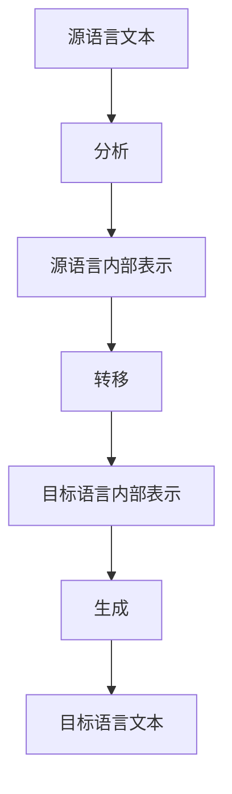
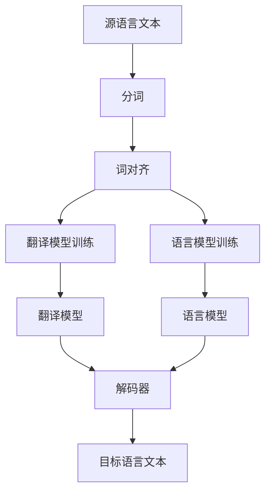

# 机器翻译(Machine Translation) - 原理与代码实例讲解

## 1.背景介绍

### 1.1 机器翻译的重要性

在当今全球化的世界中,不同语言之间的沟通障碍一直是阻碍人类交流与合作的主要障碍之一。机器翻译(Machine Translation,MT)技术的出现旨在帮助人们克服语言障碍,实现高效、低成本的跨语言交流。作为自然语言处理(Natural Language Processing,NLP)领域的一个分支,机器翻译已经广泛应用于许多领域,如国际贸易、科技文献、新闻传播、旅游服务等。

### 1.2 机器翻译的发展历程

机器翻译的研究可以追溯到20世纪40年代,在那个时候,首批基于规则的机器翻译系统(Rule-Based Machine Translation,RBMT)问世。这些系统主要依赖于语言学家手工编写的规则集,将源语言转换为目标语言。尽管取得了一些进展,但由于规则的局限性,RBMT系统的翻译质量并不理想。

20世纪90年代,随着统计机器翻译(Statistical Machine Translation,SMT)的兴起,机器翻译进入了新的发展阶段。SMT系统通过分析大量的人工翻译语料,学习源语言和目标语言之间的统计规律,从而提高了翻译质量。

近年来,随着深度学习(Deep Learning)技术的飞速发展,神经网络机器翻译(Neural Machine Translation,NMT)系统逐渐占据主导地位。NMT系统可以自动学习语言的语义和上下文信息,大幅提升了翻译质量,推动机器翻译进入了一个新的里程碑式的发展阶段。

## 2.核心概念与联系

### 2.1 机器翻译的基本流程

不管是基于规则、统计还是神经网络的机器翻译系统,它们的基本工作流程都可以概括为三个主要步骤:

1. **分析(Analysis)**: 将源语言文本转换为某种内部表示形式。
2. **转移(Transfer)**: 将源语言的内部表示转换为目标语言的内部表示。
3. **生成(Generation)**: 根据目标语言的内部表示生成最终的目标语言文本。



### 2.2 词对齐和语言模型

词对齐(Word Alignment)和语言模型(Language Model)是机器翻译系统中两个关键的概念:

- **词对齐**: 指在平行语料库中找到源语言单词与目标语言单词之间的对应关系。高质量的词对齐有助于提高翻译质量。

- **语言模型**: 用于评估目标语言文本的流畅性和grammatical性。一个好的语言模型可以帮助机器翻译系统生成更加自然、通顺的目标语言文本。

### 2.3 评估指标

评估机器翻译系统的性能是一项重要且具有挑战性的任务。常用的评估指标包括:

- **BLEU (Bilingual Evaluation Understudy)**: 基于n-gram精确匹配的自动评估指标,广泛应用于各种机器翻译系统的评估。

- **TER (Translation Edit Rate)**: 基于最小编辑距离的评估指标,反映了将机器翻译结果修改为参考人工翻译所需的最少编辑操作数。

- **人工评估**: 由专业人员根据特定标准(如流畅度、准确度等)对机器翻译结果进行评分,通常被认为是最可靠的评估方式。

## 3.核心算法原理具体操作步骤

### 3.1 统计机器翻译(SMT)

统计机器翻译系统通常由三个核心模型组成:

1. **翻译模型(Translation Model)**: 用于计算给定源语句的翻译概率。
2. **语言模型(Language Model)**: 用于评估目标语言文本的流畅性。
3. **解码器(Decoder)**: 根据翻译模型和语言模型的综合打分,搜索出最可能的目标语言翻译。

SMT系统的工作流程如下:



1. **分词(Tokenization)**: 将源语言文本分割为词序列。
2. **词对齐(Word Alignment)**: 在平行语料库中找到源语言单词与目标语言单词之间的对应关系。
3. **翻译模型训练**: 使用词对齐结果,训练翻译模型,学习源语言词序列到目标语言词序列的翻译概率。
4. **语言模型训练**: 使用大量目标语言语料,训练语言模型,学习目标语言的语法和用法。
5. **解码(Decoding)**: 解码器根据翻译模型和语言模型的综合评分,搜索出最可能的目标语言翻译。

### 3.2 神经网络机器翻译(NMT)

与统计机器翻译不同,神经网络机器翻译是一种基于序列到序列(Sequence-to-Sequence)模型的端到端(End-to-End)方法。NMT系统的核心是一个由编码器(Encoder)和解码器(Decoder)组成的神经网络模型。


1. **编码器(Encoder)**: 将源语言文本序列编码为一个上下文向量(Context Vector),该向量捕获了源语言文本的语义信息。
2. **解码器(Decoder)**: 根据上下文向量和已生成的目标语言词序列,预测下一个目标语言词。

编码器和解码器都是由循环神经网络(Recurrent Neural Network,RNN)或者transformer等神经网络模型构建而成。在训练过程中,模型会在大量的平行语料库上进行端到端的训练,自动学习源语言到目标语言的翻译映射。

神经网络机器翻译的优点是能够自动学习语言的语义和上下文信息,从而提高了翻译质量。但同时,由于需要大量的计算资源和训练数据,NMT系统的训练过程往往比统计机器翻译更加复杂和耗时。

## 4.数学模型和公式详细讲解举例说明

### 4.1 统计机器翻译的数学模型

在统计机器翻译中,翻译问题被形式化为一个最大化概率的问题:给定源语言句子 $f$,需要找到一个目标语言句子 $\hat{e}$,使得 $P(e|f)$ 最大化,即:

$$\hat{e} = \arg\max_{e} P(e|f)$$

根据贝叶斯公式,我们可以将 $P(e|f)$ 分解为:

$$P(e|f) = \frac{P(f|e)P(e)}{P(f)}$$

由于 $P(f)$ 对所有候选翻译 $e$ 都是常数,因此最大化 $P(e|f)$ 等价于最大化 $P(f|e)P(e)$:

$$\hat{e} = \arg\max_{e} P(f|e)P(e)$$

其中:

- $P(f|e)$ 是翻译模型(Translation Model),它描述了给定目标语言句子 $e$ 生成源语言句子 $f$ 的概率。
- $P(e)$ 是语言模型(Language Model),它描述了目标语言句子 $e$ 本身的概率或流畅程度。

翻译模型和语言模型的具体实现方式因系统而异,但它们的作用都是为了找到最优的目标语言翻译。

### 4.2 神经网络机器翻译的数学模型

在神经网络机器翻译中,编码器-解码器模型的目标是最大化目标语言句子 $Y=(y_1, y_2, ..., y_m)$ 的条件概率 $P(Y|X)$,其中 $X=(x_1, x_2, ..., x_n)$ 是源语言句子。具体来说,我们希望找到一个模型参数 $\theta$ ,使得:

$$\hat{\theta} = \arg\max_{\theta} \sum_{(X,Y)} \log P(Y|X;\theta)$$

其中 $(X,Y)$ 是训练语料库中的平行语句对。

在序列到序列模型中,条件概率 $P(Y|X;\theta)$ 可以进一步分解为:

$$P(Y|X;\theta) = \prod_{t=1}^m P(y_t|y_{<t}, c; \theta)$$

其中 $c$ 是编码器根据源语言句子 $X$ 生成的上下文向量(Context Vector),用于捕获源语言句子的语义信息。$y_{<t}$ 表示目标语言句子中位置 $t$ 之前的所有词。

在训练过程中,模型会通过最大似然估计(Maximum Likelihood Estimation)来学习参数 $\theta$,使得在训练语料库上的对数似然函数最大化。一旦模型训练完成,在测试阶段,我们可以使用贪心搜索或束搜索(Beam Search)等解码算法来找到最优的目标语言翻译。

## 5.项目实践:代码实例和详细解释说明

为了更好地理解机器翻译系统的工作原理,我们将使用Python和开源机器翻译库OpenNMT进行实践。OpenNMT是一个流行的神经网络机器翻译框架,支持多种模型架构和语言对。

### 5.1 数据准备

在开始训练之前,我们需要准备平行语料库作为训练数据。这里我们使用的是一个英语到德语的小型数据集,包含约20万条平行句对。你可以从OpenNMT的官方网站下载这个数据集。

```python
# 下载并解压数据集
import os
import urllib.request

data_dir = "data/"
os.makedirs(data_dir, exist_ok=True)

train_url = "https://download.opennmt.org/models/en-de/iwslt17.tgz"
test_url = "https://download.opennmt.org/models/en-de/tst2017.tgz"

for url in [train_url, test_url]:
    file_name = os.path.basename(url)
    file_path = os.path.join(data_dir, file_name)
    if not os.path.exists(file_path):
        urllib.request.urlretrieve(url, file_path)
        print(f"Downloaded {file_name}")
    else:
        print(f"{file_name} already exists, skipping download.")

# 解压数据集
import tarfile

for file_name in os.listdir(data_dir):
    if file_name.endswith(".tgz") or file_name.endswith(".tar.gz"):
        file_path = os.path.join(data_dir, file_name)
        with tarfile.open(file_path, "r:gz") as tar:
            tar.extractall(path=data_dir)
        print(f"Extracted {file_name}")
```

### 5.2 数据预处理

在训练之前,我们需要对数据进行一些预处理操作,如分词(Tokenization)、构建词表(Vocabulary)等。OpenNMT提供了一些工具函数来帮助我们完成这些任务。

```python
import opennmt

# 分词
opennmt.tokenize_dataset(
    "data/iwslt17.tgz",
    output_dir="data/tokenized",
    mode="conservative",
    language="en,de",
    tokenizer_type="aggressive",
)

# 构建词表
opennmt.build_vocab(
    "data/tokenized",
    output_dir="data/vocab",
    min_count=2,
    size=50000,
    size_multiple=8,
    join_vocab=False,
)
```

### 5.3 模型配置

OpenNMT支持多种不同的模型架构,包括RNN、Transformer等。在这个例子中,我们将使用Transformer模型。我们需要定义模型的配置,包括embedding大小、层数、注意力头数等参数。

```yaml
# model.yml
# Transformer模型配置
model:
  encoder:
    embedding_dim: 512
    num_layers: 6
    num_heads: 8
  decoder:
    embedding_dim: 512
    num_layers: 6
    num_heads: 8
```

### 5.4 模型训练

有了数据和模型配置,我们就可以开始训练了。OpenNMT提供了一个命令行工具来方便地启动训练