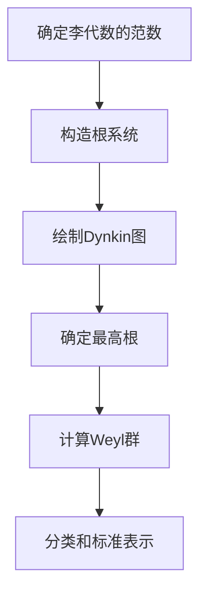

# 李群与李代数基础：第X章 复半单李代数的结构

## 1.背景介绍

在现代数学中,李群和李代数扮演着重要的角色,它们不仅在纯粹数学领域有着广泛的应用,而且在物理学、工程学等许多其他学科中也有着深远的影响。李群是一种连续群,可以看作是矩阵群在无穷小领域的推广。而李代数则是研究李群的重要工具,它是李群上的切空间上的无穷小元素所构成的集合。

复半单李代数是一类特殊的李代数,它们在理论物理学中扮演着关键的角色,特别是在研究超对称理论和量子场论时。复半单李代数不仅在数学上具有丰富的理论结构,而且在物理学中也有着广泛的应用,例如它们可以用来描述基本粒子的内禀对称性。

本章将探讨复半单李代数的结构和性质,包括它们的分类、根系统、Dynkin 图、最高根和Weyl 群等概念。通过对这些概念的深入理解,我们可以更好地把握复半单李代数的本质,并为进一步研究它们在物理学中的应用奠定基础。

## 2.核心概念与联系

### 2.1 李代数

李代数是一种代数结构,由一个向量空间和一个二元运算(通常称为李括号)组成。李代数满足以下性质:

- 双线性: $[aX+bY,Z]=a[X,Z]+b[Y,Z]$, $[X,aY+bZ]=a[X,Y]+b[X,Z]$
- 交换律: $[X,Y]=-[Y,X]$
- 雅可比恒等式: $[X,[Y,Z]]+[Y,[Z,X]]+[Z,[X,Y]]=0$

李代数与李群密切相关,每个李群都对应一个李代数,而李代数则描述了李群在单位元附近的局部结构。

### 2.2 半单李代数

半单李代数是一类特殊的李代数,它们满足以下条件:

- 可分解为一维根空间的直接和
- 存在一个非退化的对称双线性型

半单李代数在李群和李代数理论中扮演着核心的角色,因为任何复单李代数都可以分解为半单李代数的直接和。

### 2.3 复半单李代数

复半单李代数是指底空间为复数域的半单李代数。它们可以分为四大类:

1. 特殊线性李代数 $\mathfrak{sl}(n,\mathbb{C})$
2. 正交李代数 $\mathfrak{so}(n,\mathbb{C})$
3. 简单李代数 $\mathfrak{sp}(n,\mathbb{C})$
4. 例外李代数 $\mathfrak{e}_6,\mathfrak{e}_7,\mathfrak{e}_8,\mathfrak{f}_4,\mathfrak{g}_2$

这些李代数在数学和物理学中都扮演着重要的角色,特别是在研究基本粒子的内禀对称性时。

## 3.核心算法原理具体操作步骤

对于复半单李代数,我们可以通过以下步骤来研究它们的结构:

1. **确定李代数的范数**

   利用李代数的基和Killing型,我们可以计算出李代数元素的范数,这为后续的分类工作奠定了基础。

2. **构造根系统**

   根系统是研究半单李代数的关键工具。我们可以通过计算李代数元素的本征值,从而确定根系统中的根向量。

3. **绘制Dynkin图**

   Dynkin图是一种可视化工具,它可以直观地展示复半单李代数的结构。根据根系统的信息,我们可以绘制出对应的Dynkin图。

4. **确定最高根**

   最高根是根系统中的一个特殊根,它对于确定李代数的类型至关重要。我们可以通过计算每个根向量的范数,从而找到最高根。

5. **计算Weyl群**

   Weyl群是一个有限群,它描述了根系统在整个向量空间中的对称性。了解Weyl群的结构,有助于我们更深入地理解复半单李代数的性质。

6. **分类和标准表示**

   根据上述步骤得到的信息,我们可以将复半单李代数分为不同的类型,并给出它们的标准表示。

通过这些步骤,我们可以系统地研究复半单李代数的结构,为进一步的理论研究和实际应用奠定基础。



## 4.数学模型和公式详细讲解举例说明

### 4.1 Killing型

Killing型是一种在李代数上定义的双线性型,它对于研究李代数的结构至关重要。对于任意的李代数元素 $X,Y$,Killing型可以定义为:

$$
B(X,Y)=\text{tr}(\text{ad}_X\circ\text{ad}_Y)
$$

其中 $\text{ad}_X$ 表示李代数的伴随表示,定义为 $\text{ad}_X(Y)=[X,Y]$。

Killing型具有以下性质:

- 对称性: $B(X,Y)=B(Y,X)$
- 双线性: $B(aX+bY,Z)=aB(X,Z)+bB(Y,Z)$
- 不变性: $B([X,Y],Z)=B(X,[Y,Z])$

利用Killing型,我们可以计算出李代数元素的范数,从而为后续的分类工作奠定基础。

### 4.2 根系统

对于一个半单李代数 $\mathfrak{g}$,存在一个Cartan子代数 $\mathfrak{h}$,使得 $\mathfrak{g}$ 可以分解为 $\mathfrak{h}$ 的根空间的直接和:

$$
\mathfrak{g}=\mathfrak{h}\oplus\bigoplus_{\alpha\in\Phi}\mathfrak{g}_\alpha
$$

其中 $\Phi$ 是一个根系统,表示所有非零根空间 $\mathfrak{g}_\alpha$ 的集合。根系统满足以下性质:

- 对于任意 $\alpha\in\Phi$,存在 $X_\alpha\in\mathfrak{g}_\alpha$,使得 $[H,X_\alpha]=\alpha(H)X_\alpha$
- 如果 $\alpha\in\Phi$,则 $-\alpha\in\Phi$,且 $\mathfrak{g}_\alpha$ 和 $\mathfrak{g}_{-\alpha}$ 是同构的
- 对于任意 $\alpha,\beta\in\Phi$,存在一个整数 $n_{\alpha,\beta}$,使得 $[\mathfrak{g}_\alpha,\mathfrak{g}_\beta]\subseteq\mathfrak{g}_{\alpha+\beta}\oplus\cdots\oplus\mathfrak{g}_{n_{\alpha,\beta}(\alpha+\beta)}$

根系统的结构对于研究复半单李代数至关重要,因为它们的分类和性质与根系统密切相关。

### 4.3 Dynkin图

Dynkin图是一种可视化工具,用于表示复半单李代数的根系统。它由一系列节点组成,每个节点对应一个简根(一组线性无关的根),节点之间的连线表示它们之间的关系。

Dynkin图的构造规则如下:

1. 对于每个简根 $\alpha_i$,在图中画一个节点
2. 如果 $\alpha_i$ 和 $\alpha_j$ 的标量积为 0,则不连接对应的节点
3. 如果 $\alpha_i$ 和 $\alpha_j$ 的标量积为 $-1$,则用一条单线连接对应的节点
4. 如果 $\alpha_i$ 和 $\alpha_j$ 的标量积为 $-\cos(\pi/m)$,则用一条带有标记 $m$ 的线连接对应的节点

Dynkin图不仅直观地展示了复半单李代数的结构,而且还为后续的分类工作提供了重要信息。

### 4.4 最高根和Weyl群

在根系统中,存在一个特殊的根,称为最高根。最高根是指在整个根系统中范数最大的根,记为 $\tilde{\alpha}$。最高根对于确定复半单李代数的类型至关重要。

与最高根相关的另一个重要概念是Weyl群。Weyl群是一个有限群,它描述了根系统在整个向量空间中的对称性。具体来说,对于任意根 $\alpha$,存在一个Weyl群元素 $w$,使得 $w(\alpha)$ 也是一个根。

Weyl群的生成元可以由简根确定,每个简根 $\alpha_i$ 对应一个反射 $s_i$,定义为:

$$
s_i(x)=x-\frac{2(x,\alpha_i)}{(\alpha_i,\alpha_i)}\alpha_i
$$

其中 $(x,y)$ 表示标量积。通过这些生成元,我们可以计算出Weyl群的结构,从而更深入地理解复半单李代数的性质。

## 5.项目实践:代码实例和详细解释说明

为了更好地理解复半单李代数的结构,我们可以通过编写代码来实现一些相关的算法。以下是一个使用Python实现的示例,它可以计算出给定李代数的根系统和Dynkin图。

```python
import numpy as np

# 定义李代数的基和Killing型
basis = [np.array([...]), ...]
killing_form = lambda x, y: np.trace(np.dot(ad(x), ad(y)))

# 计算李代数元素的本征值
def eigenvalues(X):
    evals, evecs = np.linalg.eig(ad(X))
    return evals

# 构造根系统
def root_system(cartan_subalgebra):
    roots = []
    for H in cartan_subalgebra:
        evals = eigenvalues(H)
        for ev in evals:
            if ev != 0:
                roots.append(ev)
    return set(roots)

# 绘制Dynkin图
def draw_dynkin_diagram(simple_roots):
    # 计算简根之间的标量积
    angles = []
    for i in range(len(simple_roots)):
        row = []
        for j in range(len(simple_roots)):
            row.append(killing_form(simple_roots[i], simple_roots[j]))
        angles.append(row)
    
    # 绘制Dynkin图
    # ...

# 主函数
if __name__ == "__main__":
    # 输入李代数的基和Cartan子代数
    basis = [...]
    cartan_subalgebra = [...]
    
    # 计算根系统
    roots = root_system(cartan_subalgebra)
    
    # 找到简根
    simple_roots = ...
    
    # 绘制Dynkin图
    draw_dynkin_diagram(simple_roots)
```

在这个示例中,我们首先定义了李代数的基和Killing型。然后,我们实现了一个函数 `eigenvalues`来计算李代数元素的本征值,这是构造根系统的关键步骤。

接下来,我们定义了一个函数 `root_system`来构造给定李代数的根系统。这个函数遍历Cartan子代数中的每个元素,计算它们的本征值,并将非零本征值视为根。

最后,我们实现了一个函数 `draw_dynkin_diagram`来绘制Dynkin图。这个函数首先计算简根之间的标量积,然后根据标量积的值确定节点之间的连线情况,从而绘制出完整的Dynkin图。

通过编写这样的代码,我们不仅可以加深对复半单李代数理论的理解,而且还可以将这些理论应用于实际问题的求解。

## 6.实际应用场景

复半单李代数在物理学中有着广泛的应用,特别是在研究基本粒子的内禀对称性时。以下是一些具体的应用场景:

### 6.1 量子场论

在量子场论中,我们通常使用复半单李代数来描述基本粒子的内禀对称性。例如,在标准模型中,强相互作用的对称性由 $\mathfrak{su}(3)$ 李代数描述,而电弱相互作用的对称性则由 $\mathfrak{su}(2)\oplus\mathfrak{u}(1)$ 李代数描述。

通过研究这些李代数的表示理论,我们可以预测存在哪些基本粒子,并计算出它们的各种性质,如电荷、自旋等。这为进一步发展量子场论奠定了基础。

### 6.2 超对称理论

超对称理论是一种试图统一所有基本相互作用的理论,