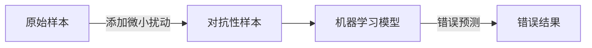
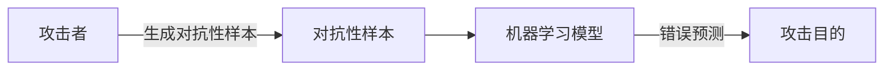
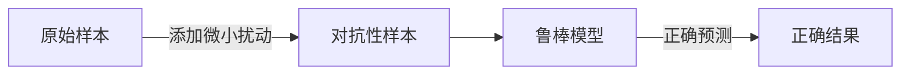
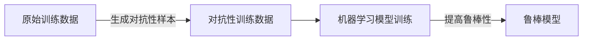
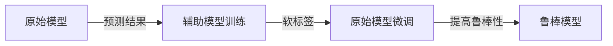

# 模型安全与对抗攻防原理与代码实战案例讲解

## 1.背景介绍

### 1.1 人工智能模型的广泛应用

随着人工智能技术的快速发展,机器学习模型已经广泛应用于各个领域,如计算机视觉、自然语言处理、推荐系统等。这些模型能够从大量数据中学习,并对新数据进行预测和决策。然而,机器学习模型也面临着安全威胁,例如对抗性样本攻击、隐私泄露等,这可能会导致模型失效或被恶意利用。

### 1.2 对抗性样本攻击

对抗性样本攻击是指通过对输入数据进行精心设计的微小扰动,使得机器学习模型产生错误的预测结果。这种攻击手段可能会导致严重的安全隐患,如自动驾驶系统失灵、人脸识别系统被欺骗等。因此,提高模型的鲁棒性,抵御对抗性样本攻击,成为了模型安全领域的重要课题。

### 1.3 模型安全的重要性

随着人工智能系统在关键基础设施和安全敏感领域的广泛应用,模型安全问题日益受到重视。确保模型的鲁棒性和可靠性,不仅可以保护用户隐私和系统安全,还可以增强公众对人工智能技术的信任。因此,研究模型安全与对抗攻防原理,并提出有效的防御措施,对于促进人工智能技术的健康发展至关重要。

## 2.核心概念与联系

### 2.1 对抗性样本

对抗性样本(Adversarial Examples)是指通过对原始样本进行精心设计的微小扰动,使得机器学习模型产生错误预测的样本。这种扰动通常是人眼难以察觉的,但却能够欺骗模型,导致错误的预测结果。



### 2.2 对抗性攻击

对抗性攻击(Adversarial Attacks)是指利用对抗性样本来欺骗机器学习模型的攻击方式。攻击者通过生成对抗性样本,使模型产生错误预测,从而达到攻击目的。根据攻击者对模型的了解程度,对抗性攻击可分为白盒攻击(White-box Attack)和黑盒攻击(Black-box Attack)。



### 2.3 模型鲁棒性

模型鲁棒性(Model Robustness)是指机器学习模型对于输入扰动的稳健性,即模型在面临对抗性样本攻击时,能够保持正确的预测结果。提高模型鲁棒性是抵御对抗性攻击的关键,可以通过对抗训练、防御蒸馏等方法来实现。



### 2.4 对抗训练

对抗训练(Adversarial Training)是提高模型鲁棒性的一种有效方法。它通过在训练过程中引入对抗性样本,使模型学习到对抗性扰动的特征,从而提高对抗性攻击的防御能力。



### 2.5 防御蒸馏

防御蒸馏(Defensive Distillation)是另一种提高模型鲁棒性的方法。它通过训练一个辅助模型,将原始模型的预测结果作为软标签,然后将辅助模型的预测结果传递回原始模型,从而提高模型对扰动的鲁棒性。



## 3.核心算法原理具体操作步骤

### 3.1 生成对抗性样本

生成对抗性样本是对抗性攻击的关键步骤。常见的方法包括快速梯度符号法(Fast Gradient Sign Method, FGSM)、投射梯度下降法(Projected Gradient Descent, PGD)等。

#### 3.1.1 快速梯度符号法(FGSM)

FGSM是一种简单而有效的对抗性样本生成方法。它通过计算损失函数关于输入的梯度,并沿着梯度的方向添加扰动,生成对抗性样本。具体步骤如下:

1. 计算损失函数 $J(\theta, x, y)$ 关于输入 $x$ 的梯度 $\nabla_x J(\theta, x, y)$
2. 生成对抗性样本 $x^{adv} = x + \epsilon \cdot sign(\nabla_x J(\theta, x, y))$,其中 $\epsilon$ 是扰动大小

```python
def fgsm(model, X, y, epsilon):
    X_adv = X.clone().detach().requires_grad_(True)
    loss = nn.CrossEntropyLoss()(model(X_adv), y)
    loss.backward()
    X_adv = X_adv + epsilon * X_adv.grad.sign()
    X_adv = torch.clamp(X_adv, 0, 1)
    return X_adv
```

#### 3.1.2 投射梯度下降法(PGD)

PGD是一种更强大的对抗性样本生成方法,它通过多次迭代,逐步更新对抗性样本,从而生成更强的对抗性样本。具体步骤如下:

1. 初始化对抗性样本 $x^{adv}_0 = x$
2. 对于每一步迭代 $i=1,2,...,N$:
    - 计算损失函数 $J(\theta, x^{adv}_{i-1}, y)$ 关于输入的梯度 $\nabla_{x^{adv}_{i-1}} J(\theta, x^{adv}_{i-1}, y)$
    - 更新对抗性样本 $x^{adv}_i = \Pi_{x+\epsilon}(x^{adv}_{i-1} + \alpha \cdot sign(\nabla_{x^{adv}_{i-1}} J(\theta, x^{adv}_{i-1}, y)))$,其中 $\Pi_{x+\epsilon}$ 是投影操作,确保扰动大小在 $\epsilon$ 范围内
3. 输出最终的对抗性样本 $x^{adv} = x^{adv}_N$

```python
def pgd(model, X, y, epsilon, alpha, num_iter):
    X_adv = X.clone().detach()
    for i in range(num_iter):
        X_adv.requires_grad_(True)
        loss = nn.CrossEntropyLoss()(model(X_adv), y)
        loss.backward()
        X_adv = X_adv + alpha * X_adv.grad.sign()
        X_adv = torch.clamp(X_adv, X - epsilon, X + epsilon)
        X_adv = torch.clamp(X_adv, 0, 1)
    return X_adv
```

### 3.2 对抗训练

对抗训练是提高模型鲁棒性的一种有效方法,它通过在训练过程中引入对抗性样本,使模型学习到对抗性扰动的特征,从而提高对抗性攻击的防御能力。具体步骤如下:

1. 初始化模型参数 $\theta$
2. 对于每一个小批量训练数据 $(X, y)$:
    - 生成对抗性样本 $X^{adv}$ (使用FGSM或PGD等方法)
    - 计算对抗性损失 $J^{adv}(\theta, X^{adv}, y)$
    - 计算原始损失 $J^{nat}(\theta, X, y)$
    - 计算总损失 $J(\theta, X, y, X^{adv}, y) = J^{nat}(\theta, X, y) + \lambda \cdot J^{adv}(\theta, X^{adv}, y)$,其中 $\lambda$ 是对抗性损失的权重
    - 更新模型参数 $\theta$ 以最小化总损失
3. 重复步骤2,直到模型收敛

```python
def adv_train(model, train_loader, optimizer, epsilon, alpha, num_iter, num_epochs):
    for epoch in range(num_epochs):
        for X, y in train_loader:
            X_adv = pgd(model, X, y, epsilon, alpha, num_iter)
            loss_nat = nn.CrossEntropyLoss()(model(X), y)
            loss_adv = nn.CrossEntropyLoss()(model(X_adv), y)
            loss = loss_nat + 0.5 * loss_adv
            optimizer.zero_grad()
            loss.backward()
            optimizer.step()
```

### 3.3 防御蒸馏

防御蒸馏是另一种提高模型鲁棒性的方法,它通过训练一个辅助模型,将原始模型的预测结果作为软标签,然后将辅助模型的预测结果传递回原始模型,从而提高模型对扰动的鲁棒性。具体步骤如下:

1. 初始化原始模型 $F$ 和辅助模型 $G$
2. 对于每一个小批量训练数据 $(X, y)$:
    - 计算原始模型的预测结果 $F(X)$
    - 将 $F(X)$ 作为软标签,训练辅助模型 $G$ 以最小化损失 $J(G(X), F(X))$
    - 计算辅助模型的预测结果 $G(X)$
    - 将 $G(X)$ 作为软标签,训练原始模型 $F$ 以最小化损失 $J(F(X), G(X))$
3. 重复步骤2,直到模型收敛

```python
def defensive_distillation(model_F, model_G, train_loader, optimizer_F, optimizer_G, temp=1.0):
    for X, y in train_loader:
        # Train model G
        logits_F = model_F(X) / temp
        loss_G = nn.KLDivLoss()(nn.LogSoftmax(dim=1)(model_G(X) / temp), nn.Softmax(dim=1)(logits_F))
        optimizer_G.zero_grad()
        loss_G.backward()
        optimizer_G.step()

        # Train model F
        logits_G = model_G(X) / temp
        loss_F = nn.KLDivLoss()(nn.LogSoftmax(dim=1)(model_F(X) / temp), nn.Softmax(dim=1)(logits_G))
        optimizer_F.zero_grad()
        loss_F.backward()
        optimizer_F.step()
```

## 4.数学模型和公式详细讲解举例说明

### 4.1 快速梯度符号法(FGSM)

快速梯度符号法(FGSM)是一种生成对抗性样本的简单而有效的方法。它通过计算损失函数关于输入的梯度,并沿着梯度的方向添加扰动,生成对抗性样本。

对于给定的输入样本 $x$,目标标签 $y$,模型参数 $\theta$,损失函数 $J(\theta, x, y)$,FGSM生成对抗性样本 $x^{adv}$ 的公式如下:

$$x^{adv} = x + \epsilon \cdot sign(\nabla_x J(\theta, x, y))$$

其中,

- $\epsilon$ 是扰动大小,控制扰动的强度
- $sign(\cdot)$ 是符号函数,用于保持扰动的方向一致
- $\nabla_x J(\theta, x, y)$ 是损失函数关于输入 $x$ 的梯度

通过添加扰动 $\epsilon \cdot sign(\nabla_x J(\theta, x, y))$,FGSM可以生成对抗性样本 $x^{adv}$,使得模型对 $x^{adv}$ 的预测结果与真实标签 $y$ 存在较大差异。

例如,在图像分类任务中,给定一张狗的图像 $x$,其真实标签为"狗"。我们可以使用FGSM生成对抗性样本 $x^{adv}$,使得模型将其错误地预测为"猫"或其他类别。

### 4.2 投射梯度下降法(PGD)

投射梯度下降法(PGD)是一种更强大的对抗性