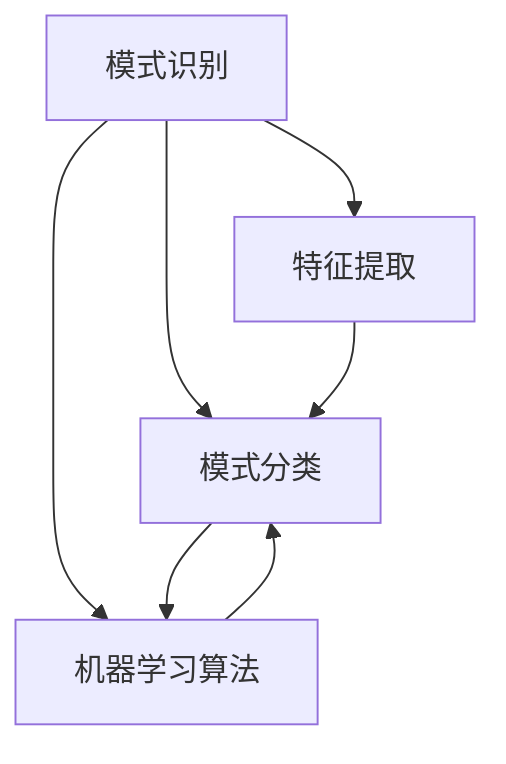

# 模式识别 原理与代码实例讲解

## 1. 背景介绍

模式识别是人工智能领域的一个重要分支,旨在从复杂的数据中提取有用的信息和规律。它广泛应用于计算机视觉、语音识别、自然语言处理、生物信息学等诸多领域。随着数据量的不断增加和计算能力的提高,模式识别技术正在快速发展,为各个领域带来了革命性的变化。

### 1.1 模式识别的定义

模式识别是一种自动化的技术,它通过提取数据中的特征,将其与已知的模式进行匹配,从而识别和分类对象或事件。这个过程包括以下几个关键步骤:

1. 数据采集和预处理
2. 特征提取
3. 模式分类和识别

### 1.2 模式识别的重要性

模式识别技术在现代社会中扮演着越来越重要的角色,因为它可以帮助我们从海量数据中发现隐藏的知识和规律。以下是一些典型应用场景:

- 计算机视觉:图像识别、目标检测和跟踪
- 语音识别:语音转文本、语音命令识别
- 自然语言处理:文本分类、情感分析、机器翻译
- 生物信息学:基因序列分析、蛋白质结构预测
- 金融:欺诈检测、风险评估、市场预测
- 安全:人脸识别、指纹识别、入侵检测

## 2. 核心概念与联系

模式识别的核心概念包括特征提取、模式分类和机器学习算法。这些概念相互关联,共同构成了模式识别的理论基础。



### 2.1 特征提取

特征提取是模式识别中的关键步骤,旨在从原始数据中提取出最能代表对象或事件本质特征的信息。良好的特征提取可以大大提高模式识别的准确性和效率。常用的特征提取方法包括:

- 统计特征:均值、方差、直方图等
- 几何特征:形状、边缘、角点等
- 频域特征:傅里叶变换、小波变换等
- 结构特征:树、图等

### 2.2 模式分类

模式分类是将提取的特征与已知模式进行匹配,并将其归类到相应的类别中。常用的模式分类方法包括:

- 统计模式分类:贝叶斯分类器、高斯混合模型等
- 神经网络分类:前馈神经网络、卷积神经网络等
- 支持向量机分类
- 决策树和随机森林分类
- 聚类分析:K-means、层次聚类等

### 2.3 机器学习算法

机器学习算法是模式识别中不可或缺的一部分,它可以从大量数据中自动学习特征和模式,并不断优化模型参数,提高识别精度。常用的机器学习算法包括:

- 监督学习:线性回归、逻辑回归、支持向量机等
- 无监督学习:K-means聚类、主成分分析、自编码器等
- 强化学习:Q-Learning、策略梯度等
- 深度学习:卷积神经网络、递归神经网络、生成对抗网络等

## 3. 核心算法原理具体操作步骤

在模式识别中,常用的核心算法包括K-近邻算法(KNN)、支持向量机(SVM)、决策树、随机森林和神经网络等。下面我们将详细介绍其中的KNN算法和SVM算法的原理和具体操作步骤。

### 3.1 K-近邻算法(KNN)

KNN算法是一种基于实例的学习算法,它通过计算待分类样本与已知样本之间的距离,找到与其最近的K个邻居,并根据这些邻居的类别进行投票,将待分类样本归类到票数最多的类别中。

#### 3.1.1 算法原理

KNN算法的核心思想是基于"相似性"原理,即如果两个样本在特征空间中距离较近,那么它们很可能属于同一类别。因此,KNN算法的关键在于定义合适的距离度量和选择合适的K值。

常用的距离度量包括欧氏距离、曼哈顿距离和余弦相似度等。K值的选择需要根据具体问题进行交叉验证,一般取一个较小的奇数值。

#### 3.1.2 算法步骤

1. 准备训练数据和测试数据
2. 选择合适的距离度量
3. 对于每个测试样本:
   a. 计算其与所有训练样本的距离
   b. 选择与其最近的K个邻居
   c. 根据这K个邻居的类别进行投票
   d. 将测试样本归类到票数最多的类别中
4. 计算分类准确率

### 3.2 支持向量机(SVM)

支持向量机是一种有监督的机器学习算法,它可以用于分类和回归问题。SVM的基本思想是在高维空间中构造一个超平面,将不同类别的样本分开,并使得两类样本间的间隔最大化。

#### 3.2.1 算法原理

SVM算法的核心思想是通过构造一个最优超平面,将不同类别的样本分开。这个超平面应该使得两类样本间的间隔最大化,从而提高分类的鲁棒性和泛化能力。

在线性不可分的情况下,SVM算法会通过核技巧将原始数据映射到高维空间,使其在高维空间中变为线性可分。常用的核函数包括线性核、多项式核和高斯核等。

#### 3.2.2 算法步骤

1. 准备训练数据和测试数据
2. 选择合适的核函数
3. 构造拉格朗日函数,求解对偶问题
4. 找到支持向量和对应的系数
5. 构造分类决策函数
6. 对测试样本进行分类
7. 计算分类准确率

## 4. 数学模型和公式详细讲解举例说明

模式识别中常用的数学模型和公式包括距离度量、核函数、拉格朗日函数等,下面我们将详细讲解其中的几个重要概念。

### 4.1 距离度量

距离度量是衡量两个样本相似性的重要指标,在KNN算法和聚类分析中扮演着关键作用。常用的距离度量包括:

#### 4.1.1 欧氏距离

欧氏距离是最常用的距离度量,它定义为两个向量在n维空间中的直线距离:

$$d(x,y) = \sqrt{\sum_{i=1}^{n}(x_i-y_i)^2}$$

其中,x和y是n维向量。

#### 4.1.2 曼哈顿距离

曼哈顿距离也称为城市街区距离,它定义为两个向量在n维空间中的绝对差之和:

$$d(x,y) = \sum_{i=1}^{n}|x_i-y_i|$$

曼哈顿距离计算速度较快,但对异常值较为敏感。

#### 4.1.3 余弦相似度

余弦相似度常用于文本挖掘和推荐系统中,它衡量两个向量的方向相似性:

$$\text{sim}(x,y) = \frac{x \cdot y}{\|x\| \|y\|}$$

其中,x和y是n维向量,x·y表示向量点乘,||x||和||y||分别表示向量的L2范数。

### 4.2 核函数

核函数是SVM算法中的关键概念,它用于将原始数据映射到高维空间,使得线性不可分的问题变为线性可分。常用的核函数包括:

#### 4.2.1 线性核

线性核是最简单的核函数,它实际上就是向量点乘:

$$K(x,y) = x \cdot y$$

#### 4.2.2 多项式核

多项式核可以捕捉样本之间的非线性关系:

$$K(x,y) = (\gamma x \cdot y + r)^d$$

其中,γ是一个常数,r是偏置项,d是多项式的次数。

#### 4.2.3 高斯核

高斯核也称为RBF核,它是一种常用的非线性核函数:

$$K(x,y) = \exp(-\gamma \|x-y\|^2)$$

其中,γ是一个超参数,控制着核函数的宽度。

### 4.3 拉格朗日函数

拉格朗日函数是SVM算法中求解最优化问题的关键工具。对于线性可分的情况,我们可以构造如下拉格朗日函数:

$$L(w,b,\alpha) = \frac{1}{2}\|w\|^2 - \sum_{i=1}^{n}\alpha_i[y_i(w^Tx_i+b)-1]$$

其中,w是超平面的法向量,b是超平面的偏移量,α是拉格朗日乘子,满足αi≥0和Σαiyi=0。

通过求解拉格朗日函数的对偶问题,我们可以找到支持向量和对应的系数,从而构造出最优分类超平面。

## 5. 项目实践:代码实例和详细解释说明

为了帮助读者更好地理解模式识别的原理和实现,我们将提供一个基于Python的实例项目,包括KNN算法和SVM算法的代码实现。

### 5.1 KNN算法实现

```python
import numpy as np
from collections import Counter

def euclidean_distance(x1, x2):
    return np.sqrt(np.sum((x1 - x2)**2))

class KNN:
    def __init__(self, k=3):
        self.k = k
        self.X_train = None
        self.y_train = None

    def fit(self, X, y):
        self.X_train = X
        self.y_train = y

    def predict(self, X):
        y_pred = [self._predict(x) for x in X]
        return np.array(y_pred)

    def _predict(self, x):
        # 计算所有训练样本与当前测试样本的距离
        distances = [euclidean_distance(x, x_train) for x_train in self.X_train]

        # 获取距离最小的k个训练样本的标签
        k_indices = np.argsort(distances)[:self.k]
        k_nearest_labels = [self.y_train[i] for i in k_indices]

        # 投票选出最多的标签
        most_common = Counter(k_nearest_labels).most_common(1)
        return most_common[0][0]
```

在上面的代码中,我们首先定义了欧氏距离函数euclidean_distance,用于计算两个样本之间的距离。然后,我们定义了KNN类,包含了fit和predict两个方法。

在fit方法中,我们将训练数据存储在X_train和y_train中。在predict方法中,我们遍历每个测试样本,调用_predict方法进行预测。

在_predict方法中,我们首先计算当前测试样本与所有训练样本的距离,然后选择距离最近的k个训练样本的标签。接着,我们使用Counter类统计这k个标签中出现次数最多的标签,并将其作为预测结果返回。

### 5.2 SVM算法实现

```python
import numpy as np

class SVM:
    def __init__(self, kernel='linear', C=1.0, gamma=0.1):
        self.kernel = kernel
        self.C = C
        self.gamma = gamma
        self.alpha = None
        self.support_vectors = None
        self.support_vector_labels = None
        self.b = None

    def fit(self, X, y):
        n_samples, n_features = X.shape
        K = self._get_kernel(X, X)

        # 构造拉格朗日函数
        P = cvxopt.matrix(np.outer(y, y) * K)
        q = cvxopt.matrix(-np.ones(n_samples))
        G = cvxopt.matrix(np.vstack((-np.eye(n_samples), np.eye(n_samples))))
        h = cvxopt.matrix(np.hstack((np.zeros(n_samples), np.ones(n_samples) * self.C)))
        A = cvxopt.matrix(y, (1, n_samples))
        b = cvxopt.matrix(0.0)

        # 求解对偶问题
        solution = cvxopt.solvers.qp(P, q, G, h, A, b)
        self.alpha = np.ravel(solution['x'])

        # 获取支持向量和对应的系数
        sv_indices = np.where(self.alpha > 1e-5)[0]
        self.support_vectors = X[sv_indices]
        self.support_vector_labels = y[sv_indices]
        self.support_vector_alphas = self.alpha