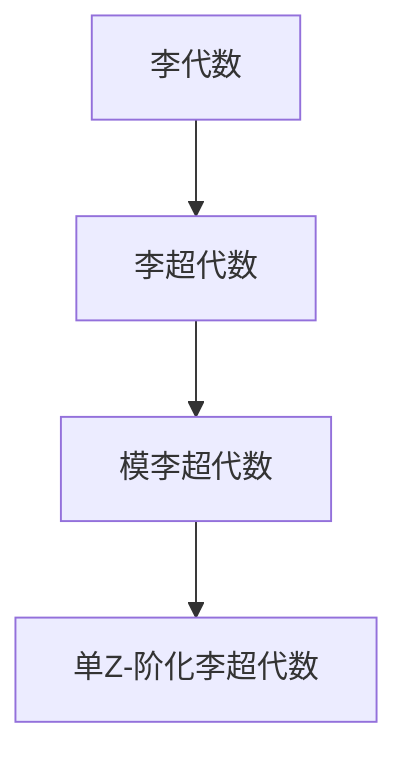

# 模李超代数：单Z-阶化李超代数的结合型

## 1. 背景介绍

在数学和理论物理学的研究中,李代数和李超代数扮演着重要的角色。它们是研究对称性、不变量和守恒定律的强大工具。李代数是研究连续对称性的基础,而李超代数则用于描述费米子系统中的对称性。

然而,传统的李代数和李超代数理论存在一些局限性,无法完全描述一些更复杂的物理系统。为了解决这个问题,数学家们提出了一种新的代数结构——模李超代数(Modulo Lie Superalgebras)。

模李超代数是一种新兴的代数结构,它将李超代数与模运算相结合,从而扩展了传统李超代数的表达能力。其中,单Z-阶化李超代数(Single Z-graded Lie Superalgebras)是模李超代数的一个特殊情况,具有更简单的结构和更丰富的性质。

## 2. 核心概念与联系

### 2.1 李代数和李超代数

李代数是一种代数结构,由一个向量空间和一个二元运算(通常称为李括号)组成。李代数广泛应用于物理学、几何学和数学的各个领域,特别是在研究连续对称性和守恒定律时扮演着关键角色。

李超代数则是李代数的一种推广,它不仅包含了偶元(即通常的向量),还包含了奇元(即反常量)。李超代数在描述费米子系统(如电子、夸克等)的对称性时非常有用。

### 2.2 模运算和模李超代数

模运算是一种在代数结构中引入等价关系的运算。在模李超代数中,我们将李超代数的向量空间与一个理想(ideal)相模,从而得到一个新的代数结构。

形式上,给定一个李超代数 $\mathcal{L}$ 和它的一个理想 $\mathcal{I}$,我们定义模李超代数为商空间 $\mathcal{L}/\mathcal{I}$,其中两个元素 $x,y \in \mathcal{L}$ 被视为等价(记作 $x \sim y$)当且仅当它们的差 $x-y \in \mathcal{I}$。

模李超代数保留了李超代数的基本性质,同时也具有一些新的有趣的性质。例如,它可以描述一些更复杂的对称性,并且在某些情况下可以简化计算。

### 2.3 单Z-阶化李超代数

单Z-阶化李超代数是模李超代数的一个特殊情况,它具有更简单的结构和更丰富的性质。在单Z-阶化李超代数中,向量空间被分解为不同的同度数子空间,并且李括号满足一定的同度数条件。

更精确地说,一个单Z-阶化李超代数 $\mathcal{L}$ 是一个 $\mathbb{Z}$-阶化的李超代数,即 $\mathcal{L}$ 可以分解为直和 $\mathcal{L} = \bigoplus_{n \in \mathbb{Z}} \mathcal{L}_n$,其中 $\mathcal{L}_n$ 是 $\mathcal{L}$ 的同度数 $n$ 的子空间,并且李括号满足 $[\mathcal{L}_m, \mathcal{L}_n] \subseteq \mathcal{L}_{m+n}$ 对于所有 $m,n \in \mathbb{Z}$。

单Z-阶化李超代数不仅具有更简单的结构,而且还具有一些特殊的性质,例如它们的表示理论和内在对称性等。这些性质使得单Z-阶化李超代数在数学和物理学中有着广泛的应用。

### 2.4 Mermaid 流程图

下面的 Mermaid 流程图展示了模李超代数、单Z-阶化李超代数和传统李代数、李超代数之间的关系:

## 3. 核心算法原理具体操作步骤

### 3.1 构造单Z-阶化李超代数

构造单Z-阶化李超代数的基本步骤如下:

1. 确定基本向量空间 $V$,并将其分解为不同的同度数子空间 $V = \bigoplus_{n \in \mathbb{Z}} V_n$。
2. 在每个同度数子空间 $V_n$ 上定义一个李括号运算 $[\cdot,\cdot]_n: V_n \times V_n \rightarrow V_n$,使得 $(V_n, [\cdot,\cdot]_n)$ 成为一个李代数。
3. 将不同同度数子空间的李括号扩展到整个向量空间 $V$ 上,使得对于任意 $x \in V_m, y \in V_n$,有 $[x,y] \in V_{m+n}$,并且满足李代数的公理。

更精确地说,对于任意 $x \in V_m, y \in V_n$,我们定义 $[x,y] = [x,y]_{m+n}$,其中 $[\cdot,\cdot]_{m+n}: V_m \times V_n \rightarrow V_{m+n}$ 是一个双线性映射,满足:

1. 交换律: $[x,y] = -(-1)^{|x||y|}[y,x]$,其中 $|x|$ 和 $|y|$ 分别表示 $x$ 和 $y$ 的度数(偶元为 0,奇元为 1)。
2. jacobi 恒等式: $(-1)^{|x||z|}[[x,y],z] + (-1)^{|y||x|}[[y,z],x] + (-1)^{|z||y|}[[z,x],y] = 0$。

通过这种方式,我们就构造了一个单Z-阶化李超代数 $\mathcal{L} = \bigoplus_{n \in \mathbb{Z}} V_n$,其中李括号满足 $[\mathcal{L}_m, \mathcal{L}_n] \subseteq \mathcal{L}_{m+n}$。

### 3.2 单Z-阶化李超代数的结合型

在研究单Z-阶化李超代数的性质时,一个重要的概念是结合型(combination type)。结合型描述了一个单Z-阶化李超代数中不同同度数子空间之间的结构关系。

更精确地说,对于一个单Z-阶化李超代数 $\mathcal{L} = \bigoplus_{n \in \mathbb{Z}} \mathcal{L}_n$,我们定义它的结合型为一个序列 $\{c_n\}_{n \in \mathbb{Z}}$,其中 $c_n$ 表示 $\mathcal{L}_n$ 的维数。

结合型不仅描述了单Z-阶化李超代数的基本结构,而且还与其他重要性质密切相关,例如表示理论、对称性等。因此,研究单Z-阶化李超代数的结合型是非常重要的。

### 3.3 计算单Z-阶化李超代数的结合型

计算单Z-阶化李超代数的结合型是一个关键步骤,它需要利用李括号的性质和一些技巧。下面是一种常见的计算方法:

1. 确定基本向量空间 $V$ 的分解 $V = \bigoplus_{n \in \mathbb{Z}} V_n$,以及每个 $V_n$ 上的李括号 $[\cdot,\cdot]_n$。
2. 计算每个 $V_n$ 的维数 $\dim V_n$,即 $c_n = \dim V_n$。
3. 利用李括号的性质,计算 $[\mathcal{L}_m, \mathcal{L}_n] \subseteq \mathcal{L}_{m+n}$ 的维数。
4. 根据步骤 3 的结果,建立一个关于 $c_n$ 的递推关系式。
5. 解递推关系式,得到 $c_n$ 的解析表达式或数值结果。

在实际计算中,我们还需要利用一些技巧和方法来简化计算,例如使用生成元、根系统等概念。下面我们将通过一个具体例子来说明计算过程。

### 3.4 例子:计算某个单Z-阶化李超代数的结合型

考虑一个由奇元 $\{x_i\}_{i=1}^m$ 和偶元 $\{y_j\}_{j=1}^n$ 生成的单Z-阶化李超代数 $\mathcal{L}$,其中 $x_i$ 的度数为 $1$,而 $y_j$ 的度数为 $0$。假设它们的非零李括号为:

$$
[x_i, x_j] = 2y_{ij}, \quad [x_i, y_j] = \alpha_{ij}^k x_k, \quad [y_i, y_j] = \beta_{ij}^k y_k
$$

其中 $\alpha_{ij}^k, \beta_{ij}^k$ 是一些结构常数。

我们可以按照如下步骤计算 $\mathcal{L}$ 的结合型:

1. 确定基本向量空间的分解:
   $$
   \mathcal{L} = \mathcal{L}_{-1} \oplus \mathcal{L}_0 \oplus \mathcal{L}_1
   $$
   其中 $\mathcal{L}_{-1} = 0$, $\mathcal{L}_0$ 由 $\{y_j\}$ 生成, $\mathcal{L}_1$ 由 $\{x_i\}$ 生成。

2. 计算每个同度数子空间的维数:
   $$
   c_{-1} = 0, \quad c_0 = n, \quad c_1 = m
   $$

3. 利用李括号的性质计算 $[\mathcal{L}_m, \mathcal{L}_n]$ 的维数:
   $$
   \begin{aligned}
   [\mathcal{L}_0, \mathcal{L}_0] &\subseteq \mathcal{L}_0 \\
   [\mathcal{L}_0, \mathcal{L}_1] &\subseteq \mathcal{L}_1 \\
   [\mathcal{L}_1, \mathcal{L}_1] &\subseteq \mathcal{L}_2
   \end{aligned}
   $$

4. 建立递推关系式:
   $$
   \begin{aligned}
   c_2 &= \frac{1}{2} \dim [\mathcal{L}_1, \mathcal{L}_1] \\
       &= \frac{1}{2} \dim \operatorname{span}\{2y_{ij} \mid 1 \leq i < j \leq m\} \\
       &= \binom{m}{2}
   \end{aligned}
   $$

5. 解递推关系式,得到结合型为:
   $$
   \{c_n\}_{n \in \mathbb{Z}} = \{\cdots, 0, 0, \binom{m}{2}, m, n, 0, 0, \cdots\}
   $$

通过这个例子,我们可以看到计算单Z-阶化李超代数结合型的基本步骤和一些技巧。在实际应用中,我们还需要根据具体情况选择合适的方法和技巧。

## 4. 数学模型和公式详细讲解举例说明

在上一节中,我们已经介绍了计算单Z-阶化李超代数结合型的一般步骤。现在,我们将通过一个具体例子,详细讲解相关的数学模型和公式。

### 4.1 例子:计算某个特殊单Z-阶化李超代数的结合型

考虑一个由一个奇元 $x$ 和两个偶元 $y_1, y_2$ 生成的单Z-阶化李超代数 $\mathcal{L}$,其非零李括号为:

$$
[x, x] = 2y_1, \quad [x, y_1] = y_2, \quad [x, y_2] = 0
$$

我们将按照如下步骤计算 $\mathcal{L}$ 的结合型:

1. 确定基本向量空间的分解:
   $$
   \mathcal{L} = \mathcal{L}_{-1} \oplus \mathcal{L}_0 \oplus \mathcal{L}_1
   $$
   其中 $\mathcal{L}_{-1} = 0$, $\mathcal{L}_0$ 由 $\{y_1, y_2\}$ 生成, $\mathcal{L}_1$ 由 $\{x\}$ 生成。

2. 计算每个同度数子空间的维数:
   $$
   c_{-1} = 0, \quad c_0 = 2, \quad c_1 = 1
   $$

3. 利用李括号的性质计算 $[\mathcal{L}_m, \mathcal{L}_n]$ 的维数:
   $$
   \begin{aligned}
   [\mathcal{