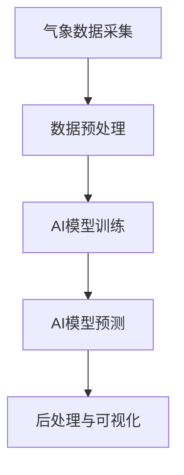

# 气候模型预测中的AI应用：准确预报自然灾害

## 1.背景介绍

### 1.1 气候变化与自然灾害

近年来,全球气候变化日益严重,极端天气事件频繁发生,造成了巨大的人员伤亡和经济损失。据统计,2022年全球因自然灾害造成的经济损失高达2650亿美元。气候变化导致的自然灾害主要包括:

- 热浪
- 严重干旱
- 森林火灾
- 暴雨洪水
- 强台风/飓风

这些灾害不仅威胁着人类生命安全,也给农业生产、基础设施等造成巨大破坏。因此,准确预报自然灾害,提高防灾减灾能力,已经成为当前亟待解决的重大课题。

### 1.2 传统气候模型的局限性  

传统的气候预测模型主要依赖于物理方程、统计模型等,存在一些局限性:

- 复杂的大气环流系统难以用简单方程精确描述
- 缺乏对复杂非线性系统的建模能力
- 数据质量和分辨率的限制影响预测精度
- 计算能力有限,难以处理海量高维度气象数据

因此,传统气候模型在捕捉极端天气的细微征兆、提高预测精度方面仍显不足。

### 1.3 AI在气候预测中的应用前景

近年来,人工智能(AI)技术在气候和天气预报领域展现出巨大的应用前景:

- 深度学习能力强,可以从海量数据中自动发现复杂模式
- 机器学习算法能够高效建模非线性、高维度的气象系统
- 大数据和云计算为AI气候模型提供了强大的计算支持
- AI可与传统数值模型相结合,发挥各自优势,提高预测精度

本文将重点探讨AI在气候模型预测中的应用,尤其是自然灾害的准确预报,并介绍相关核心技术、实践案例及发展趋势。

## 2.核心概念与联系

### 2.1 AI气候模型的基本框架

AI气候模型通常由以下几个核心组件组成:

1. **气象数据采集**: 收集地面站、雷达、卫星等多源异构气象数据
2. **数据预处理**: 进行数据清洗、标准化、降噪等预处理
3. **AI模型训练**: 使用机器学习或深度学习算法训练AI气候模型
4. **AI模型预测**: 输入新的气象数据,模型预测未来的气候状态
5. **后处理与可视化**: 对模型输出进行后处理,并以直观的形式呈现

### 2.2 AI气候模型的关键技术

#### 2.2.1 深度学习模型

深度学习是AI气候模型的核心技术,主要包括:

- **卷积神经网络(CNN)**: 擅长从高维数据(如卫星云图)中自动提取特征
- **循环神经网络(RNN)**: 适合对序列数据(如时间序列)建模
- **生成对抗网络(GAN)**: 可用于气候数据增强、超分辨率重构等
- **注意力机制(Attention)**: 赋予模型对重要特征的选择性聚焦能力
- **图神经网络(GNN)**: 适合对具有复杂拓扑结构的气候系统建模

#### 2.2.2 机器学习算法

除深度学习外,一些经典的机器学习算法也广泛应用于气候模型:

- **随机森林(RF)**: 集成学习方法,对异常值不敏感,常用于气候分类任务
- **支持向量机(SVM)**: 有较强的泛化能力,适合小数据场景
- **贝叶斯方法**: 结合先验知识,用于不确定性建模
- **聚类算法**: 如K-Means,常用于发现气候模式和异常值检测

#### 2.2.3 数据驱动的混合建模

AI气候模型往往需要与传统的物理模型相结合,形成数据驱动的混合建模范式:

- **子模型融合**: 将AI模型与数值模型的输出进行融合,发挥各自优势
- **参数估计**: 使用AI技术估计物理模型中的部分参数,提高模型精度
- **误差修正**: AI模型用于对物理模型的系统性偏差进行修正
- **子栅格建模**: 在物理模型的基础上,使用AI对高分辨率子区域进行建模

### 2.3 AI气候模型的优缺点

#### 2.3.1 优点

- 强大的非线性建模能力,适合复杂气候系统
- 可从海量数据中自动发现隐藏的模式和规律
- 计算效率高,可处理高维度、高分辨率数据
- 与物理模型相结合,能够发挥各自的优势
- 预测精度和鲁棒性较好,特别是对极端天气事件

#### 2.3.2 缺点

- 需要大量高质量的训练数据,否则容易过拟合
- 模型是"黑箱",缺乏物理解释性,不易被科学家接受
- 训练成本高,需要大量计算资源和人力投入
- 对训练数据的分布和噪声敏感,需要进行数据清洗
- 存在一定的预测偏差和不确定性,需要与物理模型相结合

综上所述,AI气候模型与传统物理模型具有互补性,两者的有机融合是提高气候预测能力的关键。

## 3.核心算法原理具体操作步骤  

### 3.1 卷积神经网络在气候建模中的应用

卷积神经网络(CNN)擅长从高维数据(如卫星云图)中自动提取特征,是气候建模的重要技术。以下是CNN在气候建模中的一般步骤:

1. **数据预处理**
   - 将卫星云图等多源异构数据进行标准化、裁剪等预处理
   - 构建包含多个变量(如温度、湿度等)的多通道输入张量

2. **CNN模型设计**
   - 设计合适的CNN网络结构,如VGGNet、ResNet等
   - 包含卷积层、池化层等,用于自动提取多尺度特征
   - 根据任务调整网络深度、通道数等超参数

3. **模型训练**
   - 准备标注的训练数据集,如历史云图与对应的天气情况
   - 选择合适的损失函数(如交叉熵)和优化器(如Adam)
   - 使用GPU加速训练,防止过拟合(如L2正则化、dropout)

4. **模型评估与微调**
   - 在验证集上评估模型性能,如准确率、精度、召回率等
   - 根据评估指标,微调模型超参数,提高泛化能力

5. **模型部署与集成**
   - 将训练好的CNN模型部署到生产环境
   - 可与其他模型(如RNN)集成,发挥各自优势

通过以上步骤,CNN可以从卫星云图等数据中自动提取有价值的特征,为气候建模提供有力支持。

### 3.2 时间序列建模:循环神经网络

由于气候数据具有强烈的时间相关性,循环神经网络(RNN)是气候时间序列建模的重要技术。以下是RNN在气候建模中的一般步骤:

1. **数据预处理**
   - 收集时间序列数据,如历史温度、降水量等
   - 进行数据清洗、插值、标准化等预处理

2. **构建时间序列数据集**
   - 将时间序列数据划分为输入序列和目标序列
   - 构建滑动窗口,生成输入-输出样本对

3. **RNN模型设计**
   - 选择合适的RNN变体,如LSTM、GRU等
   - 设计网络结构,包括RNN层数、神经元数等
   - 可引入注意力机制,赋予模型对重要时间步的关注能力

4. **模型训练**
   - 选择合适的损失函数,如平均绝对误差(MAE)
   - 使用优化算法(如Adam)迭代训练模型参数
   - 采用技巧如梯度剪裁防止梯度爆炸/消失

5. **模型评估与集成**
   - 在测试集上评估模型性能,如MAE、平均绝对百分比误差等
   - 可与其他模型(如CNN)集成,发挥各自优势

通过以上步骤,RNN可以很好地捕捉气候数据中的时间依赖关系,为准确预测提供支持。

### 3.3 基于注意力机制的多变量建模

气候系统涉及多个相互影响的变量,如温度、湿度、气压等。注意力机制可赋予模型对不同变量的选择性关注能力,提高多变量建模效果。以下是基于注意力机制的多变量建模步骤:

1. **数据预处理**
   - 收集多变量气象数据,如温度、湿度、气压等
   - 进行缺失值填充、标准化等数据预处理

2. **构建多变量输入张量**
   - 将多变量数据拼接为高维输入张量
   - 可引入一维卷积层提取初步特征

3. **注意力机制设计**
   - 设计注意力机制层,如多头自注意力
   - 为每个变量分配注意力权重向量
   - 通过权重向量对变量特征进行加权求和

4. **模型设计与训练**
   - 设计包含注意力层的深度网络结构
   - 选择合适的损失函数,如均方误差
   - 使用优化算法如Adam迭代训练模型

5. **模型评估与集成**  
   - 在测试集上评估模型性能,如MSE等指标
   - 可与其他模型(如RNN)集成,提高预测精度

通过注意力机制,模型可以自动分配不同变量的权重,关注对预测目标更加重要的变量特征,从而提高多变量建模的性能。

## 4.数学模型和公式详细讲解举例说明

### 4.1 基于卷积神经网络的云图分类

卷积神经网络(CNN)被广泛应用于气象卫星云图的分类和识别任务。以下是一个基于CNN的云图分类模型的数学表示:

假设输入是一个 $C \times H \times W$ 的三维张量 $\mathbf{X}$,表示一个 $C$ 通道、高度为 $H$、宽度为 $W$ 的卫星云图。

第一个卷积层的计算过程为:

$$
\mathbf{X}_{l+1}^{m} = \phi\left(\sum_{n=1}^{C}\mathbf{X}_{l}^{n} * \mathbf{K}_{l}^{m,n} + \mathbf{b}_{l}^{m}\right)
$$

其中:

- $\mathbf{X}_{l}^{n}$ 表示第 $l$ 层的第 $n$ 个通道特征图
- $\mathbf{K}_{l}^{m,n}$ 是第 $l$ 层的第 $m$ 个卷积核,对应输入的第 $n$ 个通道
- $\mathbf{b}_{l}^{m}$ 是第 $l$ 层第 $m$ 个卷积核的偏置项
- $*$ 表示卷积操作
- $\phi$ 是激活函数,如ReLU

经过多层卷积和池化操作后,CNN可以从原始云图中提取出多尺度的特征图。最后,通过全连接层对特征图进行非线性变换,得到云图的分类概率输出:

$$
\mathbf{y} = \text{softmax}(\mathbf{W}^{\top}\mathbf{x} + \mathbf{b})
$$

其中 $\mathbf{x}$ 是来自前一层的特征向量, $\mathbf{W}$ 和 $\mathbf{b}$ 分别是全连接层的权重和偏置参数。

在训练过程中,通过最小化分类损失函数(如交叉熵损失)来优化CNN的参数,使其能够从云图中学习到有效的特征模式,从而实现准确的云型分类。

### 4.2 基于LSTM的气温时间序列预测

长短期记忆网络(LSTM)是一种常用的循环神经网络变体,适合处理时间序列数据。以下是基