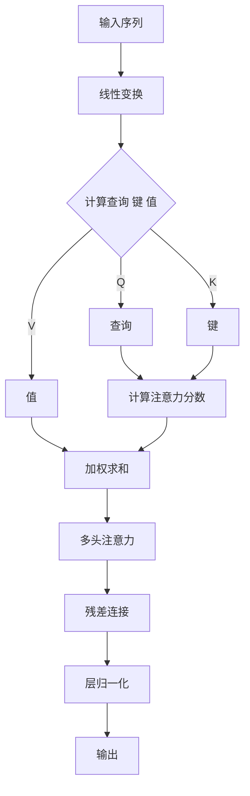

# 注意力机制 (Attention Mechanism) 原理与代码实例讲解

## 1.背景介绍

### 1.1 序列数据处理的挑战

在自然语言处理、语音识别、机器翻译等领域中,我们经常会遇到序列数据,比如一段文本、一个语音片段或一系列单词。这些序列数据具有长度可变和上下文相关的特点,给传统的机器学习模型带来了巨大的挑战。

传统的神经网络模型如卷积神经网络(CNN)和循环神经网络(RNN)在处理固定长度的数据时表现良好,但在处理可变长度序列数据时存在一些缺陷:

- 卷积神经网络只能处理固定长度的输入,无法很好地捕捉序列数据中的长程依赖关系。
- 标准的RNN存在梯度消失或梯度爆炸问题,难以学习长期依赖关系。
- RNN每次只能处理序列的一个元素,计算效率较低。

### 1.2 注意力机制的提出

为了解决上述问题,注意力机制(Attention Mechanism)应运而生。注意力机制的核心思想是允许模型在编码序列数据时,对不同位置的元素赋予不同的权重,从而更好地捕捉长程依赖关系。

2014年,注意力机制首次被应用于机器翻译任务,取得了显著的性能提升。此后,注意力机制在自然语言处理、计算机视觉、语音识别等领域得到了广泛应用,成为解决序列数据处理问题的有力工具。

## 2.核心概念与联系

### 2.1 注意力机制的核心概念

注意力机制的核心概念包括查询(Query)、键(Key)和值(Value)。

- **查询(Query)**: 表示当前需要处理的元素,通常由编码器的隐藏状态表示。
- **键(Key)**: 表示编码序列中其他元素的信息,用于计算注意力权重。
- **值(Value)**: 表示编码序列中其他元素的值,将根据注意力权重进行加权求和。

注意力机制的计算过程如下:

1. 计算查询和所有键之间的相似性分数(注意力权重)。
2. 使用注意力权重对所有值进行加权求和,得到注意力输出。
3. 将注意力输出与查询信息结合,生成最终的输出表示。

通过这种方式,模型可以自适应地关注序列中与当前元素最相关的部分,从而更好地捕捉长程依赖关系。

### 2.2 注意力机制与其他模型的联系

注意力机制与其他一些流行的模型存在密切联系:

- **Transformer**: Transformer是第一个完全基于注意力机制的序列到序列模型,在机器翻译、自然语言处理等任务上取得了卓越表现。
- **BERT**: BERT是一种基于Transformer的预训练语言模型,通过掩蔽语言模型和下一句预测任务学习上下文表示,在多个NLP任务上取得了state-of-the-art的性能。
- **Vision Transformer**: Vision Transformer将Transformer应用于计算机视觉领域,直接对图像分块作为序列输入,在图像分类、目标检测等任务上表现出色。

注意力机制为这些模型提供了一种灵活、高效的序列建模方式,是当前深度学习领域的核心技术之一。

## 3.核心算法原理具体操作步骤

### 3.1 注意力计算过程

注意力机制的计算过程可以分为以下几个步骤:

1. **查询、键、值的计算**

   给定一个输入序列 $X = (x_1, x_2, \dots, x_n)$,我们首先需要计算查询(Query)、键(Key)和值(Value)。通常,这些向量是通过线性变换从输入序列的嵌入向量中计算得到:

   $$
   \begin{aligned}
   Q &= XW^Q \\
   K &= XW^K \\
   V &= XW^V
   \end{aligned}
   $$

   其中 $W^Q$、$W^K$ 和 $W^V$ 分别是查询、键和值的权重矩阵。

2. **计算注意力分数**

   注意力分数用于衡量查询与每个键之间的相似性,通常使用缩放点积注意力(Scaled Dot-Product Attention)计算:

   $$
   \text{Attention}(Q, K, V) = \text{softmax}\left(\frac{QK^T}{\sqrt{d_k}}\right)V
   $$

   其中 $d_k$ 是键的维度,用于缩放点积以避免过大的值导致梯度饱和。softmax函数用于将注意力分数归一化为概率分布。

3. **多头注意力**

   为了从不同的子空间捕获不同的相关性,通常使用多头注意力(Multi-Head Attention):

   $$
   \text{MultiHead}(Q, K, V) = \text{Concat}(\text{head}_1, \dots, \text{head}_h)W^O
   $$

   其中每个 $\text{head}_i$ 是一个独立的注意力计算:

   $$
   \text{head}_i = \text{Attention}(QW_i^Q, KW_i^K, VW_i^V)
   $$

   $W_i^Q$、$W_i^K$、$W_i^V$ 和 $W^O$ 是可学习的权重矩阵。

4. **残差连接和层归一化**

   为了更好地训练深层网络,注意力输出通常会与输入进行残差连接,并进行层归一化(Layer Normalization):

   $$
   \text{Output} = \text{LayerNorm}(\text{MultiHead}(Q, K, V) + X)
   $$

   这种结构有助于梯度的传播,提高模型的性能。

### 3.2 注意力机制的计算流程图

上图展示了注意力机制的整体计算流程。首先,输入序列经过线性变换得到查询、键和值向量。然后,计算查询与所有键之间的注意力分数,并使用这些分数对值向量进行加权求和,得到初步的注意力输出。接下来,通过多头注意力从不同子空间捕获相关性。最后,注意力输出与输入序列进行残差连接,并进行层归一化,得到最终的输出表示。

## 4.数学模型和公式详细讲解举例说明

### 4.1 缩放点积注意力

缩放点积注意力(Scaled Dot-Product Attention)是注意力机制中最常用的注意力计算方式。它的数学表达式如下:

$$
\text{Attention}(Q, K, V) = \text{softmax}\left(\frac{QK^T}{\sqrt{d_k}}\right)V
$$

其中:

- $Q \in \mathbb{R}^{n \times d_q}$ 是查询矩阵,每一行表示一个查询向量。
- $K \in \mathbb{R}^{m \times d_k}$ 是键矩阵,每一行表示一个键向量。
- $V \in \mathbb{R}^{m \times d_v}$ 是值矩阵,每一行表示一个值向量。
- $n$ 是查询的个数,通常等于输入序列的长度。
- $m$ 是键和值的个数,也等于输入序列的长度。
- $d_q$、$d_k$ 和 $d_v$ 分别是查询、键和值的维度。

计算过程如下:

1. 计算查询和所有键的点积,得到一个 $n \times m$ 的分数矩阵 $S$:

   $$
   S = QK^T
   $$

2. 对分数矩阵 $S$ 进行缩放,避免过大的值导致softmax函数饱和:

   $$
   \tilde{S} = \frac{S}{\sqrt{d_k}}
   $$

3. 对缩放后的分数矩阵 $\tilde{S}$ 的每一行应用softmax函数,得到注意力权重矩阵 $A$:

   $$
   A = \text{softmax}(\tilde{S})
   $$

4. 将注意力权重矩阵 $A$ 与值矩阵 $V$ 相乘,得到注意力输出矩阵 $O$:

   $$
   O = AV
   $$

通过这种方式,注意力机制可以自适应地为每个查询分配不同的注意力权重,从而更好地捕捉序列中与当前查询相关的信息。

### 4.2 多头注意力

为了从不同的子空间捕获不同的相关性,注意力机制通常使用多头注意力(Multi-Head Attention)。多头注意力的数学表达式如下:

$$
\text{MultiHead}(Q, K, V) = \text{Concat}(\text{head}_1, \dots, \text{head}_h)W^O
$$

其中:

- $h$ 是注意力头的个数。
- $\text{head}_i$ 是第 $i$ 个注意力头的输出,计算方式为:

  $$
  \text{head}_i = \text{Attention}(QW_i^Q, KW_i^K, VW_i^V)
  $$

  其中 $W_i^Q \in \mathbb{R}^{d_q \times d_q'}$、$W_i^K \in \mathbb{R}^{d_k \times d_k'}$ 和 $W_i^V \in \mathbb{R}^{d_v \times d_v'}$ 是可学习的线性变换矩阵,用于将查询、键和值映射到不同的子空间。$d_q'$、$d_k'$ 和 $d_v'$ 是子空间的维度,通常设置为 $d_q/h$、$d_k/h$ 和 $d_v/h$。

- $W^O \in \mathbb{R}^{hd_v' \times d_v}$ 是可学习的输出线性变换矩阵,用于将多个注意力头的输出拼接并映射回原始值空间。

通过多头注意力,模型可以从不同的子空间捕获不同的相关性,提高了注意力机制的表示能力。

### 4.3 实例说明

假设我们有一个长度为 5 的输入序列 $X = (x_1, x_2, x_3, x_4, x_5)$,其中每个 $x_i \in \mathbb{R}^{d_x}$ 是一个 $d_x$ 维的向量。我们希望计算第三个元素 $x_3$ 对应的注意力输出。

设置参数:

- 查询、键和值的维度: $d_q = d_k = d_v = 64$
- 注意力头的个数: $h = 8$
- 子空间维度: $d_q' = d_k' = d_v' = 8$

1. 计算查询、键和值矩阵:

   $$
   \begin{aligned}
   Q &= XW^Q &\in \mathbb{R}^{5 \times 64} \\
   K &= XW^K &\in \mathbb{R}^{5 \times 64} \\
   V &= XW^V &\in \mathbb{R}^{5 \times 64}
   \end{aligned}
   $$

2. 对于每个注意力头 $i$,计算注意力输出 $\text{head}_i$:

   $$
   \begin{aligned}
   \text{head}_i &= \text{Attention}(Q_iW_i^Q, K_iW_i^K, V_iW_i^V) \\
                 &= \text{softmax}\left(\frac{(Q_iW_i^Q)(K_iW_i^K)^T}{\sqrt{8}}\right)(V_iW_i^V)
   \end{aligned}
   $$

   其中 $Q_i$、$K_i$ 和 $V_i$ 分别是 $Q$、$K$ 和 $V$ 的第 $i$ 行,表示第 $i$ 个查询、键和值向量。

3. 将所有注意力头的输出拼接并映射回原始值空间:

   $$
   \text{MultiHead}(Q, K, V) = \text{Concat}(\text{head}_1, \dots, \text{head}_8)W^O
   $$

最终,我们得到了第三个元素 $x_3$ 对应的注意力输出向量,它综合了输入序列中与 $x_3$ 相关的所有信息。

通过上述实例,我们可以更好地理解