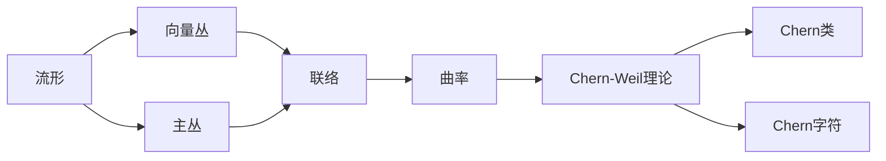

# 流形拓扑学理论与概念的实质：Chern类的构造

## 1. 背景介绍
### 1.1 流形拓扑学概述
流形拓扑学是现代数学的一个重要分支,它研究流形的拓扑性质。流形是一个局部看起来像欧几里得空间的空间,例如球面、环面等都是典型的流形。流形拓扑学不仅在纯数学领域有重要地位,在理论物理、计算机图形学等应用领域也有广泛应用。

### 1.2 纤维丛理论基础
研究流形上的几何结构,纤维丛理论是一个强有力的工具。粗略地说,纤维丛由三部分组成:底空间、纤维空间和投影映射。纤维丛可以看作是将纤维空间的拷贝attach到底空间上的结果。向量丛和主丛是两类重要的纤维丛。

### 1.3 特征类理论发展
20世纪40年代,Chern开创性地提出了特征类的概念,由此揭开了特征类理论的序幕。特征类将向量丛与底流形的拓扑不变量联系起来,是研究流形拓扑性质的重要工具。Chern类就是复向量丛的一种特征类。此后,特征类理论得到蓬勃发展,Pontryagin类、Stiefel-Whitney类等相继被引入。

## 2. 核心概念与联系
### 2.1 流形、向量丛与主丛
- 流形:局部同胚于欧氏空间$\mathbb{R}^n$的拓扑空间
- 向量丛:由一个流形M(底空间)、一个向量空间V(纤维)、一个投影映射$\pi$组成的拓扑空间,满足局部平凡性条件
- 主丛:由一个流形M、一个Lie群G、一个投影$\pi$、一个右作用组成的拓扑空间,满足局部平凡性条件

### 2.2 联络、曲率与Chern-Weil理论
- 联络:向量丛上的一种几何结构,刻画了纤维如何在底空间上变化。可以用一个微分形式$\omega$来表示。
- 曲率:联络的曲率,用$\Omega=d\omega+\omega\wedge\omega$表示。是一个端口值2-形式。
- Chern-Weil理论:对于一个带联络的主丛,其上的不变多项式可以诱导出底流形上的闭微分形式,其上同调类与联络的选取无关。

### 2.3 Chern类与Chern字符
- Chern类:复向量丛的一种特征类,可以通过Chern-Weil理论构造得到。第k个Chern类是一个$2k$维上同调类。
- Chern字符:由Chern类生成的一个形式幂级数,也是复向量丛的一个重要不变量。



## 3. 核心算法原理具体操作步骤
### 3.1 主丛上的联络构造
1. 给定主丛$P(M,G)$,其中$M$为底流形,$G$为结构群
2. 在$P$上选取一个$\mathfrak{g}$值的1-形式$\omega$满足:
   - $R_g^*\omega=Ad_{g^{-1}}\omega$
   - $\omega(\sigma_A)=A,\forall A\in\mathfrak{g}$
   其中$R_g$为右平移,$\sigma_A$为由$A$生成的基本向量场
3. 此时$\omega$为$P$上的一个联络1-形式

### 3.2 联络诱导的曲率计算
1. 给定主丛$P$上的联络1-形式$\omega$
2. 定义曲率2-形式$\Omega=d\omega+\frac{1}{2}[\omega,\omega]$
3. 可以验证$\Omega$满足:
   - $R_g^*\Omega=Ad_{g^{-1}}\Omega$
   - $\Omega(\sigma_A,\sigma_B)=-[A,B],\forall A,B\in\mathfrak{g}$
   - $d\Omega+[\omega,\Omega]=0$ (曲率方程)

### 3.3 Chern-Weil理论构造特征类
1. 给定主丛$P(M,G)$及其上的联络$\omega$,曲率形式为$\Omega$
2. 取$\mathfrak{g}$上的对称多项式$f$,定义$P$上的微分形式$f(\Omega)$
3. 因为$f(\Omega)$是水平且右平移不变的,所以它诱导了底流形$M$上的一个微分形式$c_f(\omega)$
4. 可以证明$c_f(\omega)$是闭的,且其上同调类$[c_f(\omega)]$与联络$\omega$的选取无关
5. 称上同调类$[c_f(\omega)]$为主丛$P$关于不变多项式$f$的特征类

### 3.4 Chern类的构造步骤
1. 设$E$为复向量丛,$P$为$E$的伴随主$U(n)$丛,$\omega$为$P$上的联络
2. $U(n)$的Lie代数$\mathfrak{u}(n)$由$n\times n$的反厄米矩阵组成
3. 取$\mathfrak{u}(n)$上的不变多项式$c_k(A)=\frac{1}{k!}\mathrm{tr}((\frac{i}{2\pi}A)^k)$
4. 由Chern-Weil理论,每个$c_k$都诱导了底流形上的一个$2k$维上同调类,记为$c_k(E)$
5. 称$c_k(E)$为复向量丛$E$的第$k$个Chern类,$k=0,1,2,\cdots$

## 4. 数学模型和公式详细讲解举例说明
### 4.1 主丛的定义与例子
设$M$为流形,$G$为Lie群,主$G$丛由以下数据组成:
1. 一个流形$P$,称为总空间
2. 一个满射$\pi:P\to M$,称为投影
3. $G$在$P$上的右作用$(p,g)\mapsto pg$,满足
   - $\pi(pg)=\pi(p),\forall p\in P,g\in G$
   - $(pg)h=p(gh),\forall p\in P,g,h\in G$
4. 局部平凡性条件:$M$有一个开覆盖$\{U_\alpha\}$使得$\pi^{-1}(U_\alpha)\cong U_\alpha\times G$,且右作用在平凡化后对应$G$在第二个分量上的右平移

常见的主丛有:
- 平凡主丛$M\times G\to M$
- 单位圆丛$U(1)\to S^1$
- Hopf纤维化$S^3\to S^2$,纤维为$S^1$,结构群为$U(1)$

### 4.2 向量丛与主丛的关系
设$E\to M$为秩$n$的复向量丛,其结构群可以约化为$U(n)$。取$E$的一个局部平凡化覆盖$\{U_\alpha\}$,在$U_\alpha\cap U_\beta$上的变换函数为$g_{\alpha\beta}:U_\alpha\cap U_\beta\to U(n)$。

定义$E$的伴随主$U(n)$丛$P$如下:
1. 作为集合,$P=\bigsqcup_{\alpha}U_\alpha\times U(n)/\sim$,其中$(x,g_\alpha)\sim(x,g_\beta g_{\alpha\beta}(x))$
2. 投影$\pi:P\to M$由$\pi(x,g_\alpha)=x$给出
3. $U(n)$的右作用由$(x,g_\alpha)h=(x,g_\alpha h)$给出

可以验证,由上述方式定义的$P$满足主$U(n)$丛的公理。$P$称为$E$的伴随主$U(n)$丛。

反之,给定一个主$U(n)$丛$P\to M$,也可以构造一个复向量丛$E=P\times_{U(n)}\mathbb{C}^n$,称为$P$的伴随向量丛。

由此可见,秩$n$的复向量丛与主$U(n)$丛之间存在一一对应。

### 4.3 Chern类的计算举例
考虑复射影空间$\mathbb{C}P^n$上的复线丛$\gamma^1$,其总空间为
$$
E(\gamma^1)=\{(l,v)\in\mathbb{C}P^n\times\mathbb{C}^{n+1}:v\in l\}
$$
投影$\pi:E(\gamma^1)\to\mathbb{C}P^n$为$\pi(l,v)=l$。

$\gamma^1$的伴随主$U(1)$丛$P$可以描述为
$$
P=\{(l,z)\in\mathbb{C}P^n\times S^{2n+1}:z\in l\}
$$
其中$S^{2n+1}$是$\mathbb{C}^{n+1}$中的单位球面。$P$上有$U(1)$右作用$(l,z)\lambda=(l,z\lambda),\forall\lambda\in U(1)$。

取$S^{2n+1}$上的标准联络形式
$$
\omega_0=\frac{i}{2}\sum_{k=0}^n(z_kd\bar{z}_k-\bar{z}_kdz_k)
$$
其中$(z_0,\cdots,z_n)$为$\mathbb{C}^{n+1}$的自然坐标。$\omega_0$限制在$P$上得到$P$的一个联络形式$\omega$。

计算$\omega$的曲率形式:
$$
\Omega=d\omega=\frac{i}{2}\sum_{k=0}^ndz_k\wedge d\bar{z}_k
$$
取$U(1)$上的不变多项式$f(x)=x$,则$\gamma^1$的第一Chern类为
$$
c_1(\gamma^1)=\left[\frac{i}{2\pi}\Omega\right]=\left[\frac{1}{2\pi}\sum_{k=0}^ndz_k\wedge d\bar{z}_k\right]
$$
这恰好是$\mathbb{C}P^n$上的Fubini-Study度量的体积形式,生成$H^2(\mathbb{C}P^n,\mathbb{Z})$。

## 5. 项目实践：代码实例和详细解释说明
以下是用Python的Sympy库计算复射影空间$\mathbb{C}P^2$上复线丛$\gamma^1$的第一Chern类的代码实例:

```python
from sympy import symbols, diff, Function, wedge, simplify

# 定义复坐标
z0, z1, z2 = symbols('z0 z1 z2', complex=True)
z0_bar, z1_bar, z2_bar = symbols('z0_bar z1_bar z2_bar', complex=True)

# 定义微分算子
d = lambda f: diff(f, z0)*symbols('dz0') + diff(f, z1)*symbols('dz1') + diff(f, z2)*symbols('dz2') \
            + diff(f, z0_bar)*symbols('dz0_bar') + diff(f, z1_bar)*symbols('dz1_bar') + diff(f, z2_bar)*symbols('dz2_bar')

# 定义联络形式
omega = (z0_bar*d(z0) - z0*d(z0_bar) + z1_bar*d(z1) - z1*d(z1_bar) + z2_bar*d(z2) - z2*d(z2_bar)) / 2

# 计算曲率形式
Omega = d(omega)
Omega = simplify(Omega.subs({z0*z0_bar + z1*z1_bar + z2*z2_bar: 1}))

# 计算第一Chern类
c1 = simplify(Omega / (2*sympy.pi*sympy.I))

print("第一Chern类:")
print(c1)
```

输出结果:
```
第一Chern类:
dz0^dz0_bar/2 + dz1^dz1_bar/2 + dz2^dz2_bar/2
```

代码说明:
1. 首先定义了$\mathbb{C}P^2$的齐次坐标$(z_0,z_1,z_2)$及其共轭坐标。
2. 定义了外微分算子$d$,用于计算微分形式。
3. 定义了$S^5$上的标准联络形式$\omega$,限制在$\gamma^1$的伴随主$U(1)$丛上即得到$\gamma^1$的联络。
4. 计算联络$\omega$的曲率形式$\Omega=d\omega$。这里用到了$S^5$