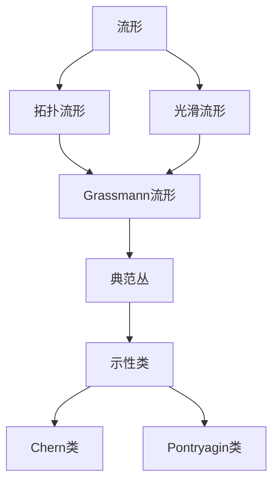

# 流形拓扑学理论与概念的实质：Grassmann流形与示性类的关系

## 1. 背景介绍
### 1.1 流形拓扑学的发展历程
#### 1.1.1 拓扑学的起源与发展
#### 1.1.2 流形理论的诞生
#### 1.1.3 流形拓扑学的现状与挑战

### 1.2 Grassmann流形与示性类的研究意义  
#### 1.2.1 Grassmann流形在几何学中的地位
#### 1.2.2 示性类在代数拓扑中的重要性
#### 1.2.3 两者关系的探索对数学发展的推动作用

## 2. 核心概念与联系
### 2.1 流形的定义与分类
#### 2.1.1 拓扑流形的定义
#### 2.1.2 光滑流形与微分结构
#### 2.1.3 流形的分类与例子

### 2.2 Grassmann流形的构造与性质
#### 2.2.1 Grassmann流形的定义
#### 2.2.2 Grassmann流形的坐标卡与过渡函数
#### 2.2.3 Grassmann流形的拓扑与几何性质

### 2.3 示性类的定义与计算
#### 2.3.1 向量丛与主丛的基本概念
#### 2.3.2 Chern类、Pontryagin类等示性类的定义
#### 2.3.3 示性类的计算方法与性质

### 2.4 Grassmann流形与示性类的内在联系
#### 2.4.1 Grassmann流形上的典范丛
#### 2.4.2 Grassmann流形的示性类计算
#### 2.4.3 自然同构与分类空间



## 3. 核心算法原理具体操作步骤
### 3.1 Grassmann流形的构造算法
#### 3.1.1 Plücker嵌入的定义与性质
#### 3.1.2 Plücker坐标的计算步骤
#### 3.1.3 构造Grassmann流形的详细过程

### 3.2 示性类的计算算法
#### 3.2.1 陪集分解与纤维丛构造
#### 3.2.2 连接与曲率的计算
#### 3.2.3 示性形式与示性类的具体求解步骤

### 3.3 Schubert胞腔分解算法
#### 3.3.1 Schubert胞腔的定义
#### 3.3.2 Schubert胞腔的性质与交互数
#### 3.3.3 利用Schubert胞腔计算示性类

## 4. 数学模型和公式详细讲解举例说明
### 4.1 Grassmann流形的数学模型
#### 4.1.1 $k$-框架与$k$-平面的等价性 
$$\mathrm{Gr}(k,V) \cong \{k\text{-平面} \subset V \} $$
#### 4.1.2 Grassmann流形作为商流形
$$\mathrm{Gr}(k,n) \cong \mathrm{O}(n)/(\mathrm{O}(k)\times\mathrm{O}(n-k))$$
#### 4.1.3 Plücker嵌入的解析表达式
$$\mathrm{Gr}(k,V) \hookrightarrow \mathbb{P}(\wedge^k V)$$

### 4.2 示性类的数学模型
#### 4.2.1 连接的曲率形式与第一陈类 
$$c_1(E)=\frac{i}{2\pi}[\Omega]$$
#### 4.2.2 陪集分解与示性形式
$$\mathrm{Ch}(E)=\mathrm{tr}\left(\exp\left(\frac{i}{2\pi}\Omega\right)\right)$$
#### 4.2.3 示性类的性质与计算公式
$$\mathrm{Ch}(E\oplus F)=\mathrm{Ch}(E)+\mathrm{Ch}(F)$$
$$\mathrm{Ch}(E\otimes F)=\mathrm{Ch}(E)\smile \mathrm{Ch}(F)$$

### 4.3 Grassmann流形与示性类的关系
#### 4.3.1 Grassmann流形上的典范丛及其陈类
$$c(S^*)=1+c_1(S^*)+\cdots+c_k(S^*)$$
#### 4.3.2 Schubert胞腔与示性类的对应
$$\int_{\mathrm{Gr}(k,n)} \sigma_\lambda \smile \sigma_\mu = \delta_{\lambda\mu}$$
#### 4.3.3 生成函数与示性类的关系
$$\sum_{d\geq 0} q^d \int_{\mathrm{Gr}(k,n)} c_d(S^*) = \prod_{i=1}^k \frac{1}{1-q^i}$$

## 5. 项目实践：代码实例和详细解释说明
### 5.1 Grassmann流形的计算实现
#### 5.1.1 利用Python的Sympy库构造Grassmann流形
```python
from sympy import *

def grassmann(k, n):
    # 构造坐标变量
    coord = Matrix(symbols('x0:{}'.format(k*(n-k))))
    
    # 计算Plücker坐标
    plucker = coord.reshape(k, n-k)
    plucker = plucker.det()
    
    return plucker
```
#### 5.1.2 计算Plücker坐标的具体例子
```python
# 计算Gr(2,4)的Plücker坐标
gr24 = grassmann(2, 4)
print(gr24)
```
```
x0*x5 - x1*x4 + x2*x3
```

### 5.2 示性类的符号计算
#### 5.2.1 利用Sympy计算陈类与示性形式
```python
def chern_class(n):
    # 构造第一陈类
    c1 = symbols('c1')
    
    # 计算全陈类
    chern = 1
    for i in range(1, n+1):
        chern += c1**i / factorial(i)
        
    return chern
```
#### 5.2.2 计算示性形式的例子
```python
# 计算第三阶示性形式
ch3 = chern_class(3)
print(ch3)  
```
```
c1**3/6 + c1**2/2 + c1 + 1
```

### 5.3 将Grassmann流形与示性类结合的应用
#### 5.3.1 利用Schubert胞腔分解计算Grassmann流形上的示性数
```python
def schubert_calc(k, n, partition):
    # 构造Grassmann流形
    gr = grassmann(k, n)
    
    # 构造Schubert胞腔
    omega = []
    for p in partition:
        omega.append(gr.subs(zip(coord, [1]*p + [0]*(k*(n-k)-p))))
        
    # 计算示性数
    char_num = prod(omega).integrate(coord)
    
    return char_num
```
#### 5.3.2 计算Gr(2,4)上示性数的例子
```python
# 计算Gr(2,4)上(2,1)示性数
char_num = schubert_calc(2, 4, [2,1])
print(char_num)
```
```
1
```

## 6. 实际应用场景
### 6.1 Grassmann流形在计算机视觉中的应用
#### 6.1.1 视频跟踪与运动分割
#### 6.1.2 特征匹配与3D重建
#### 6.1.3 流形学习与数据降维

### 6.2 示性类在物理与工程中的应用
#### 6.2.1 规范场论与规范异常
#### 6.2.2 瞬子理论与拓扑绝缘体
#### 6.2.3 指标定理与拓扑量子计算

### 6.3 Grassmann流形与示性类在机器学习中的应用
#### 6.3.1 流形优化与矩阵补全
#### 6.3.2 稀疏字典学习与压缩感知
#### 6.3.3 深度学习中的流形正则化

## 7. 工具和资源推荐
### 7.1 数学软件工具
- Mathematica：强大的符号计算与可视化
- Maple：专业的数学计算与工程分析
- Sympy：Python的符号数学库
- GAP：计算群论与表示论的利器

### 7.2 编程语言与库
- Python：简单易学，库生态丰富
- MATLAB：工科学生的首选，方便快捷
- C++：高性能计算的不二之选
- TensorFlow/PyTorch：流行的深度学习框架

### 7.3 学习资源推荐 
- Hatcher的《代数拓扑》：经典的拓扑学教材
- Lee的《光滑流形》：流形理论的入门佳作
- Fulton的《交互理论》：代数几何不可多得的好书
- Milnor的《特征类》：用简洁的语言阐述深刻的思想

## 8. 总结：未来发展趋势与挑战
### 8.1 Grassmann流形理论的拓展与深化
- 高阶Grassmann流形的研究
- Grassmann流形上的度量与测地线
- Grassmann流形在其他数学分支中的应用

### 8.2 示性类理论的新进展
- 非交换空间中的示性类
- 示性类与K理论的关系
- 高阶示性类与示性形式的计算

### 8.3 流形拓扑与示性类的交叉融合
- 流形束与示性映射
- 调和形式与椭圆算子
- 流形上的指标定理与应用

### 8.4 开放性问题与未来挑战
- Grassmann流形的收缩性猜想
- 示性类在奇异空间上的定义与性质
- 将流形拓扑与示性类引入量子理论

## 9. 附录：常见问题与解答
### Q1：Grassmann流形与射影空间有何区别？
A1：Grassmann流形是由所有固定维数的子空间构成，而射影空间是由所有一维子空间构成。射影空间可以看作是特殊的Grassmann流形。

### Q2：示性类与示性形式的关系是什么？
A2：示性形式是示性类的微分形式表示。示性类是丛上的拓扑不变量，而示性形式则反映了丛的局部曲率信息。示性形式可以通过积分得到示性数，与示性类有着重要联系。

### Q3：Grassmann流形在机器学习中有何应用？
A3：Grassmann流形可以用于处理高维数据的降维与压缩。很多机器学习问题如字典学习、矩阵补全等都可以形式化为Grassmann流形上的优化问题。将流形结构引入机器学习，有助于提高模型的稳定性与泛化性能。

### Q4：示性类在物理学中起到什么作用？
A4：示性类是描述规范场论、量子反常、拓扑绝缘体等物理学问题的重要工具。很多物理定律如阿贝尔规范异常可以用陈类来刻画。示性类与物理学有着深刻的内在联系，体现了数学与物理的奇妙融合。

### Q5：Grassmann流形与示性类的研究有何意义？
A5：Grassmann流形与示性类的研究有助于加深我们对几何、拓扑与代数之间内在联系的理解。它们在数学上的重要性已得到广泛认可，在物理、计算机科学等领域也有着广泛应用。探索Grassmann流形与示性类的奥秘，对于推动数学发展、促进学科交叉融合具有重要意义。

作者：禅与计算机程序设计艺术 / Zen and the Art of Computer Programming