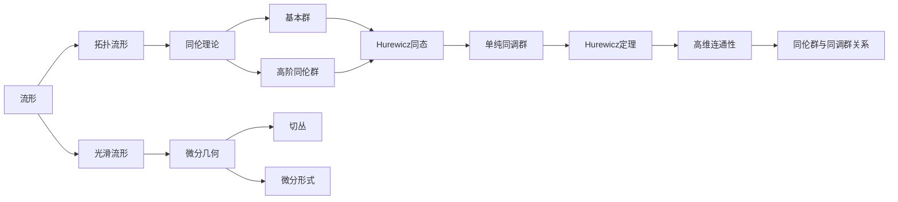

# 流形拓扑学理论与概念的实质：Hurewicz定理

## 1. 背景介绍
### 1.1 流形拓扑学的起源与发展
#### 1.1.1 拓扑学的诞生
#### 1.1.2 流形概念的提出
#### 1.1.3 流形拓扑学的形成与发展
### 1.2 流形拓扑学的重要性
#### 1.2.1 在数学领域的重要地位
#### 1.2.2 在物理学等其他学科中的应用
### 1.3 Hurewicz定理的背景
#### 1.3.1 同伦群的引入
#### 1.3.2 高维球面与环面的研究
#### 1.3.3 Hurewicz提出其著名定理

## 2. 核心概念与联系
### 2.1 流形的定义与分类
#### 2.1.1 拓扑流形的定义
#### 2.1.2 光滑流形与微分流形
#### 2.1.3 流形的维数与可定向性
### 2.2 同伦理论基础
#### 2.2.1 同伦的概念
#### 2.2.2 基本群与高阶同伦群
#### 2.2.3 同伦等价与同伦不变量
### 2.3 Hurewicz同态
#### 2.3.1 单纯同调群的定义
#### 2.3.2 Hurewicz同态的构造
#### 2.3.3 Hurewicz同态的性质

## 3. 核心算法原理具体操作步骤
### 3.1 计算流形基本群的算法
#### 3.1.1 Van Kampen定理 
#### 3.1.2 利用CW复形计算基本群
#### 3.1.3 计算曲面基本群的例子
### 3.2 计算同调群的算法
#### 3.2.1 单纯同调的计算步骤
#### 3.2.2 Mayer-Vietoris序列
#### 3.2.3 利用CW复形计算同调群
### 3.3 Hurewicz同态的计算
#### 3.3.1 低维情形下的具体计算
#### 3.3.2 Hurewicz定理在计算中的应用

## 4. 数学模型和公式详细讲解举例说明
### 4.1 同伦群的数学模型
#### 4.1.1 基本群 $\pi_1(X,x_0)$ 的定义与性质
#### 4.1.2 高阶同伦群 $\pi_n(X,x_0)$ 的定义
#### 4.1.3 环面 $\mathbb{T}^n$ 的同伦群计算
### 4.2 同调群的数学模型
#### 4.2.1 链复形与边缘算子 $\partial_n$
#### 4.2.2 循环群、边缘群和同调群定义：
$$H_n(X)=\ker \partial_n / \operatorname{im} \partial_{n+1}$$
#### 4.2.3 球面 $\mathbb{S}^n$ 的同调群计算
### 4.3 Hurewicz同态的数学刻画
#### 4.3.1 Hurewicz同态 $h_n:\pi_n(X)\to H_n(X)$ 的定义
#### 4.3.2 Hurewicz定理：若 $X$ 为 $(n-1)$ 连通，$n\geq 2$，则 $h_n$ 为同构
#### 4.3.3 Hurewicz定理的证明思路

## 5. 项目实践：代码实例和详细解释说明
### 5.1 利用 Python 实现同调群计算
#### 5.1.1 构造单纯复形类
#### 5.1.2 实现边缘算子与同调群计算
#### 5.1.3 计算球面与环面的同调群
### 5.2 利用 GAP 计算基本群
#### 5.2.1 自由群与群表示
#### 5.2.2 利用 GAP 计算曲面基本群
### 5.3 可视化展示流形与同调群
#### 5.3.1 利用 Plotly 绘制低维流形
#### 5.3.2 同调群计算结果的可视化呈现

## 6. 实际应用场景
### 6.1 流形学习与数据降维
#### 6.1.1 流形假设与流形学习
#### 6.1.2 等距映射与维度约简
#### 6.1.3 Isomap 算法原理与实现
### 6.2 图像分析中的同调方法
#### 6.2.1 图像拓扑特征提取
#### 6.2.2 图像分割中的同调方法
#### 6.2.3 基于同调的 3D 形状分析
### 6.3 物理学中的流形与拓扑
#### 6.3.1 广义相对论中的时空流形
#### 6.3.2 量子物理中的纤维丛与规范场论
#### 6.3.3 凝聚态物理中的拓扑绝缘体与拓扑超导体

## 7. 工具和资源推荐
### 7.1 数学软件与计算工具
#### 7.1.1 GAP - 计算离散代数结构的软件
#### 7.1.2 SageMath - 包含丰富拓扑与几何功能的开源数学软件
#### 7.1.3 MATLAB 与 Python 中的拓扑工具包
### 7.2 流形拓扑学学习资源
#### 7.2.1 经典教材与参考书籍推荐
#### 7.2.2 在线课程与视频资源
#### 7.2.3 专业期刊与学术会议

## 8. 总结：未来发展趋势与挑战
### 8.1 流形拓扑学的研究前沿
#### 8.1.1 高维流形分类与几何化猜想
#### 8.1.2 流形上的微分结构与 Smooth Poincaré 猜想
#### 8.1.3 低维拓扑与 Floer 理论
### 8.2 跨学科交叉与应用拓展
#### 8.2.1 人工智能中的流形方法
#### 8.2.2 生物学中的拓扑数据分析
#### 8.2.3 金融与社会科学中的拓扑应用
### 8.3 未来挑战与展望
#### 8.3.1 计算复杂性与算法设计
#### 8.3.2 高维数据可视化与交互
#### 8.3.3 拓扑深度学习的发展

## 9. 附录：常见问题与解答
### 9.1 什么是拓扑等价与同胚？
### 9.2 流形上的微分形式与 De Rham 上同调的关系？ 
### 9.3 Hurewicz 定理在高维情形下是否成立？
### 9.4 同伦群与同调群之间有什么联系？
### 9.5 计算同调群的困难点在哪里？

流形拓扑学是现代数学的一个核心分支，它融合了拓扑学、微分几何以及代数拓扑等多个数学分支的思想与方法，在理论数学和应用科学领域都有着广泛而深刻的影响。本文以 Hurewicz 定理为切入点，系统介绍了流形拓扑学的核心概念、理论基础、计算方法以及在物理学、计算机科学等领域的应用。

流形作为拓扑学与几何学研究的基本对象，可分为拓扑流形和光滑流形两大类。拓扑流形强调连续变换下的不变性，而光滑流形则进一步引入了微分结构。在拓扑流形的研究中，同伦理论扮演着重要的角色。同伦群刻画了空间在连续映射意义下的等价类，是研究流形拓扑性质的重要工具。基本群反映了空间的一维连通性，而高阶同伦群则揭示了高维连通性的信息。

另一方面，同调论提供了从代数角度研究拓扑空间的方法。单纯同调利用链复形与边缘算子构造了同调群，刻画了空间中闭链与边界的关系。Hurewicz 同态建立了同伦群与同调群之间的桥梁，而著名的 Hurewicz 定理则给出了在高维连通空间中，同伦群与同调群相同构的条件。

在计算方面，我们介绍了计算基本群、同调群以及 Hurewicz 同态的具体算法与步骤。Van Kampen 定理与 Mayer-Vietoris 序列是计算拓扑不变量的重要工具。同时，我们还展示了如何利用 Python、GAP 等数学软件进行流形拓扑计算，并给出了可视化展示的案例。

流形拓扑学在实际应用中也有着广泛的前景。流形学习将高维数据嵌入到低维流形中，实现了数据降维与特征提取。同调方法在图像分析、计算机视觉中得到了有效应用，用于提取图像的拓扑特征。物理学中，时空连续体可以用微分流形来描述，而拓扑绝缘体、拓扑超导体等新奇量子态则与拓扑不变量密切相关。

展望未来，流形拓扑学仍面临诸多挑战和机遇。高维流形分类、Smooth Poincaré 猜想等问题是当前研究的前沿方向。随着大数据时代的到来，拓扑数据分析、拓扑深度学习等跨学科交叉领域也逐渐兴起。如何设计高效算法、提升计算性能、实现高维数据可视化与交互，都是亟待解决的问题。

总之，流形拓扑学以其深刻的理论内涵和广阔的应用前景，成为当代数学研究的一个重要方向。Hurewicz 定理作为连接同伦论与同调论的纽带，更是流形拓扑学的一个里程碑式成果。通过本文的介绍，希望读者能对流形拓扑学的核心概念与方法有所了解，并对这一领域的研究现状与未来发展有所认识。

作者：禅与计算机程序设计艺术 / Zen and the Art of Computer Programming