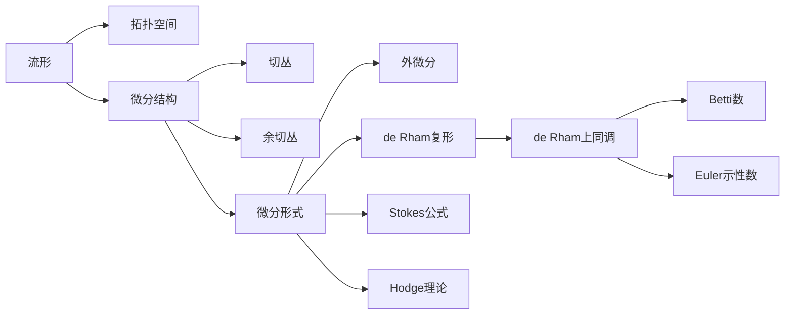

# 流形拓扑学理论与概念的实质：微分形式与de Rham复形

## 1. 背景介绍
### 1.1 流形拓扑学的发展历程
#### 1.1.1 欧拉时代的拓扑学萌芽
#### 1.1.2 黎曼的流形概念
#### 1.1.3 庞加莱的同调理论
### 1.2 微分形式理论的诞生
#### 1.2.1 外微分的引入
#### 1.2.2 Cartan对微分形式的发展
#### 1.2.3 de Rham的贡献
### 1.3 de Rham复形的意义
#### 1.3.1 de Rham复形与de Rham上同调
#### 1.3.2 de Rham定理：同调与上同调的同构
#### 1.3.3 de Rham复形在物理学中的应用

## 2. 核心概念与联系
### 2.1 流形与拓扑空间
#### 2.1.1 拓扑空间的定义与性质
#### 2.1.2 流形的定义与分类
#### 2.1.3 流形与拓扑空间的关系
### 2.2 微分形式
#### 2.2.1 外代数基础
#### 2.2.2 微分形式的定义
#### 2.2.3 外微分算子
### 2.3 de Rham复形 
#### 2.3.1 链复形与上同调
#### 2.3.2 de Rham复形的构造
#### 2.3.3 de Rham上同调群

## 3. 核心算法原理具体操作步骤
### 3.1 计算de Rham上同调群
#### 3.1.1 求闭微分形式
#### 3.1.2 求恰当微分形式
#### 3.1.3 计算上同调群
### 3.2 Mayer-Vietoris序列
#### 3.2.1 Mayer-Vietoris引理
#### 3.2.2 长正合序列
#### 3.2.3 计算覆盖空间的de Rham上同调
### 3.3 Poincaré对偶性
#### 3.3.1 Poincaré对偶的概念
#### 3.3.2 Hodge星算子
#### 3.3.3 通过对偶性计算Betti数

## 4. 数学模型和公式详细讲解举例说明
### 4.1 Stokes公式
#### 4.1.1 古典Stokes公式
#### 4.1.2 外微分形式下的Stokes公式
#### 4.1.3 Stokes公式的物理意义
### 4.2 Hodge分解定理
#### 4.2.1 Hodge算子及其性质
#### 4.2.2 调和形式 
#### 4.2.3 Hodge分解定理及其应用
### 4.3 Euler示性数
#### 4.3.1 Euler示性数的定义
#### 4.3.2 Euler示性数与Betti数的关系
#### 4.3.3 Gauss-Bonnet定理

## 5. 项目实践：代码实例和详细解释说明
### 5.1 计算球面S²的de Rham上同调群
#### 5.1.1 S²上的微分形式
#### 5.1.2 计算H¹(S²)与H²(S²) 
#### 5.1.3 代码实现与结果分析
### 5.2 计算环面T²的de Rham上同调群
#### 5.2.1 T²上的微分形式基
#### 5.2.2 计算H¹(T²)  
#### 5.2.3 代码实现与结果分析
### 5.3 计算克莱因瓶的示性数
#### 5.3.1 三角剖分与欧拉示性数
#### 5.3.2 克莱因瓶的表示
#### 5.3.3 代码实现与结果分析

## 6. 实际应用场景
### 6.1 电磁理论中的微分形式
#### 6.1.1 麦克斯韦方程组
#### 6.1.2 电磁势与规范对称性
#### 6.1.3 电荷量子化与磁单极 
### 6.2 广义相对论中的微分形式
#### 6.2.1 狭义相对论的几何描述
#### 6.2.2 广义相对论与黎曼几何
#### 6.2.3 爱因斯坦场方程
### 6.3 量子场论与规范理论
#### 6.3.1 规范场与联络
#### 6.3.2 陈类与拓扑不变量
#### 6.3.3 量子霍尔效应

## 7. 工具和资源推荐
### 7.1 学习资源
#### 7.1.1 经典教材
#### 7.1.2 在线课程
#### 7.1.3 学术论文
### 7.2 数学软件工具
#### 7.2.1 Mathematica
#### 7.2.2 MATLAB
#### 7.2.3 SageMath
### 7.3 编程语言与库
#### 7.3.1 Python及其科学计算库
#### 7.3.2 Julia语言
#### 7.3.3 C++模板库

## 8. 总结：未来发展趋势与挑战
### 8.1 流形上机器学习的兴起
#### 8.1.1 流形学习的动机
#### 8.1.2 几何深度学习
#### 8.1.3 应用前景
### 8.2 计算拓扑学的发展
#### 8.2.1 持续同调理论 
#### 8.2.2 拓扑数据分析
#### 8.2.3 应用于大数据分析
### 8.3 开放性问题
#### 8.3.1 Hodge猜想
#### 8.3.2 几何拓扑中的猜想
#### 8.3.3 物理学新理论的数学基础

## 9. 附录：常见问题与解答
### 9.1 微分形式的直观理解
### 9.2 为何要引入外代数
### 9.3 de Rham上同调与奇点的关系
### 9.4 流形定向的判定
### 9.5 Morse理论初步

流形拓扑学是现代数学的一个重要分支,它综合了拓扑学、微分几何以及代数拓扑等学科的思想和方法,在理论数学和数学物理中有着广泛的应用。本文围绕流形拓扑学的核心概念——微分形式与de Rham复形展开,试图揭示其背后的数学实质,并探讨其在物理学等领域的应用。

流形拓扑学的发展可以追溯到欧拉时代,他研究了多面体的拓扑不变量。黎曼开创性地提出了流形的概念,为微分几何的发展奠定了基础。庞加莱开创了代数拓扑,引入了同调群的概念。微分形式理论经过外微分、Cartan和de Rham等数学家的发展臻于完善,成为现代微分几何的语言。de Rham复形建立了流形上的微分形式与拓扑不变量之间的桥梁。

流形是一类特殊的拓扑空间,在局部同胚于欧氏空间,还具有光滑的微分结构。切丛和余切丛是研究流形微分几何的重要工具。微分形式是定义在流形上的反对称张量场,外代数是研究微分形式代数结构的基础。通过外微分算子,可以定义de Rham复形,其上同调群即为de Rham上同调,与流形的奇异上同调同构。

计算de Rham上同调群的核心是求闭形式模恰当形式,还可以利用Mayer-Vietoris序列计算覆盖空间的上同调。Poincaré对偶性揭示了流形上互补维数上同调群之间的对偶关系。Stokes公式是微分形式理论的基石,揭示了微分形式的积分与边界的关系。Hodge理论利用调和形式将de Rham上同调与Hodge分解联系起来。Euler示性数与Betti数之和有着优美的拓扑关系。

本文通过计算球面、环面等经典流形的de Rham上同调群,展示了微分形式理论的计算方法。克莱因瓶作为一个非定向流形,其示性数的计算体现了拓扑不变量的特点。电磁理论、广义相对论和量子场论等物理学分支都大量使用了微分形式的语言,揭示了几何和拓扑与物理规律之间的深刻联系。

流形上机器学习、计算拓扑学等前沿方向展现了流形拓扑学的发展前景。几何深度学习将深度学习与流形结构相结合,在图像识别、自然语言处理等领域取得了重要进展。拓扑数据分析利用流形拓扑的思想分析高维数据,是当前大数据分析的热点。Hodge猜想等数学难题的证明以及物理学新理论的建立,都有赖于流形拓扑学的进一步发展。

作者：禅与计算机程序设计艺术 / Zen and the Art of Computer Programming