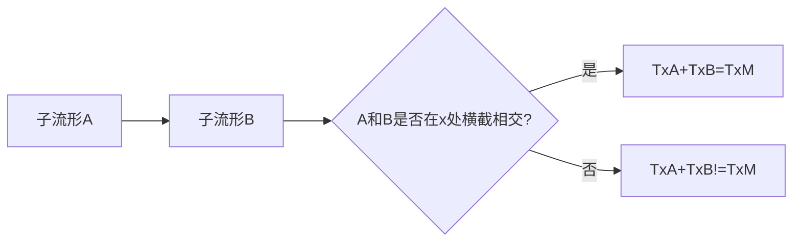

# 流形拓扑学理论与概念的实质：正则值与横截性

## 1.背景介绍

流形拓扑学是一门研究流形及其上的连续映射的数学分支。它结合了几何和代数的概念,为许多数学和物理领域提供了强大的分析工具。其中,正则值和横截性是流形拓扑学中两个核心概念,对于理解流形的本质属性和拓扑不变量具有重要意义。

### 1.1 流形的概念

流形(Manifold)是一种在局部上类似于欧几里得空间,但在全局上可能呈现出更复杂拓扑结构的数学对象。形式上,一个流形是一个拓扑空间,在该空间的每个点存在一个邻域,该邻域与欧几里得空间同胚。流形广泛应用于数学、物理、计算机科学和工程等领域。

### 1.2 正则值和横截性的重要性

正则值和横截性是流形拓扑学中两个基本概念,它们描述了流形上的映射的局部和全局行为。正则值反映了映射在某一点的局部线性逼近,而横截性则描述了映射在整个流形上的全局拓扑性质。这两个概念不仅在理论上具有重要意义,而且在许多应用领域也扮演着关键角色,如微分几何、代数拓扑、动力系统和量子场论等。

## 2.核心概念与联系

### 2.1 正则值

正则值(Regular Value)是指对于一个从流形M到流形N的平滑映射f,如果对于任意y∈N,preimage f^-1(y)是一个子流形或为空集,则称y为f的正则值。

更精确地说,如果对于任意y∈N,对于每个x∈f^-1(y),映射f在x处的微分Df(x)是满秩的,即Df(x)的核为{0},那么y就是f的正则值。

```mermaid
graph LR
    A[流形M] -->|平滑映射f| B[流形N]
    B --> C{y是否为正则值?}
    C -->|是| D[f^-1(y)是子流形或空集]
    C -->|否| E[f^-1(y)不是子流形]
```

正则值的概念揭示了映射在某一点的局部线性逼近的性质。如果y是f的正则值,那么在y的一个邻域内,f^-1(y)是一个子流形,映射f在该子流形上具有良好的局部线性逼近。

### 2.2 横截性

横截性(Transversality)是指两个子流形在它们的交点处"正交"相交的性质。更精确地说,对于流形M中的两个子流形A和B,如果对于任意x∈A∩B,我们有TxA+TxB=TxM,则称A和B在x处横截相交。其中,TxA和TxB分别表示A和B在x处的切空间。



横截性是一个全局拓扑不变量,它描述了两个子流形在整个流形上的相交方式。如果两个子流形在每一个交点处都横截相交,那么它们的交集也是一个子流形,并且具有良好的拓扑性质。

### 2.3 正则值与横截性的联系

正则值和横截性之间存在着内在的联系。事实上,如果f:M→N是一个平滑映射,那么y∈N是f的正则值,当且仅当f^-1(y)和N中的一个点y横截相交。这种等价关系揭示了正则值和横截性在描述映射的局部和全局性质方面的一致性。

利用这种联系,我们可以将正则值和横截性的概念推广到更一般的情况,如映射的交集、预像和像等,从而构建更加丰富的理论框架。

## 3.核心算法原理具体操作步骤

### 3.1 判断正则值

判断一个值y是否为平滑映射f:M→N的正则值,我们可以采取以下步骤:

1. 计算f^-1(y),即映射f在y处的前像。
2. 对于每个x∈f^-1(y),计算f在x处的微分Df(x)。
3. 检查Df(x)是否为满秩,即核为{0}。
4. 如果对于所有x∈f^-1(y),Df(x)都是满秩的,那么y就是f的正则值。

这个算法的核心思想是检查映射f在y的前像上的每一个点处是否具有良好的局部线性逼近。如果是,那么y就是正则值。

### 3.2 判断横截性

判断两个子流形A和B在一个点x处是否横截相交,我们可以采取以下步骤:

1. 计算A和B在x处的切空间TxA和TxB。
2. 检查TxA+TxB是否等于TxM,其中M是包含A和B的流形。
3. 如果TxA+TxB=TxM,那么A和B在x处横截相交。

这个算法的核心思想是检查A和B在x处的切空间之和是否"填满"了整个流形M的切空间。如果是,那么A和B就在x处横截相交。

### 3.3 计算映射的正则值集

对于一个平滑映射f:M→N,我们可以计算它的正则值集,即所有正则值y∈N的集合。算法步骤如下:

1. 初始化正则值集为空集。
2. 对于每个y∈N,检查y是否为f的正则值。
3. 如果y是正则值,将其加入正则值集。
4. 重复步骤2和3,直到遍历完所有y∈N。

计算正则值集的目的是了解映射f在哪些点上具有良好的局部线性逼近,从而更好地理解映射的性质。

### 3.4 计算子流形的横截相交集

对于流形M中的两个子流形A和B,我们可以计算它们的横截相交集,即所有横截相交点x的集合。算法步骤如下:

1. 初始化横截相交集为空集。
2. 对于每个x∈A∩B,检查A和B在x处是否横截相交。
3. 如果A和B在x处横截相交,将x加入横截相交集。
4. 重复步骤2和3,直到遍历完所有x∈A∩B。

计算横截相交集的目的是了解两个子流形在整个流形上的相交方式,从而更好地理解它们的拓扑性质。

## 4.数学模型和公式详细讲解举例说明

### 4.1 正则值的数学模型

设M和N分别是m维和n维流形,f:M→N是一个平滑映射。对于任意y∈N,我们定义f在y处的前像为:

$$f^{-1}(y) = \{x\in M | f(x) = y\}$$

如果对于每个x∈f^-1(y),映射f在x处的微分Df(x)是满秩的,即核为{0},那么y就是f的正则值。

更精确地说,对于x∈M,我们有:

$$Df(x): T_xM \rightarrow T_{f(x)}N$$

其中,TxM和Tf(x)N分别表示M在x处和N在f(x)处的切空间。如果对于每个x∈f^-1(y),Df(x)都是满秩的,即核为{0},那么y就是f的正则值。

例如,考虑映射f:R^2→R,定义为f(x,y)=x^2+y^2。对于任意y∈R,我们有:

$$f^{-1}(y) = \{(x,y)\in R^2 | x^2 + y^2 = y\}$$

这是一个圆环。对于每个(x,y)∈f^-1(y),我们有:

$$Df(x,y) = (2x, 2y)$$

由于(2x,2y)≠(0,0),因此Df(x,y)是满秩的。所以,对于任意y∈R,y都是f的正则值。

### 4.2 横截性的数学模型

设A和B是流形M中的两个子流形,对于任意x∈A∩B,我们定义A和B在x处的切空间为TxA和TxB。如果TxA+TxB=TxM,则称A和B在x处横截相交。

更精确地说,对于x∈A∩B,我们有:

$$T_xM = T_xA \oplus T_xB$$

其中,⊕表示向量空间的直和。如果上式成立,那么A和B在x处横截相交。

例如,考虑R^3中的两个子流形A={(x,y,z)|x=0}和B={(x,y,z)|y=0}。对于任意x=(0,y,z)∈A∩B,我们有:

$$T_xA = \text{span}\{(0,1,0), (0,0,1)\}$$
$$T_xB = \text{span}\{(1,0,0), (0,0,1)\}$$
$$T_xR^3 = \text{span}\{(1,0,0), (0,1,0), (0,0,1)\}$$

显然,TxA+TxB=TxR^3,因此A和B在每个交点处都横截相交。

### 4.3 正则值与横截性的等价关系

正则值和横截性之间存在着内在的联系。事实上,如果f:M→N是一个平滑映射,那么y∈N是f的正则值,当且仅当f^-1(y)和N中的一个点y横截相交。

数学上,我们有:

$$y\in N\text{ is a regular value of }f \iff f^{-1}(y)\pitchfork_x\{y\}\text{ for all }x\in f^{-1}(y)$$

其中,∏x表示在x处横截相交。

这种等价关系揭示了正则值和横截性在描述映射的局部和全局性质方面的一致性。利用这种联系,我们可以将正则值和横截性的概念推广到更一般的情况,如映射的交集、预像和像等,从而构建更加丰富的理论框架。

## 5.项目实践:代码实例和详细解释说明

为了更好地理解正则值和横截性的概念,我们可以通过编程来实现一些相关的算法。以下是一些Python代码示例:

### 5.1 判断正则值

```python
import numpy as np

def is_regular_value(f, y, tol=1e-8):
    """
    判断y是否为映射f的正则值
    
    参数:
    f: 映射函数,输入为点x,输出为值y
    y: 需要判断的值
    tol: 判断矩阵满秩的容差
    
    返回:
    True 如果y是正则值,False 否则
    """
    # 计算f^-1(y)
    preimage = [x for x in np.linspace(-10, 10, 1000) if np.isclose(f(x), y, atol=tol)]
    
    # 对于每个x∈f^-1(y),检查Df(x)是否满秩
    for x in preimage:
        Df = np.gradient(f, x)
        if np.isclose(Df, 0, atol=tol):
            return False
    
    return True
```

这个函数实现了判断正则值的算法。它首先计算映射f在y处的前像f^-1(y),然后对于每个x∈f^-1(y),检查f在x处的微分Df(x)是否满秩。如果存在x使得Df(x)=0,那么y就不是正则值。

### 5.2 判断横截性

```python
import numpy as np

def is_transverse(A, B, x, tol=1e-8):
    """
    判断两个子流形A和B在点x处是否横截相交
    
    参数:
    A, B: 子流形函数,输入为点x,输出为值y
    x: 需要判断的点
    tol: 判断向量空间直和的容差
    
    返回:
    True 如果A和B在x处横截相交,False 否则
    """
    # 计算A和B在x处的切空间
    TxA = np.gradient(A, x)
    TxB = np.gradient(B, x)
    
    # 检查TxA+TxB是否等于TxM
    TxM = np.eye(len(x))
    if np.allclose(np.concatenate((TxA, TxB), axis=0), TxM, atol=tol):
        return True
    else:
        return False
```

这个函数实现了判断横截性的算法。它首先计算两个子流形A和B在点x处的切空间TxA和TxB,然后检查T