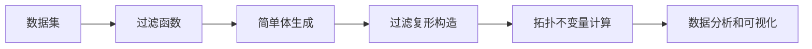
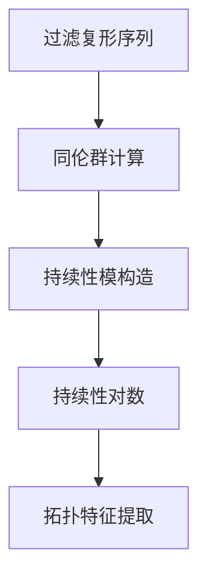

# 流形拓扑学理论与概念的实质：过滤复形的谱序列

## 1.背景介绍

在数据科学和机器学习领域,我们经常会遇到高维数据集。这些数据集通常具有复杂的拓扑结构,传统的线性方法很难有效地捕捉和分析这些结构。因此,拓扑数据分析(TDA)应运而生,它利用代数拓扑学的概念和方法来研究数据的形状和结构。

其中,流形学习是TDA的一个重要分支,旨在从高维数据中恢复低维流形。流形是一种在局部看起来像欧几里得空间的拓扑空间。许多自然界和人工系统中的数据都可以被认为是嵌入在高维空间中的低维流形的采样。因此,流形学习对于数据可视化、降维和理解数据的本质结构至关重要。

过滤复形是流形学习中的一个关键概念,它提供了一种有效的方法来捕捉和表示数据的拓扑和几何结构。本文将深入探讨过滤复形的理论基础、构建方法以及它在数据分析中的应用。

## 2.核心概念与联系

### 2.1 简单复形

为了理解过滤复形,我们首先需要了解简单复形(Simplicial Complex)的概念。简单复形是一种离散的几何对象,由一组简单体(Simplex)组成,并满足某些条件。

简单体是一种基本的几何对象,可以看作是一个点(0-简单体)、线段(1-简单体)、三角形(2-简单体)、四面体(3-简单体)等。一个 k 维简单体由 k+1 个仿射无关的点(顶点)组成。

简单复形是由一组满足以下条件的简单体组成的集合:

1. 任何简单体的每个面(Face)也属于该复形。
2. 两个简单体的交集要么为空,要么是它们的一个公共面。

简单复形提供了一种离散化表示拓扑空间的方法,它可以近似表示任何形状的对象或流形。

### 2.2 过滤复形

过滤复形(Filtered Simplicial Complex)是一种特殊的简单复形,它引入了一个额外的结构:过滤函数(Filtering Function)。过滤函数为每个简单体分配一个实数值,表示该简单体出现或"被诞生"的阈值。

形式上,一个过滤复形是一个简单复形的序列 $\{K_a\}_{a \in \mathbb{R}}$,其中 $K_a$ 是由所有出现阈值小于或等于 a 的简单体组成的子复形。这个序列满足嵌套条件:对于任何 $a \leq b$,都有 $K_a \subseteq K_b$。

过滤复形的构造过程通常基于数据点及其相互之间的某种相似性或距离度量。常见的过滤函数包括:

- 距离到一个固定参考点的距离
- 距离到数据集的直径
- 密度估计函数(如核密度估计)
- 其他可以反映数据点"重要性"的函数

通过不同的过滤函数,我们可以捕捉数据的不同拓扑和几何特征。



## 3.核心算法原理具体操作步骤

### 3.1 过滤复形构造算法

虽然过滤复形的理论定义很简单,但是如何从实际数据中有效地构造出一个合适的过滤复形却是一个具有挑战性的问题。以下是一种常见的构造过滤复形的算法流程:

1. **数据预处理**: 对原始数据进行标准化、去噪等预处理,以确保后续计算的稳定性和可靠性。

2. **选择过滤函数**: 根据分析目标和数据的特点,选择一个合适的过滤函数。常见选择包括距离函数、密度估计函数等。

3. **构建邻域图**: 基于过滤函数,为每个数据点确定其邻域,并构建一个邻域图(Neighborhood Graph)。这个图的节点对应数据点,边表示两个点之间的邻域关系。

4. **生成简单体**: 从邻域图中提取出所有的简单体(点、边、三角形等),并计算它们的出现阈值(通常是最大的过滤函数值)。

5. **构建过滤复形**: 按照出现阈值的升序,依次将简单体加入过滤复形序列中。需要注意的是,加入一个新的简单体时,必须确保它的所有面也已经存在于当前的子复形中。

6. **压缩过滤复形(可选)**: 为了减少计算开销,可以对过滤复形进行压缩,移除那些对拓扑不变量计算没有影响的简单体。

通过上述步骤,我们就可以从数据中构造出一个合适的过滤复形,为后续的拓扑不变量计算和数据分析做好准备。

### 3.2 拓扑不变量计算

拓扑不变量是代数拓扑学中的一个重要概念,它可以刻画一个拓扑空间的某些本质特征,而不受连续变形的影响。在过滤复形的背景下,我们通常关注以下两种拓扑不变量:

1. **同伦群(Homology Group)**: 同伦群描述了一个拓扑空间中的"洞"的代数结构。对于过滤复形,我们可以计算出每个出现阈值下的同伦群,从而捕捉不同尺度下的拓扑特征。

2. **persistance同伦(Persistent Homology)**: 由于过滤复形是一个嵌套的序列,因此我们可以追踪同伦群中"洞"的出生和死亡时间。这些持续的"洞"对应于数据中的显著拓扑特征,而短暂的"洞"则可能是由噪声引起的。

计算同伦群和持续同伦的标准算法是基于矩阵化简的。具体步骤如下:

1. 构建边界矩阵(Boundary Matrix):这是一个稀疏矩阵,它的行对应于 k 维简单体,列对应于 k-1 维简单体。矩阵的每个元素表示该 k 维简单体的边界在相应的 k-1 维简单体上取值为 1 或 -1。

2. 矩阵化简:通过对边界矩阵进行列运算,将其化简为标准形式。在这个过程中,我们可以识别出那些生存的"洞"。

3. 持续性对数计算:基于化简后的矩阵,我们可以计算出每个"洞"的出生和死亡时间,从而得到持续性对数(Persistence Diagram)。

4. 拓扑特征提取:从持续性对数中,我们可以提取出一些统计量,如持续性betti数、持续性熵等,用于量化数据的拓扑特征。

这些拓扑不变量为我们提供了一种全新的视角来理解和分析数据,尤其是那些具有复杂拓扑结构的数据。

## 4.数学模型和公式详细讲解举例说明 

### 4.1 同伦群

同伦群是代数拓扑学中的一个基本不变量,它描述了一个拓扑空间中的"洞"的代数结构。对于一个 k 维过滤复形 $K$,我们定义它的 k 维同伦群 $H_k(K)$ 如下:

$$H_k(K) = \ker \partial_k / \text{im} \partial_{k+1}$$

其中 $\partial_k$ 是从 k 维链群(Chain Group)到 k-1 维链群的边界同态(Boundary Homomorphism)。直观地说,k 维同伦群描述了 k 维"洞"在模除了边界之后的剩余结构。

例如,对于一个 2 维球面,它的 0 维同伦群对应于连通分量的个数;1 维同伦群对应于环路或孔洞的个数(在这种情况下为 0);2 维同伦群对应于球体内部和外部的两个"空穴"。

通过计算同伦群,我们可以捕捉到数据中的一些本质拓扑特征,如连通分量、环路和空穴等。这为后续的数据分析和可视化提供了重要的线索。

### 4.2 持续同伦(Persistent Homology)

由于过滤复形是一个嵌套的序列,因此我们可以追踪同伦群中"洞"的出生和死亡时间。这种跟踪"洞"持续性的方法被称为持续同伦(Persistent Homology)。

持续同伦的核心思想是,如果一个"洞"在过滤复形的一个较大范围内持续存在,那么它很可能对应于数据的一个显著拓扑特征,而不是噪声引起的。相反,如果一个"洞"的生命周期很短,那么它可能只是由于局部扰动而产生的,不足以代表数据的整体结构。

形式上,我们定义 k 维持续性模 $H_k = \{H_k(K_a)\}_{a \in \mathbb{R}}$,它是所有 k 维同伦群 $H_k(K_a)$ 的集合。对于每个 k 维"洞" $\gamma \in H_k(K_a)$,我们可以找到它的出生时间 $b_\gamma$ 和死亡时间 $d_\gamma$,它们分别对应于 $\gamma$ 第一次出现和最后消失的过滤值。

我们将所有"洞"的出生时间和死亡时间绘制在二维平面上,就得到了持续性对数(Persistence Diagram)。持续性对数提供了一种直观的方式来可视化数据的拓扑特征,并且它还具有一些良好的代数性质,例如对小扰动具有稳定性。



### 4.3 拓扑向量表示

除了可视化之外,我们还可以从持续性对数中提取出一些数值特征,用于后续的机器学习任务。一种常见的方法是构造拓扑向量(Topological Vector),它将持续性对数中的信息编码到一个固定长度的向量中。

具体来说,我们可以将持续性对数分成若干个区间,并统计每个区间内"洞"的个数。这些统计量就构成了拓扑向量的分量。更精细的方法还可以考虑"洞"的持续时间、稳定性等因素。

拓扑向量为我们提供了一种将复杂的拓扑信息嵌入到欧几里得空间中的方式,使得我们可以将经典的机器学习算法应用于拓扑数据分析任务,如聚类、分类和回归等。

## 5.项目实践:代码实例和详细解释说明

为了更好地理解过滤复形的构造和应用,我们将通过一个实际的代码示例来演示整个过程。在这个示例中,我们将使用 Python 中的 Giotto-TDA 库来处理一个合成数据集。

### 5.1 导入所需的库

```python
import numpy as np
from gtda.homology import VietorisRipsPersistence
from gtda.diagrams import PersistencEntropy
from gtda.pipeline import Pipeline
```

我们将使用 Giotto-TDA 库中的 `VietorisRipsPersistence` 类来构造过滤复形,并计算其持续同伦。`PersistencEntropy` 类将用于从持续性对数中提取拓扑特征。`Pipeline` 类则提供了一种方便的方式来组合不同的操作步骤。

### 5.2 生成合成数据集

```python
# 生成一个嵌入在 3 维空间中的圆环数据集
n_samples = 1000
noise = 0.05
data = np.zeros((n_samples, 3))
data[:, 0] = np.cos(np.linspace(0, 2 * np.pi, n_samples))
data[:, 1] = np.sin(np.linspace(0, 2 * np.pi, n_samples))
data += noise * np.random.randn(n_samples, 3)
```

在这个示例中,我们生成了一个嵌入在 3 维空间中的圆环数据集,并添加了一些高