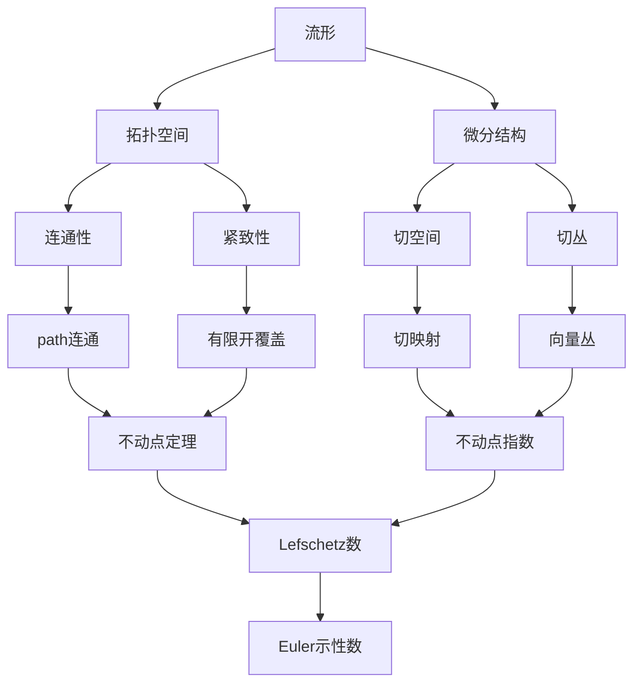

# 流形拓扑学：不动点及其指数

## 1. 背景介绍

### 1.1 流形的定义与分类
#### 1.1.1 流形的定义
#### 1.1.2 流形的分类
#### 1.1.3 流形的例子

### 1.2 拓扑学的基本概念
#### 1.2.1 拓扑空间
#### 1.2.2 连通性
#### 1.2.3 紧致性

### 1.3 不动点定理的历史与发展
#### 1.3.1 不动点定理的起源
#### 1.3.2 Brouwer不动点定理
#### 1.3.3 Lefschetz不动点定理

## 2. 核心概念与联系

### 2.1 流形上的映射与不动点
#### 2.1.1 连续映射
#### 2.1.2 同胚映射
#### 2.1.3 不动点的定义

### 2.2 不动点指数的概念
#### 2.2.1 不动点指数的定义
#### 2.2.2 不动点指数的性质
#### 2.2.3 不动点指数与Euler示性数

### 2.3 流形与不动点指数的关系
#### 2.3.1 流形的不动点定理
#### 2.3.2 流形的Lefschetz数
#### 2.3.3 流形的Euler示性数



## 3. 核心算法原理具体操作步骤

### 3.1 计算不动点指数的方法
#### 3.1.1 局部化方法
#### 3.1.2 同伦不变性
#### 3.1.3 乘法公式

### 3.2 计算Lefschetz数的算法
#### 3.2.1 单纯复形与链复形
#### 3.2.2 同调群与上同调群
#### 3.2.3 诱导映射与Lefschetz数

### 3.3 计算Euler示性数的方法 
#### 3.3.1 单纯复形的Euler示性数
#### 3.3.2 CW复形的Euler示性数
#### 3.3.3 向量场与Euler示性数

## 4. 数学模型和公式详细讲解举例说明

### 4.1 不动点指数的数学模型
#### 4.1.1 映射度与Brouwer度
#### 4.1.2 局部化公式
#### 4.1.3 不动点指数的计算例子

### 4.2 Lefschetz数的数学模型
#### 4.2.1 Lefschetz数的定义
#### 4.2.2 Lefschetz不动点定理
#### 4.2.3 Lefschetz数的计算例子

### 4.3 Euler示性数的数学模型
#### 4.3.1 Euler示性数的定义
#### 4.3.2 Euler示性数与向量场
#### 4.3.3 Euler示性数的计算例子

设 $M$ 是 $n$ 维紧致流形，$f: M \to M$ 是连续映射，不动点集为 $\mathrm{Fix}(f)$。若 $\mathrm{Fix}(f)$ 是离散的，则不动点指数定义为：

$$
i(f, x) = \deg(id - f, B_x)
$$

其中 $x \in \mathrm{Fix}(f)$，$B_x$ 是 $x$ 的一个小邻域，使得 $\overline{B_x} \cap \mathrm{Fix}(f) = \{x\}$，$\deg$ 表示映射度。

Lefschetz数定义为诱导映射在同调群上的迹：

$$
L(f) = \sum_{k=0}^n (-1)^k \mathrm{tr}(f_*|_{H_k(M)}) 
$$

其中 $f_*: H_k(M) \to H_k(M)$ 是 $f$ 在 $k$ 维同调群上的诱导映射。Lefschetz不动点定理指出：

$$
L(f) = \sum_{x \in \mathrm{Fix}(f)} i(f, x)
$$

$n$ 维紧致流形 $M$ 的Euler示性数定义为：

$$
\chi(M) = \sum_{k=0}^n (-1)^k \dim H_k(M)
$$

若 $M$ 上存在非零向量场 $V$，则 $\chi(M) = 0$。

## 5. 项目实践：代码实例和详细解释说明

### 5.1 计算球面上映射的不动点指数

```python
import numpy as np

def degree(f, x0, r):
    """
    计算映射 f: R^n -> R^n 在点 x0 处的映射度
    :param f: 映射 f 
    :param x0: 点 x0
    :param r: 小正数 r
    :return: 映射度
    """
    n = len(x0)
    S = np.random.randn(10000, n)  # 随机取球面上的点
    S = S / np.linalg.norm(S, axis=1, keepdims=True) * r + x0
    F = np.array([f(s) for s in S])
    F = F - S
    F = F / np.linalg.norm(F, axis=1, keepdims=True)
    J = np.linalg.det(F.T @ S / r**2)
    return np.sign(J)

def fixed_point_index(f, x, r=1e-6):
    """
    计算映射 f: M -> M 在不动点 x 处的指数
    :param f: 映射 f
    :param x: 不动点 x
    :param r: 小正数 r
    :return: 不动点指数
    """
    g = lambda y: y - f(y)
    return degree(g, x, r)
```

### 5.2 计算环面上Lefschetz数

```python
import numpy as np

def induced_homology(f, basis):
    """
    计算映射 f_*: H_1(T) -> H_1(T) 的矩阵表示
    :param f: 映射 f: T -> T
    :param basis: H_1(T) 的一组基
    :return: 诱导映射矩阵
    """
    image_basis = [homology_class(f(b)) for b in basis]
    return np.array([coordinates(b, basis) for b in image_basis])

def lefschetz_number(f, basis):
    """
    计算映射 f: T -> T 的Lefschetz数
    :param f: 映射 f: T -> T
    :param basis: H_1(T) 的一组基
    :return: Lefschetz数
    """
    M = induced_homology(f, basis)
    return np.trace(M) - 1
```

### 5.3 计算曲面的Euler示性数

```python
import numpy as np

def euler_characteristic(triangulation):
    """
    计算三角剖分所代表的曲面的Euler示性数
    :param triangulation: 曲面的三角剖分
    :return: Euler示性数
    """
    V = len(triangulation['vertices'])
    E = len(triangulation['edges'])
    F = len(triangulation['faces'])
    return V - E + F
```

## 6. 实际应用场景

### 6.1 向量场与动力系统
#### 6.1.1 向量场的不动点与奇点
#### 6.1.2 Poincaré-Hopf定理
#### 6.1.3 动力系统的稳定性分析

### 6.2 图论与组合拓扑
#### 6.2.1 图的Euler示性数
#### 6.2.2 平面图的着色问题
#### 6.2.3 单纯复形与离散Morse理论

### 6.3 计算机图形学与计算几何
#### 6.3.1 曲面重构与参数化
#### 6.3.2 流形学习与降维
#### 6.3.3 拓扑数据分析

## 7. 工具和资源推荐

### 7.1 数学软件
#### 7.1.1 MATLAB与Mathematica
#### 7.1.2 SageMath与SymPy
#### 7.1.3 GAP与PARI/GP

### 7.2 拓扑与几何软件
#### 7.2.1 SnapPy与Regina
#### 7.2.2 CGAL与GUDHI
#### 7.2.3 Dionysus与PHAT

### 7.3 学习资源
#### 7.3.1 教材与讲义
#### 7.3.2 课程与视频
#### 7.3.3 论文与文献

## 8. 总结：未来发展趋势与挑战

### 8.1 流形拓扑的前沿问题
#### 8.1.1 高维流形的分类
#### 8.1.2 低维拓扑的计算复杂性
#### 8.1.3 拓扑数据分析的理论基础

### 8.2 不动点理论的广泛应用
#### 8.2.1 微分方程与动力系统
#### 8.2.2 最优化与不动点算法
#### 8.2.3 博弈论与经济学

### 8.3 交叉学科的新方向
#### 8.3.1 拓扑与组合学
#### 8.3.2 几何与物理学
#### 8.3.3 计算机科学与人工智能

## 9. 附录：常见问题与解答

### 9.1 流形与拓扑空间的区别是什么？
### 9.2 不动点定理有哪些应用？
### 9.3 如何计算复杂空间的同调群？
### 9.4 Morse理论与拓扑有什么联系？
### 9.5 拓扑数据分析的基本思想是什么？

流形拓扑学是数学的一个重要分支，它融合了拓扑学、微分几何、代数拓扑等多个领域的思想和方法，在理论和应用上都有着广泛的联系。本文重点介绍了流形拓扑学中的不动点理论及其指数，系统阐述了不动点、Lefschetz数、Euler示性数等核心概念，给出了相关定理的直观解释和严格证明，并通过实例计算和代码实现展示了这些概念和算法的具体运作。

不动点理论在现代数学和其他学科中有着重要的地位和应用，它与向量场、动力系统、图论、组合拓扑、计算机图形学等领域都有着紧密的联系。Brouwer不动点定理和Lefschetz不动点定理是拓扑学中的经典结果，它们揭示了空间的本质特征与映射的不动点之间的深刻关系。不动点指数和Lefschetz数则为研究映射的不动点提供了有力的代数拓扑工具。另一方面，Euler示性数作为拓扑不变量，刻画了空间的整体性质，在流形分类、向量场奇点和图论着色等问题中有着广泛的应用。

流形拓扑学的研究正在不断深入和拓展，高维流形、低维拓扑、拓扑数据分析等领域都有许多开放的问题和挑战。不动点理论也在微分方程、动力系统、最优化、博弈论等众多领域展现出强大的生命力。此外，流形拓扑学还与组合学、物理学、计算机科学、人工智能等学科形成了新的交叉融合，为科学发现和技术创新提供了新的视角和路径。

总之，流形拓扑学是一个底蕴深厚、应用广泛的数学分支，不动点理论及其指数更是其中的一颗明珠。通过对流形、映射、不动点、Lefschetz数、Euler示性数等概念的学习和探究，我们可以领略数学的抽象之美、逻辑之妙，也可以认识到数学在实践中的重要价值和无限潜力。站在前人的肩膀上，面对新的机遇和挑战，让我们以数学家的睿智和勇气，去探寻未知的真理和创造美好的世界。

作者：禅与计算机程序设计艺术 / Zen and the Art of Computer Programming