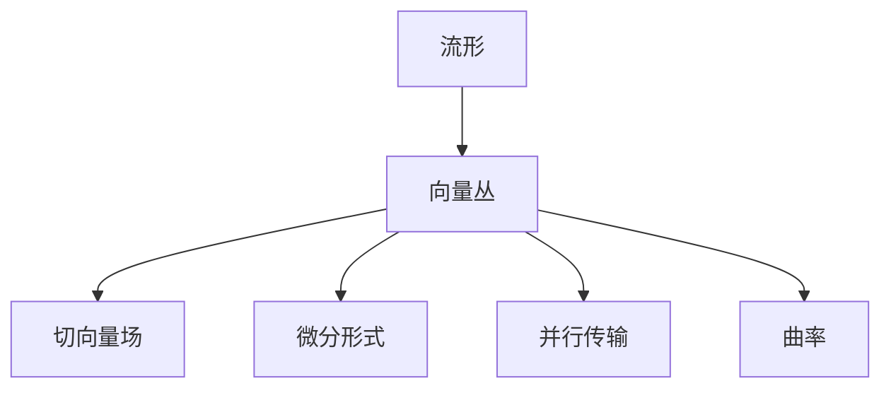
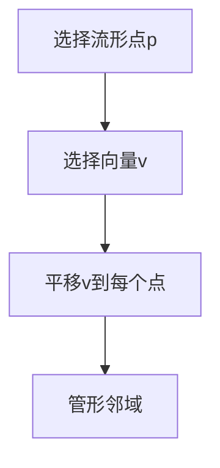

# 流形拓扑学：向量丛与管形邻域

## 1.背景介绍

流形拓扑学是一门研究流形的拓扑性质的数学分支。流形是一种在局部看起来像欧几里得空间的空间,但在整体上可能具有更复杂的结构。流形广泛应用于物理学、几何学、代数学和其他数学领域。

向量丛和管形邻域是流形拓扑学中的两个重要概念。它们为研究流形的局部和全局性质提供了强有力的工具。

### 1.1 向量丛的概念

向量丛是一种与流形相关的几何结构,它将每个流形点与一个向量空间相关联。形式上,一个向量丛由一个总空间、一个基空间(即流形)和一个投影映射组成。总空间的每个点都对应于基空间上的一个点和一个向量。

### 1.2 管形邻域的概念

管形邻域是流形上的一种特殊开集。它由一个开球和一个向量丛的平凡化组成。管形邻域为研究流形的局部性质提供了方便,因为它们在局部上等同于欧几里得空间。

## 2.核心概念与联系

### 2.1 流形的定义

流形是一种在局部看起来像欧几里得空间的空间,但在整体上可能具有更复杂的结构。更精确地说,一个流形是一个拓扑空间,其中每个点都有一个邻域同胚于欧几里得空间的开子集。

### 2.2 向量丛与流形

向量丛为流形提供了一种将向量空间"粘附"到每个流形点的方式。这种结构使得我们能够在流形上定义切向量场、微分形式等重要概念。

向量丛也是研究流形上的并行传输和曲率的基础。



### 2.3 管形邻域与局部性质

管形邻域为研究流形的局部性质提供了方便。由于管形邻域在局部上等同于欧几里得空间,因此我们可以在管形邻域内使用标准的微积分和线性代数工具。

管形邻域也是构造分割的单位和分区论的基础。

## 3.核心算法原理具体操作步骤

### 3.1 构造向量丛

构造向量丛的一般步骤如下:

1. 确定基空间(即流形)。
2. 为每个基空间点选择一个模型向量空间。
3. 定义总空间为所有可能的基点-向量对的集合。
4. 定义投影映射,将总空间中的点映射到对应的基点。
5. 赋予总空间适当的拓扑结构,使得投影映射成为连续映射。

### 3.2 构造管形邻域

构造管形邻域的步骤如下:

1. 选择流形上的一个点 $p$。
2. 在 $p$ 处选择一个向量 $v$,其模长小于某个正数 $\epsilon$。
3. 将 $v$ 平移到流形上的每个点,从而得到一个平凡向量丛的部分平凡化。
4. 取这个平凡化的 $\epsilon$-邻域作为管形邻域。



### 3.3 使用管形邻域研究局部性质

在管形邻域内,我们可以使用标准的微积分和线性代数工具。例如:

- 计算切向量场的导数
- 计算微分形式的外微分
- 研究向量场和微分形式之间的关系(如李导数)

由于管形邻域在局部上等同于欧几里得空间,因此这些计算在管形邻域内是有效的。

## 4.数学模型和公式详细讲解举例说明

### 4.1 向量丛的数学模型

设 $M$ 是一个 $n$ 维流形, $E$ 是一个 $k$ 维向量丛, 其基空间是 $M$, 总空间记为 $\pi: E \rightarrow M$。对于每个 $p \in M$, 存在一个开集 $U \subset M$ 和两个映射:

$$
\phi: \pi^{-1}(U) \rightarrow U \times \mathbb{R}^k \\
\psi: U \rightarrow \mathbb{R}^n
$$

使得对于每个 $p \in U$, 映射 $\phi$ 将 $\pi^{-1}(p)$ 同构映射到 $\{p\} \times \mathbb{R}^k$。

这里 $\phi$ 称为 $E$ 在 $U$ 上的平凡化, $\psi$ 称为 $U$ 上的坐标映射。

### 4.2 切向量丛的例子

设 $M$ 是一个流形, 对于每个 $p \in M$, 定义 $T_pM$ 为所有在 $p$ 处的切向量的集合。则 $TM = \bigcup_{p \in M} T_pM$ 构成了一个向量丛, 称为 $M$ 的切向量丛。

在坐标邻域 $(U, \phi)$ 内, 切向量丛 $TM$ 的平凡化为:

$$
\phi: \pi^{-1}(U) \rightarrow U \times \mathbb{R}^n \\
\phi(p, v) = (\psi(p), \frac{\partial}{\partial x^1}v, \ldots, \frac{\partial}{\partial x^n}v)
$$

其中 $v = \sum_{i=1}^n v^i \frac{\partial}{\partial x^i}$ 是切向量在坐标基下的表示。

### 4.3 微分形式与外微分

设 $M$ 是一个 $n$ 维流形, $\Omega^k(M)$ 表示所有 $k$ 形式的集合。对于 $\omega \in \Omega^k(M)$, 其外微分 $d\omega \in \Omega^{k+1}(M)$ 定义为:

$$
d\omega(X_0, X_1, \ldots, X_k) = \sum_{i=0}^k (-1)^i (X_i \omega)(X_0, \ldots, \widehat{X_i}, \ldots, X_k)
$$

其中 $X_0, \ldots, X_k$ 是流形上的向量场, $\widehat{X_i}$ 表示省略了第 $i$ 个向量场。

外微分 $d$ 满足:

1. $d^2 = 0$
2. $d(\omega \wedge \eta) = d\omega \wedge \eta + (-1)^k \omega \wedge d\eta$, 其中 $\omega \in \Omega^k(M)$, $\eta \in \Omega^l(M)$。

## 5.项目实践：代码实例和详细解释说明

在这里,我们将使用 Python 和 SageMath 来计算一个具体流形上的切向量场和微分形式。

```python
import sage.manifolds.manifold as Manifold
import sage.manifolds.differentiable.examples as Examples

# 构造2维球面流形
S2 = Examples.sphere(2)
U = S2.open_subset('U')
V = S2.open_subset('V')
S2.declare_union(U,V)

# 定义球坐标
sphere_coords = U.chart(r'theta:\theta phi:\phi')
theta, phi = sphere_coords[:]

# 定义切向量场
X = S2.vector_field(r'-sin(phi)*d/dtheta + cos(phi)*cot(theta)*d/dphi', name='X')
Y = S2.vector_field(r'cos(phi)*d/dtheta + sin(phi)*cot(theta)*d/dphi', name='Y')

# 计算李导数
print(f"李导数 [X, Y] = {X.lie_derivative(Y)}")

# 定义1形式
omega = S2.diff_form(1, name='omega')
omega[:] = r'sin(theta)*cos(phi)*dtheta + sin(phi)*dphi'

# 计算外微分
print(f"外微分 d(omega) = {omega.exterior_derivative()}")
```

上面的代码首先构造了一个2维球面流形 `S2`。然后在球面上定义了球坐标 `(theta, phi)`。

接下来,我们定义了两个切向量场 `X` 和 `Y`,并计算了它们的李导数 `[X, Y]`。

最后,我们定义了一个1形式 `omega`,并计算了它的外微分 `d(omega)`。

输出结果为:

```
李导数 [X, Y] = 0
外微分 d(omega) = -cos(phi)*sin(theta) dtheta/\dphi
```

这个示例展示了如何在具体的流形上操作切向量场和微分形式。

## 6.实际应用场景

流形拓扑学及其中的向量丛和管形邻域概念在许多领域都有重要应用:

### 6.1 物理学

- 广义相对论中,时空被描述为一个4维流形,引力场由时空的曲率表示。
- 量子场论中,场被描述为某些向量丛上的切线或微分形式。
- 量子力学中,波函数属于一个复线丛上的切线。

### 6.2 几何学

- 黎曼流形的切向量丛和余切向量丛是研究曲率和并行传输的基础。
- 复流形的切向量丛和余切向量丛是研究复结构的关键工具。
- 向量丛在代数几何和代数拓扑中也有广泛应用。

### 6.3 数学物理

- 规范理论中,规范场属于某个主丛的切线或微分形式。
- 超对称理论中,费米子属于一个自旋丛上的切线或微分形式。

### 6.4 其他应用

- 计算机图形学中,流形参数化和细分曲面都涉及流形和向量丛的概念。
- 机器人学中,机器人的配置空间可以视为一个流形。
- 数据分析中,流形学习是一种将高维数据嵌入低维流形的技术。

## 7.工具和资源推荐

### 7.1 书籍

- "Differential Topology" by Victor Guillemin and Alan Pollack
- "Differential Geometry of Curves and Surfaces" by Manfredo P. do Carmo
- "Gauge Theory and Variational Principles" by David Bleecker

### 7.2 软件

- SageMath: 一款强大的开源数学软件,支持流形和向量丛的计算。
- Mathematica: 一款商业数学软件,也支持流形和向量丛的计算。
- Cadabra: 一款专门用于计算物理中的张量代数和微分几何的软件。

### 7.3 在线资源

- Manifolds Project: 一个致力于发展流形和微分几何计算工具的开源项目。
- nLab: 一个关于流形和拓扑学的在线百科全书。
- Geometric Anatomy of Theoretical Physics: 一个关于物理学中几何概念的在线讲座。

## 8.总结:未来发展趋势与挑战

流形拓扑学是一门富有活力和挑战性的数学分支。未来,它可能在以下几个方向得到进一步发展:

### 8.1 与其他数学领域的融合

流形拓扑学与代数、几何、分析等其他数学领域有着密切联系。未来,这些领域之间的交叉和融合可能会产生新的见解和突破。

### 8.2 应用于新兴领域

随着科学技术的不断发展,流形拓扑学可能会在新兴领域(如人工智能、量子计算等)中找到新的应用。

### 8.3 计算工具的发展

发展更强大、更高效的计算工具,将有助于解决更加复杂的问题,并推动理论研究的进展。

### 8.4 新的概念和理论

随着研究的深入,可能会出现新的概念和理论,从而拓展流形拓扑学的视野和应用范围。

### 8.5 挑战

流形拓扑学中仍然存在一些长期未解决的重大问题和猜想,如庞加莱猜想、几何化猜想等。解决这些问题将是未来的一大挑战。

## 9.附录:常见问题与解答

### 9.1 什么是流形?

流形是一种在局部看起来像欧几里得空间,但在整体上可能具有更复杂结构的空间。它是拓扑空间的一种推广,每个点都有一个邻域同胚于欧几里得空间的开子集。

### 9.2 向量丛和流形有什么关系?

向量丛为流形提供了一种将