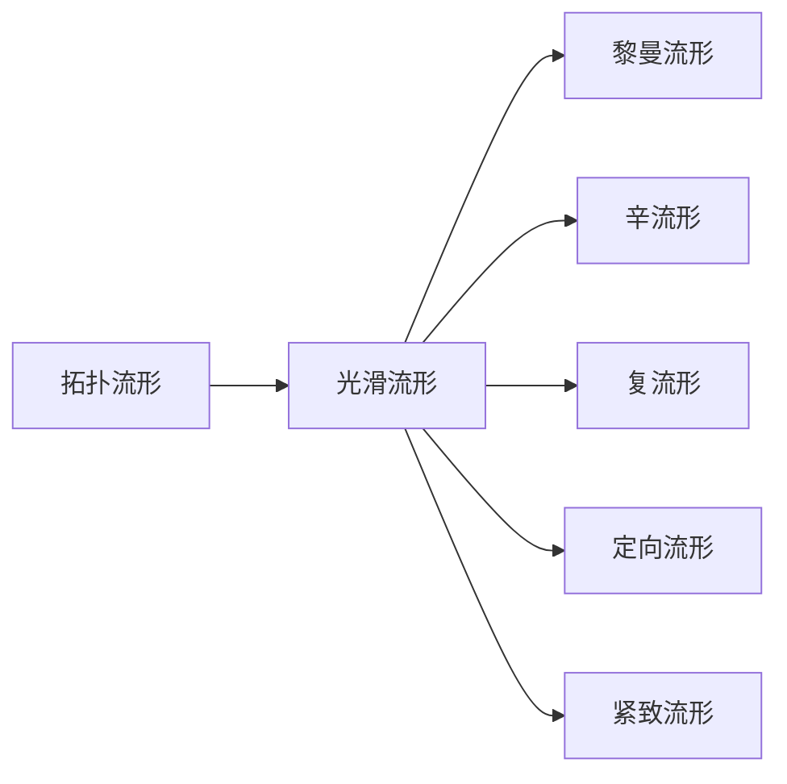

# 流形拓扑学：流形上的张量场

## 1. 背景介绍

### 1.1 流形拓扑学的起源与发展
流形拓扑学是现代数学的重要分支,它研究流形的拓扑性质。流形是一类特殊的拓扑空间,局部看起来像欧氏空间,但整体拓扑结构可能非常复杂。流形拓扑学的发展可以追溯到19世纪,当时黎曼、庞加莱等数学家开始系统研究流形的性质。20世纪中叶,在Whitney、Milnor、Smale等数学家的推动下,流形拓扑学进入了蓬勃发展的新时期。

### 1.2 张量场在流形上的意义
张量场是定义在流形上的一种几何对象,它在每一点赋予一个多重线性映射,刻画了流形上的几何量如曲率、挠率等。研究流形上的张量场,对于理解流形的几何和拓扑性质具有重要意义。张量场的概念在物理学中也有广泛应用,如广义相对论就是建立在黎曼流形和度规张量的基础之上。

### 1.3 流形上张量场的研究现状
目前,流形上张量场的研究已经取得了丰富的成果。人们构造了丰富的张量场,如黎曼度规、辛结构、复结构等,刻画了流形的几何性质。同时,人们还发展了张量场的分析方法,如Hodge理论、调和映射理论等,用于研究张量场的性质及其与流形拓扑的关系。张量场的研究已经渗透到数学的多个分支,如偏微分方程、动力系统、代数几何等,展现出强大的生命力。

## 2. 核心概念与联系

### 2.1 流形的定义与分类
流形是一类特殊的拓扑空间,它局部同胚于欧氏空间 $\mathbb{R}^n$。更准确地说,一个 $n$ 维流形 $M$ 是一个拓扑空间,它满足：
1. $M$ 是Hausdorff空间；
2. $M$ 是可数基空间；
3. $M$ 局部同胚于 $\mathbb{R}^n$,即 $\forall x\in M$,存在 $x$ 的开邻域 $U$,以及同胚 $\varphi:U\to \mathbb{R}^n$ 的开子集。

流形可以按照多种标准进行分类：
- 按照维数分类：1维流形、2维流形（曲面）、高维流形等；
- 按照附加结构分类：光滑流形、黎曼流形、辛流形、复流形等；
- 按照定向性分类：定向流形、非定向流形；
- 按照紧致性分类：紧致流形、非紧致流形。



### 2.2 张量场的定义与分类
设 $M$ 是 $n$ 维光滑流形,$(U,\varphi)$ 是 $M$ 上的坐标卡。张量场 $T$ 是一个映射：
$$T:\underbrace{TM\times\cdots\times TM}_{r}\times \underbrace{T^*M\times\cdots\times T^*M}_{s}\to C^\infty(M)$$
其中 $TM$ 是 $M$ 的切丛,$T^*M$ 是 $M$ 的余切丛。称 $T$ 是 $M$ 上的 $(r,s)$ 型张量场。

张量场也有多种分类方式：
- 按照类型分类：$(0,0)$ 型张量场（函数）、$(1,0)$ 型张量场（向量场）、$(0,1)$ 型张量场（1-形式）、$(0,2)$ 型张量场（黎曼度规）等；
- 按照对称性分类：对称张量场、反对称张量场；  
- 按照性质分类：平行张量场、调和张量场、Killing张量场等。

### 2.3 流形与张量场的关系
流形为张量场提供了定义的舞台,张量场则刻画了流形的几何性质。它们之间存在着紧密的联系：
- 流形的拓扑决定了张量场的存在性和分类。如球面 $S^2$ 上不存在非零向量场,而环面 $T^2$ 上存在非零向量场；
- 张量场反映了流形的几何性质。如黎曼度规刻画了流形的度量,辛结构刻画了流形的辛几何；
- 张量场满足一定的方程和恒等式。如黎曼度规满足 $\nabla g=0$,辛结构满足 $d\omega=0$ 等。

## 3. 核心算法原理具体操作步骤

### 3.1 张量场的局部表示
设 $(U,\varphi=(x^1,\cdots,x^n))$ 是流形 $M$ 上的坐标卡,$(r,s)$ 型张量场 $T$ 在 $U$ 上的局部表示为：
$$T=T^{i_1\cdots i_r}_{j_1\cdots j_s}\frac{\partial}{\partial x^{i_1}}\otimes\cdots\otimes\frac{\partial}{\partial x^{i_r}}\otimes dx^{j_1}\otimes\cdots\otimes dx^{j_s}$$
其中 $T^{i_1\cdots i_r}_{j_1\cdots j_s}$ 是关于坐标 $x^i$ 的光滑函数。

### 3.2 张量场的坐标变换公式
设 $(U,\varphi=(x^1,\cdots,x^n))$ 和 $(V,\psi=(y^1,\cdots,y^n))$ 是流形 $M$ 上的两个坐标卡,它们之间的坐标变换为 $y^i=y^i(x^1,\cdots,x^n)$。则张量场 $T$ 在两个坐标卡下的分量满足变换公式：
$$\widetilde{T}^{i_1\cdots i_r}_{j_1\cdots j_s}=\frac{\partial y^{i_1}}{\partial x^{k_1}}\cdots\frac{\partial y^{i_r}}{\partial x^{k_r}}\frac{\partial x^{l_1}}{\partial y^{j_1}}\cdots\frac{\partial x^{l_s}}{\partial y^{j_s}}T^{k_1\cdots k_r}_{l_1\cdots l_s}$$

### 3.3 张量场的代数运算
设 $S$ 和 $T$ 是流形 $M$ 上的两个张量场,它们的和 $S+T$、数乘 $cT$、张量积 $S\otimes T$ 和缩并 $C(T)$ 都是张量场,它们的分量满足：
$$(S+T)^{i_1\cdots i_r}_{j_1\cdots j_s}=S^{i_1\cdots i_r}_{j_1\cdots j_s}+T^{i_1\cdots i_r}_{j_1\cdots j_s}$$
$$(cT)^{i_1\cdots i_r}_{j_1\cdots j_s}=cT^{i_1\cdots i_r}_{j_1\cdots j_s}$$
$$(S\otimes T)^{i_1\cdots i_{r+r'}}_{j_1\cdots j_{s+s'}}=S^{i_1\cdots i_r}_{j_1\cdots j_s}T^{i_{r+1}\cdots i_{r+r'}}_{j_{s+1}\cdots j_{s+s'}}$$
$$(C(T))^{i_1\cdots i_{r-1}}_{j_1\cdots j_{s-1}}=T^{i_1\cdots i_{r-1}k}_{j_1\cdots j_{s-1}k}$$

### 3.4 张量场的外微分
设 $\omega$ 是流形 $M$ 上的 $p$ 形式,它的外微分 $d\omega$ 是一个 $p+1$ 形式,其分量满足：
$$(d\omega)_{i_0\cdots i_p}=\frac{1}{p!}\sum_{\sigma\in S_{p+1}}(-1)^\sigma \frac{\partial}{\partial x^{i_{\sigma(0)}}}\omega_{i_{\sigma(1)}\cdots i_{\sigma(p)}}$$
其中 $S_{p+1}$ 是 $p+1$ 个元素的全排列群。外微分算子 $d$ 满足：
1. $d(c\omega)=cd(\omega)$,其中 $c$ 是常数；
2. $d(\omega+\eta)=d\omega+d\eta$；
3. $d(d\omega)=0$。

## 4. 数学模型和公式详细讲解举例说明

### 4.1 黎曼度规
黎曼度规是一个 $(0,2)$ 型对称张量场 $g$,它在每一点给出一个对称双线性形式 $g_p:T_pM\times T_pM\to\mathbb{R}$,满足：
1. $g_p(X,Y)=g_p(Y,X),\forall X,Y\in T_pM$；
2. $g_p(X,X)>0,\forall X\in T_pM,X\neq 0$。

在局部坐标 $(x^1,\cdots,x^n)$ 下,黎曼度规的分量为 $g_{ij}=g(\frac{\partial}{\partial x^i},\frac{\partial}{\partial x^j})$,它们构成了对称矩阵 $(g_{ij})$。黎曼度规刻画了流形上的度量,即两个切向量 $X,Y$ 的内积为 $\langle X,Y\rangle=g(X,Y)$。

例如,欧氏空间 $\mathbb{R}^n$ 上的标准度规为 $g=\sum_{i=1}^n dx^i\otimes dx^i$,即 $g_{ij}=\delta_{ij}$。单位球面 $S^2$ 上的标准度规为 $g=d\theta\otimes d\theta+\sin^2\theta d\varphi\otimes d\varphi$,其中 $(\theta,\varphi)$ 是球面坐标。

### 4.2 辛结构 
辛结构是一个 $(0,2)$ 型反对称张量场 $\omega$,它在每一点给出一个反对称双线性形式 $\omega_p:T_pM\times T_pM\to\mathbb{R}$,满足：
1. $\omega_p(X,Y)=-\omega_p(Y,X),\forall X,Y\in T_pM$；
2. $d\omega=0$,即 $\omega$ 是闭的。

如果 $\omega$ 还满足非退化性条件,即 $\forall p\in M,\forall X\in T_pM,X\neq 0,\exists Y\in T_pM$ 使得 $\omega_p(X,Y)\neq 0$,则称 $(M,\omega)$ 为辛流形。

在局部坐标 $(x^1,\cdots,x^n)$ 下,辛结构的分量为 $\omega_{ij}=\omega(\frac{\partial}{\partial x^i},\frac{\partial}{\partial x^j})$,它们构成了反对称矩阵 $(\omega_{ij})$。闭条件 $d\omega=0$ 在坐标下的表达式为：
$$\frac{\partial \omega_{ij}}{\partial x^k}+\frac{\partial \omega_{jk}}{\partial x^i}+\frac{\partial \omega_{ki}}{\partial x^j}=0$$

例如,欧氏空间 $\mathbb{R}^{2n}$ 上的标准辛结构为 $\omega=\sum_{i=1}^n dx^i\wedge dx^{n+i}$,其中 $x^1,\cdots,x^{2n}$ 是 $\mathbb{R}^{2n}$ 的坐标。单位球面 $S^2$ 上的辛结构为 $\omega=\sin\theta d\theta\wedge d\varphi$。

## 5. 项目实践：代码实例和详细解释说明

下面我们用Python的Sympy库来计算张量场的一些操作。

首先导入需要的库：

```python
from sympy import * 
init_printing()
```

定义流形上的坐标：

```python
x1, x2 = symbols('x1 x2')
```

定义两个向量场 $X=\frac{\partial}{\partial x^1},Y=x^1\frac{\partial}{\partial x^2}$：

```python
X = CovariantTensor(1, 0, [1, 0], [x1, x2])
Y = CovariantTensor(1, 0, [0, x1], [x1, x2])
```

计算它们的张量积 $X\otimes Y$：

```python
T = TensorProduct(X, Y)
T.display()
```

输出结果为：
$$\begin{pmatrix}0 & x^{1}\\0 & 0\end{pmatrix