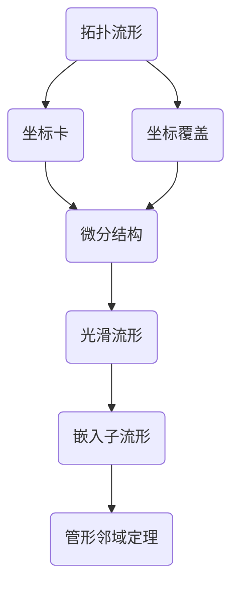

# 流形拓扑学：管形邻域定理

## 1.背景介绍
### 1.1 流形的基本概念
流形(Manifold)是一个抽象的数学概念,用于描述局部类似于欧氏空间的拓扑空间。直观地说,流形就是一个可以赋予坐标系的空间,在局部看起来像是欧氏空间。流形的研究在现代数学和物理学中有着广泛的应用。

### 1.2 拓扑学与流形的联系
拓扑学是研究空间性质在连续变换下保持不变的数学分支。流形作为一类特殊的拓扑空间,其拓扑性质的研究是流形拓扑学的核心内容。管形邻域定理就是流形拓扑学中的一个重要定理,揭示了流形局部的拓扑结构。

### 1.3 管形邻域定理的重要性
管形邻域定理在流形拓扑学中有着重要的地位。它不仅揭示了流形局部的拓扑结构,而且在许多其他定理的证明中也起到了关键作用,如Poincaré-Hopf定理、Gauss-Bonnet定理等。因此,深入理解管形邻域定理对于学习流形拓扑学至关重要。

## 2.核心概念与联系
### 2.1 拓扑流形的定义
拓扑流形是一个Hausdorff空间M,且M满足第二可数公理,同时M的任意一点都有一个同胚于欧氏空间的开邻域。

### 2.2 坐标卡与坐标覆盖
坐标卡(Chart)是从流形的一个开子集到欧氏空间的同胚。坐标覆盖(Atlas)是一族坐标卡的集合,使得它们的定义域覆盖了整个流形。

### 2.3 微分结构与光滑流形
在拓扑流形上赋予一个maximal的光滑结构,可以得到一个光滑流形。光滑结构使得我们可以在流形上做微积分。

### 2.4 子流形与余维数
流形M的子集N如果也是一个流形,且N到M的包含映射是一个嵌入,则称N是M的子流形。子流形N在M中的余维数(Codimension)定义为dim(M)-dim(N)。

## 3.核心算法原理具体操作步骤
管形邻域定理的证明可以分为以下几个步骤:

### 3.1 局部坐标卡的构造
在子流形N上任取一点p,利用N作为M的嵌入子流形,可以找到M上的坐标卡(U,φ),使得p∈U且φ(U∩N)=Rn×{0}。

### 3.2 构造延拓的坐标卡
利用3.1中构造的坐标卡(U,φ),可以构造M在p点的一个坐标卡(V,ψ),其中V⊂U是p的一个开邻域,且ψ:V→Rn×Rm是同胚,满足ψ|V∩N=φ|V∩N。

### 3.3 构造管形邻域的同胚
利用3.2构造的坐标卡(V,ψ),可以构造一个同胚h:V→N×Dm,其中Dm是m维单位闭球,使得h(q)=(q,0),∀q∈N∩V。

### 3.4 管形邻域的存在性
利用3.3构造的同胚h,可以证明N在M中的管形邻域Tub(N)的存在性,即Tub(N)同胚于N×Dm。

## 4.数学模型和公式详细讲解举例说明
### 4.1 拓扑流形的定义
设M是一个拓扑空间,如果满足:
(1) M是Hausdorff的;
(2) M满足第二可数公理;
(3) M的任意一点p都有一个开邻域U,使得U同胚于Rn的一个开子集。
则称M是一个n维拓扑流形。

### 4.2 嵌入映射的定义
设M,N是两个流形,f:N→M是一个连续映射。如果f是一个同胚到它的像f(N)上,且f(N)是M的一个子流形,则称f是一个嵌入映射。

### 4.3 管形邻域定理
设M是一个m维光滑流形,N是M的n维嵌入子流形,则N在M中有一个管形邻域Tub(N),满足Tub(N)同胚于N×Dm-n,其中Dm-n是(m-n)维单位闭球。

## 5.项目实践：代码实例和详细解释说明
在实际应用中,我们常常需要对流形进行三角剖分,得到一个单纯复形。下面是利用Python的SimplicialComplex包对托卢斯(Torus)进行三角剖分的代码:

```python
import numpy as np
from scipy.spatial import Delaunay
from simplicialcomplex import SimplicialComplex

# 生成托卢斯上的点
angles = np.linspace(0, 2*np.pi, 20)
r1, r2 = 2, 1
points = np.array([[
    (r1+r2*np.cos(t))*np.cos(s), 
    (r1+r2*np.cos(t))*np.sin(s), 
    r2*np.sin(t)
] for s,t in np.array(np.meshgrid(angles, angles)).T.reshape(-1,2)])

# 对点进行Delaunay三角剖分
tri = Delaunay(points)

# 构造单纯复形
sc = SimplicialComplex(simplices=tri.simplices)
```

在这个例子中,我们首先生成了托卢斯上均匀分布的一些点,然后利用scipy.spatial的Delaunay类对这些点进行Delaunay三角剖分,最后利用SimplicialComplex类构造了一个单纯复形。这样,我们就得到了托卢斯的一个单纯复形近似。

## 6.实际应用场景
管形邻域定理在许多领域都有重要的应用,例如:

### 6.1 微分拓扑学
管形邻域定理是许多微分拓扑学定理的基础,如Poincaré-Hopf定理、Gauss-Bonnet定理等。

### 6.2 动力系统
在动力系统的研究中,人们常常需要研究一个流形上的向量场。管形邻域定理保证了我们可以在流形上构造向量场。

### 6.3 物理学
在广义相对论等物理学理论中,时空被模型化为一个4维流形。管形邻域定理在研究时空的局部结构时有重要作用。

## 7.工具和资源推荐
以下是一些学习流形拓扑学的有用资源:

### 7.1 书籍
- John M. Lee, Introduction to Smooth Manifolds
- Loring W. Tu, An Introduction to Manifolds
- Shoshichi Kobayashi, Katsumi Nomizu, Foundations of Differential Geometry

### 7.2 视频课程
- Nigel Hitchin, Geometry of Manifolds (Oxford)
- Frederic Schuller, Lectures on the Geometric Anatomy of Theoretical Physics

### 7.3 软件工具
- SimplicialComplex: 一个用于处理单纯复形的Python包
- Gudhi: 一个用于计算拓扑不变量的C++库

## 8.总结：未来发展趋势与挑战
流形拓扑学作为现代数学的一个重要分支,在过去的一个世纪中取得了长足的发展。管形邻域定理作为流形拓扑学的一个基础定理,在许多问题的研究中起到了关键作用。

展望未来,流形拓扑学仍然有许多开放的问题有待解决,例如:
- 高维流形的分类问题
- 流形上的Ricci流和几何化猜想
- 流形上的调和分析与谱理论

同时,流形拓扑学与其他数学分支(如代数拓扑、微分几何)以及物理学(如广义相对论、弦理论)之间的联系也有待进一步探索。可以预见,流形拓扑学在21世纪仍将是一个充满活力的研究领域。

## 9.附录：常见问题与解答
### Q1:流形一定是一个度量空间吗?
A1:不一定。虽然在流形上可以定义度量(如Riemann度量),但流形本身作为一个拓扑空间,并不一定要求有度量结构。

### Q2:管形邻域定理对于拓扑流形还成立吗?
A2:管形邻域定理一般是对光滑流形而言的。对于拓扑流形,类似的结论未必成立。但是,如果假设拓扑流形上的嵌入满足某些额外的条件(如局部平坦),则类似的结论仍然成立。

### Q3:管形邻域定理在低维流形(如曲面)上有什么特殊的应用吗?
A3:在曲面论中,管形邻域定理常用于研究曲面上的嵌入曲线。例如,利用管形邻域定理可以证明,任何嵌入到曲面上的闭曲线都有一个管形邻域,从而可以定义曲线的管形覆盖。这在研究曲面的拓扑性质时非常有用。

### Q4:管形邻域定理在物理学中有什么应用?
A4:在广义相对论中,时空被模型化为一个4维流形。管形邻域定理保证了我们可以在时空流形上局部地构造坐标系。这在研究黑洞等时空奇点附近的性质时非常重要。此外,在弦理论中,额外的维度也常常被模型化为某些流形。管形邻域定理在研究这些额外维度的性质时也有重要作用。

### Q5:管形邻域定理与纤维丛理论有什么联系?
A5:管形邻域定理可以看作是纤维丛局部平凡性的一个特例。具体来说,如果E是流形M上的一个向量丛,且E的秩等于M的余维数,则E局部平凡,即E的任何一点都有一个邻域U,使得E限制在U上同构于平凡丛U×Rk。这可以看作是管形邻域定理的一个推广。

作者：禅与计算机程序设计艺术 / Zen and the Art of Computer Programming

